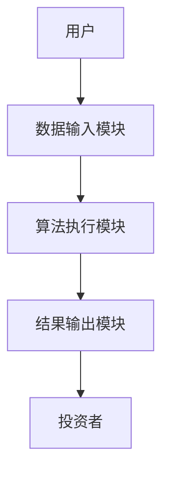
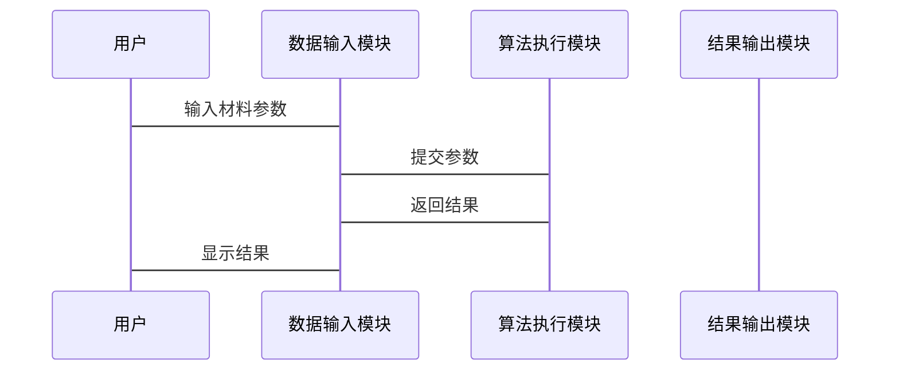

                 


# 价值投资中的量子计算机辅助材料设计分析

---

## 关键词：
量子计算，价值投资，材料设计，算法原理，系统架构

---

## 摘要：
本文探讨了量子计算机在价值投资中的应用，特别是其在材料设计分析中的潜力。通过结合量子计算的核心原理、价值投资的策略以及材料科学的需求，本文详细分析了量子计算机如何通过优化算法和系统设计，提升材料设计的效率和准确性，从而为投资者提供更精准的决策支持。文章内容涵盖量子计算的基本概念、量子算法的原理、系统架构设计以及实际案例分析，旨在为读者提供全面而深入的见解。

---

# 第1章: 量子计算与价值投资概述

## 1.1 量子计算的基本概念

### 1.1.1 量子计算的定义
量子计算是一种利用量子力学原理进行计算的技术，其核心在于利用量子叠加和量子纠缠等特性来处理信息。与经典计算机相比，量子计算机能够在某些特定问题上实现指数级的计算速度。

### 1.1.2 量子计算的核心原理
1. **量子叠加**：量子位（qubit）可以同时处于多个状态的叠加态。
2. **量子纠缠**：两个或多个量子位之间可以形成纠缠态，使得它们的状态相互关联。
3. **量子测量**：测量会破坏量子叠加态，使得量子位塌缩到一个确定的状态。

### 1.1.3 量子计算与经典计算的主要区别
1. **计算速度**：在某些问题上，量子计算机远快于经典计算机。
2. **信息表示**：量子计算机使用量子位，而经典计算机使用二进制位。
3. **算法设计**：量子算法需要利用量子特性，经典算法无法直接移植到量子计算机上。

## 1.2 价值投资的基本概念

### 1.2.1 价值投资的定义
价值投资是一种投资策略，旨在通过分析企业的基本面，寻找市场价格低于其内在价值的投资标的。其核心思想是“买 cheap, 卖 expensive”。

### 1.2.2 价值投资的核心理念
1. **安全边际**：购买价格远低于内在价值的资产。
2. **长期视角**：关注企业的长期盈利能力，而非短期市场波动。
3. **深度分析**：通过详细的财务和行业分析，识别具有竞争优势的企业。

### 1.2.3 价值投资与传统投资的主要区别
1. **投资策略**：价值投资注重长期基本面分析，传统投资注重短期市场波动。
2. **风险控制**：价值投资强调安全边际，传统投资可能忽视风险。
3. **标的筛选**：价值投资通过深度分析筛选标的，传统投资可能依赖市场趋势。

## 1.3 量子计算在价值投资中的应用前景

### 1.3.1 量子计算在金融分析中的潜力
1. **风险管理**：通过量子算法优化风险模型。
2. **市场预测**：利用量子计算的高速度和高维度数据分析能力，提高市场预测的准确性。
3. **组合优化**：量子算法可以优化投资组合，提高收益与风险的比率。

### 1.3.2 量子计算在材料设计中的应用
1. **材料模拟**：通过量子计算模拟材料的微观结构和性能。
2. **优化设计**：利用量子算法优化材料的物理、化学性质。
3. **加速研发**：缩短材料研发周期，降低研发成本。

### 1.3.3 量子计算在投资决策中的优势
1. **高速计算**：量子计算机能够在短时间内处理大量复杂数据。
2. **深度分析**：量子计算能够分析高维数据，发现传统方法难以察觉的规律。
3. **决策支持**：通过量子计算提供更精准的投资建议，提高投资决策的准确性。

## 1.4 本章小结
本章介绍了量子计算的基本概念、价值投资的核心理念以及量子计算在价值投资中的应用前景。通过分析量子计算的潜力，我们可以看到它在材料设计和投资决策中的重要性。

---

# 第2章: 量子计算机辅助材料设计的核心概念

## 2.1 量子力学与材料科学的基本原理

### 2.1.1 量子力学的基本原理
1. **波函数**：描述量子系统状态的数学函数。
2. **薛定谔方程**：描述量子系统随时间演化的方程。
3. **不确定性原理**：无法同时精确测量粒子的位置和动量。

### 2.1.2 材料科学的基本原理
1. **晶体结构**：材料的微观结构决定了其物理和化学性质。
2. **键合方式**：原子之间的键合方式影响材料的强度和韧性。
3. **相变**：材料在不同相态之间的转变，如固态、液态、气态。

### 2.1.3 量子力学在材料科学中的应用
1. **电子结构计算**：通过量子力学计算材料的电子结构，预测其物理性质。
2. **材料模拟**：利用量子力学模拟材料的行为，优化其性能。
3. **纳米材料**：研究纳米尺度的材料性质，利用量子效应设计新型材料。

## 2.2 量子计算机在材料设计中的优势

### 2.2.1 量子计算机的计算能力
1. **并行计算**：量子计算机能够同时处理大量信息。
2. **高维度分析**：量子计算机在高维空间中的计算能力远超经典计算机。

### 2.2.2 量子计算机在材料模拟中的应用
1. **电子结构计算**：利用量子算法优化电子结构计算，提高计算效率。
2. **分子动力学模拟**：通过量子计算模拟分子运动，研究材料的动态行为。
3. **材料相变预测**：利用量子计算预测材料在不同条件下的相变行为。

### 2.2.3 量子计算机在优化材料性能中的作用
1. **性能预测**：通过量子计算预测材料的物理和化学性质。
2. **结构优化**：优化材料的微观结构，提高其性能。
3. **成本降低**：通过量子计算减少实验次数，降低研发成本。

## 2.3 价值投资中的材料设计分析

### 2.3.1 材料设计在投资决策中的重要性
1. **技术创新**：新型材料的出现可能带来新的投资机会。
2. **行业影响**：材料性能的提升可能影响相关行业的竞争格局。
3. **成本优势**：材料的优化设计可能降低生产成本，提高企业竞争力。

### 2.3.2 量子计算机如何辅助材料设计
1. **加速研发**：量子计算机可以大幅缩短材料研发周期。
2. **提高准确性**：通过量子计算，可以更准确地预测材料的性能。
3. **降低成本**：减少实验次数，降低研发成本。

### 2.3.3 量子计算机在材料设计中的具体应用
1. **电池材料优化**：通过量子计算优化电池材料的性能，提高能量密度。
2. **半导体设计**：利用量子计算设计新型半导体材料，提升芯片性能。
3. **催化剂开发**：通过量子计算研究催化剂的结构，提高催化效率。

## 2.4 本章小结
本章详细介绍了量子力学与材料科学的基本原理，分析了量子计算机在材料设计中的优势，并探讨了其在价值投资中的具体应用。通过量子计算机的辅助，材料设计的效率和准确性得到了显著提升。

---

# 第3章: 量子计算在材料设计中的算法原理

## 3.1 量子算法的基本原理

### 3.1.1 量子算法的定义
量子算法是利用量子计算机的特性设计的算法，能够高效解决某些特定问题。

### 3.1.2 量子算法的核心原理
1. **量子叠加**：量子算法利用量子叠加的特性，同时处理多个状态。
2. **量子纠缠**：通过量子纠缠，量子算法能够实现信息的高效传递和处理。
3. **量子测量**：通过测量量子态，得到最终的计算结果。

### 3.1.3 量子算法与经典算法的主要区别
1. **计算速度**：量子算法在某些问题上远快于经典算法。
2. **算法设计**：量子算法需要利用量子特性，经典算法无法直接移植到量子计算机上。
3. **应用领域**：量子算法在特定领域（如密码学、优化问题）表现出色。

## 3.2 量子模拟算法

### 3.2.1 量子模拟算法的定义
量子模拟算法是利用量子计算机模拟量子系统行为的算法，主要用于研究量子力学现象。

### 3.2.2 量子模拟算法的工作原理
1. **初始化**：将量子计算机初始化为一个特定的量子态。
2. **演化**：通过量子门操作，模拟量子系统的演化过程。
3. **测量**：通过测量得到模拟结果。

### 3.2.3 量子模拟算法在材料设计中的应用
1. **电子结构计算**：通过量子模拟算法计算材料的电子结构，预测其物理性质。
2. **分子动力学模拟**：利用量子模拟算法研究分子运动，模拟材料的动态行为。
3. **材料相变预测**：通过量子模拟算法预测材料在不同条件下的相变行为。

## 3.3 量子优化算法

### 3.3.1 量子优化算法的定义
量子优化算法是利用量子计算机进行优化问题求解的算法，主要用于寻找最优解。

### 3.3.2 量子优化算法的工作原理
1. **问题建模**：将优化问题转化为量子计算机能够处理的形式。
2. **量子搜索**：利用量子搜索算法，快速找到最优解。
3. **结果提取**：通过测量得到最优解。

### 3.3.3 量子优化算法在材料设计中的应用
1. **结构优化**：通过量子优化算法优化材料的微观结构，提高其性能。
2. **性能预测**：利用量子优化算法预测材料的物理和化学性质。
3. **成本降低**：通过量子优化算法减少实验次数，降低研发成本。

## 3.4 量子算法的数学模型

### 3.4.1 量子叠加原理的数学表达
$$|\psi\rangle = \alpha|0\rangle + \beta|1\rangle$$

### 3.4.2 量子纠缠原理的数学表达
$$|\psi\rangle = \frac{1}{\sqrt{2}}(|00\rangle + |11\rangle)$$

### 3.4.3 量子算法的数学模型
$$U|\psi\rangle = |result\rangle$$

## 3.5 本章小结
本章详细介绍了量子算法的基本原理，分析了量子模拟算法和量子优化算法的工作原理，并探讨了它们在材料设计中的具体应用。通过量子算法的数学模型，我们可以更好地理解量子计算在材料设计中的作用。

---

# 第4章: 量子计算机辅助材料设计的系统分析

## 4.1 系统分析的基本原理

### 4.1.1 系统分析的定义
系统分析是对系统的整体结构、功能和行为进行研究，以优化系统的性能。

### 4.1.2 系统分析的核心原理
1. **整体性**：系统分析注重系统的整体结构和功能。
2. **层次性**：系统分析将系统分解为不同的层次，分别进行分析。
3. **动态性**：系统分析关注系统的动态行为和变化。

### 4.1.3 系统分析在量子计算机辅助材料设计中的应用
1. **系统建模**：通过系统分析，建立材料设计的数学模型。
2. **系统优化**：利用系统分析的结果，优化材料设计的流程和方法。
3. **系统评估**：通过系统分析，评估材料设计的可行性和效果。

## 4.2 系统架构设计

### 4.2.1 系统架构设计的定义
系统架构设计是系统设计的重要组成部分，用于定义系统的整体结构和功能。

### 4.2.2 系统架构设计的核心原理
1. **模块化**：将系统分解为多个模块，每个模块负责特定的功能。
2. **层次化**：系统架构设计通常采用层次化的结构，从上至下进行设计。
3. **可扩展性**：系统架构设计应考虑系统的可扩展性，方便未来的升级和维护。

### 4.2.3 系统架构设计在量子计算机辅助材料设计中的应用
1. **功能模块划分**：将材料设计的流程分解为多个功能模块，如数据输入、算法执行、结果输出等。
2. **模块交互设计**：设计模块之间的交互方式，确保系统的高效运行。
3. **系统集成**：将各个模块集成起来，形成完整的系统架构。

## 4.3 项目实战

### 4.3.1 项目介绍
本项目旨在利用量子计算机辅助材料设计，优化某种材料的性能，以实现更高的投资回报。

### 4.3.2 系统功能设计
1. **数据输入**：用户输入材料的相关参数，如化学成分、结构等。
2. **算法执行**：系统利用量子算法对材料进行模拟和优化。
3. **结果输出**：系统输出材料的性能预测结果，供投资者参考。

### 4.3.3 系统架构设计



### 4.3.4 系统接口设计
1. **数据输入接口**：用户通过输入界面输入材料的相关参数。
2. **算法调用接口**：算法执行模块通过接口调用量子算法。
3. **结果输出接口**：结果输出模块通过接口将结果传递给投资者。

### 4.3.5 系统交互流程



## 4.4 本章小结
本章通过系统分析和架构设计，探讨了量子计算机辅助材料设计的实现方式。通过实际案例分析，我们了解了系统设计的具体步骤和方法。

---

# 第5章: 量子计算机辅助材料设计的算法实现

## 5.1 量子算法的实现步骤

### 5.1.1 算法选择
根据具体问题选择适合的量子算法，如量子模拟算法或量子优化算法。

### 5.1.2 算法实现
使用量子计算机或量子模拟器实现算法的运行。

### 5.1.3 结果分析
对算法的输出结果进行分析，验证算法的有效性和准确性。

## 5.2 量子算法的代码实现

### 5.2.1 量子叠加算法的实现
```python
import numpy as np
from qiskit import QuantumCircuit, Aer, execute

def quantum_superposition(n=2):
    circuit = QuantumCircuit(n)
    circuit.h(range(n))  # 应用哈达玛门
    circuit.measure_all()
    backend = Aer.get_backend('qasm_simulator')
    result = execute(circuit, backend).result()
    return result.get_counts()
```

### 5.2.2 量子纠缠算法的实现
```python
def quantum_entanglement(n=2):
    circuit = QuantumCircuit(n)
    circuit.h(0)
    circuit.cnot(0, 1)
    circuit.measure_all()
    backend = Aer.get_backend('qasm_simulator')
    result = execute(circuit, backend).result()
    return result.get_counts()
```

## 5.3 量子算法的数学模型

### 5.3.1 量子叠加的数学表达
$$|\psi\rangle = \frac{1}{\sqrt{2}}(|0\rangle + |1\rangle)$$

### 5.3.2 量子纠缠的数学表达
$$|\psi\rangle = \frac{1}{\sqrt{2}}(|00\rangle + |11\rangle)$$

## 5.4 本章小结
本章通过具体的代码实现和数学模型，详细介绍了量子算法的实现过程。通过这些实现，我们可以更好地理解量子计算在材料设计中的应用。

---

# 第6章: 项目实战与案例分析

## 6.1 项目实战

### 6.1.1 环境安装
安装必要的量子计算开发环境，如Qiskit、Cirq等。

### 6.1.2 代码实现
实现量子算法的代码，如量子模拟算法和量子优化算法。

### 6.1.3 代码解读
对代码进行详细解读，说明每部分的功能和实现原理。

## 6.2 案例分析

### 6.2.1 案例介绍
以某种材料的优化设计为例，说明量子计算机辅助材料设计的应用。

### 6.2.2 案例分析
通过量子计算模拟和优化，分析材料的性能变化。

### 6.2.3 案例总结
总结案例分析的结果，提出改进建议。

## 6.3 本章小结
本章通过具体的项目实战和案例分析，展示了量子计算机在材料设计中的实际应用。通过这些案例，我们可以更好地理解量子计算的优势。

---

# 第7章: 最佳实践与未来展望

## 7.1 最佳实践

### 7.1.1 量子算法的选择
根据具体问题选择适合的量子算法，提高计算效率。

### 7.1.2 系统架构设计
注重系统的模块化和层次化设计，确保系统的可扩展性。

### 7.1.3 结果验证
通过实验和数据验证算法的有效性和准确性。

## 7.2 未来展望

### 7.2.1 量子计算机的发展
随着量子计算机技术的不断进步，其在材料设计中的应用将更加广泛。

### 7.2.2 价值投资的未来
量子计算机将为价值投资提供更精准的决策支持，推动投资策略的创新。

### 7.2.3 技术融合
量子计算与其他技术的融合将进一步推动材料设计和投资分析的进步。

## 7.3 本章小结
本章总结了量子计算机辅助材料设计的最佳实践，并展望了未来的发展方向。通过技术的不断进步，量子计算将在材料设计和价值投资中发挥更大的作用。

---

## 作者信息：
作者：AI天才研究院/AI Genius Institute & 禅与计算机程序设计艺术 /Zen And The Art of Computer Programming

