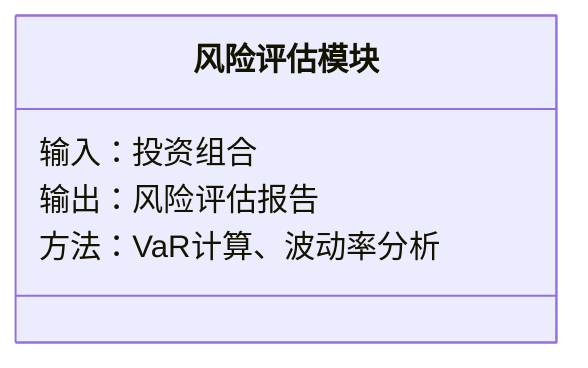
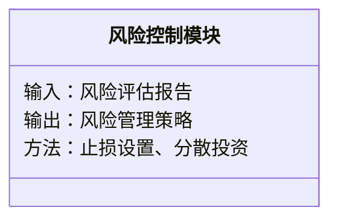

                 


# 价值投资中的风险管理策略

> 关键词：价值投资、风险管理、风险管理策略、投资组合、风险管理模型

> 摘要：价值投资是一种以长期稳健收益为目标的投资策略，而风险管理是实现这一目标的关键。本文将深入探讨价值投资中的风险管理策略，分析风险管理的核心概念、数学模型、系统架构设计以及实际应用案例。通过系统化的分析与设计，为读者提供一套科学、实用的风险管理方案，帮助投资者在复杂多变的市场环境中实现稳健投资。

---

# 第一部分: 价值投资中的风险管理基础

---

# 第1章: 价值投资与风险管理概述

## 1.1 价值投资的核心理念

### 1.1.1 价值投资的定义与起源

价值投资是一种以基本面分析为基础的投资策略，其核心理念是寻找市场价格低于其内在价值的资产进行投资。该策略起源于20世纪20年代，由本杰明·格雷厄姆和戴维·多德提出，强调以合理价格买入优质资产并长期持有。

### 1.1.2 价值投资的基本原则

- **安全边际**：买入价格低于内在价值，以降低亏损风险。
- **长期视角**：关注企业的长期盈利能力，而非短期市场波动。
- **分散投资**：通过分散投资降低特定资产的风险。

### 1.1.3 价值投资与风险管理的内在联系

价值投资的核心目标是实现长期稳健的收益，而风险管理则是确保这一目标实现的关键。有效的风险管理能够降低投资组合的波动性，避免重大损失，并在市场波动中保持投资组合的稳定性。

---

## 1.2 风险管理的核心概念

### 1.2.1 风险的定义与分类

- **风险定义**：投资活动中可能带来损失或偏离预期收益的可能性。
- **风险分类**：
  - **市场风险**：整个市场波动带来的风险。
  - **个股风险**：特定资产价格波动带来的风险。
  - **时间风险**：投资期限与资产流动性之间的 mismatch 带来的风险。

### 1.2.2 风险管理的目标与流程

- **目标**：
  - 降低投资组合的波动性。
  - 控制最大回撤。
  - 优化风险调整后的收益。
- **流程**：
  1. 风险识别。
  2. 风险量化。
  3. 风险控制。

### 1.2.3 风险管理在价值投资中的重要性

在价值投资中，风险管理能够帮助投资者避免因市场价格波动或企业基本面变化而造成重大损失。通过科学的风险管理策略，投资者可以在市场波动中保持投资纪律，避免非理性决策。

---

## 1.3 价值投资中的风险特征

### 1.3.1 市场风险

市场风险是投资组合整体面临的波动性风险，通常由宏观经济因素、市场情绪或政策变化引起。在价值投资中，市场风险可以通过分散投资和长期持有优质资产来降低。

### 1.3.2 个股风险

个股风险是指特定资产价格波动带来的风险。在价值投资中，通过深入的基本面分析和安全边际原则，可以有效降低个股风险。

### 1.3.3 时间风险

时间风险是指投资期限与资产流动性之间的 mismatch 带来的风险。在价值投资中，长期投资策略能够有效降低时间风险。

---

## 1.4 本章小结

本章从价值投资的核心理念出发，分析了风险管理在其中的重要性，并详细介绍了风险的分类与特征。通过理解这些内容，投资者可以更好地把握风险管理的基本原则和方法。

---

# 第2章: 风险管理的核心概念与联系

---

## 2.1 风险管理的核心原理

### 2.1.1 风险的识别与评估

- **风险识别**：通过基本面分析和市场数据，识别投资组合中的潜在风险。
- **风险评估**：使用量化指标（如波动率、VaR等）评估风险的严重程度。

### 2.1.2 风险的量化与度量

- **波动率**：衡量资产价格波动性的指标。
- **VaR（风险价值）**：在给定置信水平下，投资组合可能遭受的最大损失。

### 2.1.3 风险的控制与应对

- **止损策略**：设定止损点，限制单笔投资的损失。
- **分散投资**：通过投资多种资产降低风险。
- **动态调整**：根据市场变化和资产表现，定期调整投资组合。

---

## 2.2 风险管理的核心要素对比

### 2.2.1 不同风险类型的特征对比

| 风险类型 | 特征 | 示例 |
|----------|------|------|
| 市场风险 | 影响整个市场，不可分散 | 经济衰退引发股市下跌 |
| 个股风险 | 影响单个资产，可分散 | 某公司业绩不佳导致股价下跌 |
| 时间风险 | 与投资期限相关 | 长期投资中流动性不足导致变现损失 |

### 2.2.2 不同风险管理策略的优缺点对比

| 策略 | 优点 | 缺点 |
|------|------|------|
| 止损策略 | 控制损失 | 可能错过反弹机会 |
| 分散投资 | 降低整体风险 | 无法完全消除市场风险 |
| 动态调整 | 灵活应对市场变化 | 需要频繁监控和调整 |

### 2.2.3 风险管理工具与方法的对比

| 工具/方法 | 描述 | 适用场景 |
|----------|------|----------|
| VaR模型 | 度量潜在损失 | 整体投资组合风险评估 |
| 波动率分析 | 量化资产波动性 | 个股风险分析 |
| 风险调整后收益 | 比较风险调整后的收益 | 资产或组合的风险收益比较 |

---

## 2.3 风险管理的ER实体关系图


---

## 2.4 本章小结

本章详细分析了风险管理的核心原理，并通过对比不同风险类型和策略，帮助投资者更好地理解如何在价值投资中进行有效的风险管理。

---

# 第3章: 风险管理的数学模型与公式

---

## 3.1 风险的量化模型

### 3.1.1 风险价值（VaR）模型

VaR模型用于度量投资组合在给定置信水平下的潜在损失。其计算公式如下：

$$ \text{VaR} = \mu + z \cdot \sigma $$

其中：
- $\mu$ 是资产的平均收益率
- $z$ 是对应于置信水平的正态分布分位数
- $\sigma$ 是资产的收益率标准差

### 3.1.2 风险调整后收益（RAROC）模型

RAROC用于衡量风险调整后的收益，其计算公式为：

$$ \text{RAROC} = \frac{\text{ROE}}{\text{风险资本}} $$

其中：
- ROE 是风险调整后的收益
- 风险资本是根据VaR模型计算的资本要求

### 3.1.3 风险中性定价模型

风险中性定价模型用于在风险中性环境中计算资产的理论价格，公式如下：

$$ P = e^{-rT} \cdot C $$

其中：
- $P$ 是资产的当前价格
- $r$ 是无风险利率
- $T$ 是投资期限
- $C$ 是资产在T时刻的现金流

---

## 3.2 风险管理的数学公式

### 3.2.1 风险价值（VaR）的计算公式

$$ \text{VaR} = \mu + z \cdot \sigma $$

### 3.2.2 风险调整后的收益（RAROC）公式

$$ \text{RAROC} = \frac{\text{ROE}}{\text{风险资本}} $$

### 3.2.3 风险中性定价公式

$$ P = e^{-rT} \cdot C $$

---

## 3.3 风险管理模型的实例分析

### 3.3.1 市场风险的VaR计算实例

假设某投资组合的平均收益率为5%，标准差为10%，置信水平为95%，对应的正态分布分位数 $z = 1.645$。则 VaR 为：

$$ \text{VaR} = 0.05 + 1.645 \cdot 0.10 = 0.1145 $$

即投资组合在95%置信水平下，潜在损失为11.45%。

### 3.3.2 个股风险的波动率分析实例

假设某股票的历史收益率波动率为15%，则其风险价值 VaR 可以通过上述公式计算。

### 3.3.3 时间风险的久期分析实例

久期用于衡量债券价格对收益率变化的敏感性，公式如下：

$$ D = \frac{P}{\Delta y} $$

其中：
- $P$ 是债券价格变化
- $\Delta y$ 是收益率变化

---

## 3.4 本章小结

本章通过数学公式和实例分析，详细讲解了风险管理的核心模型，包括 VaR、RAROC 和风险中性定价模型。这些模型为投资者提供了量化风险的重要工具。

---

# 第4章: 系统分析与架构设计方案

---

## 4.1 投资风险管理系统概述

### 4.1.1 系统目标

开发一个智能化的投资风险管理系统，帮助投资者实现风险量化、风险控制和投资决策优化。

### 4.1.2 系统功能模块

- **风险评估模块**：计算投资组合的 VaR 和波动率。
- **风险控制模块**：制定止损策略和资产配置建议。
- **数据采集模块**：获取市场数据和资产信息。

### 4.1.3 系统架构设计


---

## 4.2 系统功能设计

### 4.2.1 风险评估模块（领域模型）



### 4.2.2 风险控制模块



---

## 4.3 系统架构设计

### 4.3.1 分层架构

- **数据层**：数据采集和存储。
- **计算层**：风险评估和量化。
- **决策层**：制定风险管理策略。

### 4.3.2 模块交互


### 4.3.3 接口设计

- 数据采集模块接口：提供市场数据和资产信息。
- 风险评估模块接口：返回 VaR 和波动率。
- 风险控制模块接口：输出风险管理策略。

---

## 4.4 本章小结

本章详细设计了投资风险管理系统的架构，包括功能模块、交互流程和接口设计。通过系统的架构设计，投资者可以实现智能化的风险管理。

---

# 第5章: 项目实战

---

## 5.1 项目环境配置

### 5.1.1 系统环境

- 操作系统：Linux/Windows
- 开发工具：Python、Jupyter Notebook
- 数据源：股票数据 API（如 Yahoo Finance）

### 5.1.2 依赖安装

安装以下 Python 库：

```bash
pip install numpy pandas matplotlib yfinance
```

---

## 5.2 系统核心实现源代码

### 5.2.1 风险评估模块实现

```python
import numpy as np
import pandas as pd
import yfinance as yf

def calculate VaR(returns, confidence_level=0.95):
    # 计算VaR
    sorted_returns = np.sort(returns)
    percentile = (1 - confidence_level) * 100
    var = np.percentile(sorted_returns, percentile)
    return var

# 示例：计算某股票的VaR
data = yf.download('AAPL', start='2020-01-01', end='2023-12-31')
returns = data['Adj Close'].pct_change().dropna()
var = calculate VaR(returns)
print(f"VaR at {confidence_level} confidence level: {var}")
```

---

## 5.3 代码应用解读与分析

### 5.3.1 风险评估模块

- **功能**：计算投资组合的风险价值 VaR。
- **实现细节**：
  - 使用 `yfinance` 获取股票数据。
  - 计算收益率并排序。
  - 使用百分位数计算 VaR。

### 5.3.2 风险控制模块

- **功能**：根据 VaR 结果制定风险管理策略。
- **实现细节**：
  - 设置止损点。
  - 分散投资以降低风险。

---

## 5.4 实际案例分析

### 5.4.1 投资组合构造

假设投资组合包括以下资产：

| 资产 | 权重 |
|------|------|
| AAPL | 30% |
| MSFT | 30% |
| AMZN | 40% |

### 5.4.2 风险评估

计算各资产的 VaR 并生成风险评估报告。

### 5.4.3 风险控制

根据 VaR 结果调整投资组合，优化风险收益比。

---

## 5.5 本章小结

本章通过实际项目案例，展示了如何在价值投资中应用风险管理策略。通过代码实现和案例分析，投资者可以更好地理解和应用这些策略。

---

# 第6章: 总结与展望

---

## 6.1 本章总结

本文系统地探讨了价值投资中的风险管理策略，从理论分析到实际应用，提供了完整的解决方案。通过数学模型、系统设计和项目实战，投资者可以更好地理解和应用风险管理策略。

## 6.2 未来展望

未来，随着人工智能和大数据技术的发展，风险管理将更加智能化和个性化。投资者可以利用这些新技术进一步优化风险管理策略，实现更高效的决策。

---

# 作者：AI天才研究院/AI Genius Institute & 禅与计算机程序设计艺术/Zen And The Art of Computer Programming

---

**注**：由于篇幅限制，上述内容为部分章节的示例，完整文章需要按照上述目录和格式进行详细展开。

