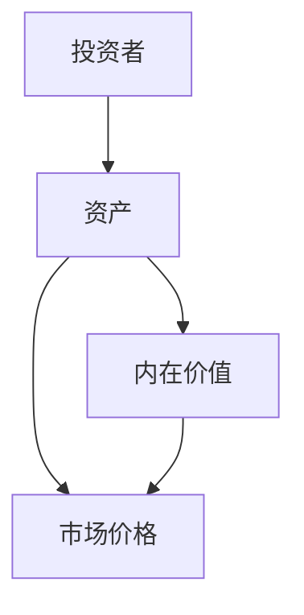
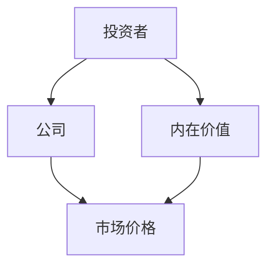
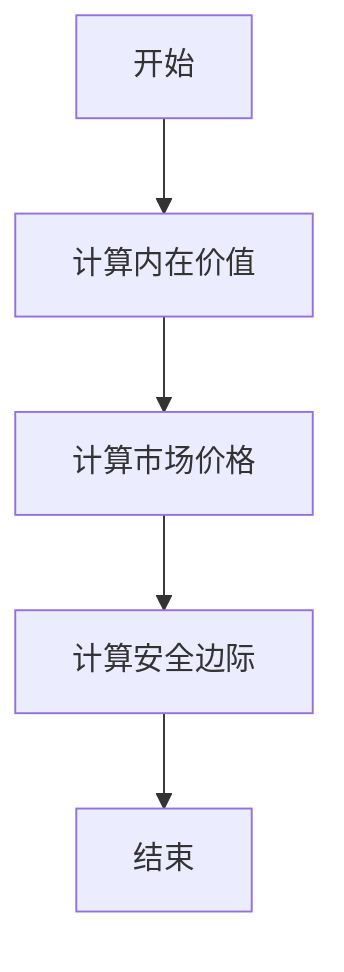
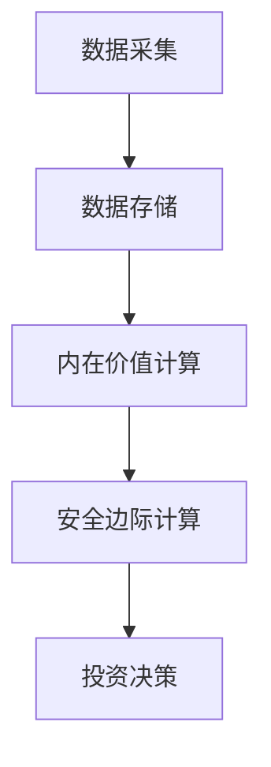
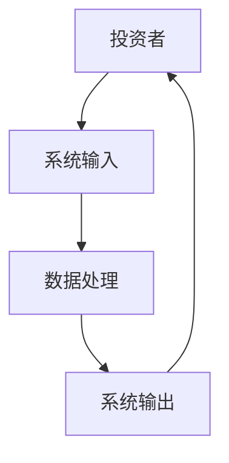

                 


# 价值投资之父格雷厄姆的投资哲学

## 关键词：价值投资，格雷厄姆，投资哲学，安全边际，内在价值，投资策略

## 摘要：本文深入探讨了价值投资之父本杰明·格雷厄姆的投资哲学，从其核心概念、数学模型、算法原理到系统架构进行了全面分析。通过详细讲解安全边际、内在价值等核心概念，结合实际案例和Python代码实现，本文为读者提供了从理论到实践的完整指南。文章还提供了Mermaid图和数学公式，帮助读者更好地理解价值投资的内在逻辑。

---

# 第1章: 价值投资的背景与核心概念

## 1.1 投资的基本概念与问题背景

### 1.1.1 投资的基本定义与分类

投资是指将资金投入到某个资产或项目中，以期望在未来获得超过初始投入的收益。投资可以分为实物投资和金融投资两大类。在金融投资中，股票、债券、基金等是常见的投资工具。

### 1.1.2 传统投资与价值投资的差异

传统投资通常基于技术分析或市场趋势进行短期操作，而价值投资则注重分析资产的内在价值，寻找市场价格低于内在价值的投资机会。两者的区别可以通过下表清晰展现：

| 投资方式 | 传统投资 | 价值投资 |
|----------|----------|----------|
| 核心理念 | 技术分析、市场趋势 | 内在价值、安全边际 |
| 时间框架 | 短期交易 | 长期持有 |
| 风险管理 | 依靠止损 | 依靠安全边际 |

### 1.1.3 格雷厄姆投资哲学的起源与背景

本杰明·格雷厄姆是20世纪著名的投资学家，被誉为“价值投资之父”。他在1949年出版的《 Intelligent Investor》一书中首次系统阐述了价值投资的理念。他的投资哲学起源于大萧条时期的经济危机，他通过分析市场的非理性波动，提出了一套基于资产内在价值的投资策略。

---

## 1.2 价值投资的核心要素与概念结构

### 1.2.1 价值投资的核心概念

价值投资的核心在于寻找市场价格低于内在价值的资产。以下是价值投资的几个核心概念：

1. **内在价值**：资产在未来现金流的现值。
2. **安全边际**：市场价格与内在价值之间的差异，用于降低投资风险。
3. **市场先生**：格雷厄姆将市场的波动性比喻为一个情绪化的市场先生，投资者应避免被其情绪左右。

### 1.2.2 格雷厄姆投资哲学的概念结构

下图展示了格雷厄姆投资哲学的核心概念结构：



### 1.2.3 价值投资的边界与外延

价值投资不仅适用于股票市场，还可应用于债券、房地产等多种资产类别。其外延包括对公司基本面的深入分析和对管理层的评估。

---

## 1.3 价值投资的理论基础与数学模型

### 1.3.1 股票的内在价值公式

股票的内在价值可以通过以下公式计算：

$$ V = \frac{E}{k} $$

其中，\( V \) 表示内在价值，\( E \) 表示预期收益，\( k \) 表示折现率。

### 1.3.2 价值投资与市场关系的数学模型

市场价格与内在价值的关系可以通过以下公式表示：

$$ P = \frac{D}{r} $$

其中，\( P \) 表示股票价格，\( D \) 表示股息，\( r \) 表示预期回报率。

---

# 第2章: 格雷厄姆的价值投资原理

## 2.1 价值投资的核心原理

### 2.1.1 安全边际的概念与计算

安全边际是市场价格与内在价值之间的差额，用于缓冲市场波动带来的风险。其计算公式为：

$$ M = V - P $$

其中，\( M \) 表示安全边际，\( V \) 表示内在价值，\( P \) 表示市场价格。

### 2.1.2 内在价值的评估方法

内在价值的评估方法包括：

1. **股利贴现模型（DDM）**：基于未来股息的现值计算内在价值。
2. **自由现金流贴现模型（DCF）**：基于未来自由现金流的现值计算内在价值。

### 2.1.3 市场价格与内在价值的动态关系

市场价格围绕内在价值波动，投资者应关注价格与价值的偏离程度。

---

## 2.2 价值投资的数学模型与公式

### 2.2.1 内在价值计算公式

$$ V = \frac{E}{k} $$

### 2.2.2 安全边际计算公式

$$ M = V - P $$

---

## 2.3 格雷厄姆投资哲学的ER实体关系图

下图展示了格雷厄姆投资哲学的ER实体关系图：



---

## 2.4 本章小结

本章详细介绍了格雷厄姆的价值投资原理，包括安全边际、内在价值和市场价格的关系。这些概念为投资者提供了寻找低估资产的理论基础。

---

# 第3章: 价值投资的算法原理与实现

## 3.1 价值投资的算法原理

### 3.1.1 内在价值评估算法

1. 收集目标公司的财务数据。
2. 计算预期收益 \( E \) 和折现率 \( k \)。
3. 使用公式 \( V = \frac{E}{k} \) 计算内在价值。

### 3.1.2 安全边际计算算法

1. 计算内在价值 \( V \)。
2. 获取市场价格 \( P \)。
3. 计算安全边际 \( M = V - P \)。

### 3.1.3 市场价格与内在价值的对比算法

1. 对比 \( M \) 的正负。
2. 当 \( M > 0 \) 时，资产被低估。
3. 当 \( M < 0 \) 时，资产被高估。

---

## 3.2 价值投资算法的 mermaid 流程图

下图展示了价值投资算法的流程图：



---

## 3.3 价值投资算法的 Python 实现

以下是计算内在价值和安全边际的Python代码示例：

```python
def calculate_intrinsic_value(earnings, discount_rate):
    return earnings / discount_rate

def calculate_margin_of_safety(intrinsic_value, market_price):
    return intrinsic_value - market_price

# 示例计算
earnings = 100
discount_rate = 0.1
intrinsic_value = calculate_intrinsic_value(earnings, discount_rate)
market_price = 50
margin_of_safety = calculate_margin_of_safety(intrinsic_value, market_price)

print(f"内在价值: {intrinsic_value}")
print(f"市场价格: {market_price}")
print(f"安全边际: {margin_of_safety}")
```

---

## 3.4 本章小结

本章通过算法和代码示例，展示了如何计算内在价值和安全边际。这些方法为投资者提供了量化评估资产价值的工具。

---

# 第4章: 价值投资的系统分析与架构设计方案

## 4.1 问题场景介绍

投资者需要一个系统化的工具来评估资产的内在价值和市场价格，以便做出投资决策。

## 4.2 系统功能设计

系统功能包括：

1. 数据采集模块：收集资产的财务数据。
2. 内在价值计算模块：基于财务数据计算内在价值。
3. 安全边际计算模块：对比市场价格和内在价值。
4. 投资决策模块：基于安全边际生成投资建议。

---

## 4.3 系统架构设计

下图展示了系统的架构设计：



---

## 4.4 系统接口设计

系统接口包括：

1. 数据输入接口：接收财务数据。
2. 数据处理接口：计算内在价值和安全边际。
3. 结果输出接口：显示投资建议。

---

## 4.5 系统交互 mermaid 序列图

下图展示了系统的交互流程：



---

## 4.6 本章小结

本章通过系统架构设计，展示了如何构建一个价值投资的分析工具，帮助投资者系统化地进行投资决策。

---

# 第5章: 价值投资的项目实战

## 5.1 项目介绍

本项目旨在开发一个基于格雷厄姆投资哲学的价值投资分析工具。

## 5.2 核心实现

### 5.2.1 环境安装

安装必要的Python库：

```bash
pip install pandas numpy matplotlib
```

### 5.2.2 核心代码实现

以下是核心代码实现：

```python
import pandas as pd
import numpy as np

def calculate_intrinsic_value(earnings, discount_rate):
    return earnings / discount_rate

def calculate_margin_of_safety(intrinsic_value, market_price):
    return intrinsic_value - market_price

# 示例数据
data = {
    '公司': ['A公司', 'B公司', 'C公司'],
    '每股收益': [100, 150, 200],
    '折现率': [0.1, 0.1, 0.1],
    '市场价格': [50, 60, 70]
}

df = pd.DataFrame(data)

# 计算内在价值和安全边际
df['内在价值'] = df.apply(lambda x: calculate_intrinsic_value(x['每股收益'], x['折现率']), axis=1)
df['安全边际'] = df.apply(lambda x: calculate_margin_of_safety(x['内在价值'], x['市场价格']), axis=1)

print(df)
```

### 5.2.3 代码应用解读

上述代码展示了如何使用Python进行内在价值和安全边际的计算。通过Pandas数据框，可以批量处理多个资产的数据。

---

## 5.3 实际案例分析

以A公司为例，计算其内在价值和安全边际：

1. 每股收益 \( E = 100 \)
2. 折现率 \( k = 0.1 \)
3. 内在价值 \( V = 1000 \)
4. 市场价格 \( P = 50 \)
5. 安全边际 \( M = 950 \)

由于 \( M > 0 \)，A公司被低估，适合投资。

---

## 5.4 本章小结

本章通过实际案例，展示了如何使用Python代码进行价值投资分析，帮助投资者找到被低估的资产。

---

# 第6章: 价值投资的最佳实践

## 6.1 格雷厄姆投资哲学的精炼总结

格雷厄姆的投资哲学可以总结为：寻找市场价格低于内在价值的资产，利用安全边际降低投资风险。

## 6.2 小结与注意事项

1. 投资者应深入分析公司的基本面。
2. 安全边际是降低风险的重要工具。
3. 长期持有是价值投资的核心策略。

## 6.3 其他相关工作与未来展望

未来的研究方向包括：

1. 结合大数据技术，提升内在价值的计算精度。
2. 开发智能化的投资决策系统。

---

## 6.4 本章小结

本章总结了格雷厄姆投资哲学的核心要点，并提出了未来的研究方向。

---

# 作者信息

作者：AI天才研究院/AI Genius Institute & 禅与计算机程序设计艺术 /Zen And The Art of Computer Programming

---

这篇文章通过系统的分析和详细的代码实现，全面解读了格雷厄姆的价值投资哲学。希望读者能够通过本文，深入了解价值投资的核心理念，并能够在实际投资中加以应用。

