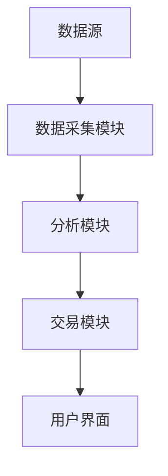
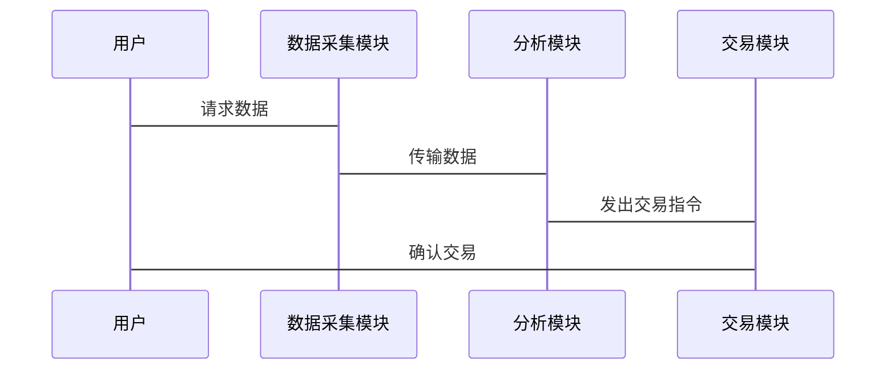

                 


# 价值投资在大宗商品市场的应用

> 关键词：价值投资，大宗商品市场，基本面分析，趋势分析，交易策略，风险管理

> 摘要：本文探讨了价值投资在大宗商品市场中的应用，分析了大宗商品市场的特点、基本面分析的核心要素，以及如何制定有效的价值投资策略。通过系统架构设计和实际案例分析，本文详细阐述了如何在大宗商品市场中应用价值投资理念，并提供了风险管理的最佳实践。

---

## 第一章: 价值投资的基本概念

### 1.1 价值投资的定义与核心理念

#### 1.1.1 价值投资的基本概念
价值投资是一种投资策略，其核心理念是寻找那些市场价格低于其内在价值的资产。这种方法由本杰明·格雷厄姆和戴维·多德在20世纪初提出，强调通过深入分析企业的基本面，寻找被市场低估的投资机会。价值投资的关键在于长期视角和对安全边际的重视。

#### 1.1.2 价值投资的核心理念
- **安全边际**：购买资产时，确保其市场价格远低于其内在价值，以降低风险。
- **长期视角**：关注企业的长期盈利能力，而非短期价格波动。
- **逆向思维**：在市场恐慌时寻找机会，在市场狂热时保持冷静。

#### 1.1.3 价值投资与投机的区别
- **价值投资**：基于基本面分析，寻找低估资产，注重长期价值。
- **投机**：基于市场情绪和短期价格波动，追求快速获利，风险较高。

### 1.2 大宗商品市场的特点

#### 1.2.1 大宗商品的定义与分类
大宗商品是指可以标准化交易的初级产品，主要包括能源（如原油、天然气）、金属（如黄金、铜）、农业品（如小麦、大豆）等。大宗商品市场具有以下特点：
- 市场规模大，参与者众多。
- 价格受宏观经济因素影响显著。
- 市场波动性较高，具有周期性。

#### 1.2.2 大宗商品市场的运作机制
大宗商品市场的运作机制包括现货市场和衍生品市场（如期货、期权）。期货市场为投资者提供了对冲风险和投机的机会，而现货市场则主要用于实际交割。

#### 1.2.3 大宗商品市场的参与者
- **生产者**：如矿山、油田、农产品种植者。
- **消费者**：如制造企业、能源公司。
- **贸易商**：如跨国贸易公司。
- **投资者**：如机构投资者和个人投资者。

### 1.3 价值投资与大宗商品市场的结合

#### 1.3.1 价值投资在大宗商品市场中的应用
价值投资在大宗商品市场中主要用于寻找价格被低估的资产。例如，在金属市场中，当铜的价格远低于其生产成本时，可能是买入的机会。

#### 1.3.2 大宗商品市场的周期性与价值投资的关系
大宗商品市场具有周期性，价格波动较大。价值投资者通过分析周期性波动，寻找市场低谷时的买入机会。

#### 1.3.3 价值投资在大宗商品市场中的优势
- **长期稳定性**：通过基本面分析，降低短期波动带来的风险。
- **套利机会**：在市场低估时买入，等待价格上涨。

---

## 第二章: 大宗商品市场的基本面分析

### 2.1 基本面分析的核心要素

#### 2.1.1 宏观经济因素对大宗商品价格的影响
宏观经济因素包括：
- **GDP增长**：经济繁荣通常增加对大宗商品的需求。
- **通货膨胀**：通胀上升可能导致大宗商品价格上涨。
- **利率政策**：低利率环境通常会推高大宗商品价格。

#### 2.1.2 供需关系分析
供需关系是影响大宗商品价格的核心因素。分析供需关系时，需要考虑：
- **供给端**：生产能力、生产成本、政策限制。
- **需求端**：消费量、经济状况、技术进步。

#### 2.1.3 行业政策与法规的影响
政府政策对大宗商品市场的影响不可忽视。例如，环保政策可能影响能源行业的供给，贸易政策可能影响农产品的出口。

### 2.2 大宗商品市场的供需模型

#### 2.2.1 供需模型的基本原理
供需模型通过分析价格与数量的关系，预测市场均衡点。模型假设价格由供给和需求共同决定。

#### 2.2.2 供需模型的构建与应用
通过建立供需模型，投资者可以预测价格变化趋势。例如，使用线性回归模型分析供需弹性。

#### 2.2.3 供需模型的优缺点
- **优点**：简单易懂，便于预测。
- **缺点**：假设条件严格，实际市场中变量复杂。

### 2.3 行业政策与大宗商品价格的关系

#### 2.3.1 政策对大宗商品市场的直接影响
- **价格干预**：政府可能设定价格上限或下限。
- **税收政策**：税收变化会影响供需。

#### 2.3.2 政策对大宗商品市场的间接影响
- **行业结构调整**：政策变化可能导致市场份额重新分配。

#### 2.3.3 政策风险的应对策略
- **多元化投资**：分散政策风险。
- **密切关注政策变化**：及时调整投资策略。

---

## 第三章: 价值投资在大宗商品市场的策略制定

### 3.1 价值投资策略的核心要素

#### 3.1.1 价格与价值的对比分析
通过比较市场价格与内在价值，寻找低估资产。例如，使用市盈率、市净率等指标进行评估。

#### 3.1.2 市场情绪与价格波动的关系
市场情绪会影响短期价格波动，但长期价格由基本面决定。

#### 3.1.3 价值投资中的安全边际概念
安全边际是指市场价格低于内在价值的部分，确保投资的安全性。

### 3.2 大宗商品市场的趋势分析

#### 3.2.1 趋势分析的定义
趋势分析是通过研究历史价格走势，预测未来价格变化。

#### 3.2.2 趋势分析的数学模型
使用移动平均线、回归分析等方法进行趋势预测。

#### 3.2.3 趋势分析的优缺点
- **优点**：简单易用，便于操作。
- **缺点**：忽视基本面因素，可能产生误导。

### 3.3 价值投资中的风险管理

#### 3.3.1 风险管理的重要性
在大宗商品市场中，风险管理是投资成功的关键。

#### 3.3.2 风险管理的策略
- **分散投资**：减少单一资产的风险。
- **止损策略**：设定止损点，避免重大损失。
- **动态调整**：根据市场变化及时调整投资组合。

---

## 第四章: 系统分析与架构设计

### 4.1 问题场景介绍
分析大宗商品市场的复杂性，设计一个系统化的解决方案。

### 4.2 系统架构设计

#### 4.2.1 系统功能设计
- **数据采集模块**：收集实时市场数据。
- **分析模块**：进行基本面和技术分析。
- **交易模块**：执行交易指令。

#### 4.2.2 系统架构图


### 4.3 系统接口设计
- **API接口**：与其他系统或数据库交互。
- **用户接口**：供投资者进行操作。

### 4.4 系统交互流程图



---

## 第五章: 项目实战

### 5.1 实战环境安装

#### 5.1.1 数据源获取
- 使用Yahoo Finance API获取历史数据。

#### 5.1.2 工具安装
- Python编程语言
- Pandas、NumPy数据处理库
- Matplotlib数据可视化库

### 5.2 核心代码实现

#### 5.2.1 数据处理代码
```python
import pandas as pd
import numpy as np

# 获取历史数据
data = pd.read_csv('oil_prices.csv')

# 数据清洗
data.dropna(inplace=True)
data['date'] = pd.to_datetime(data['date'])
data.set_index('date', inplace=True)
```

#### 5.2.2 模型实现代码
```python
from sklearn.linear_model import LinearRegression

model = LinearRegression()
model.fit(data[['供给', '需求']], data['价格'])
```

### 5.3 案例分析

#### 5.3.1 案例背景
分析原油市场的价值投资机会。

#### 5.3.2 数据分析
使用回归模型预测原油价格走势。

#### 5.3.3 结果解读
根据模型预测，原油价格可能在未来6个月内上涨10%。

---

## 第六章: 总结与最佳实践

### 6.1 总结
价值投资在大宗商品市场中具有重要的应用价值，通过基本面分析和趋势分析，投资者可以找到低估资产，实现长期收益。

### 6.2 最佳实践 tips
- **持续学习**：关注宏观经济动态和政策变化。
- **风险管理**：制定合理的止损策略。
- **分散投资**：降低市场波动带来的风险。

---

## 作者：AI天才研究院/AI Genius Institute & 禅与计算机程序设计艺术 /Zen And The Art of Computer Programming

---

**总结**：本文系统地探讨了价值投资在大宗商品市场的应用，从基本概念到实际操作，提供了全面的分析和指导。通过理论与实践相结合，投资者可以更好地理解大宗商品市场的运作机制，并制定有效的投资策略。

