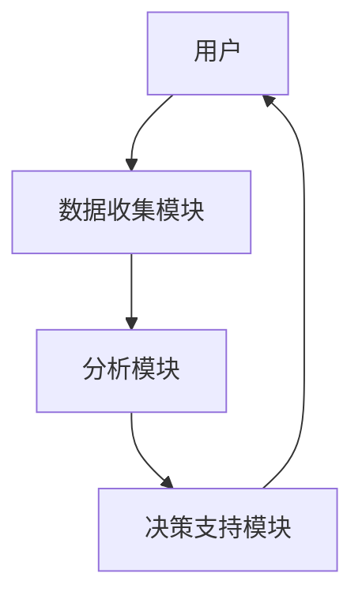
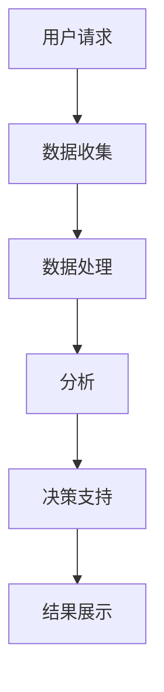

                 

# 价值投资在科技股中的应用

> 关键词：价值投资、科技股、股票分析、投资策略、风险管理、内在价值

> 摘要：价值投资是一种长期有效的投资策略，尤其在科技股中，其高成长性和高波动性使得价值投资的应用更具挑战性和重要性。本文通过系统分析和实际案例，详细探讨了价值投资在科技股中的应用方法，包括内在价值评估、财务分析、行业分析、风险管理等方面，为投资者提供科学的指导和实践参考。

---

## 第1章: 背景介绍

### 1.1 价值投资的定义与核心理念
价值投资是一种以基本面分析为基础的投资策略，强调以低于内在价值的价格购买优质资产。其核心理念是寻找市场低估的公司，长期持有，等待其价值回归。

- **核心概念**：内在价值、安全边际、长期投资。
- **核心原则**：选择具有强大竞争优势、良好财务状况和管理团队的公司。

### 1.2 科技股的特点与投资机会
科技股是指与科技行业相关的股票，涵盖半导体、互联网、人工智能等领域。科技股的特点包括高成长性、高波动性和高风险。

- **高成长性**：科技行业的创新能力强，增长潜力大。
- **高波动性**：科技股受市场情绪和技术进步影响较大，价格波动剧烈。
- **高风险**：科技行业的竞争激烈，技术更新换代快，风险较高。

### 1.3 价值投资在科技股中的应用前景
科技股的高成长性和高波动性为价值投资提供了丰富的机会，但也带来了挑战。价值投资者需要深入分析公司的基本面，寻找被市场低估的科技股。

---

## 第2章: 核心概念与联系

### 2.1 价值投资的核心概念
- **内在价值**：公司未来现金流的现值，是决定股票价值的关键。
- **市场价值**：股票在市场上的交易价格，可能高于或低于内在价值。
- **安全边际**：买入价格与内在价值之间的差距，提供了风险缓冲。

### 2.2 科技股的评估标准
- **财务指标**：市盈率（P/E）、市净率（P/B）、ROE（净资产收益率）等。
- **成长性**：收入增长率、净利润增长率等。
- **竞争优势**：专利、品牌、技术壁垒等。

### 2.3 价值投资中的风险控制
- **风险识别**：识别市场风险、公司风险、行业风险。
- **风险管理**：通过分散投资、设置止损等方式控制风险。

---

## 第3章: 算法原理与数学模型

### 3.1 内在价值的计算方法
现金流折现模型（DCF）是计算内在价值的核心方法。

#### 3.1.1 DCF模型
$$
\text{内在价值} = \sum_{t=1}^{n} \frac{\text{现金流}_t}{(1 + r)^t} + \frac{\text{残值}}{(1 + r)^n}
$$
其中，r为折现率，n为永续期数。

#### 3.1.2 市盈率模型
$$
\text{目标股价} = \text{目标市盈率} \times \text{每股收益}
$$

### 3.2 科技股的估值算法
- **步骤1**：预测公司未来5年的现金流。
- **步骤2**：计算永续期的现金流。
- **步骤3**：选择合适的折现率。
- **步骤4**：计算内在价值。

---

## 第4章: 系统分析与架构设计

### 4.1 系统功能设计
- **数据收集模块**：收集公司财务数据、行业数据。
- **分析模块**：计算内在价值、评估指标。
- **决策支持模块**：提供投资建议。

### 4.2 系统架构设计

### 4.3 数据流图

---

## 第5章: 项目实战

### 5.1 案例分析：苹果公司
#### 5.1.1 财务分析
- **收入**：2022年收入为9461亿美元。
- **净利润**：2022年净利润为998亿美元。
- **市盈率**：约25倍。

#### 5.1.2 竞争优势
- **品牌影响力**：全球知名品牌。
- **产品生态**：iPhone、iPad、Mac、Apple Watch形成闭环生态。

#### 5.1.3 投资决策
- **内在价值计算**：使用DCF模型计算苹果的内在价值约为每股200美元。
- **市场价值**：2023年苹果股价约为180美元，具有投资价值。

### 5.2 案例分析：亚马逊
#### 5.2.1 财务分析
- **收入**：2022年收入为4988亿美元。
- **净利润**：2022年净利润为254亿美元。
- **市盈率**：约50倍。

#### 5.2.2 竞争优势
- **电子商务**：全球最大的电商平台。
- **云计算**：AWS占据全球云服务市场主导地位。

#### 5.2.3 投资决策
- **内在价值计算**：使用DCF模型计算亚马逊的内在价值约为每股300美元。
- **市场价值**：2023年亚马逊股价约为150美元，具有长期投资价值。

### 5.3 案例分析：特斯拉
#### 5.3.1 财务分析
- **收入**：2022年收入为814.67亿美元。
- **净利润**：2022年净利润为125.52亿美元。
- **市盈率**：约30倍。

#### 5.3.2 竞争优势
- **电动汽车**：全球领先的电动汽车制造商。
- **自动驾驶技术**：具备强大的技术优势。

#### 5.3.3 投资决策
- **内在价值计算**：使用DCF模型计算特斯拉的内在价值约为每股700美元。
- **市场价值**：2023年特斯拉股价约为500美元，具有较高的投资潜力。

---

## 第6章: 总结与展望

### 6.1 总结
价值投资在科技股中的应用需要深入分析公司的基本面，寻找被市场低估的科技股。通过科学的估值方法和严格的风险管理，投资者可以在科技股中获得长期稳定的收益。

### 6.2 展望
随着科技行业的快速发展，价值投资在科技股中的应用将更加重要。未来，投资者需要更加关注公司的技术创新、市场地位和财务健康状况，以应对科技股投资中的挑战。

---

## 作者：AI天才研究院/AI Genius Institute & 禅与计算机程序设计艺术 /Zen And The Art of Computer Programming

