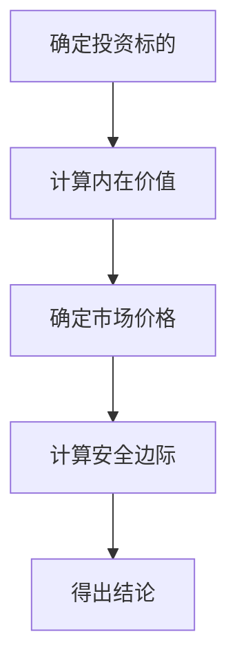
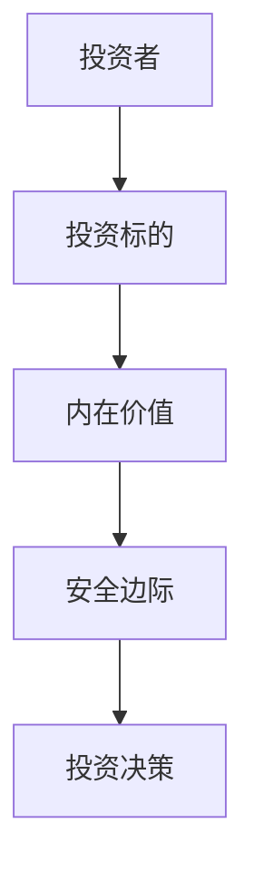
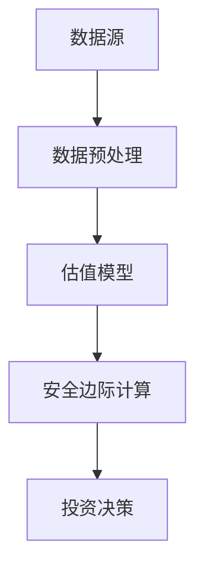
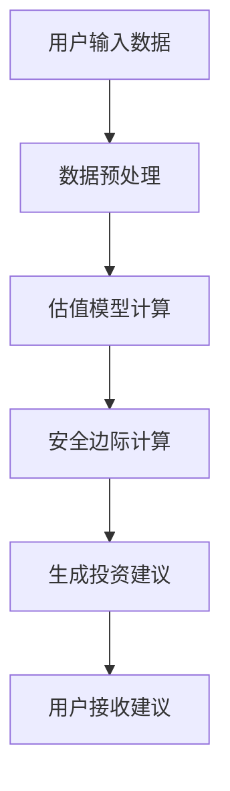

                 


# 《价值投资的核心原则：安全边际》

> 关键词：价值投资、安全边际、投资策略、风险控制、内在价值

> 摘要：本文深入探讨了价值投资的核心原则——安全边际。从定义、原理、计算方法到实际应用，详细阐述了如何通过安全边际来降低投资风险，实现稳健的投资回报。

---

## 第一部分: 价值投资与安全边际的背景介绍

### 第1章: 价值投资的核心概念

#### 1.1 价值投资的起源与定义

- **1.1.1 价值投资的起源**
  - 价值投资理论由本杰明·格雷厄姆在20世纪初提出。
  - 格雷厄姆的学生戴维·多德进一步完善了这一理论。
  - 价值投资强调以低于内在价值的价格购买优质资产。

- **1.1.2 价值投资的定义**
  - 价值投资是一种投资策略，旨在通过寻找市场价格低于内在价值的资产，实现长期稳定的收益。
  - 与短期交易不同，价值投资注重长期持有，关注企业的基本面。

- **1.1.3 价值投资的核心理念**
  - 市场价格波动与内在价值的差异提供了投资机会。
  - 投资者应关注企业的长期盈利能力，而非短期价格波动。
  - 安全边际是价值投资的核心原则之一。

#### 1.2 安全边际的定义与作用

- **1.2.1 安全边际的定义**
  - 安全边际 = 内在价值 - 市场价格。
  - 衡量市场价格与内在价值之间的差距，确保投资的安全性。

- **1.2.2 安全边际在价值投资中的作用**
  - 降低投资风险：通过安全边际，投资者可以避免在高估的市场中购买资产。
  - 提供纠错空间：即使估值出现误差，安全边际也能为投资者提供一定的缓冲。
  - 增强投资信心：安全边际的存在使得投资者能够在市场波动中保持耐心。

- **1.2.3 安全边际与价值投资的关系**
  - 安全边际是价值投资的核心原则，确保投资决策的稳健性。
  - 价值投资通过安全边际筛选出具有长期竞争优势的企业。

#### 1.3 价值投资与安全边际的核心要素

- **1.3.1 投资标的选择标准**
  - 企业具备长期竞争优势。
  - 财务状况稳健，盈利能力持续。
  - 市场价格低于内在价值。

- **1.3.2 安全边际的计算方法**
  - 计算内在价值，比较市场价格，确定安全边际宽度。

- **1.3.3 价值投资的边界与外延**
  - 安全边际的计算依赖于对内在价值的准确评估。
  - 价值投资的外延包括对企业管理、行业地位等因素的考量。

#### 1.4 安全边际与投资决策的联系

- **1.4.1 安全边际在投资决策中的应用**
  - 作为筛选投资标的的重要指标。
  - 用于评估投资风险和潜在回报。

- **1.4.2 安全边际与风险控制的关系**
  - 通过安全边际控制投资风险。
  - 在市场波动中，安全边际提供缓冲空间。

- **1.4.3 安全边际与长期投资回报的关系**
  - 安全边际高的投资标的，长期回报更稳定。
  - 通过安全边际筛选，投资者能够获得超越市场的回报。

#### 1.5 本章小结

- 价值投资以内在价值为核心，安全边际是其关键原则。
- 安全边际通过比较市场价格和内在价值，确保投资的稳健性。
- 价值投资不仅是一种投资策略，更是一种长期稳健的财富管理方法。

---

## 第二部分: 安全边际的核心概念与联系

### 第2章: 安全边际的原理与计算

#### 2.1 安全边际的原理

- **2.1.1 安全边际的基本原理**
  - 通过比较市场价格和内在价值，确定投资的安全性。
  - 内在价值是资产的真实价值，市场价格波动为其提供了投资机会。

- **2.1.2 安全边际的数学模型**
  - 内在价值（V）= 现金流的现值。
  - 安全边际 = V - P（P为市场价格）。

- **2.1.3 安全边际的属性特征对比表格**

| 属性       | 内在价值（V）       | 市场价格（P）         | 安全边际（V - P）     |
|------------|---------------------|----------------------|----------------------|
| 性质       | 理论价值             | 市场波动             | 数值差异             |
| 计算依据   | 未来现金流折现       | 市场供需关系         | 前两者的差值         |
| 作用       | 确定资产真实价值     | 反映市场情绪         | 评估投资安全性       |

#### 2.2 安全边际的计算方法

- **2.2.1 安全边际的计算公式**
  $$ \text{安全边际} = V - P $$

  其中：
  - \( V \) 是内在价值
  - \( P \) 是市场价格

- **2.2.2 安全边际的计算流程图（使用 Mermaid）**



- **2.2.3 安全边际的计算实例**
  - 投资标的价格：$P = 50$
  - 内在价值：$V = 60$
  - 安全边际：$10$
  - 分析：具有10美元的安全边际，投资风险较低。

#### 2.3 安全边际与价值投资的实体关系图（使用 Mermaid）



#### 2.4 本章小结

- 安全边际通过比较内在价值和市场价格，为投资者提供了风险控制的工具。
- 计算安全边际需要准确评估内在价值和市场价格，确保投资决策的稳健性。

---

## 第三部分: 安全边际的算法原理

### 第3章: 安全边际的算法实现

#### 3.1 内在价值的计算方法

- **3.1.1 内在价值的公式**
  $$ V = \sum_{t=1}^{n} \frac{CF_t}{(1 + r)^t} $$
  
  其中：
  - \( CF_t \) 是第t年的现金流
  - \( r \) 是折现率

- **3.1.2 内在价值计算的Python代码示例**

```python
def calculate_intrinsic_value(cash_flows, discount_rate):
    n = len(cash_flows)
    intrinsic_value = 0
    for t in range(n):
        cf = cash_flows[t]
        intrinsic_value += cf / (1 + discount_rate) ** t
    return intrinsic_value

# 示例
cash_flows = [100, 120, 150, 180]
discount_rate = 0.10
iv = calculate_intrinsic_value(cash_flows, discount_rate)
print(f"内在价值为: {iv:.2f}")
```

#### 3.2 安全边际的计算与验证

- **3.2.1 安全边际的计算流程**
  - 确定投资标的的现金流和折现率，计算内在价值。
  - 收集市场价格数据，计算安全边际。
  - 分析安全边际的宽度，决定是否投资。

- **3.2.2 安全边际的验证方法**
  - 使用历史数据验证安全边际的有效性。
  - 比较不同投资标的的安全边际，选择最优投资组合。

#### 3.3 安全边际的动态调整

- **3.3.1 动态调整的必要性**
  - 市场价格波动会影响安全边际。
  - 内在价值的变化需要及时更新。

- **3.3.2 动态调整的算法实现**

```python
import pandas as pd
import numpy as np

def calculate_margin(iv, p):
    return iv - p

# 示例数据
ivs = [100, 120, 150, 180]
prices = [80, 110, 130, 170]
margins = [calculate_margin(iv, p) for iv, p in zip(ivs, prices)]

data = pd.DataFrame({
    '内在价值': ivs,
    '市场价格': prices,
    '安全边际': margins
})

print(data)
```

---

## 第四部分: 安全边际的系统架构与设计

### 第4章: 系统架构与设计

#### 4.1 项目背景与目标

- 项目目标：开发一个基于安全边际的价值投资系统。
- 项目背景：帮助投资者识别具有足够安全边际的投资机会。

#### 4.2 系统功能设计

- 数据收集模块：获取投资标的的财务数据和市场价格。
- 估值模型模块：计算内在价值和安全边际。
- 风险评估模块：分析投资风险，提供决策支持。

#### 4.3 系统架构图（使用 Mermaid）



#### 4.4 系统接口设计

- 输入接口：接收财务数据和市场价格。
- 输出接口：提供安全边际和投资建议。

#### 4.5 系统交互流程图（使用 Mermaid）



---

## 第五部分: 项目实战与应用

### 第5章: 项目实战

#### 5.1 环境安装与配置

- 安装Python和必要的库（如Pandas、NumPy）。
- 配置数据源，如Yahoo Finance API。

#### 5.2 核心代码实现

- 数据收集与处理：
  ```python
  import yfinance as yf

  def get_stock_data(ticker, start, end):
      return yf.download(ticker, start, end)
  ```

- 安全边际计算：
  ```python
  def calculate_margin(iv, p):
      return iv - p
  ```

- 投资建议生成：
  ```python
  def generate_recommendation(margin):
      if margin > 20:
          return "买入"
      elif margin > 10:
          return "观望"
      else:
          return "卖出"
  ```

#### 5.3 实际案例分析

- 案例：某股票的内在价值为100，市场价格为80，安全边际为20。
- 分析：安全边际较高，建议买入。

#### 5.4 项目小结

- 项目实现了基于安全边际的投资决策系统。
- 提供了从数据收集到投资建议的完整流程。
- 代码示例展示了系统的核心功能。

---

## 第六部分: 安全边际的最佳实践

### 第6章: 最佳实践

#### 6.1 小结与总结

- 安全边际是价值投资的核心原则。
- 通过安全边际，投资者可以降低风险，实现稳健投资。

#### 6.2 注意事项

- 确保内在价值计算的准确性。
- 定期更新数据和模型。
- 避免情绪化投资，保持理性。

#### 6.3 拓展阅读

- 《价值投资：原则与实践》
- 《安全边际：投资的艺术与科学》

---

## 作者：AI天才研究院 & 禅与计算机程序设计艺术

---

这篇博客文章详细探讨了安全边际在价值投资中的应用，从理论到实践，为投资者提供了系统化的指导。通过清晰的结构和丰富的实例，帮助读者理解并应用这一核心原则，实现稳健的投资回报。

