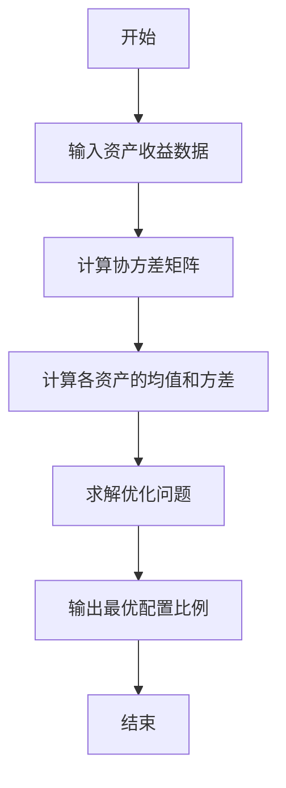
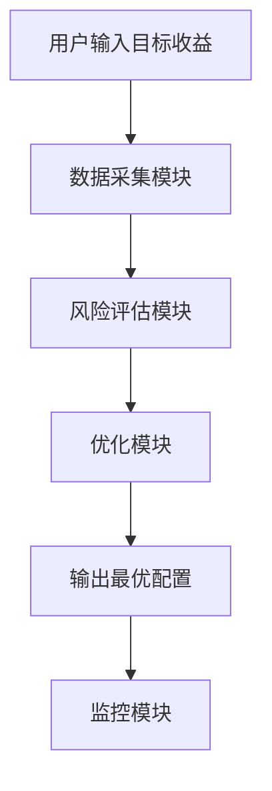
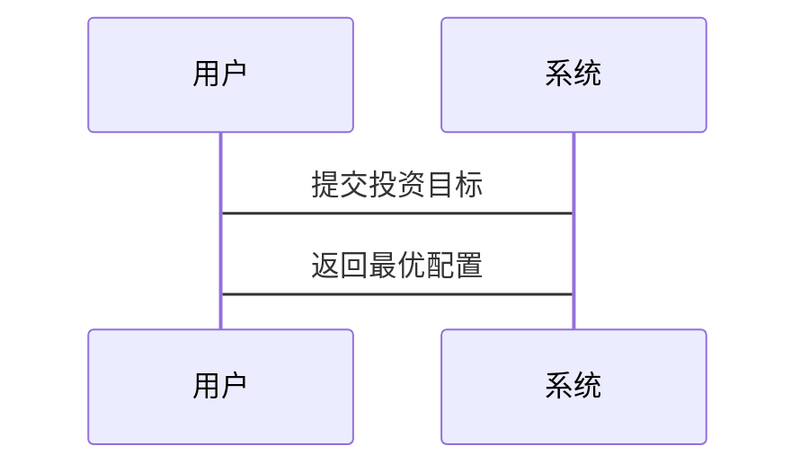

                 


# 《价值投资者如何构建多元化投资组合》

## 关键词：价值投资, 多元化投资, 投资组合, 资产配置, 风险管理, 价值评估

## 摘要：  
价值投资是一种长期有效的投资策略，通过深入分析企业的基本面，选择具有内在价值的股票进行投资。而构建多元化投资组合是降低风险、优化收益的重要手段。本文将从价值投资的核心理念出发，探讨如何通过科学的资产配置和风险分散，构建一个高效、稳定的多元化投资组合。文章结合现代投资组合理论，详细介绍投资组合的数学模型、优化算法以及实际应用案例，为价值投资者提供切实可行的指导。

---

# 第一部分：价值投资与多元化投资组合基础

## 第1章：价值投资的核心理念

### 1.1 价值投资的基本概念

#### 1.1.1 投资的定义与分类
投资是将资金投入某种资产或项目，以期在未来获得收益或资本增值的行为。根据资产类型，投资可以分为以下几类：
- **股票投资**：购买公司股权，分享企业成长收益。
- **债券投资**：购买政府或企业发行的债券，定期获取利息。
- **房地产投资**：购买房地产用于出租或升值。
- **其他投资**：如黄金、艺术品等实物资产。

#### 1.1.2 价值投资的起源与发展
价值投资由本杰明·格雷厄姆（Benjamin Graham）和戴维·多德（David Dodd）在20世纪初提出，强调以低于内在价值的价格购买优质股票。巴菲特（Warren Buffett）继承并发展了这一理念，认为市场短期波动不可预测，但长期来看，股票价格最终会回归其内在价值。

#### 1.1.3 价值投资的核心原则
- **安全边际**：买入价格低于内在价值，确保安全空间。
- **长期视角**：关注企业的长期盈利能力，而非短期价格波动。
- **基本面分析**：通过财务报表等数据评估企业的内在价值。

### 1.2 多元化投资组合的必要性

#### 1.2.1 投资组合的基本概念
投资组合是指将资金分散投资于多种资产，以降低风险并提高收益。多元化投资通过配置不同类型的资产，可以有效分散市场风险、行业风险和公司风险。

#### 1.2.2 多元化投资的优势
- **降低风险**：通过配置不同资产，减少单一资产波动对整体投资组合的影响。
- **提高收益稳定性**：不同资产在不同市场环境下的表现不同，组合收益更稳定。
- **捕捉更多投资机会**：多元化配置可以覆盖更多领域，抓住不同市场的投资机会。

#### 1.2.3 多元化与风险控制的关系
多元化投资通过分散投资降低非系统性风险（特定资产或行业的风险），但无法降低系统性风险（如经济衰退带来的整体市场下跌）。因此，构建投资组合时需要平衡多样性和风险控制。

### 1.3 价值投资与多元化投资的结合

#### 1.3.1 价值投资中的多元化策略
价值投资者通常选择多个具有持续盈利能力的优质企业进行投资，通过分散投资降低风险。

#### 1.3.2 多元化投资如何实现长期收益
通过配置不同类型资产（如股票、债券、房地产等），投资者可以在不同市场环境下保持稳定收益，同时抓住优质资产的长期增值机会。

#### 1.3.3 价值投资与多元化投资的边界
价值投资强调基本面分析和安全边际，而多元化投资强调资产配置和风险分散。两者的结合需要在选择资产时兼顾质量和多样性。

## 1.4 本章小结  
本章介绍了价值投资的基本概念、多元化投资的优势以及两者结合的策略。通过理解这些内容，投资者可以更好地构建一个既能分散风险又具备长期增长潜力的投资组合。

---

## 第2章：资产配置与风险分散

### 2.1 资产配置的基本原理

#### 2.1.1 资产配置的定义与分类
资产配置是指将资金分配到不同资产类别（如股票、债券、现金等）以实现投资目标。常见的资产配置类型包括：
- **保守型配置**：以债券、现金为主，风险低，收益稳定。
- **平衡型配置**：股票和债券各占一定比例，风险和收益适中。
- **积极型配置**：以股票为主，风险较高，收益潜力大。

#### 2.1.2 不同资产类别风险收益特征对比
| 资产类别 | 风险 | 收益 |
|----------|------|------|
| 股票     | 高   | 高   |
| 债券     | 中   | 中   |
| 现金     | 低   | 低   |
| 房地产   | 中高 | 高   |

#### 2.1.3 资产配置的数学模型
资产配置可以通过数学模型优化。假设投资者有两类资产（股票和债券），目标是实现最大收益。可以用以下公式表示：
$$ w_1 \times r_1 + w_2 \times r_2 = \text{总收益} $$
其中，$w_1$ 和 $w_2$ 分别是股票和债券的配置比例，$r_1$ 和 $r_2$ 分别是两类资产的预期收益。

### 2.2 风险分散的原理与方法

#### 2.2.1 风险的定义与分类
风险是指投资收益的不确定性，通常分为系统性风险和非系统性风险。系统性风险（如经济衰退）影响整个市场，而非系统性风险（如公司业绩下滑）仅影响特定资产。

#### 2.2.2 风险分散的基本原理
通过将资金分配到相关性较低的资产，可以降低非系统性风险。例如，股票和债券的相关性较低，可以有效分散风险。

#### 2.2.3 风险分散的具体方法
- **跨行业投资**：选择不同行业的股票，避免单一行业波动的影响。
- **跨市场投资**：配置国内外资产，分散地域风险。
- **资产类别多样化**：同时投资股票、债券、房地产等多种资产。

### 2.3 资产配置与风险分散的结合

#### 2.3.1 资产配置对风险分散的影响
资产配置决定了投资组合的风险和收益特征。通过合理配置资产，可以实现风险与收益的最佳平衡。

#### 2.3.2 不同市场环境下的资产配置策略
- **牛市**：增加股票配置，抓住市场上涨机会。
- **熊市**：增加债券配置，降低投资组合的波动性。

#### 2.3.3 资产配置的风险调整收益分析
在选择资产配置方案时，需要考虑每种方案的风险调整后收益（RAROC）。例如，方案A的收益为10%，风险为20%；方案B的收益为8%，风险为10%。显然，方案B的风险调整后收益更高。

### 2.4 本章小结  
本章详细讲解了资产配置的基本原理和风险分散的具体方法，强调了两者结合在投资组合管理中的重要性。

---

## 第3章：现代投资组合理论与数学模型

### 3.1 现代投资组合理论概述

#### 3.1.1 理论的提出与核心假设
现代投资组合理论（MPT）由哈里·马科维茨（Harry Markowitz）提出，核心假设包括：
- 投资者是理性的，追求收益最大化且厌恶风险。
- 资产收益符合正态分布。
- 市场是有效的，价格反映所有相关信息。

#### 3.1.2 理论的特点与局限性
- **特点**：强调风险调整后的收益，提倡分散投资。
- **局限性**：假设市场有效且收益符合正态分布，可能与实际情况不符。

### 3.2 投资组合理论的数学模型

#### 3.2.1 均值-方差模型
均值-方差模型用于优化投资组合的收益和风险。目标是最小化投资组合的方差（风险），在满足收益约束的条件下：
$$\text{目标函数: } \min_w \sigma^2$$
$$\text{约束条件: } \sum w_i = 1$$
其中，$w_i$ 是第$i$个资产的配置比例，$\sigma^2$ 是投资组合的方差。

#### 3.2.2 资本资产定价模型（CAPM）
CAPM用于确定资产的预期收益：
$$E(r_i) = r_f + \beta_i (E(r_m) - r_f)$$
其中，$r_f$ 是无风险利率，$\beta_i$ 是第$i$个资产的贝塔系数，$E(r_m)$ 是市场预期收益。

### 3.3 投资组合理论的算法实现

#### 3.3.1 均值-方差优化算法流程图


#### 3.3.2 Python代码实现
```python
import numpy as np
import pandas as pd

def mean_variance_optimization(returns):
    n = returns.shape[1]
    Sigma = returns.cov()
    mu = returns.mean().values

    # 初始化权重向量
    w = np.zeros(n)
    w[0] = 1

    # 迭代优化
    for i in range(1000):
        h = np.zeros(n)
        for j in range(n):
            if w[j] > 0:
                h[j] = 1
        w = w * (1 - w @ h + h @ h) / (w @ h)
    
    return w
```

#### 3.3.3 算法原理的图表展示


### 3.4 本章小结  
本章通过数学模型和算法实现，详细讲解了现代投资组合理论在多元化投资组合中的应用。

---

## 第4章：投资组合管理系统设计

### 4.1 系统功能设计

#### 4.1.1 系统功能模块
- **数据采集模块**：收集资产的历史收益数据。
- **风险评估模块**：计算各资产的风险指标（如方差、贝塔系数）。
- **优化模块**：基于均值-方差模型优化投资组合。
- **监控模块**：实时监控投资组合的表现。

#### 4.1.2 系统功能流程图


### 4.2 系统架构设计

#### 4.2.1 系统架构图


#### 4.2.2 关键接口设计
- **数据接口**：提供资产收益数据的查询接口。
- **优化接口**：根据输入的收益目标，返回最优配置比例。

### 4.3 系统交互设计

#### 4.3.1 系统交互流程图


### 4.4 本章小结  
本章通过系统设计，展示了如何将投资组合优化算法应用于实际投资管理中。

---

## 第5章：项目实战——构建多元化投资组合

### 5.1 环境安装与配置

#### 5.1.1 环境要求
- Python 3.8以上版本
- 安装必要的库：pandas、numpy、scipy、matplotlib

#### 5.1.2 安装步骤
```bash
pip install pandas numpy scipy matplotlib
```

### 5.2 核心代码实现

#### 5.2.1 数据采集
```python
import pandas as pd

# 从Yahoo Finance获取数据
def get_data(tickers, start, end):
    data = pd.DataFrame()
    for ticker in tickers:
        data[ticker] = pdDataReader(ticker, 'yahoo', start, end)['Adj Close']
    return data
```

#### 5.2.2 风险评估
```python
import numpy as np

def calculate_risk(data):
    returns = data.pct_change().dropna()
    covariance_matrix = returns.cov()
    return covariance_matrix
```

#### 5.2.3 投资组合优化
```python
from scipy.optimize import minimize

def optimize_portfolio(returns):
    n = returns.shape[1]
    mu = returns.mean().values
    Sigma = returns.cov().values

    def objective(w):
        return np.dot(w.T, np.dot(Sigma, w))

    constraints = [{'type': 'eq', 'fun': lambda w: sum(w) - 1}]
    bounds = [(0, 1) for _ in range(n)]

    result = minimize(objective, np.ones(n)/n, bounds=bounds, constraints=constraints)
    return result.x
```

#### 5.2.4 结果展示
```python
import matplotlib.pyplot as plt

def plot_portfolio(weights):
    plt.bar(weights.index, weights.values)
    plt.title('Investment Portfolio Allocation')
    plt.ylabel('Weight')
    plt.show()
```

### 5.3 案例分析与解读

#### 5.3.1 数据来源与假设
- 数据来源：选取5只股票和2只债券，数据区间为过去5年。
- 假设：市场是有效的，历史收益可以预测未来收益。

#### 5.3.2 优化结果分析
- 通过均值-方差优化，得出最优配置比例。
- 对比不同配置方案的风险调整后收益。

### 5.4 项目小结  
通过本章的实战项目，读者可以掌握如何利用Python工具构建一个简单的多元化投资组合，并理解理论在实际中的应用。

---

## 第6章：最佳实践与风险管理

### 6.1 价值投资中的风险管理

#### 6.1.1 风险管理的核心原则
- 定期评估投资组合的风险敞口。
- 及时调整配置比例以应对市场变化。
- 设置止损点，避免重大损失。

#### 6.1.2 风险管理的工具与方法
- 使用VaR（Value at Risk）模型评估潜在损失。
- 定期复检投资组合的分散效果。

### 6.2 定期调整与再平衡

#### 6.2.1 投资组合再平衡的必要性
- 市场波动导致资产比例偏离目标配置。
- 通过定期再平衡优化风险收益比。

#### 6.2.2 再平衡的实现步骤
1. 评估当前投资组合的配置比例。
2. 对比目标配置，计算调整幅度。
3. 调整各资产的配置比例，完成再平衡。

### 6.3 长期投资与定期定额投资

#### 6.3.1 长期投资的优势
- 降低市场短期波动的影响。
- 享受复利效应，实现财富长期增值。

#### 6.3.2 定期定额投资的策略
- 定期投入固定金额，分散投资成本。
- 适合长期看好市场但无法频繁交易的投资者。

### 6.4 本章小结  
本章总结了多元化投资组合管理中的风险管理原则和长期投资策略，强调了定期调整和定额定投的重要性。

---

## 第7章：结论与展望

### 7.1 研究总结
本文详细探讨了价值投资者如何通过多元化投资组合构建实现长期稳定收益。从理论基础到实际应用，为投资者提供了全面的指导。

### 7.2 未来展望
未来，随着人工智能和大数据技术的发展，投资组合优化将更加精准和高效。投资者可以利用新技术进一步提升投资决策的科学性。

---

## 作者：AI天才研究院/AI Genius Institute & 禅与计算机程序设计艺术 /Zen And The Art of Computer Programming

