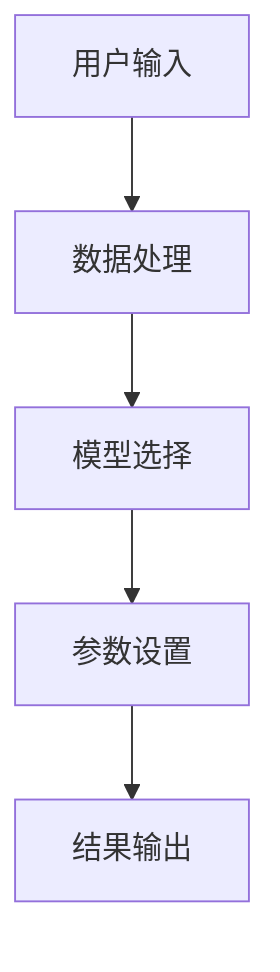

                 


# 《价值投资者必备：企业估值技巧》

## 关键词：
- 价值投资
- 企业估值
- DCF模型
- 市盈率
- 市净率
- 股息率
- 加权平均资本成本（WACC）

## 摘要：
企业估值是价值投资的核心技能，决定了投资者对企业的内在价值的判断。本文系统地介绍了多种企业估值方法，重点讲解了现金流贴现模型（DCF模型）、市盈率法、市净率法和股息率法等常用方法。通过详细分析每种方法的原理、公式、优缺点及实际应用案例，帮助投资者掌握企业估值的核心技巧。同时，本文还探讨了如何构建企业估值系统、如何选择合适的估值模型以及如何避免估值中的常见误区。通过实际的项目实战和代码实现，进一步巩固读者对企业估值的理解和应用能力。

---

# 第1章: 价值投资与企业估值概述

## 1.1 价值投资的起源与发展

### 1.1.1 价值投资的起源
价值投资起源于20世纪初，由本杰明·格雷厄姆和戴维·多德等人提出。它是一种基于对企业内在价值分析的投资方法，强调以低于内在价值的价格买入优质股票。

### 1.1.2 价值投资的核心理念
价值投资的核心理念是：市场价格围绕内在价值波动，投资者应寻找市场价格低于内在价值的企业进行投资。

### 1.1.3 价值投资与企业估值的关系
企业估值是价值投资的基石，通过对企业的内在价值进行评估，投资者可以判断其是否具备投资价值。

## 1.2 企业估值的基本概念

### 1.2.1 企业估值的定义
企业估值是指通过对企业未来现金流的折现，估算企业当前的内在价值。

### 1.2.2 企业估值的核心要素
- 自由现金流
- 折现率
- 终值

### 1.2.3 企业估值的重要性
准确的企业估值可以帮助投资者识别低估或高估的企业，避免投资决策中的重大错误。

## 1.3 企业估值的主要方法

### 1.3.1 市盈率法
市盈率法通过将企业当前股价与市盈率进行比较，判断其估值是否合理。

### 1.3.2 市净率法
市净率法通过比较企业股价与每股净资产的比率，判断其估值是否合理。

### 1.3.3 股息率法
股息率法通过比较企业股息与股价的比率，判断其估值是否合理。

## 1.4 企业估值的常见误区

### 1.4.1 高估企业价值的常见错误
- 忽略企业的财务风险
- 过高估计未来的现金流

### 1.4.2 低估企业价值的常见错误
- 忽略企业的竞争优势
- 过低估计企业的成长潜力

### 1.4.3 企业估值中的非理性因素
- 市场情绪的影响
- 过度依赖历史数据

## 1.5 本章小结
企业估值是价值投资的核心技能，投资者需要掌握多种估值方法，并结合企业的实际情况进行综合判断。

---

# 第2章: 现金流贴现模型（DCF模型）详解

## 2.1 DCF模型的定义与特点

### 2.1.1 DCF模型的定义
现金流贴现模型（DCF模型）是一种通过将未来现金流折现，估算企业内在价值的方法。

### 2.1.2 DCF模型的核心假设
- 未来现金流可以合理预测
- 折现率能够准确反映企业的财务风险和市场风险

### 2.1.3 DCF模型的优势与局限性
- 优势：能够全面考虑企业的未来现金流
- 局限性：对现金流预测的准确性要求较高

## 2.2 DCF模型的计算步骤

### 2.2.1 确定企业的自由现金流
自由现金流（FCF） = 经营活动现金流 - 资本支出

### 2.2.2 估算终值
终值（TV） = 自由现金流 / 折现率

### 2.2.3 计算加权平均资本成本（WACC）
$$ WACC = w_d \times k_d + w_e \times k_e $$

## 2.3 DCF模型的数学公式

### 2.3.1 终值计算公式
$$ TV = \frac{CF_{n+1}}{WACC} $$

### 2.3.2 加权平均资本成本公式
$$ WACC = w_d \times k_d + w_e \times k_e $$

## 2.4 DCF模型的实际应用

### 2.4.1 案例分析：某公司DCF估值
- 假设某公司未来5年的自由现金流分别为100、120、140、160、180万元
- 折现率为10%
- 终值 = 180 / 10% = 1800万元
- 内在价值 = 现值（前五年现金流的现值） + 终值的现值

## 2.5 本章小结
DCF模型是企业估值的核心方法，通过对未来现金流的折现，可以帮助投资者准确估算企业的内在价值。

---

# 第3章: 企业估值的其他方法

## 3.1 市盈率法（P/E Ratio）

### 3.1.1 市盈率的定义
市盈率 = 股价 / 每股收益

### 3.1.2 市盈率的计算公式
$$ P/E = \frac{Price}{Earnings} $$

## 3.2 市净率法（P/B Ratio）

### 3.2.1 市净率的定义
市净率 = 股价 / 每股净资产

### 3.2.2 市净率的计算公式
$$ P/B = \frac{Price}{Book\ Value\ Per\ Share} $$

## 3.3 股息率法

### 3.3.1 股息率的定义
股息率 = 每股股息 / 股价

### 3.3.2 股息率的计算公式
$$ Dividend\ Yield = \frac{Dividend\ Per\ Share}{Price\ Per\ Share} $$

## 3.4 各种估值方法的对比分析

| 估值方法 | 优点 | 缺点 |
|----------|------|------|
| DCF模型 | 考虑未来现金流 | 对现金流预测依赖性强 |
| 市盈率法 | 简单易用 | 适合盈利稳定的公司 |
| 市净率法 | 考虑资产价值 | 不适合亏损公司 |
| 股息率法 | 简单易用 | 适合高分红公司 |

## 3.5 本章小结
不同的估值方法各有优缺点，投资者应根据企业的实际情况选择合适的估值方法。

---

# 第4章: 企业估值的数学模型与公式

## 4.1 DCF模型的数学推导

### 4.1.1 现金流贴现公式
$$ V = \sum_{t=1}^{n} \frac{CF_t}{(1 + r)^t} + \frac{TV}{(1 + r)^n} $$

### 4.1.2 终值计算公式
$$ TV = \frac{CF_{n+1}}{r} $$

## 4.2 加权平均资本成本（WACC）的计算公式

$$ WACC = w_d \times k_d + w_e \times k_e $$

其中：
- \( w_d \) 和 \( w_e \) 分别表示债务和股权的权重
- \( k_d \) 和 \( k_e \) 分别表示债务和股权的资本成本

## 4.3 企业估值的综合案例分析

### 4.3.1 案例背景
某公司未来5年的自由现金流分别为100、120、140、160、180万元，折现率为10%。

### 4.3.2 计算过程
- 现金流的现值计算：
  $$ PV = \frac{100}{1.1} + \frac{120}{1.1^2} + \frac{140}{1.1^3} + \frac{160}{1.1^4} + \frac{180}{1.1^5} $$
- 终值计算：
  $$ TV = \frac{180}{0.1} = 1800万元 $$
- 终值的现值：
  $$ PV_{TV} = \frac{1800}{1.1^5} = 825.44万元 $$

### 4.3.3 内在价值
$$ V = PV + PV_{TV} = 450.48 + 825.44 = 1275.92万元 $$

## 4.4 本章小结
通过数学公式和案例分析，进一步理解企业估值的核心逻辑。

---

# 第5章: 企业估值系统设计与实现

## 5.1 系统架构设计

### 5.1.1 系统功能模块
- 数据输入模块
- 模型选择模块
- 参数设置模块
- 结果输出模块

### 5.1.2 系统架构图



## 5.2 系统实现代码

### 5.2.1 环境安装
- Python 3.8+
- numpy、pandas库

### 5.2.2 核心代码实现

```python
import numpy as np

def calculateDCF(FCFs, wacc):
    PV = 0
    for t in range(len(FCFs)):
        PV += FCFs[t] / (1 + wacc)**t
    return PV

FCFs = [100, 120, 140, 160, 180]
wacc = 0.1
DCF_value = calculateDCF(FCFs, wacc)
print("DCF Value:", DCF_value)
```

### 5.2.3 代码解读
- `calculateDCF`函数：计算现金流的现值
- `FCFs`：未来现金流列表
- `wacc`：加权平均资本成本

## 5.3 项目实战

### 5.3.1 案例分析
- 某公司未来5年的自由现金流分别为100、120、140、160、180万元
- 折现率为10%

### 5.3.2 实际计算
- 现金流的现值：
  $$ PV = \frac{100}{1.1} + \frac{120}{1.1^2} + \frac{140}{1.1^3} + \frac{160}{1.1^4} + \frac{180}{1.1^5} = 450.48万元 $$
- 终值：
  $$ TV = \frac{180}{0.1} = 1800万元 $$
- 终值的现值：
  $$ PV_{TV} = \frac{1800}{1.1^5} = 825.44万元 $$
- 内在价值：
  $$ V = 450.48 + 825.44 = 1275.92万元 $$

## 5.4 本章小结
通过系统设计和代码实现，进一步理解企业估值的实际操作过程。

---

# 第6章: 总结与展望

## 6.1 本章总结
企业估值是价值投资的核心技能，投资者需要掌握多种估值方法，并结合企业的实际情况进行综合判断。

## 6.2 未来展望
随着人工智能和大数据技术的发展，企业估值将更加精准和高效。投资者应关注新兴技术对企业估值的影响，并不断学习和提升自己的估值能力。

---

# 作者：AI天才研究院/AI Genius Institute & 禅与计算机程序设计艺术 /Zen And The Art of Computer Programming

---

**说明：以上内容为文章的完整大纲和部分详细内容，您可以根据需要继续补充各章节的具体内容。**

