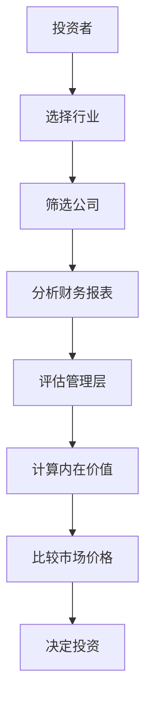

                 


# 价格公道的好公司：巴菲特投资理念的核心

> 关键词：巴菲特投资理念，价值投资，价格公道，好公司，内在价值，风险管理，投资策略

> 摘要：本文深入分析巴菲特投资理念的核心，探讨其如何通过寻找价格公道的好公司来实现长期稳健的投资回报。文章从巴菲特的投资哲学、核心概念、数学模型、系统架构、实际案例、风险管理等方面进行详细阐述，为读者提供全面的理论和实践指导。

---

## 第一部分: 巴菲特投资理念的核心基础

### 第1章: 巴菲特投资理念的背景与核心概念

#### 1.1 巴菲特投资理念的背景

巴菲特的投资理念是价值投资的代表，其核心思想是寻找价格公道的好公司。价值投资的起源可以追溯到本杰明·格雷厄姆，而巴菲特在此基础上发展出了自己的独特方法。他强调长期投资、基本面分析和安全边际，认为市场波动是投资机会的来源。

#### 1.2 巴菲特投资理念的核心概念

- **好公司的定义**：巴菲特认为好公司具有强大的护城河、稳定的盈利能力、良好的管理层和健康的财务状况。
- **内在价值的计算**：内在价值是公司未来现金流的现值，计算公式为：
  $$ \text{内在价值} = \sum_{t=1}^{\infty} \frac{\text{CF}_t}{(1 + r)^t} $$
  其中，CF为现金流，r为折现率。

#### 1.3 巴菲特投资理念的边界与外延

- **投资与投机的界限**：巴菲特强调投资的长期性和安全性，而投机则是短期且高风险的。
- **长期投资与短期交易的对比**：巴菲特主张长期持有，避免频繁交易，以降低交易成本和市场波动的影响。
- **价值投资的适用范围**：价值投资适用于具有明确财务数据和稳定商业模式的公司。

### 第2章: 巴菲特投资理念的核心原理

#### 2.1 巴菲特投资理念的数学模型

- **股息折现模型（DDM）**：用于评估股票的内在价值。
  $$ \text{内在价值} = \frac{\text{D}_1}{r - g} $$
  其中，D1为第一年的股息，r为折现率，g为股息增长率。

- **现金流折现模型（DCF）**：用于评估公司的整体价值。
  $$ \text{企业价值} = \sum_{t=1}^{n} \frac{\text{CF}_t}{(1 + r)^t} $$

#### 2.2 巴菲特投资理念的系统架构

- **投资者决策流程**：
  ```mermaid
  graph TD
    A[投资者] --> B[选择行业]
    B --> C[筛选公司]
    C --> D[分析财务报表]
    D --> E[评估管理层]
    E --> F[计算内在价值]
    F --> G[比较市场价格]
    G --> H[决定投资]
  ```

- **公司基本面分析**：
  ```mermaid
  graph TD
    A[公司] --> B[收入]
    B --> C[利润]
    C --> D[现金流]
    D --> E[资产负债表]
  ```

### 第3章: 巴菲特投资理念的核心要素与联系

#### 3.1 核心要素对比表格

| 核心要素       | 描述                           | 重要性 |
|----------------|--------------------------------|--------|
| 公司基本面     | 收入、利润、现金流             | 高      |
| 财务报表分析   | 资产、负债、利润表             | 中      |
| 管理层质量     | 诚信、能力                     | 高      |

#### 3.2 巴菲特投资理念的系统架构图



---

## 第二部分: 巴菲特投资理念的实践应用

### 第4章: 巴菲特投资理念的数学模型与实例

#### 4.1 内在价值计算的数学公式

- **案例分析**：假设某公司未来5年的现金流分别为100万、120万、150万、180万、200万，折现率为10%。
  $$ \text{内在价值} = \frac{100}{1.1} + \frac{120}{1.1^2} + \frac{150}{1.1^3} + \frac{180}{1.1^4} + \frac{200}{1.1^5} \approx 471.24 \text{万元} $$

- **市场价格比较**：如果市场价格低于内在价值，说明公司被低估。

### 第5章: 巴菲特投资理念的实际案例分析

#### 5.1 可口可乐案例

- **行业地位**：可口可乐是全球饮料行业的领导者。
- **财务状况**：现金流稳定，负债率低。
- **管理层质量**：管理层注重股东价值和长期发展。
- **内在价值**：通过DCF模型计算，可口可乐的内在价值远高于市场价格。

#### 5.2 苹果公司案例

- **护城河**：强大的品牌和技术优势。
- **财务状况**：现金流充足，资产负债表健康。
- **管理层质量**：库克的领导能力得到市场认可。
- **内在价值**：通过DDM模型计算，苹果的内在价值高于市场价格。

### 第6章: 巴菲特投资理念的风险管理

#### 6.1 风险管理的核心原则

- **分散投资**：避免过度集中，降低风险。
- **安全边际**：买入价格低于内在价值，留有安全空间。
- **长期持有**：避免短期波动的影响。

#### 6.2 风险管理的实践

- **市场波动**：市场波动是机会，而非风险。
- **估值错误**：通过持续学习和分析，避免估值错误。
- **管理层变化**：关注管理层的稳定性，避免管理层质量问题。

---

## 第三部分: 巴菲特投资理念的总结与展望

### 第7章: 巴菲特投资理念的总结与未来展望

#### 7.1 总结

巴菲特的投资理念强调长期、基本面和价值。通过寻找价格公道的好公司，投资者可以在市场波动中获得稳健的回报。核心要素包括公司基本面、财务报表分析和管理层质量。

#### 7.2 未来展望

随着市场的发展，巴菲特的投资理念将不断演变。投资者需要结合新的经济环境和技术变化，灵活运用巴菲特的理论，寻找新的投资机会。

---

## 附录

### 附录A: 巴菲特经典语录

- “价格是暂时的，价值是永恒的。”
- “投资是简单的事情，但需要极大的勇气。”

### 附录B: 参考文献

- 巴菲特的股东大会演讲
- 《巴菲特投资哲学》
- 《价值投资：从理论到实践》

---

作者：AI天才研究院/AI Genius Institute & 禅与计算机程序设计艺术 /Zen And The Art of Computer Programming

