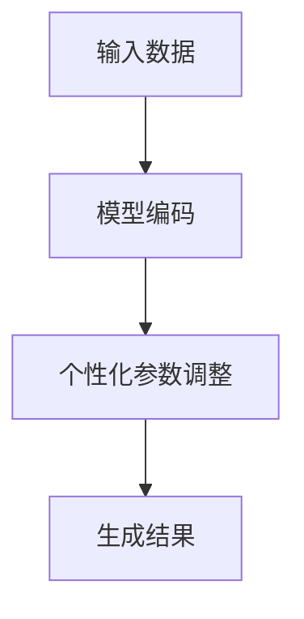
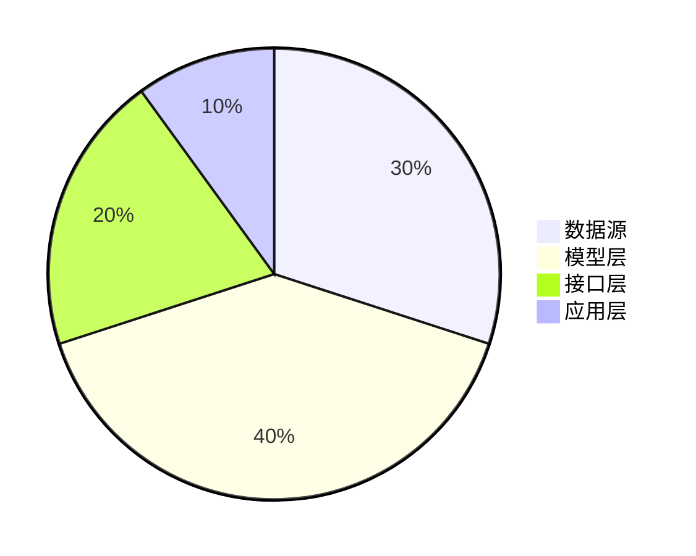
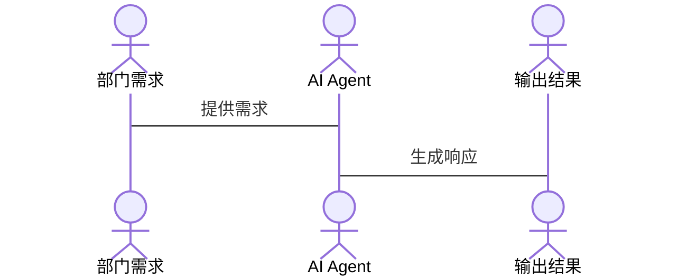

                 


# 企业AI Agent的个性化定制：适应不同部门需求

## 关键词：企业AI Agent，个性化定制，部门需求，AI模型，系统架构

## 摘要：本文详细探讨了企业AI Agent的个性化定制，分析了其在不同部门中的应用，从核心概念、算法原理到系统架构和项目实战，为企业提供了一套完整的解决方案。

---

## 第1章: 企业AI Agent概述

### 1.1 企业AI Agent的定义与背景

#### 1.1.1 什么是企业AI Agent

企业AI Agent是一种智能系统，能够感知环境、理解需求，并通过执行任务来满足特定目标。它结合了自然语言处理、机器学习和自动化技术，为企业提供智能化的解决方案。

#### 1.1.2 企业AI Agent的发展背景

随着企业数字化转型的推进，对智能化工具的需求日益增长。AI Agent能够处理复杂任务，提高效率，成为企业不可或缺的一部分。

#### 1.1.3 企业AI Agent的应用价值

AI Agent能够优化企业流程，提升决策能力，并为用户提供个性化的服务，从而增强竞争力。

### 1.2 企业AI Agent的核心需求

#### 1.2.1 不同部门的个性化需求

企业中的销售、客服、技术等各部门有不同的需求，AI Agent需要根据这些需求进行定制。

#### 1.2.2 企业AI Agent的定制化目标

通过个性化定制，AI Agent能够更精准地满足各部门的需求，提高效率和准确性。

#### 1.2.3 企业AI Agent的实现方式

AI Agent可以通过参数微调、prompt设计和多任务学习等方法实现个性化定制。

### 1.3 企业AI Agent的边界与外延

#### 1.3.1 企业AI Agent的功能边界

明确AI Agent的功能范围，避免超出其能力范围。

#### 1.3.2 企业AI Agent的适用场景

适用于需要个性化服务和自动化处理的部门。

#### 1.3.3 企业AI Agent的限制与挑战

数据质量、模型泛化能力以及隐私保护是主要挑战。

### 1.4 企业AI Agent的核心要素

#### 1.4.1 数据源与输入

AI Agent需要多样化的数据源，如文本、结构化数据等。

#### 1.4.2 AI模型与算法

选择合适的模型和算法是实现个性化定制的关键。

#### 1.4.3 个性化定制参数

这些参数决定了AI Agent的行为模式，需要根据部门需求进行调整。

### 1.5 本章小结

本章介绍了企业AI Agent的基本概念、核心需求和实现方式，为后续章节打下基础。

---

## 第2章: 企业AI Agent的核心概念与联系

### 2.1 核心概念原理

#### 2.1.1 AI Agent的基本原理

AI Agent通过感知环境、理解和推理需求，生成相应的响应或执行任务。

#### 2.1.2 个性化定制的核心机制

个性化定制通过调整模型参数或使用特定的prompt，使AI Agent适应不同部门的需求。

#### 2.1.3 部门需求与AI Agent的映射关系

部门需求被转化为定制化的参数和模型，以实现精准服务。

### 2.2 核心概念属性对比

| 属性 | 部门需求 | 个性化定制参数 |
|------|----------|----------------|
| 特征 | 功能需求、数据需求 | 参数调整、模型优化 |

### 2.3 ER实体关系图

```mermaid
er
  actor: 部门需求
  actor: AI Agent
  actor: 个性化参数
  actor: 数据源
  actor: 输出结果
  relation: "提供" --> 部门需求
  relation: "处理" --> AI Agent
  relation: "生成" --> 输出结果
```

### 2.4 本章小结

本章通过实体关系图和属性对比，详细阐述了企业AI Agent的核心概念及其与部门需求的联系。

---

## 第3章: 企业AI Agent的算法原理

### 3.1 生成式AI模型原理

#### 3.1.1 基于大语言模型的生成原理

大语言模型通过大量数据训练，生成与输入相关的文本。

#### 3.1.2 Transformer模型的核心机制

Transformer模型使用自注意力机制，捕捉文本中的长距离依赖关系。

#### 3.1.3 概率生成模型的数学基础

生成模型通过概率分布预测下一个词，公式如下：

$$ P(y|x) = \prod_{i=1}^{n} P(y_i | y_{<i}, x) $$

### 3.2 个性化定制算法

#### 3.2.1 参数微调的实现原理

通过微调模型参数，使AI Agent适应特定部门的需求。

#### 3.2.2 基于prompt的定制方法

使用特定的prompt，引导模型生成符合需求的输出。

#### 3.2.3 多任务学习的优化策略

同时优化多个任务，提升模型的泛化能力。

### 3.3 算法流程图



### 3.4 本章小结

本章详细讲解了生成式AI模型的原理及其个性化定制算法，为实现企业AI Agent提供了理论基础。

---

## 第4章: 企业AI Agent的系统架构

### 4.1 系统组成

企业AI Agent系统主要包括数据层、模型层、接口层和应用层。

### 4.2 功能模块

- 数据处理模块：负责数据预处理和特征提取。
- 模型推理模块：执行生成任务。
- 自定义参数模块：调整模型参数。
- 输出模块：生成并返回结果。

### 4.3 系统架构图



### 4.4 系统接口设计

- 输入接口：接收部门需求和数据。
- 输出接口：返回生成结果和日志。

### 4.5 系统交互流程图



### 4.6 本章小结

本章通过系统架构图和交互流程图，展示了企业AI Agent的整体结构和工作流程。

---

## 第5章: 企业AI Agent的项目实战

### 5.1 环境安装

安装Python、TensorFlow和Hugging Face库：

```bash
pip install python==3.9
pip install tensorflow
pip install transformers
```

### 5.2 系统核心实现源代码

```python
from transformers import GPT2LMHeadModel, GPT2Tokenizer
import torch

# 加载预训练模型和分词器
model_name = 'gpt2'
tokenizer = GPT2Tokenizer.from_pretrained(model_name)
model = GPT2LMHeadModel.from_pretrained(model_name)

# 自定义参数调整
def customize_params(model):
    for name, param in model.named_parameters():
        if 'output' in name:
            param.requires_grad = True
    return model

# 生成函数
def generate_response(prompt, model, tokenizer):
    inputs = tokenizer.encode(prompt, return_tensors='pt')
    outputs = model.generate(inputs, max_length=50, do_sample=True)
    response = tokenizer.decode(outputs[0], skip_special_tokens=True)
    return response

# 测试案例
prompt = "作为销售部门，我们需要生成客户邮件..."
response = generate_response(prompt, model, tokenizer)
print(response)
```

### 5.3 代码解读与分析

1. **环境安装**：确保安装了必要的库。
2. **模型加载**：使用Hugging Face加载预训练模型。
3. **参数调整**：仅对输出层的参数进行微调。
4. **生成函数**：根据提示生成个性化响应。

### 5.4 案例分析与经验总结

通过测试案例，验证了AI Agent在销售部门的应用效果。生成的邮件符合部门需求，提升了工作效率。

### 5.5 本章小结

本章通过实际项目，展示了企业AI Agent的实现过程和应用效果，为读者提供了可参考的实战经验。

---

## 第6章: 企业AI Agent的优化与展望

### 6.1 常见问题与解答

1. **数据不足**：可以通过数据增强和迁移学习解决。
2. **模型泛化能力差**：增加数据多样性和优化模型结构。

### 6.2 性能优化技巧

- 使用分布式训练提升效率。
- 优化超参数和调整学习率。

### 6.3 未来趋势分析

- 更强的生成能力：通过更大模型和更精细的调整。
- 更高的定制化能力：支持更多样化的部门需求。
- 更多的跨领域应用：AI Agent在更多场景中的应用。

### 6.4 伦理与安全注意事项

- 数据隐私保护：确保数据安全和合规。
- 模型滥用风险：防止AI Agent被滥用。

### 6.5 本章小结

本章探讨了企业AI Agent的优化策略和未来发展方向，提醒读者注意伦理和安全问题。

---

## 作者：AI天才研究院 & 禅与计算机程序设计艺术

感谢您的阅读！如需进一步探讨或获取代码，请访问[禅与计算机程序设计艺术](https://www.zanandart.com)。

