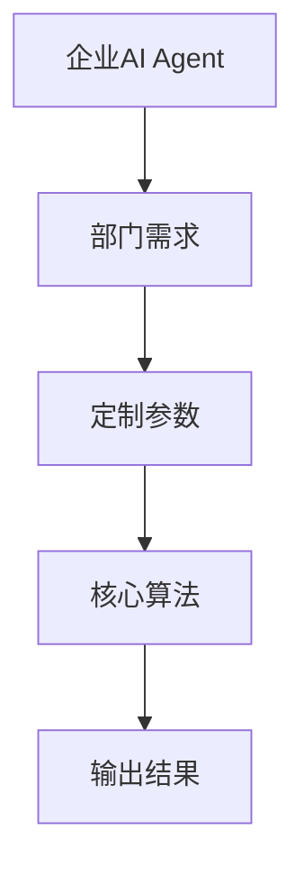
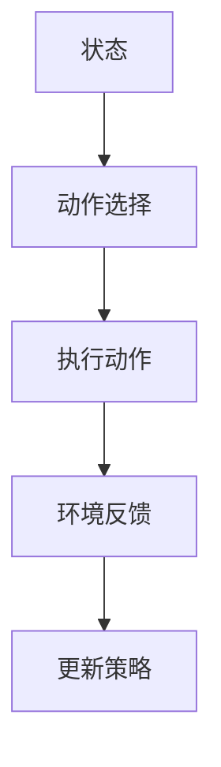
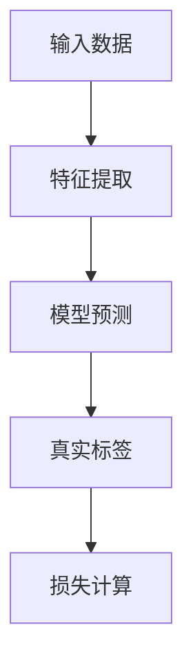
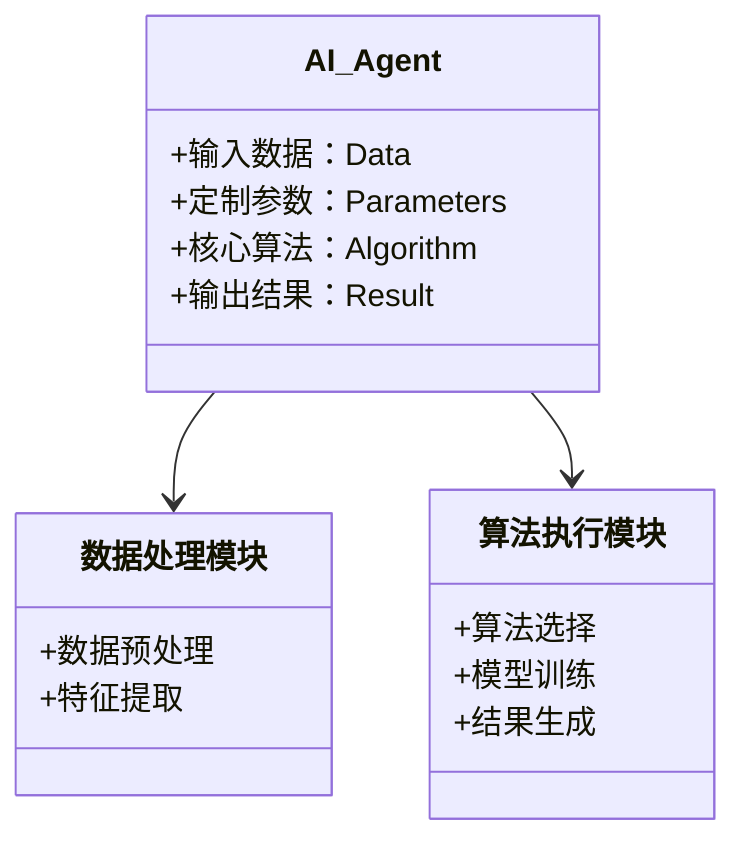
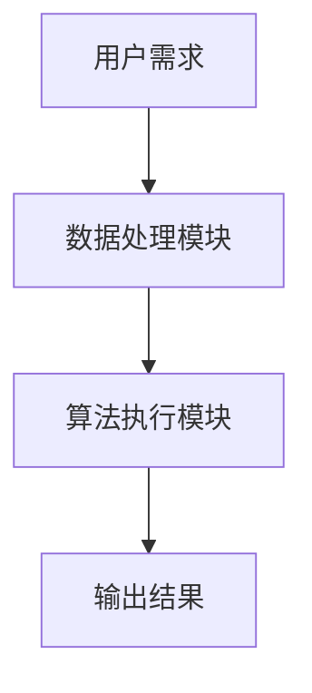

                 


# 企业AI Agent的个性化定制：适应不同部门需求

**关键词**：企业AI Agent、个性化定制、部门需求、机器学习、定制方法

**摘要**：  
本文探讨了企业AI Agent的个性化定制，重点分析了如何根据不同部门的需求进行定制化设计与实现。文章从AI Agent的基本概念出发，深入解析其核心原理，结合实际应用场景，详细阐述了如何通过算法优化、系统架构设计和项目实战，实现AI Agent的个性化定制。本文还提供了丰富的案例分析和技术细节，为读者提供了从理论到实践的全面指导。

---

## 第一部分: 企业AI Agent的背景与概念

### 第1章: 企业AI Agent的背景与概念

#### 1.1 企业AI Agent的定义与核心要素
企业AI Agent是一种能够理解、分析和执行特定任务的智能系统，旨在通过自动化和智能化的方式提升企业各部门的工作效率。其核心要素包括：
- **输入数据**：来自企业各部门的结构化或非结构化数据。
- **定制参数**：根据部门需求调整的参数，如学习率、目标函数等。
- **核心算法**：用于处理数据并生成输出的算法，如强化学习、监督学习等。
- **输出结果**：根据输入数据和定制参数生成的最终结果。

#### 1.2 企业AI Agent的应用场景
企业中的不同部门对AI Agent的需求各不相同，以下是几个典型的应用场景：
- **销售与市场部门**：用于客户行为分析、精准营销和市场预测。
- **技术研发部门**：用于代码审查、缺陷预测和研发效率优化。
- **人力资源部门**：用于员工绩效评估、招聘推荐和培训计划优化。
- **财务与供应链部门**：用于财务预测、成本优化和供应链管理。

---

## 第二部分: AI Agent的核心概念与联系

### 第2章: AI Agent的核心概念与联系

#### 2.1 AI Agent的核心原理
AI Agent通过输入数据和定制参数，利用核心算法生成输出结果。其基本流程如下：
1. **输入数据**：企业各部门提供的数据。
2. **特征提取**：对数据进行特征提取，以便算法处理。
3. **模型预测**：基于定制参数，生成预测结果。
4. **反馈优化**：根据输出结果优化模型。

#### 2.2 核心概念属性特征对比
以下是不同部门需求和AI Agent属性特征的对比表格：

| 部门需求         | 输入数据类型         | 定制参数         | 输出结果类型         |
|------------------|----------------------|------------------|----------------------|
| 销售与市场       | 客户行为数据         | 营销策略参数     | 营销预测结果         |
| 技术研发         | 代码和缺陷数据       | 缺陷预测参数      | 缺陷预测结果         |
| 人力资源         | 员工绩效数据         | 绩效评估参数      | 员工推荐结果         |
| 财务与供应链     | 财务数据和供应链数据   | 成本优化参数      | 财务预测结果         |

#### 2.3 ER实体关系图
以下是AI Agent的ER实体关系图：



---

## 第三部分: AI Agent的算法原理与数学模型

### 第3章: AI Agent的核心算法

#### 3.1 基于强化学习的AI Agent算法
强化学习是一种通过试错机制优化模型的算法，适用于动态环境中的决策问题。以下是强化学习的流程图：



#### 3.2 基于监督学习的AI Agent算法
监督学习是一种通过已有数据训练模型的算法，适用于分类和回归问题。以下是监督学习的流程图：



#### 3.3 算法的数学模型
以下是强化学习的数学模型示例：

$$
Q(s, a) = Q(s, a) + \alpha (r + \max_{a'} Q(s', a') - Q(s, a))
$$

其中：
- $s$ 表示当前状态。
- $a$ 表示当前动作。
- $\alpha$ 表示学习率。
- $r$ 表示奖励。
- $s'$ 表示下一个状态。

---

## 第四部分: 系统分析与架构设计方案

### 第4章: 系统分析与架构设计方案

#### 4.1 问题场景介绍
企业AI Agent的系统设计需要考虑以下问题：
- 如何处理不同部门的定制需求？
- 如何保证系统的高效性和可扩展性？

#### 4.2 系统功能设计
以下是系统功能设计的类图：



#### 4.3 系统架构设计
以下是系统架构设计的架构图：



---

## 第五部分: 项目实战

### 第5章: 项目实战

#### 5.1 环境安装与配置
以下是安装环境的代码示例：

```python
# 安装依赖
pip install numpy scikit-learn matplotlib
```

#### 5.2 系统核心实现
以下是AI Agent的核心代码实现：

```python
import numpy as np
from sklearn import linear_model

# 定义AI Agent类
class AI_Agent:
    def __init__(self, parameters):
        self.parameters = parameters
        self.model = linear_model.LinearRegression()
    
    def train(self, data):
        self.model.fit(data.features, data.labels)
    
    def predict(self, input_data):
        return self.model.predict(input_data)
```

#### 5.3 案例分析与优化
以下是案例分析的详细步骤：
1. **数据收集**：收集企业各部门的数据。
2. **特征提取**：对数据进行特征提取。
3. **模型训练**：根据定制参数训练模型。
4. **结果生成**：生成输出结果并优化模型。

---

## 第六部分: 最佳实践与总结

### 第6章: 最佳实践与总结

#### 6.1 小结
企业AI Agent的个性化定制需要根据不同部门的需求进行分析和设计，结合算法优化和系统架构设计，确保系统的高效性和可扩展性。

#### 6.2 注意事项
- 在定制AI Agent时，需要充分考虑数据的质量和完整性。
- 确保算法的可解释性和透明性。
- 定期优化模型，以适应业务需求的变化。

#### 6.3 拓展阅读
- 《机器学习实战》
- 《深度学习》
- 《强化学习导论》

---

**作者：AI天才研究院 & 禅与计算机程序设计艺术**

