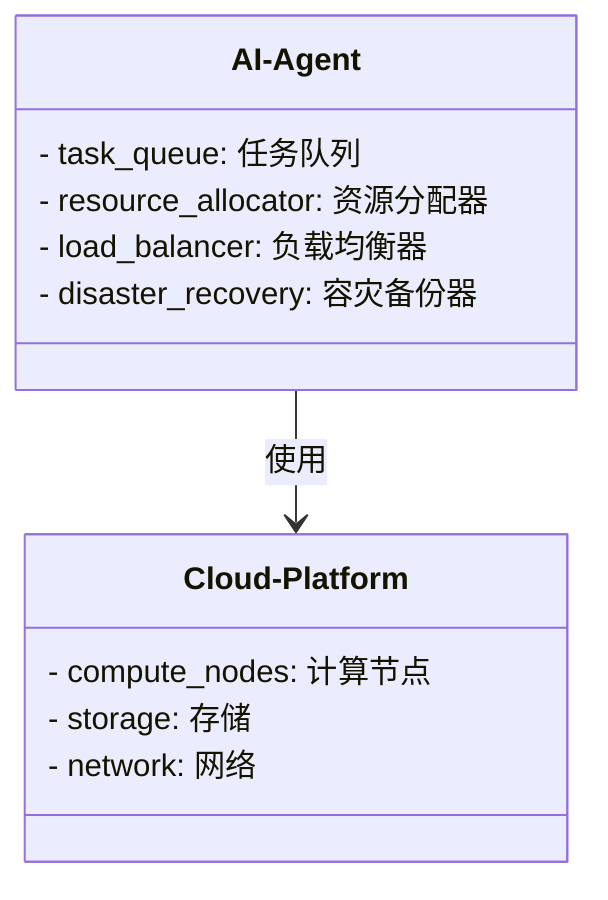
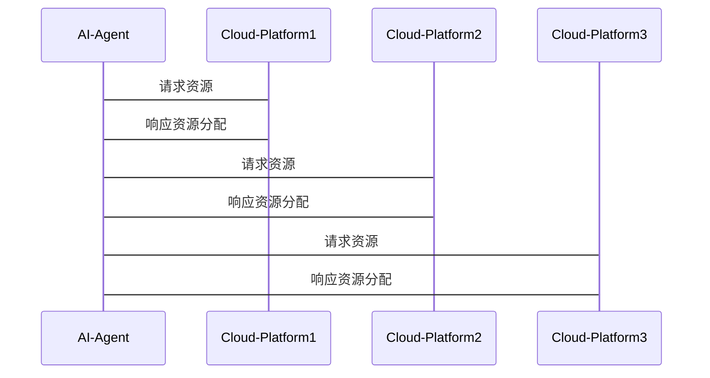

                 


# 企业AI Agent的多云部署策略：灵活性与可靠性

## 关键词：AI Agent，多云部署，灵活性，可靠性，系统架构，负载均衡，容灾备份

## 摘要：  
随着人工智能技术的快速发展，企业AI Agent的应用场景越来越广泛。然而，AI Agent的多云部署策略面临着灵活性与可靠性之间的平衡挑战。本文将从AI Agent的基本概念出发，深入探讨多云部署的核心策略，分析其灵活性与可靠性实现的原理，并通过具体的算法和系统架构设计，提供实践中的解决方案。文章最后将结合实际案例，总结多云部署的最佳实践，为企业在AI Agent的多云部署中提供参考。

---

## 第一部分: 企业AI Agent的多云部署背景与概念

### 第1章: AI Agent与多云部署概述

#### 1.1 AI Agent的基本概念
##### 1.1.1 AI Agent的定义与特点
- **定义**：AI Agent（人工智能代理）是指能够感知环境、自主决策并执行任务的智能实体。
- **特点**：智能性、自主性、反应性、目标导向性。
- **应用场景**：智能客服、自动化运维、智能推荐系统等。

##### 1.1.2 AI Agent在企业中的应用场景
- **智能客服**：通过自然语言处理技术为用户提供个性化服务。
- **自动化运维**：利用AI Agent实现自动化监控、故障诊断和修复。
- **智能推荐系统**：基于用户行为数据分析，提供个性化推荐。

##### 1.1.3 多云部署的定义与优势
- **定义**：将应用程序部署在多个云平台上的策略，以提高系统的可用性和性能。
- **优势**：资源弹性扩展、成本优化、避免单点故障、利用不同云平台的优势。

#### 1.2 多云部署的核心挑战
##### 1.2.1 多云环境的复杂性
- **资源异构性**：不同云平台的资源种类和性能差异。
- **API兼容性问题**：不同云平台的API接口存在差异。
- **网络延迟**：多云部署可能导致网络通信延迟。

##### 1.2.2 跨云平台的兼容性问题
- **API兼容性**：不同云平台的API接口存在差异，导致集成复杂。
- **认证与授权**：跨云平台的认证机制不统一，增加实现难度。
- **日志与监控**：多云环境下的日志收集和监控需要统一管理。

##### 1.2.3 数据一致性与服务可靠性
- **数据一致性**：多云部署中如何保证数据的全局一致性。
- **服务可靠性**：如何在多云环境下保证服务的可用性。
- **容灾与备份**：如何实现跨云平台的容灾备份。

#### 1.3 本章小结
本章从AI Agent的基本概念出发，介绍了其在企业中的应用场景，并重点分析了多云部署的核心挑战，包括环境复杂性、API兼容性问题以及数据一致性与服务可靠性。这些内容为后续章节的策略分析奠定了基础。

---

## 第二部分: 多云部署策略的核心概念与联系

### 第2章: 多云部署策略的灵活性与可靠性

#### 2.1 多云部署的灵活性分析
##### 2.1.1 灵活性的定义与实现方式
- **定义**：灵活性指在多云环境下，根据需求快速调整资源分配和任务执行的能力。
- **实现方式**：动态资源分配、任务迁移、弹性伸缩。

##### 2.1.2 灵活性与企业需求的匹配
- **动态资源分配**：根据负载变化自动调整资源分配。
- **任务迁移**：在不同云平台之间动态迁移任务。
- **弹性伸缩**：根据需求自动扩展或缩减资源。

##### 2.1.3 灵活性对系统架构的影响
- **架构解耦**：通过松耦合架构设计，提高系统的灵活性。
- **服务发现与路由**：动态发现可用服务并进行路由。

#### 2.2 多云部署的可靠性保障
##### 2.2.1 可靠性定义与实现目标
- **定义**：可靠性指在多云环境下，系统能够持续提供稳定服务的能力。
- **实现目标**：保证服务可用性、数据一致性、容灾备份能力。

##### 2.2.2 可靠性与系统容错能力的关系
- **容错设计**：通过冗余设计和故障隔离，提高系统的容错能力。
- **故障恢复**：在发生故障时快速恢复服务。

##### 2.2.3 可靠性对数据同步的要求
- **数据一致性**：保证多云环境下数据的全局一致性。
- **数据备份**：定期备份数据，防止数据丢失。

#### 2.3 灵活性与可靠性的对比分析
##### 2.3.1 灵活性与可靠性的权衡
- **权衡点**：在某些场景下，灵活性可能会影响系统的可靠性，反之亦然。
- **优先级选择**：根据具体需求选择灵活性与可靠性优先级。

##### 2.3.2 不同场景下的优先级选择
- **高负载场景**：优先考虑灵活性，动态调整资源分配。
- **关键业务场景**：优先考虑可靠性，确保服务不中断。

##### 2.3.3 灵活性与可靠性对系统性能的影响
- **性能影响**：灵活性可能导致资源利用率波动，可靠性可能导致额外的资源消耗。

#### 2.4 本章小结
本章分析了多云部署的灵活性与可靠性，探讨了两者之间的关系，并提出了在不同场景下优先级选择的策略。这些内容为后续的算法实现和系统设计提供了理论基础。

---

## 第三部分: 多云部署策略的算法原理

### 第3章: 多云部署策略的算法实现

#### 3.1 负载均衡算法
##### 3.1.1 负载均衡的定义与作用
- **定义**：负载均衡是指将任务或数据均匀地分配到多个节点或资源上，以提高系统的性能和可靠性。
- **作用**：提高系统吞吐量、减少单点故障、优化资源利用率。

##### 3.1.2 常见负载均衡算法的实现原理
- **轮询算法（Round Robin）**：按顺序将任务分配给不同的节点。
- **加权轮询算法（Weighted Round Robin）**：根据节点的权重分配任务。
- **最小连接数算法（Least Connections）**：将任务分配给当前连接数最少的节点。

##### 3.1.3 基于AI的自适应负载均衡算法
- **自适应算法**：根据实时负载和资源利用率动态调整任务分配。
- **实现步骤**：
  1. 监测各节点的负载情况。
  2. 根据负载情况计算权重。
  3. 动态调整任务分配策略。

##### 3.1.4 负载均衡算法的数学模型
$$ \text{负载均衡权重} = \frac{\text{节点资源利用率}}{\sum \text{所有节点资源利用率}} $$

#### 3.2 容灾备份算法
##### 3.2.1 容灾备份的定义与目标
- **定义**：容灾备份是指在系统发生故障时，能够快速恢复数据和服务。
- **目标**：保证系统的可用性和数据的完整性。

##### 3.2.2 基于多云的容灾备份策略
- **数据冗余存储**：在多个云平台中存储相同数据。
- **服务冗余部署**：在多个云平台中部署相同服务。

##### 3.2.3 容灾备份算法的实现步骤
1. 数据同步：定期将数据同步到多个云平台。
2. 故障检测：检测到服务故障后，触发容灾机制。
3. 故障恢复：从备份平台恢复数据和服务。

##### 3.2.4 容灾备份算法的数学模型
$$ \text{恢复时间} = \text{故障检测时间} + \text{数据恢复时间} $$

#### 3.3 算法实现的数学模型
##### 3.3.1 负载均衡的数学模型
$$ \text{负载均衡权重} = \frac{\text{节点资源利用率}}{\sum \text{所有节点资源利用率}} $$

##### 3.3.2 容灾备份的数学模型
$$ \text{恢复时间} = \text{故障检测时间} + \text{数据恢复时间} $$

#### 3.4 本章小结
本章详细介绍了多云部署中的负载均衡和容灾备份算法，分析了它们的实现原理和数学模型。这些算法为后续的系统设计提供了理论依据。

---

## 第四部分: 多云部署策略的系统架构与设计

### 第4章: 系统架构与设计

#### 4.1 系统功能设计
##### 4.1.1 系统功能模块划分
- **资源管理模块**：负责资源分配和管理。
- **负载均衡模块**：负责任务的负载均衡。
- **容灾备份模块**：负责数据的备份和恢复。

##### 4.1.2 系统功能设计的领域模型


#### 4.2 系统架构设计
##### 4.2.1 系统架构设计的mermaid图


##### 4.2.2 系统接口设计
- **API接口**：AI Agent与云平台之间的通信接口。
- **内部接口**：系统模块之间的通信接口。

##### 4.2.3 系统交互的mermaid序列图


#### 4.3 本章小结
本章通过系统架构设计和接口设计，详细描述了AI Agent多云部署的实现方案。通过Mermaid图展示了系统的整体架构和交互流程。

---

## 第五部分: 多云部署策略的项目实战

### 第5章: 项目实战

#### 5.1 环境安装与配置
##### 5.1.1 环境要求
- **操作系统**：Linux/Windows
- **编程语言**：Python
- **开发工具**：PyCharm、VS Code
- **云平台**：AWS、Azure、阿里云

##### 5.1.2 环境配置步骤
1. 安装Python和必要的库（如boto3、requests）。
2. 配置各云平台的API密钥。
3. 初始化项目目录，创建必要的文件和目录。

#### 5.2 核心代码实现
##### 5.2.1 负载均衡模块的实现
```python
def load_balance(nodes):
    # 根据节点资源利用率计算权重
    utilization = [node['utilization'] for node in nodes]
    total = sum(utilization)
    weights = [u/total for u in utilization]
    return nodes[utilization.index(max(utilization))]
```

##### 5.2.2 容灾备份模块的实现
```python
def disaster_recovery():
    # 检测故障
    for node in nodes:
        if node['status'] == 'failed':
            # 启用备份节点
            backup_node = get_backup_node(node)
            backup_node['status'] = 'active'
            return backup_node
    return None
```

##### 5.2.3 系统交互流程的实现
```python
def system_interaction():
    while True:
        task = get_task()
        selected_node = load_balance(nodes)
        if selected_node['status'] == 'active':
            selected_node['tasks'].append(task)
            execute_task(task, selected_node)
        else:
            # 触发容灾机制
            disaster_recovery()
```

#### 5.3 项目实战案例分析
##### 5.3.1 案例背景
- **企业场景**：一家电商企业需要在多个云平台上部署AI推荐系统。

##### 5.3.2 系统实现
- **资源分配**：根据用户请求量动态分配计算资源。
- **负载均衡**：使用自适应负载均衡算法分配任务。
- **容灾备份**：在主节点故障时，自动切换到备份节点。

##### 5.3.3 案例分析
- **优势**：提高了系统的可用性和性能，降低了成本。
- **挑战**：跨云平台的API兼容性问题，数据同步的延迟问题。

#### 5.4 本章小结
本章通过具体的项目实战，详细介绍了AI Agent多云部署的实现过程。通过案例分析，总结了多云部署的优势和挑战。

---

## 第六部分: 多云部署策略的最佳实践与小结

### 第6章: 最佳实践与小结

#### 6.1 最佳实践
##### 6.1.1 灵活性与可靠性的平衡
- **灵活性优先**：在高负载场景下，优先考虑灵活性。
- **可靠性优先**：在关键业务场景下，优先考虑可靠性。

##### 6.1.2 系统架构设计
- **松耦合设计**：通过模块化设计提高系统的灵活性。
- **冗余设计**：通过冗余设计提高系统的可靠性。

##### 6.1.3 代码实现
- **模块化实现**：将系统功能模块化，便于维护和扩展。
- **日志与监控**：实现统一的日志收集和监控，便于故障排查。

#### 6.2 小结
本文从AI Agent的基本概念出发，分析了多云部署的核心策略，探讨了灵活性与可靠性实现的原理，并通过具体的算法和系统架构设计，提供了实践中的解决方案。最后，结合实际案例，总结了多云部署的最佳实践。

---

## 作者信息

作者：AI天才研究院/AI Genius Institute & 禅与计算机程序设计艺术/Zen And The Art of Computer Programming

---

**注意**：由于篇幅限制，上述目录仅为示例内容，具体文章可以根据实际需求进行扩展和调整。

