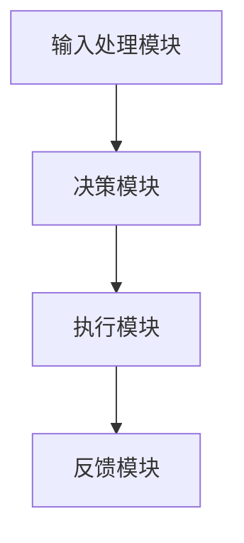
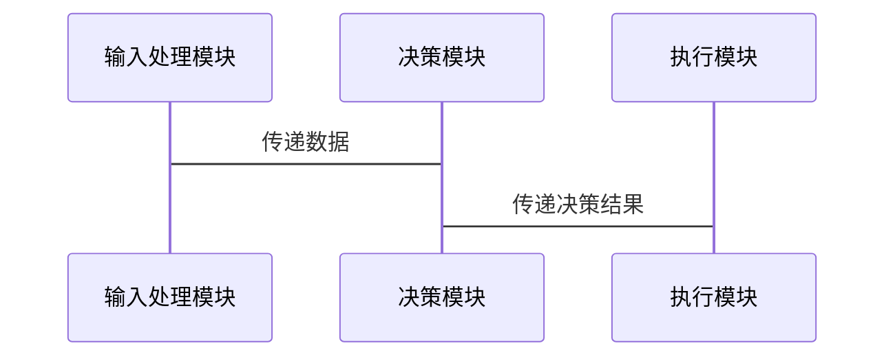

                 

# 企业AI Agent的多场景测试策略：模拟真实业务环境

## 关键词：AI Agent, 多场景测试, 企业测试, 业务环境模拟, 测试策略

## 摘要：  
本文深入探讨了企业AI Agent在多场景测试中的策略与方法，重点分析了如何在真实业务环境中模拟和测试AI Agent的行为与性能。文章从AI Agent的基本概念、测试目标、策略选择、实施步骤到实际案例分析，全面解析了企业在AI Agent测试中的关键问题和解决方案。通过系统化的测试策略，结合实际项目案例，本文为读者提供了在复杂业务环境中有效测试AI Agent的实用方法和最佳实践。

---

## 第一部分: 企业AI Agent的背景与核心概念

### 第1章: 企业AI Agent的背景与核心概念

#### 1.1 AI Agent的基本概念

##### 1.1.1 什么是AI Agent
AI Agent（人工智能代理）是指能够感知环境、自主决策并执行任务的智能实体。它通过感知信息、分析问题、制定计划并执行操作来实现目标。AI Agent可以是软件程序、机器人或其他智能设备，具备自主性、反应性和社会性等核心特征。

##### 1.1.2 AI Agent的核心特征
- **自主性**：AI Agent能够自主决策，无需外部干预。
- **反应性**：能够实时感知环境变化并做出响应。
- **目标导向**：基于目标驱动行为，追求最优解。
- **学习能力**：通过数据和经验不断优化自身性能。

##### 1.1.3 AI Agent与传统自动化系统的区别
- **自主性**：AI Agent具备自主决策能力，而传统自动化系统通常遵循固定的规则。
- **学习能力**：AI Agent能够通过数据学习和优化，传统系统不具备此能力。
- **灵活性**：AI Agent能够适应复杂多变的环境，传统系统在固定场景下表现更优。

#### 1.2 企业AI Agent的应用场景

##### 1.2.1 客户服务与支持
AI Agent在客户服务中的应用包括智能客服、聊天机器人等，能够通过自然语言处理技术为用户提供实时支持。

##### 1.2.2 业务流程自动化
AI Agent可以自动化处理企业中的重复性任务，如订单处理、数据录入等，提高效率并减少错误。

##### 1.2.3 数据分析与决策支持
AI Agent能够分析海量数据，为企业提供决策支持，优化业务流程和资源配置。

##### 1.2.4 多部门协作与任务分配
AI Agent可以协调不同部门的工作，分配任务并跟踪进度，提升企业内部协作效率。

#### 1.3 多场景测试的必要性

##### 1.3.1 AI Agent在复杂环境中的挑战
- **环境多样性**：AI Agent需要在不同的业务环境中运行，面临多种复杂场景。
- **决策不确定性**：AI Agent的决策依赖于数据和模型，可能存在不确定性和错误。
- **性能瓶颈**：在高负载情况下，AI Agent可能面临性能下降的问题。

##### 1.3.2 多场景测试的目标与意义
- **确保稳定性**：通过多场景测试，验证AI Agent在各种环境中的稳定性和可靠性。
- **提升性能**：优化AI Agent在复杂场景下的表现，提升执行效率。
- **降低风险**：发现潜在问题，减少AI Agent在实际应用中的风险。

##### 1.3.3 测试中的边界与外延
- **边界**：AI Agent的测试范围通常不包括硬件设备和网络环境。
- **外延**：测试不仅关注功能，还包括性能、安全性和用户体验等方面。

#### 1.4 本章小结
本章介绍了AI Agent的基本概念、核心特征及其在企业中的应用场景，并强调了多场景测试的必要性。通过分析AI Agent在复杂环境中的挑战，明确了测试的目标和意义。

---

## 第二部分: AI Agent的测试策略与方法

### 第2章: AI Agent的测试目标与策略

#### 2.1 测试目标的确定

##### 2.1.1 功能测试目标
- **核心功能验证**：确保AI Agent的核心功能在各种场景下正常运行。
- **边界条件测试**：验证AI Agent在边界条件下的表现。

##### 2.1.2 性能测试目标
- **响应时间测试**：确保AI Agent在高负载下的响应时间在可接受范围内。
- **资源利用率测试**：监控AI Agent在不同场景下的资源消耗情况。

##### 2.1.3 安全性测试目标
- **数据安全性**：确保AI Agent在处理敏感数据时不会发生泄露或滥用。
- **对抗性测试**：测试AI Agent在恶意输入或攻击情况下的表现。

##### 2.1.4 用户体验测试目标
- **易用性测试**：确保AI Agent与用户交互的友好性和易用性。
- **反馈机制测试**：验证AI Agent在错误或异常情况下的反馈机制。

#### 2.2 多场景测试策略

##### 2.2.1 场景驱动的测试方法
- **场景分析**：基于实际业务流程，识别关键场景。
- **场景覆盖**：确保测试用例覆盖所有关键场景。

##### 2.2.2 数据驱动的测试方法
- **数据准备**：收集和整理测试所需的数据，确保数据的多样性和代表性。
- **数据驱动测试**：通过参数化测试用例，快速生成和执行多种场景。

##### 2.2.3 组合驱动的测试方法
- **组合测试**：通过组合不同的输入条件，生成覆盖更多场景的测试用例。
- **优先级排序**：根据业务需求和风险评估，优先测试高风险场景。

#### 2.3 测试用例设计原则

##### 2.3.1 等价类划分
- **输入等价类**：将输入数据划分为不同的等价类，确保测试覆盖所有可能的情况。
- **行为等价类**：将系统行为划分为不同的等价类，确保测试覆盖所有可能的用户操作。

##### 2.3.2 边界值分析
- **输入边界值**：测试输入数据的边界值，验证系统在极端情况下的表现。
- **输出边界值**：测试系统输出的边界值，确保系统在边界条件下的正确性。

##### 2.3.3 因果图法
- **因果分析**：通过因果图分析输入条件和输出结果之间的关系，设计有效的测试用例。
- **覆盖所有可能的因果组合**：确保测试用例覆盖所有可能的因果关系。

##### 2.3.4 正交数组法
- **正交数组设计**：使用正交数组设计测试用例，确保用最少的测试用例覆盖最多的情况。
- **高效测试覆盖**：通过正交数组法，提高测试效率，减少重复测试。

#### 2.4 本章小结
本章详细讨论了AI Agent的测试目标和多场景测试策略，介绍了几种常用的测试用例设计方法，并强调了场景覆盖和数据准备的重要性。

---

## 第三部分: 多场景测试的实施与分析

### 第3章: 多场景测试的实施步骤

#### 3.1 场景分析与选择

##### 3.1.1 场景分析方法
- **业务流程分析**：通过分析企业的业务流程，识别关键场景。
- **用户需求分析**：结合用户需求，确定需要测试的关键场景。
- **风险评估**：根据场景的风险程度，优先测试高风险场景。

##### 3.1.2 场景优先级排序
- **风险优先**：优先测试风险较高的场景。
- **业务影响**：优先测试对业务影响较大的场景。
- **技术复杂度**：优先测试技术实现较为复杂的场景。

##### 3.1.3 场景覆盖范围确定
- **覆盖所有关键场景**：确保测试用例覆盖所有关键场景。
- **避免遗漏重要场景**：通过场景分析和优先级排序，避免遗漏重要场景。

#### 3.2 测试用例设计与执行

##### 3.2.1 场景驱动的用例编写
- **基于场景编写用例**：根据场景描述，编写对应的测试用例。
- **详细描述步骤**：明确测试用例的执行步骤和预期结果。

##### 3.2.2 数据准备与输入设计
- **数据收集**：收集测试所需的数据，包括正常数据、异常数据和边界数据。
- **数据输入设计**：设计合理的数据输入方式，确保测试用例的可执行性和有效性。

##### 3.2.3 测试脚本编写与执行
- **自动化测试脚本**：使用自动化测试工具编写测试脚本，提高测试效率。
- **手动测试验证**：在某些复杂场景下，进行手动测试验证，确保测试结果的准确性。

#### 3.3 测试结果分析与报告

##### 3.3.1 结果记录与分析
- **测试日志记录**：记录测试执行过程中的日志信息，便于后续分析。
- **结果统计与分析**：统计测试结果，分析测试覆盖率和缺陷分布情况。

##### 3.3.2 问题定位与修复
- **缺陷定位**：根据测试结果，定位具体的问题。
- **问题修复**：与开发团队协作，修复发现的问题，并重新测试验证。

##### 3.3.3 测试报告编写
- **测试总结报告**：编写测试总结报告，涵盖测试范围、执行情况、发现的问题和改进建议。
- **测试质量评估**：评估测试的整体质量，为后续测试提供参考。

#### 3.4 本章小结
本章详细描述了多场景测试的实施步骤，从场景分析与选择到测试用例设计与执行，再到测试结果分析与报告，为读者提供了完整的测试实施流程。

---

## 第四部分: 企业级测试架构设计

### 第4章: 企业AI Agent测试架构设计

#### 4.1 系统架构设计

##### 4.1.1 系统功能模块划分
- **输入处理模块**：负责接收和解析输入数据。
- **决策模块**：基于输入数据，进行分析和决策。
- **执行模块**：根据决策结果，执行相应的操作。
- **反馈模块**：收集执行结果并反馈给系统。

##### 4.1.2 模块间交互关系
- **输入处理模块与决策模块**：输入数据传递到决策模块进行处理。
- **决策模块与执行模块**：决策结果传递到执行模块进行执行。
- **执行模块与反馈模块**：执行结果传递到反馈模块进行反馈。

##### 4.1.3 数据流与信息流向
- **数据输入流向**：数据从输入模块流向决策模块。
- **决策流向**：决策结果从决策模块流向执行模块。
- **反馈流向**：执行结果从执行模块流向反馈模块。

##### 4.1.4 系统架构图（Mermaid）

#### 4.2 系统组件交互设计

##### 4.2.1 组件协作机制
- **组件间通信**：通过消息队列或数据库进行组件间通信。
- **组件协作流程**：明确各组件在协作过程中的角色和责任。

##### 4.2.2 交互顺序与依赖关系
- **交互顺序**：输入模块先处理数据，决策模块再进行决策，执行模块最后执行操作。
- **依赖关系**：各模块之间存在依赖关系，确保协作过程的顺利进行。

##### 4.2.3 组件交互序列图（Mermaid）

#### 4.3 数据流与系统交互设计

##### 4.3.1 数据流设计
- **数据输入**：输入模块接收外部数据，进行预处理。
- **数据传输**：预处理后的数据传递到决策模块。
- **数据存储**：决策模块处理数据后，存储结果或反馈信息。

##### 4.3.2 系统交互设计
- **用户输入**：用户通过界面或API输入数据。
- **系统处理**：系统接收到输入数据后，进行处理并返回结果。
- **反馈输出**：系统将处理结果反馈给用户或相关组件。

#### 4.4 本章小结
本章详细描述了企业AI Agent测试架构设计，包括系统功能模块划分、组件交互关系和数据流设计。通过Mermaid图展示了系统的架构和交互流程，为后续测试实施提供了理论基础。

---

## 第五部分: 项目实战

### 第5章: 企业AI Agent测试项目实战

#### 5.1 项目背景与目标

##### 5.1.1 项目背景
- **项目名称**：企业AI Agent多场景测试项目。
- **项目目标**：验证AI Agent在复杂业务环境下的稳定性和可靠性。

##### 5.1.2 项目需求
- **功能需求**：确保AI Agent在多种场景下的功能正常。
- **性能需求**：优化AI Agent在高负载下的性能表现。
- **安全需求**：保障AI Agent在处理敏感数据时的安全性。

#### 5.2 项目实施过程

##### 5.2.1 环境搭建
- **测试环境配置**：搭建测试环境，包括硬件、软件和网络配置。
- **数据准备**：收集和整理测试所需的数据，确保数据的多样性和代表性。

##### 5.2.2 核心代码实现
- **测试用例编写**：根据场景需求，编写相应的测试用例。
- **自动化测试脚本**：使用自动化测试工具编写测试脚本，提高测试效率。
- **代码实现细节**：详细描述代码实现的关键部分，包括数据处理、场景模拟和结果分析。

##### 5.2.3 测试用例编写与执行
- **测试用例设计**：根据场景需求，设计详细的测试用例。
- **测试用例执行**：执行测试用例，记录测试结果。
- **测试结果分析**：分析测试结果，找出问题并进行修复。

#### 5.3 测试结果分析与优化

##### 5.3.1 测试结果记录
- **测试日志**：记录测试执行过程中的日志信息。
- **缺陷报告**：编写缺陷报告，详细描述问题现象、步骤和预期结果。

##### 5.3.2 问题定位与修复
- **缺陷定位**：根据测试结果，定位具体的问题。
- **问题修复**：与开发团队协作，修复发现的问题，并重新测试验证。

##### 5.3.3 性能优化
- **性能分析**：分析测试结果，找出性能瓶颈。
- **优化措施**：针对性能问题，提出优化措施，并实施优化。

#### 5.4 本章小结
本章通过一个实际的项目案例，详细描述了企业AI Agent测试项目的实施过程，包括环境搭建、核心代码实现和测试结果分析。通过实际操作，验证了测试策略的有效性和可操作性。

---

## 第六部分: 总结与展望

### 第6章: 总结与展望

#### 6.1 项目总结

##### 6.1.1 核心成果
- **测试策略**：制定了适用于企业AI Agent的多场景测试策略。
- **测试方法**：探索了多种测试方法，提高了测试效率和覆盖率。
- **测试工具**：开发了自动化测试工具，提升了测试的自动化水平。

##### 6.1.2 实践经验
- **场景覆盖**：通过场景分析和优先级排序，确保了测试的全面性。
- **数据准备**：数据准备是测试成功的关键，需要投入足够的时间和资源。
- **团队协作**：测试是一个团队协作的过程，需要开发、测试和运维团队的紧密配合。

#### 6.2 未来展望

##### 6.2.1 测试技术发展
- **AI驱动测试**：随着AI技术的发展，未来的测试可能会更加智能化，由AI代理自动执行测试任务。
- **自动化测试工具**：自动化测试工具将更加智能化，支持更多的测试场景和复杂环境。

##### 6.2.2 测试方法创新
- **自适应测试**：根据测试结果动态调整测试策略，实现自适应测试。
- **预测性测试**：通过数据分析和预测模型，提前发现潜在问题。

##### 6.2.3 测试工具与平台
- **AI测试平台**：开发专门针对AI Agent的测试平台，提供更加专业的测试工具和服务。
- **云测试环境**：利用云计算技术，构建弹性扩展的测试环境，支持大规模测试。

#### 6.3 本章小结
本章总结了项目的成果和实践经验，并展望了未来测试技术的发展方向。通过总结，为读者提供了在复杂业务环境中测试AI Agent的宝贵经验，并展望了未来的发展趋势。

---

## 作者信息

作者：AI天才研究院/AI Genius Institute & 禅与计算机程序设计艺术/Zen And The Art of Computer Programming

---

以上是《企业AI Agent的多场景测试策略：模拟真实业务环境》的技术博客文章的完整目录大纲。接下来，我会根据这个大纲逐步展开每一部分的内容，提供详细的讲解和分析，确保文章逻辑清晰、结构紧凑、内容详实。

