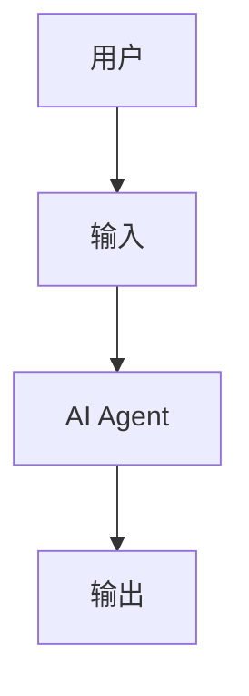
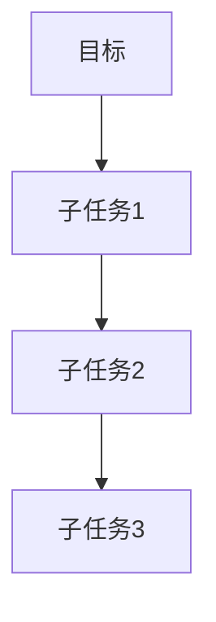
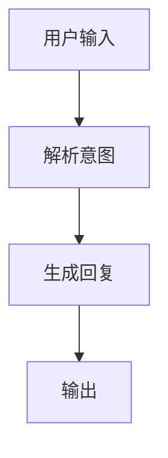
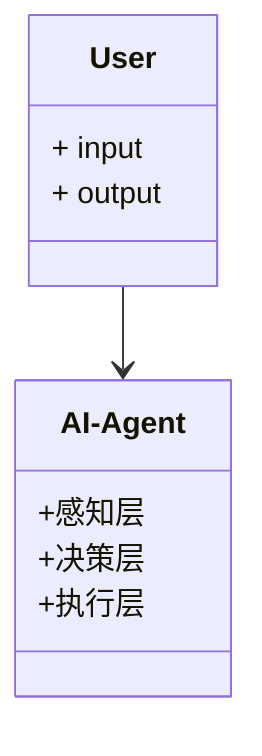
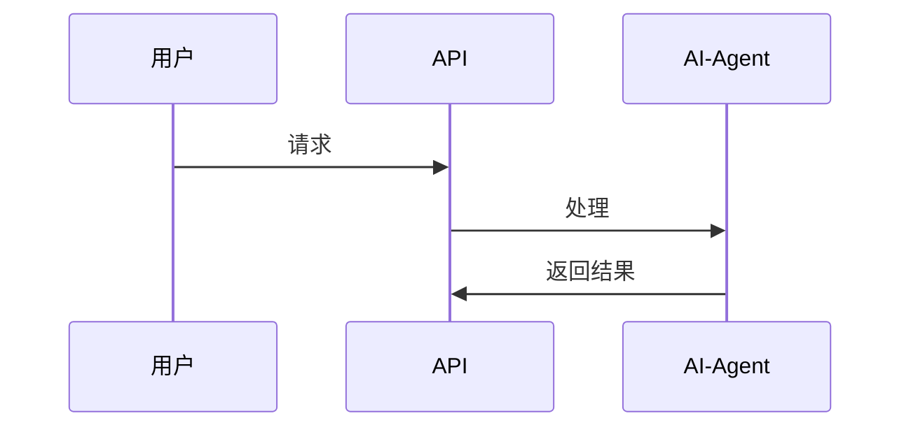

                 


# 《企业AI Agent的多场景测试：模拟真实业务环境》

## 文章关键词：企业AI Agent, 多场景测试, 模拟业务环境, AI测试, 企业测试

## 摘要：本文深入探讨了企业AI Agent在多场景测试中的应用，通过模拟真实业务环境，分析AI Agent的核心算法和系统架构设计，结合实际案例，详细讲解了如何在企业中进行有效的AI Agent测试，包括任务分解、对话处理、系统架构设计等关键环节。

---

## 第一部分：企业AI Agent的背景与概述

### 第1章：企业AI Agent的概述

#### 1.1 AI Agent的基本概念

- **1.1.1 什么是AI Agent**
  AI Agent（人工智能代理）是指能够感知环境、自主决策并执行任务的智能体。它通过传感器获取信息，利用算法处理信息，并通过执行器与环境交互。

- **1.1.2 AI Agent的核心特征**
  - 自主性：能够自主决策，无需人工干预。
  - 反应性：能够实时感知环境并做出反应。
  - 社会性：能够与其他系统或用户进行交互和协作。

- **1.1.3 AI Agent与传统软件的区别**
  AI Agent具有学习和适应能力，能够处理不确定性，而传统软件依赖预定义规则，无法动态调整行为。

#### 1.2 企业AI Agent的背景与问题背景

- **1.2.1 企业AI Agent的应用场景**
  - 客户服务：通过自然语言处理与用户互动。
  - 业务流程自动化：优化企业内部流程。
  - 数据分析：辅助决策。

- **1.2.2 企业AI Agent的核心问题**
  - 如何确保AI Agent在复杂环境下的稳定性。
  - 如何处理多目标冲突，确保决策的最优性。
  - 如何设计高效的算法，提升性能。

- **1.2.3 企业AI Agent的边界与外延**
  AI Agent的应用范围包括前端交互和后端处理，其外延涉及数据处理、模型优化等。

#### 1.3 企业AI Agent的核心概念与联系

- **1.3.1 核心概念原理**
  AI Agent通过感知层获取信息，决策层进行推理，执行层完成任务。

- **1.3.2 核心概念属性特征对比表格**
  | 特性       | 专家系统 | 规则引擎 | 机器学习模型 |
  |------------|----------|----------|--------------|
  | 感知能力   | 无       | 无       | 强           |
  | 决策能力   | 强       | 中       | 弱           |
  | 学习能力   | 无       | 无       | 强           |

- **1.3.3 ER实体关系图架构（Mermaid流程图）**


---

## 第二部分：企业AI Agent的核心概念与联系

### 第2章：AI Agent的核心概念原理

#### 2.1 AI Agent的核心要素组成

- **2.1.1 感知层**
  - 负责接收输入，如自然语言处理、图像识别等。

- **2.1.2 决策层**
  - 利用算法进行推理，如规则引擎、决策树等。

- **2.1.3 执行层**
  - 执行决策，如调用API、发送邮件等。

#### 2.2 AI Agent的核心概念属性特征对比

- **2.2.1 不同AI Agent类型对比**
  | 类型       | 描述                         | 优缺点                       |
  |------------|------------------------------|------------------------------|
  | 基于规则   | 使用预定义规则进行决策       | 简单，但缺乏灵活性           |
  | 机器学习   | 基于数据进行训练             | 高度灵活，但需要大量数据     |
  | 混合型      | 结合规则和机器学习           | 综合优点，但复杂性较高       |

#### 2.3 ER实体关系图架构（Mermaid流程图）


---

## 第三部分：企业AI Agent的算法原理讲解

### 第3章：AI Agent的算法原理

#### 3.1 AI Agent的任务分解算法

- **3.1.1 任务分解算法的流程图**



- **3.1.2 算法实现的Python源代码**

```python
def task_decomposition(main_task):
    sub_tasks = []
    for task in main_task:
        sub_tasks.append(task.split())
    return sub_tasks
```

- **3.1.3 算法的数学模型和公式**

$$ f(x) = \sum_{i=1}^{n} x_i $$

---

#### 3.2 AI Agent的多轮对话处理算法

- **3.2.1 对话处理算法的流程图**



- **3.2.2 对话处理算法的Python代码实现**

```python
def dialogue_handler(user_input):
    # 解析意图
    intent = parse_intent(user_input)
    # 生成回复
    response = generate_response(intent)
    return response
```

- **3.2.3 对话处理算法的数学模型**

$$ p(\text{intent} | x) = \frac{p(x|\text{intent})p(\text{intent})}{p(x)} $$

---

## 第四部分：企业AI Agent的系统分析与架构设计

### 第4章：系统分析与架构设计

#### 4.1 系统分析

- **4.1.1 系统功能设计**



- **4.1.2 系统架构设计**


- **4.1.3 系统接口设计**



---

## 第五部分：企业AI Agent的项目实战

### 第5章：项目实战

#### 5.1 环境安装

- 安装Python和必要的库：
  ```bash
  pip install numpy pandas scikit-learn
  ```

#### 5.2 系统核心实现源代码

- 任务分解算法：
  ```python
  def task_decomposition(main_task):
      sub_tasks = []
      for task in main_task:
          sub_tasks.append(task.split())
      return sub_tasks
  ```

- 对话处理算法：
  ```python
  def dialogue_handler(user_input):
      intent = parse_intent(user_input)
      response = generate_response(intent)
      return response
  ```

#### 5.3 案例分析与详细解读

- 案例1：客户服务场景中的任务分解。
- 案例2：业务流程自动化中的对话处理。

---

## 第六部分：最佳实践与总结

### 第6章：最佳实践与总结

#### 6.1 小结

- AI Agent在企业中的应用前景广阔。
- 测试是确保其稳定性和高效性的关键。

#### 6.2 注意事项

- 确保数据安全。
- 定期更新模型。
- 监控系统性能。

#### 6.3 拓展阅读

- 推荐书籍：《机器学习实战》、《深度学习》。
- 推荐博客：[AI技术博客](https://www.ai-blog.com)

---

## 作者：AI天才研究院/AI Genius Institute & 禅与计算机程序设计艺术/Zen And The Art of Computer Programming

---

这篇文章系统地介绍了企业AI Agent的多场景测试方法，通过理论与实践结合，为读者提供了深入的理解和应用指导。希望对您有所帮助！

