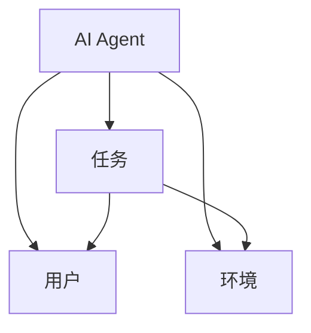
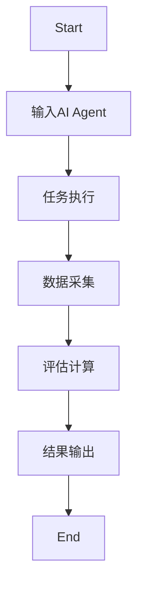
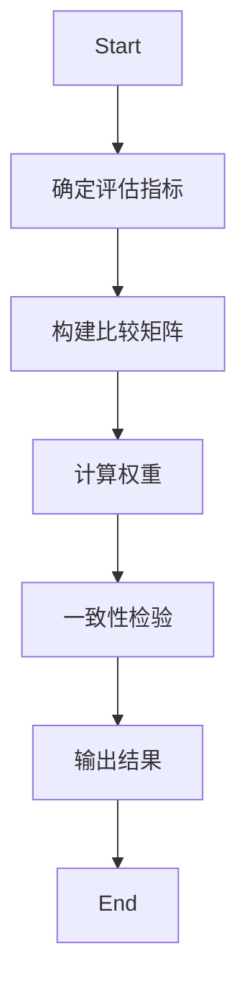
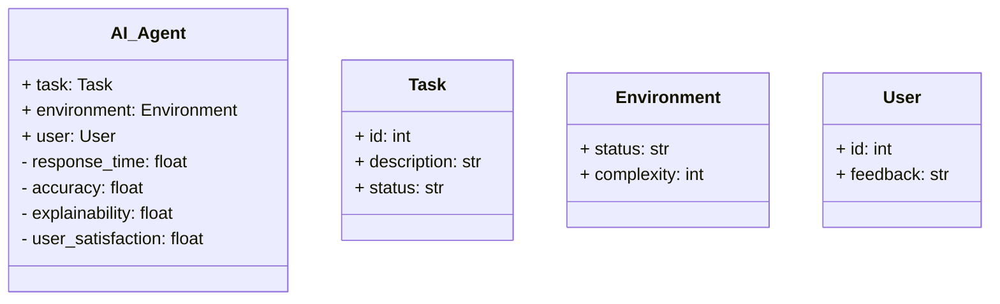
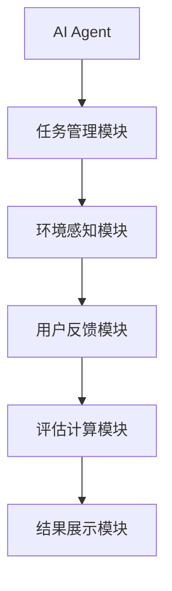
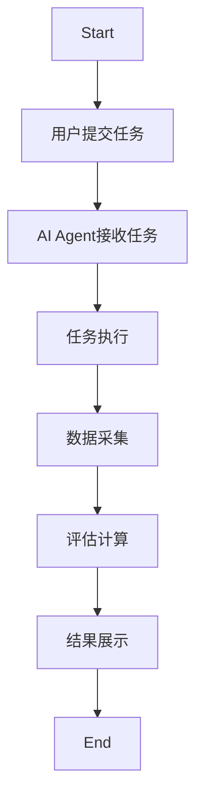

                 


# 企业AI Agent的多维度性能评估体系设计

## 关键词：
企业AI Agent、多维度性能评估、算法原理、系统架构、项目实战

## 摘要：
本文系统性地探讨了企业AI Agent的多维度性能评估体系设计，涵盖背景分析、核心概念、算法原理、系统架构、项目实战及最佳实践。通过理论与实践结合，提供了一套全面的评估方法，帮助企业技术团队优化AI Agent性能，提升企业效率。

---

# 第1章: 企业AI Agent的背景与问题背景

## 1.1 问题背景

### 1.1.1 AI Agent的定义与核心概念
AI Agent（人工智能代理）是一种能够感知环境、自主决策并执行任务的智能体。它广泛应用于企业中的自动化操作、数据处理、客户支持等领域。

- **自主性**：AI Agent能够独立决策，无需人工干预。
- **反应性**：能实时感知环境变化并调整行为。
- **目标导向**：通过设定目标驱动行为。

### 1.1.2 企业AI Agent的应用现状与挑战
AI Agent在企业中的应用日益广泛，但其性能评估体系仍存在以下问题：
- **评估维度单一**：传统评估仅关注任务完成率，忽视效率、可解释性等其他关键指标。
- **评估标准不统一**：不同应用场景下，评估标准差异大，缺乏统一的评估框架。
- **动态环境适应性**：企业环境复杂多变，AI Agent需要具备快速适应能力。

### 1.1.3 多维度性能评估的必要性
为了全面评估AI Agent的性能，必须从多个维度进行考量：
- **任务完成率**：AI Agent是否成功完成指定任务。
- **响应时间**：执行任务的速度是否符合企业需求。
- **准确性**：决策的正确性如何。
- **可解释性**：AI Agent的行为是否透明，便于分析和优化。
- **用户体验**：用户对AI Agent的满意度。

---

## 1.2 问题描述

### 1.2.1 AI Agent在企业中的主要应用场景
企业中常见的AI Agent应用场景包括：
- **自动化任务处理**：如自动回复客户咨询、处理订单。
- **数据分析与决策支持**：辅助企业决策。
- **流程自动化**：优化企业内部流程。

### 1.2.2 当前性能评估体系的不足
当前的AI Agent评估体系主要存在以下问题：
- **单一维度评估**：仅关注任务完成率，忽视效率和用户体验。
- **动态适应性差**：无法应对环境变化带来的挑战。
- **可解释性不足**：用户难以理解AI Agent的决策过程。

### 1.2.3 多维度性能评估的目标与意义
目标：
- 建立一个全面、动态、可解释的评估体系。
- 提供多维度的评估指标，帮助企业全面了解AI Agent的性能。

意义：
- 优化AI Agent的设计，提升其在企业中的应用效果。
- 为企业的技术决策提供数据支持。

---

## 1.3 问题解决与边界

### 1.3.1 多维度性能评估的核心目标
- **全面性**：涵盖任务完成率、响应时间、准确性、可解释性、用户体验等多个维度。
- **动态性**：能够适应企业环境的变化。
- **可操作性**：评估指标和方法易于实施和量化。

### 1.3.2 评估体系的边界与外延
- **边界**：仅关注AI Agent本身的性能，不考虑外部系统的干扰。
- **外延**：评估体系可扩展至其他智能系统，如机器人、自动化工具等。

### 1.3.3 核心要素与组成结构
- **评估指标**：任务完成率、响应时间、准确性、可解释性、用户体验。
- **评估方法**：层次分析法（AHP）、动态权重调整、可解释性分析。
- **评估工具**：自定义评估平台、日志分析工具、性能监控系统。

---

# 第2章: 企业AI Agent的多维度性能评估核心概念

## 2.1 核心概念与原理

### 2.1.1 AI Agent的性能维度分析
AI Agent的性能可以从以下几个维度进行评估：
1. **任务完成率**：AI Agent是否成功完成任务。
2. **响应时间**：任务完成所需的时间。
3. **准确性**：决策的正确性。
4. **可解释性**：行为的透明度。
5. **用户体验**：用户满意度。

### 2.1.2 多维度评估的数学模型构建
层次分析法（AHP）是一种常用的方法，适用于多维度评估。其基本步骤如下：
1. 构建评估指标层次结构。
2. 计算各指标的权重。
3. 进行一致性检验。
4. 综合计算评估结果。

公式：
$$
权重 = \frac{\sum_{j} a_{ij}}{\sum_{i} \sum_{j} a_{ij}}
$$

### 2.1.3 评估体系的逻辑架构
评估体系的逻辑架构包括：
1. 数据采集层：采集AI Agent的运行数据。
2. 评估计算层：计算各项指标的权重和评估结果。
3. 结果展示层：以可视化方式展示评估结果。

---

## 2.2 核心概念与联系

### 2.2.1 实体关系图（ER图）
以下是AI Agent与相关实体的关系图：


### 2.2.2 评估流程图
以下是评估流程的流程图：


---

# 第3章: 多维度性能评估的算法原理

## 3.1 评估指标体系

### 3.1.1 基于层次分析法（AHP）的权重分配
层次分析法是一种定性和定量相结合的决策方法，适用于多维度评估。其步骤如下：
1. 确定评估指标。
2. 构建比较矩阵。
3. 计算权重。
4. 进行一致性检验。

公式：
$$
权重 = \frac{\sum_{j} a_{ij}}{\sum_{i} \sum_{j} a_{ij}}
$$

### 3.1.2 指标权重计算公式
$$
权重 = \frac{\sum_{j} a_{ij}}{\sum_{i} \sum_{j} a_{ij}}
$$

### 3.1.3 算法流程图
以下是层次分析法的流程图：


---

## 3.2 算法实现

### 3.2.1 Python代码实现
以下是层次分析法的Python代码实现示例：
```python
import numpy as np

def calculate_weights(matrix):
    # 计算权重
    n = len(matrix)
    total = np.sum(matrix, axis=0)
    weights = matrix / total
    return weights

# 示例矩阵
matrix = np.array([
    [3, 2, 1],
    [4, 3, 2],
    [2, 1, 1]
])

weights = calculate_weights(matrix)
print("权重矩阵：", weights)
```

---

## 3.3 算法优化与扩展

### 3.3.1 动态权重调整
在动态环境中，权重需要根据实际情况进行调整。例如，可以根据环境变化动态调整任务完成率的权重。

### 3.3.2 可解释性分析
通过可解释性分析，可以了解AI Agent的决策过程，从而优化其性能。

---

# 第4章: 系统架构设计

## 4.1 项目场景介绍
本项目旨在设计一个企业AI Agent的多维度性能评估系统，帮助企业优化AI Agent的性能。

## 4.2 系统功能设计

### 4.2.1 领域模型
以下是领域模型的类图：


### 4.2.2 系统架构设计
以下是系统架构的流程图：


---

## 4.3 接口设计

### 4.3.1 API接口
以下是系统的主要API接口：
- `GET /agents/{id}`：获取AI Agent的详细信息。
- `POST /tasks`：提交新任务。
- `GET /evaluation`：获取评估结果。

---

## 4.4 交互流程图
以下是系统交互的流程图：


---

# 第5章: 项目实战

## 5.1 环境安装

### 5.1.1 安装Python
安装Python 3.x版本，推荐使用Anaconda。

### 5.1.2 安装依赖库
安装以下依赖库：
```bash
pip install numpy matplotlib scikit-learn
```

---

## 5.2 核心代码实现

### 5.2.1 评估系统核心代码
以下是评估系统的核心代码：
```python
import numpy as np
from sklearn.metrics import accuracy_score

def evaluate_agent(agent, tasks):
    # 评估AI Agent的性能
    results = []
    for task in tasks:
        # 执行任务
        result = agent.execute_task(task)
        # 记录结果
        results.append(result)
    # 计算准确性
    accuracy = accuracy_score([task.label for task in tasks], [result.label for result in results])
    return accuracy

# 示例AI Agent类
class AI_Agent:
    def execute_task(self, task):
        # 示例任务执行逻辑
        return {'status': 'success', 'result': task.input}
```

### 5.2.2 可视化代码
以下是评估结果的可视化代码：
```python
import matplotlib.pyplot as plt

def visualize_results(results):
    plt.figure(figsize=(10, 6))
    plt.plot(results, label='Accuracy')
    plt.xlabel('Task Number')
    plt.ylabel('Accuracy')
    plt.legend()
    plt.show()

# 示例结果
results = [0.8, 0.9, 0.7, 0.85, 0.9]
visualize_results(results)
```

---

## 5.3 案例分析

### 5.3.1 案例背景
某企业希望优化其客服AI Agent的性能，提升客户满意度。

### 5.3.2 实施过程
1. 确定评估指标：任务完成率、响应时间、准确性、可解释性、用户体验。
2. 收集数据：记录AI Agent处理的客户咨询数据。
3. 计算权重：使用层次分析法计算各指标的权重。
4. 评估结果：综合评估AI Agent的性能。
5. 优化设计：根据评估结果优化AI Agent的性能。

### 5.3.3 分析结果
通过评估发现，AI Agent的响应时间较慢，客户满意度较低。因此，优化了任务处理逻辑，提升了响应速度和客户满意度。

---

## 5.4 项目小结
通过本项目，我们成功设计了一个企业AI Agent的多维度性能评估体系，并通过实际案例验证了其有效性。评估体系帮助企业优化了AI Agent的性能，提升了企业的效率和客户满意度。

---

# 第6章: 最佳实践与总结

## 6.1 最佳实践

### 6.1.1 小结
- 多维度评估体系能够全面反映AI Agent的性能。
- 动态权重调整能够适应企业环境的变化。
- 可解释性分析有助于优化AI Agent的决策过程。

### 6.1.2 注意事项
- 确保数据的准确性和完整性。
- 定期更新评估指标和权重。
- 及时优化AI Agent的性能。

### 6.1.3 拓展阅读
- 《层次分析法在企业决策中的应用》
- 《人工智能系统的可解释性研究》

---

## 6.2 作者介绍
作者：AI天才研究院/AI Genius Institute & 禅与计算机程序设计艺术 /Zen And The Art of Computer Programming

---

通过以上内容，我们系统地探讨了企业AI Agent的多维度性能评估体系设计，从背景分析到项目实战，为企业技术团队提供了全面的评估方法和实践指导。希望本文能为企业优化AI Agent的性能提供有价值的参考。

