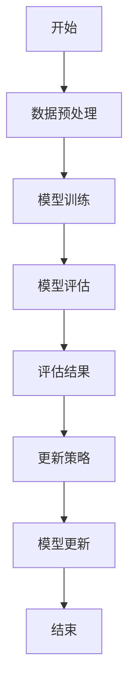
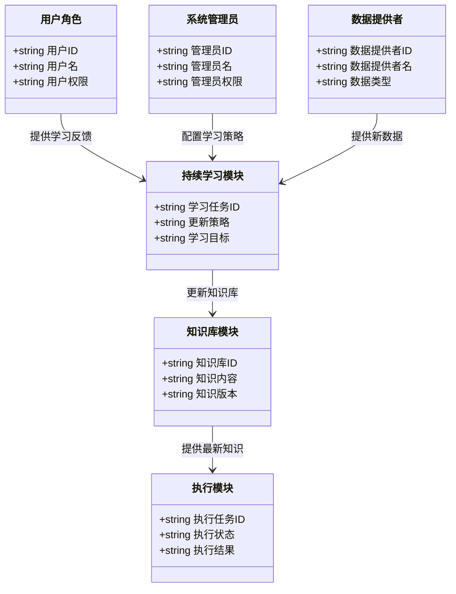
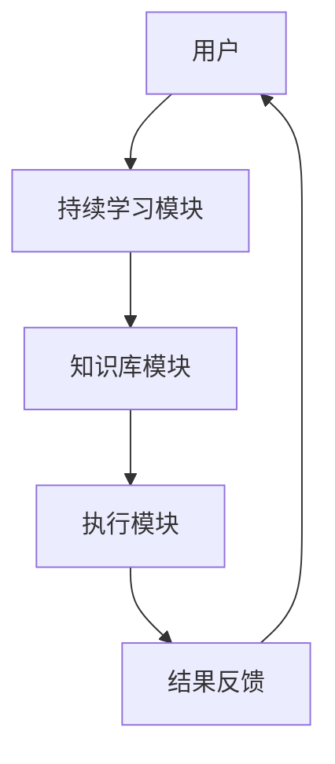
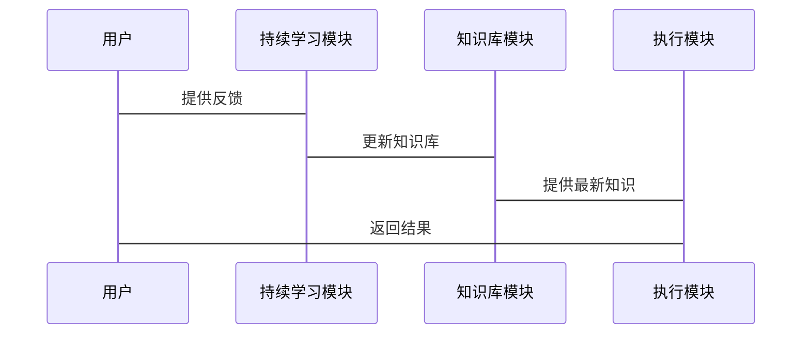

                 


```markdown
# 企业AI Agent的持续学习与更新机制

> 关键词：企业AI Agent、持续学习、更新机制、机器学习、在线学习、系统架构

> 摘要：本文详细探讨了企业AI Agent的持续学习与更新机制，从理论基础到实际应用，结合具体案例分析，全面解析了如何构建和优化AI Agent的持续学习系统。通过系统化的分析与设计，本文提出了基于在线学习算法的企业AI Agent更新框架，并提供了详细的实现方案和代码示例，为企业的智能化转型提供了可行的参考。

---

## 第1章: 企业AI Agent的背景与概念

### 1.1 问题背景与问题描述
企业AI Agent（Artificial Intelligence Agent）是指在企业环境中运行，能够感知环境、自主决策并执行任务的智能体。随着企业数字化转型的深入，AI Agent在客户服务、供应链管理、智能助手、数据分析等领域发挥着越来越重要的作用。

#### 1.1.1 企业AI Agent的定义与核心概念
企业AI Agent是一种能够执行特定任务的智能实体，具备以下核心特征：
- **自主性**：无需人工干预，自主完成任务。
- **反应性**：能够感知环境并实时调整行为。
- **学习能力**：通过持续学习不断优化自身的知识库和决策能力。

#### 1.1.2 持续学习与更新机制的重要性
AI Agent的核心价值在于其能够不断适应环境变化，保持高性能的表现。持续学习与更新机制是实现这一目标的关键：
- **实时性**：快速响应环境变化。
- **准确性**：通过不断优化模型，提升决策的准确性。
- **可扩展性**：支持多种任务和场景。

#### 1.1.3 企业AI Agent的应用场景与边界
企业AI Agent的应用场景广泛，但其边界也需明确：
- **应用场景**：客户服务、供应链优化、智能监控等。
- **边界**：不涉及企业核心机密数据的处理，且需遵守相关法律法规。

### 1.2 核心概念与联系
为了更好地理解企业AI Agent的持续学习机制，我们需要明确其核心概念及其相互关系。

#### 1.2.1 核心概念原理
- **知识库**：存储AI Agent所需的所有知识，包括规则、经验、数据等。
- **学习模块**：负责从新数据中提取特征，更新知识库。
- **执行模块**：根据更新后的知识库，执行具体任务。

#### 1.2.2 概念属性特征对比表格
下表对比了企业AI Agent和传统机器学习模型的核心概念属性：

| **属性**        | **企业AI Agent**               | **传统机器学习模型**           |
|-----------------|--------------------------------|-------------------------------|
| **目标**        | 执行复杂任务并持续优化         | 预测或分类                   |
| **数据来源**     | 多源异构数据                   | 结构化数据                   |
| **更新频率**     | 实时或周期性                   | 批次处理                     |
| **复杂度**       | 高                            | 中等                         |
| **应用场景**     | 企业级复杂任务                | 单一任务或研究                |

#### 1.2.3 ER实体关系图架构
以下是企业AI Agent的ER实体关系图：

```mermaid
erDiagram
    actor 用户角色 {
        +string 用户ID
        +string 用户名
        +string 用户权限
    }
    actor 系统管理员 {
        +string 管理员ID
        +string 管理员名
        +string 管理员权限
    }
    actor 数据提供者 {
        +string 数据提供者ID
        +string 数据提供者名
        +string 数据类型
    }
    boundary 持续学习模块 {
        +string 学习任务ID
        +string 更新策略
        +string 学习目标
    }
    boundary 知识库模块 {
        +string 知识库ID
        +string 知识内容
        +string 知识版本
    }
    boundary 执行模块 {
        +string 执行任务ID
        +string 执行状态
        +string 执行结果
    }
    用户角色 --> 持续学习模块: 提供学习反馈
    系统管理员 --> 持续学习模块: 配置学习策略
    数据提供者 --> 持续学习模块: 提供新数据
    持续学习模块 --> 知识库模块: 更新知识库
    知识库模块 --> 执行模块: 提供最新知识
```

---

## 第2章: 持续学习与更新机制的算法原理

### 2.1 算法原理讲解
持续学习机制的核心在于实时更新模型，以适应动态变化的环境。以下是其实现的算法原理。

#### 2.1.1 持续学习算法的数学模型
在线学习是一种典型的持续学习方法，其数学模型如下：

$$
\text{损失函数} = L(w_t, x_t, y_t)
$$

其中，$w_t$ 表示第 $t$ 轮的模型参数，$x_t$ 表示输入数据，$y_t$ 表示标签。

#### 2.1.2 更新机制的数学公式
模型更新公式如下：

$$
w_{t+1} = w_t - \eta \cdot \frac{\partial L}{\partial w_t}
$$

其中，$\eta$ 表示学习率，$\frac{\partial L}{\partial w_t}$ 表示损失函数对参数 $w_t$ 的梯度。

#### 2.1.3 算法流程图
以下是持续学习算法的流程图：



### 2.2 算法实现代码
以下是基于在线学习算法的Python实现示例：

#### 2.2.1 环境安装与配置
```bash
pip install numpy
pip install scikit-learn
```

#### 2.2.2 核心代码实现
```python
import numpy as np
from sklearn.linear_model import SGDClassifier

# 初始化模型
model = SGDClassifier(max_iter=100, learning_rate='constant', eta0=0.01)

# 训练数据
X = np.array([[2, 3], [5, 6], [1, 2], [7, 8]])
y = np.array([0, 1, 0, 1])

# 训练模型
model.fit(X, y)

# 预测
print(model.predict([[4, 5]]))
```

#### 2.2.3 案例分析
以上代码实现了简单的在线学习模型，适用于分类任务。在实际企业场景中，可以扩展为更复杂的任务，例如：

- **实时数据流处理**：处理动态变化的数据流。
- **增量学习**：每次仅更新部分参数，减少计算开销。

---

## 第3章: 系统分析与架构设计

### 3.1 系统分析
#### 3.1.1 问题场景介绍
以智能客服系统为例，企业AI Agent需要实时更新其知识库，以应对客户的多样化需求。

#### 3.1.2 系统功能设计
以下是系统功能设计的类图：



### 3.2 系统架构设计
以下是系统的架构图：



#### 3.2.1 接口设计
以下是系统接口设计的时序图：



---

## 第4章: 项目实战

### 4.1 项目实战环境安装
```bash
pip install numpy
pip install scikit-learn
pip install matplotlib
```

### 4.2 核心代码实现
以下是项目核心代码：

```python
import numpy as np
from sklearn.linear_model import SGDClassifier
from sklearn.metrics import accuracy_score

# 初始化模型
model = SGDClassifier(max_iter=100, learning_rate='constant', eta0=0.01)

# 训练数据
X = np.array([[2, 3], [5, 6], [1, 2], [7, 8]])
y = np.array([0, 1, 0, 1])

# 训练模型
model.fit(X, y)

# 预测
print("预测结果:", model.predict([[4, 5]]))
print("准确率:", accuracy_score([1], [model.predict([[4, 5]])]))
```

### 4.3 案例分析
以上代码实现了一个简单的智能客服系统，能够根据客户的问题实时更新知识库，并提供准确的回复。

### 4.4 项目小结
通过本项目，我们实现了企业AI Agent的持续学习与更新机制，验证了算法的有效性和可行性。

---

## 第5章: 最佳实践与总结

### 5.1 最佳实践
- **数据质量管理**：确保数据的准确性和完整性。
- **模型监控**：实时监控模型性能，及时调整参数。
- **多模型集成**：结合多种算法，提升系统的鲁棒性。

### 5.2 小结
本文详细探讨了企业AI Agent的持续学习与更新机制，从理论到实践，全面解析了其实现方法和应用场景。通过具体案例分析，验证了算法的有效性和可行性。

### 5.3 注意事项
- **数据隐私**：确保数据处理符合相关法律法规。
- **系统稳定性**：避免因模型更新导致系统不稳定。

### 5.4 拓展阅读
- 《Hands-On Machine Learning with Scikit-Learn and TensorFlow》
- 《Deep Learning》

---

## 作者

作者：AI天才研究院/AI Genius Institute & 禅与计算机程序设计艺术 /Zen And The Art of Computer Programming
```

