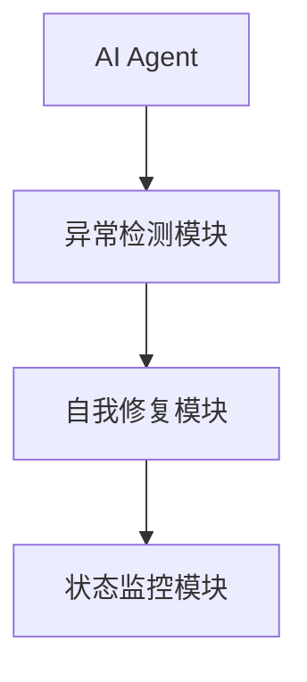
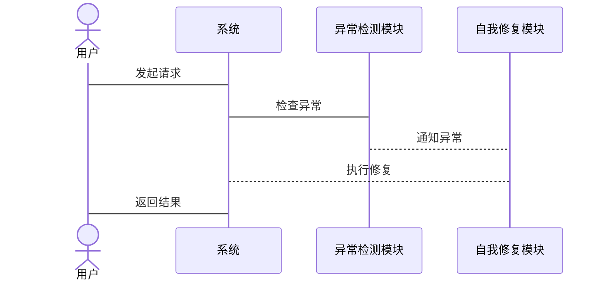

                 


# 企业AI Agent的自我诊断与修复能力

> 关键词：企业AI Agent，自我诊断，自我修复，异常检测，智能修复，系统架构

> 摘要：企业AI Agent的自我诊断与修复能力是实现智能化系统的重要组成部分。本文从AI Agent的基本概念出发，深入探讨其自我诊断与修复能力的核心机制，包括异常检测、自我修复算法、系统架构设计等，结合实际案例分析，为企业AI Agent的实现提供理论支持和实践指导。

---

# 第1章: AI Agent的基本概念与背景

## 1.1 AI Agent的定义与特点

### 1.1.1 AI Agent的定义
AI Agent（人工智能代理）是指能够感知环境、自主决策并执行任务的智能实体。企业AI Agent通常用于自动化处理业务流程、优化资源配置、提高效率等场景。

### 1.1.2 AI Agent的核心特点
- **自主性**：能够自主决策，无需人工干预。
- **反应性**：能够实时感知环境变化并做出响应。
- **学习能力**：通过数据和经验不断优化自身行为。
- **容错性**：能够在异常情况下保持稳定运行。

### 1.1.3 企业AI Agent的应用场景
- **智能客服**：自动处理客户咨询和问题。
- **流程自动化**：优化企业内部流程，提高效率。
- **智能监控**：实时监控系统状态，发现异常并及时处理。

---

## 1.2 企业AI Agent的自我诊断与修复能力

### 1.2.1 自我诊断能力的定义
自我诊断能力是指AI Agent能够识别自身或外部环境中的异常，并定位问题根源的能力。

### 1.2.2 自我修复能力的实现方式
自我修复能力是指AI Agent在发现问题后，能够自动采取措施解决问题，恢复系统的正常运行。

### 1.2.3 企业AI Agent自我诊断与修复的重要性
- **提高系统稳定性**：能够快速发现并解决问题，减少系统故障时间。
- **降低维护成本**：通过自动化修复，减少人工干预的需求。
- **提升用户体验**：通过快速响应和解决问题，提升用户满意度。

---

## 1.3 企业AI Agent自我诊断与修复能力的技术背景

### 1.3.1 AI Agent技术的发展历程
AI Agent技术起源于20世纪60年代的知识表示和推理研究，随着机器学习和深度学习技术的发展，AI Agent逐渐具备了更强的自主决策和问题解决能力。

### 1.3.2 自我诊断与修复能力的技术挑战
- **复杂性**：企业系统通常复杂，问题可能涉及多个模块和组件。
- **不确定性**：环境中的不确定性可能导致问题难以预测和定位。
- **安全性**：自我修复过程中可能引入新的风险，需要确保修复过程的安全性。

### 1.3.3 企业级应用中的实际需求
- **高可用性**：企业系统需要7×24小时稳定运行。
- **快速响应**：面对问题时，需要快速做出响应并解决问题。
- **智能优化**：通过自我诊断与修复，不断优化系统性能。

---

# 第2章: 企业AI Agent自我诊断与修复的核心概念

## 2.1 自我诊断机制

### 2.1.1 异常检测的基本原理
异常检测是自我诊断的核心技术之一，通过分析系统行为和数据，识别与预期不符的模式。

#### 异常检测的分类
- **基于统计的方法**：通过统计分析识别异常。
- **基于机器学习的方法**：利用监督学习或无监督学习模型识别异常。
- **基于深度学习的方法**：利用神经网络模型学习正常行为，并识别异常。

### 2.1.2 基于日志分析的诊断方法
日志分析是常见的异常检测方法，通过分析系统日志，识别异常行为。

### 2.1.3 基于行为分析的诊断方法
行为分析是通过分析系统行为模式，识别异常操作。

---

## 2.2 自我修复机制

### 2.2.1 自动修复的实现方式
自动修复是自我修复的核心技术之一，通过预定义的修复规则或学习得到的修复策略，自动解决问题。

### 2.2.2 基于反馈机制的修复策略
基于反馈机制的修复策略是通过系统反馈的结果，动态调整修复策略。

### 2.2.3 分级修复的逻辑架构
分级修复是将问题按严重性和影响范围进行分级，逐步进行修复。

---

## 2.3 自我诊断与修复能力的实现框架

### 2.3.1 分层诊断与修复架构
分层诊断与修复架构是将问题分为多个层次，逐步进行诊断和修复。

### 2.3.2 模块化设计的实现思路
模块化设计是将系统划分为多个功能模块，每个模块负责特定的诊断和修复任务。

### 2.3.3 跨模块协同的修复机制
跨模块协同是指多个模块协同工作，共同完成诊断和修复任务。

---

# 第3章: 企业AI Agent自我诊断与修复的算法原理

## 3.1 异常检测算法

### 3.1.1 基于统计的异常检测算法
基于统计的异常检测算法通过分析数据的分布情况，识别异常值。

#### 示例算法
- **均值-标准差法**：计算数据的均值和标准差，判断数据是否偏离均值超过一定倍数的标准差。
- **箱线图法**：通过箱线图识别数据中的异常值。

### 3.1.2 基于机器学习的异常检测算法
基于机器学习的异常检测算法利用监督学习或无监督学习模型识别异常。

#### 示例算法
- **One-Class SVM**：用于无监督异常检测。
- **Isolation Forest**：基于树结构的异常检测算法。

### 3.1.3 基于深度学习的异常检测算法
基于深度学习的异常检测算法利用神经网络模型学习正常行为，并识别异常。

#### 示例算法
- **变自编码器（AE）**：通过重建误差识别异常。
- **变生成对抗网络（GAN）**：通过生成对抗网络识别异常。

---

## 3.2 自我修复算法

### 3.2.1 基于规则的修复算法
基于规则的修复算法通过预定义的修复规则，自动解决问题。

#### 示例规则
- 如果系统日志中出现特定错误码，则重启相关服务。

### 3.2.2 基于强化学习的修复算法
基于强化学习的修复算法通过强化学习模型学习修复策略。

#### 示例算法
- **Q-Learning**：通过状态-动作-奖励机制学习修复策略。

### 3.2.3 基于反馈机制的修复算法
基于反馈机制的修复算法通过系统反馈的结果，动态调整修复策略。

#### 示例算法
- 根据修复结果调整修复优先级。

---

## 3.3 算法实现的数学模型

### 3.3.1 异常检测的数学模型
异常检测的数学模型通常包括概率分布、距离度量等。

#### 示例模型
- **概率密度函数**：用于计算数据点的概率密度，识别低概率区域的异常点。
- **马氏距离**：用于计算数据点之间的相似性，识别异常点。

### 3.3.2 自我修复的数学模型
自我修复的数学模型通常包括修复规则、修复优先级等。

#### 示例模型
- **修复规则集**：定义了一系列修复规则，用于指导修复过程。
- **修复优先级模型**：根据问题的严重性和影响范围，确定修复优先级。

---

# 第4章: 企业AI Agent自我诊断与修复的系统架构设计

## 4.1 系统功能设计

### 4.1.1 异常检测模块的功能设计
异常检测模块负责实时监控系统状态，识别异常行为。

### 4.1.2 自我修复模块的功能设计
自我修复模块负责根据异常检测结果，自动采取修复措施。

### 4.1.3 状态监控模块的功能设计
状态监控模块负责实时监控系统状态，提供可视化界面供用户查看。

---

## 4.2 系统架构设计

### 4.2.1 系统架构图
以下是企业AI Agent自我诊断与修复系统的架构图：



### 4.2.2 系统交互流程图
以下是系统交互流程图：



---

## 4.3 系统接口设计

### 4.3.1 异常检测模块接口
- **输入**：系统状态数据
- **输出**：异常报告

### 4.3.2 自我修复模块接口
- **输入**：异常报告
- **输出**：修复结果

### 4.3.3 状态监控模块接口
- **输入**：无
- **输出**：系统状态监控信息

---

## 4.4 系统实现细节

### 4.4.1 异常检测模块的实现
以下是异常检测模块的实现代码示例：

```python
def detect_anomaly(data):
    # 假设data是系统状态数据
    # 实现异常检测算法
    return anomaly_report
```

### 4.4.2 自我修复模块的实现
以下是自我修复模块的实现代码示例：

```python
def repair(anomaly_report):
    # 假设anomaly_report是异常报告
    # 实现修复逻辑
    return repair_result
```

---

## 4.5 系统优化建议

### 4.5.1 系统性能优化
- **数据压缩**：通过压缩数据减少计算量。
- **并行处理**：通过并行计算提高处理效率。

### 4.5.2 系统安全性优化
- **访问控制**：通过访问控制机制防止未经授权的访问。
- **日志审计**：通过日志审计记录系统操作，便于后续分析。

---

# 第5章: 项目实战

## 5.1 环境安装

### 5.1.1 系统环境
- 操作系统：Linux/Windows
- Python版本：3.6+

### 5.1.2 工具安装
- 安装Python依赖库：`pip install numpy pandas scikit-learn`

---

## 5.2 系统核心实现

### 5.2.1 异常检测模块实现
以下是异常检测模块的实现代码：

```python
import numpy as np
from sklearn.ensemble import IsolationForest

# 初始化异常检测模型
model = IsolationForest(n_estimators=100, random_state=42)

# 训练模型
model.fit(X_train)

# 预测异常
y_pred = model.predict(X_test)
```

### 5.2.2 自我修复模块实现
以下是自我修复模块的实现代码：

```python
def repair_rule(anomaly_report):
    if anomaly_report['error_code'] == 500:
        return 'restart_service'
    else:
        return 'log_error'
```

---

## 5.3 代码应用解读与分析

### 5.3.1 异常检测模块解读
异常检测模块通过训练模型，识别异常数据点，生成异常报告。

### 5.3.2 自我修复模块解读
自我修复模块根据异常报告，执行预定义的修复规则，自动解决问题。

---

## 5.4 实际案例分析

### 5.4.1 案例背景
某企业系统出现500错误，导致用户无法访问。

### 5.4.2 案例分析
异常检测模块识别到500错误，并生成异常报告。自我修复模块根据修复规则，执行服务重启操作，恢复系统正常运行。

---

## 5.5 项目小结

### 5.5.1 项目总结
通过实现企业AI Agent的自我诊断与修复能力，能够显著提高系统的稳定性和可用性。

### 5.5.2 项目优化
进一步优化异常检测算法，提高检测准确率；完善修复规则，减少误修复。

---

# 第6章: 最佳实践与注意事项

## 6.1 最佳实践

### 6.1.1 系统设计
- **模块化设计**：将系统划分为多个功能模块，便于维护和扩展。
- **容错设计**：设计容错机制，防止问题扩散。

### 6.1.2 系统实现
- **日志记录**：记录系统操作日志，便于后续分析。
- **监控系统**：实时监控系统状态，及时发现异常。

### 6.1.3 系统优化
- **性能优化**：通过优化算法和架构，提高系统性能。
- **安全性优化**：通过加密和访问控制，提高系统安全性。

---

## 6.2 注意事项

### 6.2.1 系统维护
- 定期更新异常检测模型，适应环境变化。
- 定期检查修复规则，确保其有效性。

### 6.2.2 系统安全
- 防止未经授权的访问，确保系统安全。
- 定期进行安全审计，发现潜在风险。

---

## 6.3 小结

企业AI Agent的自我诊断与修复能力是实现智能化系统的重要组成部分。通过合理设计和实现，能够显著提高系统的稳定性和可用性。

---

## 6.4 未来展望

随着AI技术的不断发展，企业AI Agent的自我诊断与修复能力将更加智能化和自动化，为企业系统提供更强大的支持。

---

# 附录

## 附录A: 参考文献

1. 《机器学习实战》
2. 《深度学习入门》
3. 《人工智能：现代方法》

## 附录B: 工具推荐

- **Python**：用于实现AI算法。
- **Scikit-learn**：用于机器学习算法。
- **TensorFlow**：用于深度学习算法。

---

# 作者：AI天才研究院 & 禅与计算机程序设计艺术

--- 

希望这篇文章能够为读者提供清晰的思路和深入的技术分析，帮助企业更好地理解和实现AI Agent的自我诊断与修复能力。

