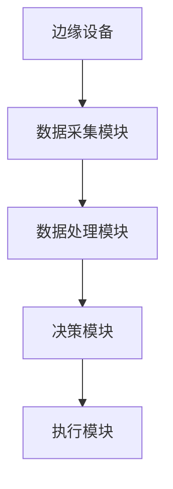

                 


# 企业AI Agent的边缘计算应用：提升响应速度

> 关键词：企业AI Agent，边缘计算，响应速度，算法原理，系统架构

> 摘要：本文探讨了企业AI Agent在边缘计算中的应用，重点分析了如何通过边缘计算提升AI Agent的响应速度。文章从背景介绍、核心概念、算法原理、系统架构设计、项目实战到最佳实践，全面解析了AI Agent与边缘计算的结合，为企业在数字化转型中的高效应用提供了理论支持和实践指导。

---

## 第一部分：企业AI Agent与边缘计算的背景介绍

### 第1章：企业AI Agent的定义与特点

#### 1.1 AI Agent的基本概念
AI Agent（人工智能代理）是一种能够感知环境、自主决策并执行任务的智能实体。它通过传感器获取信息，利用算法处理数据，并通过执行器与环境交互。AI Agent的核心目标是优化决策过程，提高任务执行效率。

#### 1.2 企业AI Agent的核心要素
- **感知能力**：通过传感器或API获取实时数据。
- **决策能力**：基于数据进行分析和推理，生成最优决策。
- **执行能力**：通过执行器或API将决策转化为具体行动。
- **自适应能力**：根据环境变化动态调整行为策略。

#### 1.3 边缘计算的基本概念
边缘计算是一种分布式计算范式，数据在靠近数据源的边缘设备上进行处理，而非集中到云端。边缘计算的优势在于低延迟、高实时性和带宽优化。

#### 1.4 边缘计算与云计算的区别
- **云计算**：数据集中处理，适用于大规模数据存储和分析，但延迟较高。
- **边缘计算**：数据在边缘设备处理，实时性强，适用于需要快速响应的场景。

### 第2章：企业AI Agent在边缘计算中的应用背景

#### 2.1 传统企业应用的响应速度问题
- 传统中心化架构依赖云端处理，导致延迟较高，无法满足实时性要求。
- 数据传输过程中的带宽消耗大，增加了成本和响应时间。

#### 2.2 边缘计算在企业中的优势
- **低延迟**：边缘设备直接处理数据，减少数据传输距离，提升响应速度。
- **高实时性**：适用于需要快速决策的场景，如智能制造、智慧城市等。
- **带宽优化**：仅将关键数据上传至云端，减少网络负担。

#### 2.3 AI Agent在边缘计算中的作用
AI Agent作为边缘计算的核心组件，负责数据的感知、分析和执行，能够显著提升系统的响应速度和处理效率。

---

## 第二部分：企业AI Agent与边缘计算的核心概念

### 第3章：AI Agent的核心原理

#### 3.1 AI Agent的基本工作流程
1. **感知环境**：通过传感器或API获取数据。
2. **数据处理**：利用算法对数据进行分析和推理。
3. **决策制定**：基于分析结果生成最优决策。
4. **执行操作**：通过执行器或API将决策转化为行动。

#### 3.2 AI Agent的感知与决策机制
- **感知机制**：AI Agent通过多种传感器或数据源获取信息，构建环境模型。
- **决策机制**：基于构建的环境模型，AI Agent利用强化学习或监督学习等算法生成决策。

### 第4章：边缘计算的核心原理

#### 4.1 边缘计算的分布式架构
边缘计算采用分布式架构，数据在边缘设备上进行处理，减少对云端的依赖。

#### 4.2 边缘计算的数据处理流程
1. **数据采集**：通过传感器或设备采集数据。
2. **数据预处理**：清洗、转换数据，使其适合处理。
3. **数据处理**：利用算法对数据进行分析和推理。
4. **结果输出**：将处理结果返回给设备或发送到云端。

### 第5章：AI Agent与边缘计算的结合原理

#### 5.1 AI Agent在边缘计算中的部署模式
- **边缘设备本地部署**：AI Agent直接在边缘设备上运行，快速响应。
- **边缘网关部署**：AI Agent在边缘网关上运行，处理多个边缘设备的数据。

#### 5.2 边缘计算对AI Agent性能的提升
- **低延迟**：数据在边缘处理，减少传输时间。
- **高实时性**：快速响应，适用于实时场景。
- **资源优化**：边缘设备仅处理关键数据，降低云端负担。

---

## 第三部分：企业AI Agent边缘计算的算法原理

### 第6章：AI Agent的核心算法

#### 6.1 基于强化学习的AI Agent算法
- **算法流程**：通过强化学习，AI Agent在与环境的交互中学习最优策略。
- **数学模型**：利用Q-learning算法，构建状态-动作价值函数。

#### 6.2 基于监督学习的AI Agent算法
- **算法流程**：通过监督学习，AI Agent学习专家决策。
- **数学模型**：构建回归模型，预测最优决策。

### 第7章：边缘计算中的算法优化

#### 7.1 算法在边缘设备上的资源限制
- **计算能力有限**：边缘设备的计算能力有限，需要优化算法复杂度。
- **存储空间有限**：算法需要轻量化设计，减少存储需求。

#### 7.2 边缘计算中的分布式算法
- **分布式计算**：算法在多个边缘设备上分布式执行。
- **协同优化**：通过协同计算，提升整体性能。

### 第8章：AI Agent与边缘计算结合的算法实现

#### 8.1 算法实现步骤
1. **数据采集**：通过传感器或设备采集数据。
2. **数据预处理**：清洗、转换数据。
3. **算法处理**：利用强化学习或监督学习算法进行分析和推理。
4. **决策制定**：生成最优决策。
5. **执行操作**：将决策转化为具体行动。

---

## 第四部分：企业AI Agent边缘计算的系统架构设计

### 第9章：问题场景介绍

#### 9.1 问题背景
- **应用场景**：智能制造、智慧城市、智慧医疗等。
- **问题描述**：传统中心化架构响应速度慢，无法满足实时性要求。

#### 9.2 项目介绍
- **项目目标**：通过边缘计算提升AI Agent的响应速度。
- **项目范围**：设计并实现一个基于边缘计算的企业AI Agent系统。

### 第10章：系统功能设计

#### 10.1 系统功能模块
- **数据采集模块**：采集实时数据。
- **数据处理模块**：预处理和分析数据。
- **决策模块**：生成最优决策。
- **执行模块**：将决策转化为具体行动。

#### 10.2 系统功能流程
1. 数据采集模块获取数据。
2. 数据处理模块清洗和转换数据。
3. 决策模块利用算法生成决策。
4. 执行模块执行决策。

### 第11章：系统架构设计

#### 11.1 系统架构图


---

## 第五部分：企业AI Agent边缘计算的项目实战

### 第12章：环境安装

#### 12.1 环境要求
- **硬件要求**：支持边缘计算的设备，如树莓派、边缘网关。
- **软件要求**：安装Python、TensorFlow等开发工具。

### 第13章：系统核心实现

#### 13.1 数据采集模块实现
```python
import numpy as np

def collect_data():
    # 模拟传感器数据采集
    data = np.random.randn(100, 2)
    return data
```

#### 13.2 数据处理模块实现
```python
def preprocess(data):
    # 数据预处理
    processed_data = data[:, 0] * 0.5 + data[:, 1] * 0.3
    return processed_data
```

#### 13.3 决策模块实现
```python
def decision_model(processed_data):
    # 强化学习算法实现
    import numpy as np
    import random

    class Agent:
        def __init__(self, state_space, action_space):
            self.state_space = state_space
            self.action_space = action_space
            self.q_table = np.zeros((state_space, action_space))

        def act(self, state):
            # 探索与利用策略
            if random.random() < 0.1:
                return random.randint(0, self.action_space - 1)
            else:
                return np.argmax(self.q_table[state])
    
    agent = Agent(len(processed_data), 4)
    action = agent.act(processed_data)
    return action
```

### 第14章：案例分析与详细讲解

#### 14.1 案例分析
- **应用场景**：智能制造中的设备故障预测。
- **案例描述**：通过边缘计算实时监测设备状态，预测可能的故障。

#### 14.2 详细讲解
- **数据采集**：实时采集设备状态数据。
- **数据处理**：预处理数据，提取特征。
- **决策制定**：基于强化学习算法预测故障。
- **执行操作**：通知维护人员进行维修。

### 第15章：项目小结

#### 15.1 项目总结
通过边缘计算，AI Agent的响应速度得到了显著提升，满足了实时性要求。

#### 15.2 项目意义
为企业数字化转型提供了高效的应用解决方案。

---

## 第六部分：最佳实践

### 第16章：小结

#### 16.1 本章总结
企业AI Agent在边缘计算中的应用显著提升了响应速度，适用于智能制造、智慧城市等场景。

### 第17章：注意事项

#### 17.1 系统设计注意事项
- **资源优化**：确保算法在边缘设备上的高效运行。
- **安全性**：加强数据安全和隐私保护。

### 第18章：拓展阅读

#### 18.1 推荐书籍
- 《边缘计算：原理与实践》
- 《人工智能：一种现代的方法》

---

## 作者

作者：AI天才研究院/AI Genius Institute & 禅与计算机程序设计艺术 /Zen And The Art of Computer Programming

---

本文通过详细讲解企业AI Agent在边缘计算中的应用，从背景介绍、核心概念、算法原理到系统架构设计和项目实战，为企业在数字化转型中的高效应用提供了理论支持和实践指导。通过本文的分析，读者可以全面理解AI Agent与边缘计算的结合，提升企业的响应速度和效率。

