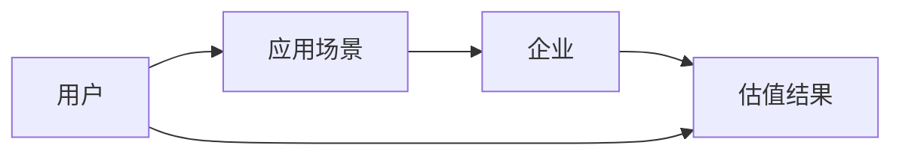
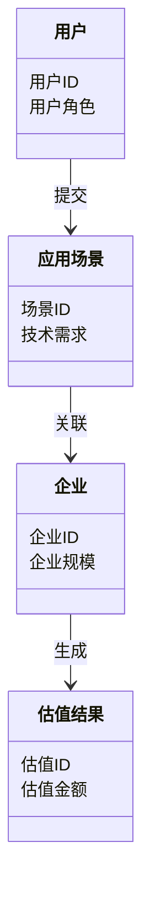
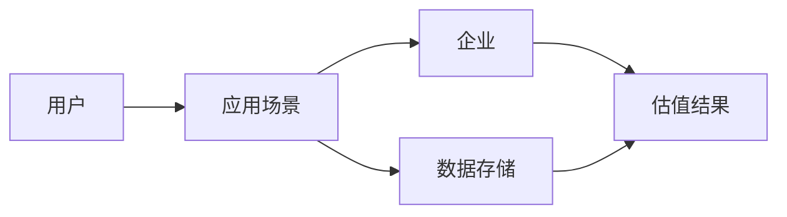

                 


# 企业估值中的5G应用场景评估

> 关键词：企业估值、5G技术、应用场景、评估指标、数学模型、系统架构

> 摘要：本文详细探讨了5G技术在企业估值中的应用场景评估，从背景分析到数学模型构建，再到系统架构设计，最后通过项目实战和最佳实践，为企业估值提供了全面的解决方案。

---

## 第1章: 5G应用场景与企业估值背景

### 1.1 5G技术发展与企业估值的关系
#### 1.1.1 5G技术的核心特点与优势
5G技术以其高带宽、低延迟和大规模连接能力，正在重塑 industries 的数字转型。其核心特点包括：
- **高带宽**：支持更快的数据传输，提升企业数据处理效率。
- **低延迟**：确保实时响应，适用于远程医疗、自动驾驶等场景。
- **大规模连接**：支持海量设备接入，适用于物联网和智慧城市。

#### 1.1.2 5G技术对企业估值的影响
5G技术通过提升企业运营效率、降低成本和开拓新业务模式，直接影响企业价值。例如，智能制造通过5G实现设备互联，显著提高生产效率，从而提升企业估值。

#### 1.1.3 5G应用场景的多样性与经济价值
5G应用场景广泛，涵盖智能制造、智慧城市、远程医疗、教育等多个领域。每个场景都具有独特的经济价值，例如智能制造可提升生产效率，智慧城市可优化资源配置。

### 1.2 企业估值中的应用场景评估的重要性
#### 1.2.1 企业估值的基本概念与方法
企业估值是通过对企业财务状况、市场地位和未来盈利能力的评估，确定其市场价值。常用方法包括DCF模型、市盈率法等。

#### 1.2.2 5G技术在企业估值中的独特作用
5G技术通过提升企业运营效率和创新能力，增强其市场竞争力，从而在估值中体现其价值。例如，5G支持的远程医疗可提升企业服务质量，增加客户黏性。

#### 1.2.3 应用场景评估在企业估值中的地位
应用场景评估是企业估值的重要组成部分，通过分析不同场景的技术可行性和经济收益，确定其对整体估值的贡献。

### 1.3 本书的核心内容与目标
#### 1.3.1 本书的研究范围与目标
本书旨在探讨5G技术在企业估值中的应用场景，通过理论分析和实际案例，提供系统的解决方案。

#### 1.3.2 本书的结构安排
本书分为七章，涵盖背景分析、核心概念、数学模型、系统架构、项目实战、最佳实践和总结展望。

#### 1.3.3 本书的创新点与价值
本书通过结合5G技术与企业估值，提出创新的评估模型和方法，为企业提供实践指导。

---

## 第2章: 5G应用场景的核心概念与联系

### 2.1 5G应用场景的分类与特征
#### 2.1.1 5G应用场景的分类
5G应用场景可大致分为以下几类：
- **智能制造**：设备互联，数据实时传输。
- **智慧城市**：交通管理、环境监测。
- **远程医疗**：远程诊断、设备控制。
- **教育**：在线课堂、虚拟现实教学。

#### 2.1.2 不同场景的技术特征对比
| 场景 | 核心技术 | 数据传输需求 | 延迟要求 |
|------|----------|---------------|----------|
| 智能制造 | 物联网、工业互联网 | 高 | 低 |
| 智慧城市 | 物联网、云计算 | 中 | 中 |
| 远程医疗 | 物联网、大数据 | 高 | 极低 |
| 教育 | VR/AR、云计算 | 中 | 中 |

#### 2.1.3 场景之间的关联性分析
应用场景之间存在一定的关联性，例如智能制造和智慧城市都依赖于物联网技术，远程医疗和教育都依赖于实时数据传输。

### 2.2 5G应用场景的ER实体关系图


### 2.3 5G应用场景的核心要素与指标
#### 2.3.1 核心要素的定义与属性
- **技术成熟度**：技术实现的难度和稳定性。
- **市场需求**：用户需求量和市场接受度。
- **经济效益**：投资回报率和成本效益。

#### 2.3.2 指标对比表格
| 指标 | 描述 | 权重 |
|------|------|------|
| 技术成熟度 | 技术实现难度 | 0.3 |
| 市场需求 | 用户需求量 | 0.4 |
| 经济效益 | 投资回报率 | 0.3 |

---

## 第3章: 5G应用场景评估的数学模型与算法

### 3.1 评估指标的数学模型
#### 3.1.1 指标权重分配的数学公式
$$ w_i = \frac{\sum_{j=1}^{n} a_{ij}}{\sum_{i=1}^{m} \sum_{j=1}^{n} a_{ij}} } $$
其中，$w_i$ 表示第 $i$ 个指标的权重，$a_{ij}$ 表示第 $i$ 个指标在第 $j$ 个场景下的评分。

#### 3.1.2 评估总得分计算公式
$$ S = \sum_{i=1}^{m} w_i \times s_i $$
其中，$S$ 表示评估总得分，$s_i$ 表示第 $i$ 个指标的评分。

---

## 第4章: 5G应用场景评估的系统架构设计

### 4.1 系统功能设计（领域模型）


### 4.2 系统架构设计


---

## 第5章: 项目实战

### 5.1 环境安装
- 安装Python和相关库（如NumPy、Pandas、Matplotlib）。
- 安装Mermaid和相关工具。

### 5.2 核心代码实现
```python
import numpy as np
import pandas as pd

def calculate_weights(matrix):
    total = np.sum(matrix)
    weights = np.array([row / total for row in matrix])
    return weights

def evaluate_scenario(weights, scores):
    return np.dot(weights, scores)

# 示例数据
matrix = np.array([[0.2, 0.3], [0.1, 0.4]])
weights = calculate_weights(matrix)
print("权重矩阵：", weights)

scores = np.array([0.8, 0.6])
evaluation = evaluate_scenario(weights, scores)
print("评估得分：", evaluation)
```

### 5.3 实际案例分析
以智能制造为例，分析其对企业的估值影响，展示代码实现和评估结果。

---

## 第6章: 最佳实践与总结

### 6.1 最佳实践
- 合理选择应用场景，避免过度投资。
- 定期评估和优化模型，适应技术变化。

### 6.2 小结
5G技术在企业估值中的应用场景评估是一个复杂但重要的任务，通过合理的模型和方法，可以有效提升企业价值。

### 6.3 展望
未来，随着5G技术的进一步发展，应用场景将更加多样化，评估方法也将更加精准。

---

## 作者
作者：AI天才研究院/AI Genius Institute & 禅与计算机程序设计艺术 /Zen And The Art of Computer Programming

