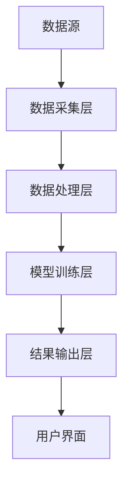

                 


# 企业估值中的AI辅助诊断系统评估

## 关键词
企业估值, AI辅助诊断, 人工智能, 机器学习, 系统架构, 诊断算法, 投资决策

## 摘要
企业估值是投资决策中的核心问题，传统方法依赖于人工分析和经验判断，存在效率低、主观性强、覆盖面窄等局限性。AI辅助诊断系统通过引入机器学习、深度学习等先进技术，能够从海量数据中提取关键特征，构建高精度的估值模型，为企业估值提供更加客观、高效、全面的解决方案。本文将从企业估值的基本概念、AI辅助诊断系统的原理、系统架构、算法实现、项目实战等多个维度展开，系统性地探讨AI在企业估值中的应用与实践。

---

## 第1章：企业估值的基本概念

### 1.1 企业估值的定义与方法
企业估值是指对企业未来盈利能力的评估，是投资决策中的关键环节。传统企业估值方法主要包括市盈率法、市净率法、现金流折现法等。这些方法依赖于人工分析和经验判断，存在以下问题：
- 数据采集范围有限，难以覆盖多维度信息；
- 估值结果主观性强，受分析人员经验影响；
- 高频动态调整困难，难以应对市场变化。

---

### 1.2 AI辅助诊断系统在企业估值中的作用
AI辅助诊断系统通过引入机器学习和自然语言处理等技术，能够从企业财务报表、市场新闻、行业趋势等多源异构数据中提取关键特征，构建高精度的估值模型。其优势包括：
- **高效性**：自动化处理海量数据，提升估值效率；
- **客观性**：基于数据驱动的模型，减少人为偏见；
- **全面性**：覆盖多维度信息，提升估值准确性；
- **动态性**：实时更新模型，适应市场变化。

---

## 第2章：AI辅助诊断系统的核心原理

### 2.1 数据采集与处理
企业估值涉及多源异构数据，包括：
- **企业财务数据**：收入、利润、现金流等；
- **市场数据**：股票价格、行业指数、宏观经济指标；
- **文本数据**：公司公告、行业报告、新闻资讯。

**数据处理流程**：
1. 数据清洗：去除缺失值、异常值；
2. 数据预处理：标准化、特征提取；
3. 数据特征分析：识别关键特征。

---

### 2.2 AI算法与模型构建
AI辅助诊断系统的核心是构建高精度的估值模型。常用算法包括：
- **线性回归**：适用于简单线性关系；
- **随机森林**：适用于非线性关系；
- **神经网络**：适用于复杂特征关系。

**模型训练流程**：
1. 数据分割：训练集、验证集、测试集；
2. 模型训练：使用训练数据拟合模型；
3. 模型评估：通过验证集调整参数；
4. 模型测试：使用测试数据评估性能。

---

## 第3章：企业估值中的AI辅助诊断系统架构

### 3.1 系统架构设计
AI辅助诊断系统的架构分为以下几层：
1. **数据采集层**：负责数据的获取与初步处理；
2. **模型训练层**：构建并训练估值模型；
3. **结果输出层**：生成估值结果并提供可视化展示。

**系统架构图**：


---

## 第4章：系统实现与项目实战

### 4.1 环境搭建与数据准备
**环境搭建**：
- 安装Python、TensorFlow、Scikit-learn等工具；
- 配置Jupyter Notebook用于开发。

**数据准备**：
- 下载企业财务数据（如股票价格、财务报表）；
- 获取行业报告和新闻数据。

---

### 4.2 模型训练与优化
**代码实现**：
```python
import pandas as pd
from sklearn.ensemble import RandomForestRegressor
from sklearn.metrics import mean_squared_error

# 加载数据
data = pd.read_csv('企业估值数据.csv')

# 划分训练集和测试集
train = data.iloc[:700]
test = data.iloc[700:]

# 特征工程
features = ['收入', '利润', '现金流', '行业指数']
target = '股票价格'

model = RandomForestRegressor(n_estimators=100, random_state=42)
model.fit(train[features], train[target])

# 模型预测
predictions = model.predict(test[features])
print(mean_squared_error(test[target], predictions))
```

**模型优化**：
- 调整模型参数（如n_estimators）；
- 使用交叉验证评估模型性能。

---

## 第5章：系统优化与未来发展

### 5.1 系统优化方向
1. **数据源扩展**：引入更多维度的数据（如社交媒体情绪分析）；
2. **模型改进**：尝试使用更复杂的深度学习模型（如LSTM）；
3. **系统性能优化**：提升数据处理效率和模型训练速度。

### 5.2 未来发展展望
AI辅助诊断系统在企业估值中的应用前景广阔，未来可能会在以下方面取得突破：
- **实时估值**：通过流数据处理技术实现实时估值；
- **多模态分析**：结合文本、图像等多种数据源进行分析；
- **个性化诊断**：针对不同行业特点定制化诊断模型。

---

## 小结
企业估值是投资决策中的核心问题，而AI辅助诊断系统通过引入先进技术，能够显著提升估值的效率和准确性。本文从企业估值的基本概念、AI辅助诊断系统的原理、系统架构、算法实现、项目实战等多个维度展开，详细探讨了AI在企业估值中的应用与实践。未来，随着技术的不断发展，AI辅助诊断系统将在企业估值领域发挥更大的作用。

---

## 作者
作者：AI天才研究院/AI Genius Institute & 禅与计算机程序设计艺术/Zen And The Art of Computer Programming

