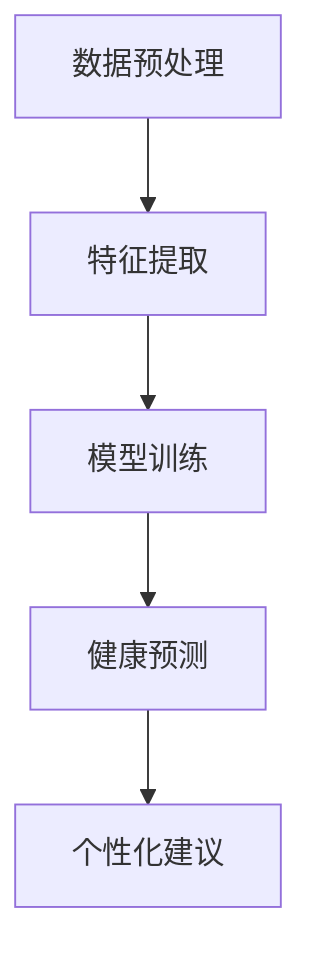
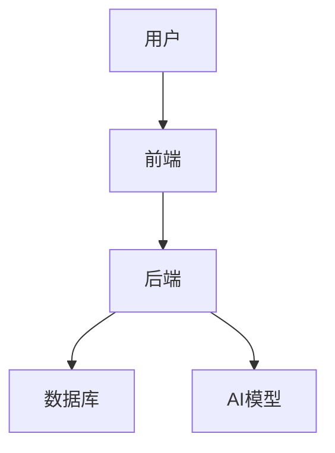
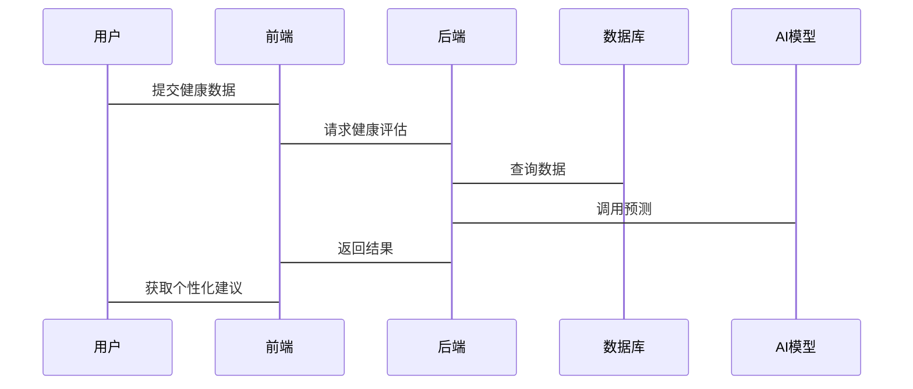

                 


# 《企业估值中的AI驱动的个性化健康管理平台评估》

## 关键词：
- 企业估值
- AI驱动
- 个性化健康管理
- 平台评估
- 数学模型
- 系统架构
- 项目实战

## 摘要：
本篇文章深入探讨如何利用人工智能技术评估个性化健康管理平台，从而帮助企业进行更精准的企业估值。文章从背景介绍、核心概念、AI算法原理、数学模型、系统架构设计到项目实战，全面解析AI在健康管理平台评估中的应用，为企业估值提供新思路和实践指导。

---

## 第1章: 背景介绍

### 1.1 问题背景
#### 1.1.1 传统企业估值的局限性
传统的企业估值方法通常依赖于财务数据和历史表现，难以全面反映企业的潜在价值，尤其是新兴领域如健康管理平台的动态价值。

#### 1.1.2 健康管理平台在企业中的重要性
健康管理平台通过收集和分析员工健康数据，优化企业的人力资源管理，降低医疗成本，提升员工 productivity，从而影响企业整体价值。

#### 1.1.3 个性化健康管理平台的兴起
个性化健康管理平台利用AI技术，为员工提供定制化的健康建议，进一步提升企业的健康管理和价值评估。

### 1.2 问题描述
#### 1.2.1 个性化健康管理平台的核心目标
通过AI技术，个性化健康管理平台旨在优化员工健康，降低企业成本，提升员工 productivity，从而间接提升企业估值。

#### 1.2.2 传统估值方法的不足
传统估值方法难以量化健康管理平台对企业整体价值的具体贡献，尤其是在数据驱动的决策方面存在局限性。

#### 1.2.3 AI驱动在企业估值中的潜力
AI技术可以通过分析海量健康数据，预测员工健康趋势，帮助企业更准确地评估健康管理和潜在成本，从而提升估值的准确性。

### 1.3 问题解决
#### 1.3.1 AI驱动的个性化健康管理平台如何提升企业估值
通过AI分析健康数据，预测员工健康风险，优化健康计划，降低医疗成本，提升员工 productivity，从而增加企业价值。

#### 1.3.2 数据驱动的决策优势
数据驱动的决策能够更精准地识别健康风险，制定有效的健康策略，从而提升企业的整体估值。

#### 1.3.3 个性化健康解决方案对企业价值的影响
个性化健康解决方案能够提高员工健康水平，减少缺勤率，提升生产力，从而增强企业的市场竞争力和估值。

### 1.4 边界与外延
#### 1.4.1 个性化健康管理平台的边界
个性化健康管理平台专注于员工健康数据分析和健康建议，不涉及企业的财务和战略决策。

#### 1.4.2 AI驱动的估值方法的适用范围
适用于数据充足的健康管理平台，特别适合科技驱动的创新企业。

#### 1.4.3 与传统估值方法的结合
AI驱动的估值方法可以与传统财务指标结合，提供更全面的企业估值。

### 1.5 核心概念与联系
#### 1.5.1 核心概念的定义
- 健康管理平台：提供健康数据分析和管理工具的平台。
- AI驱动：利用人工智能技术进行数据分析和预测。
- 个性化评估：基于个体特征提供定制化健康建议。

#### 1.5.2 核心概念的属性对比
| 概念       | 描述                                                                 |
|------------|----------------------------------------------------------------------|
| 健康管理平台 | 数据收集、分析和管理健康数据的平台                                         |
| AI驱动     | 使用机器学习等技术进行数据分析和预测                                       |
| 个性化评估 | 根据个体特征提供定制化健康建议                                             |

#### 1.5.3 ER实体关系图
```mermaid
erDiagram
    health_platform {
      id: int
      name: string
      description: string
    }
    employee {
      id: int
      name: string
      health_data: string
    }
    health_metric {
      id: int
      metric_name: string
      value: float
    }
    health_goal {
      id: int
      goal_name: string
      target_value: float
    }
    health_platform --| health_metric
    health_platform --| employee
    employee --| health_metric
    health_platform --| health_goal
```

---

## 第2章: 核心概念与联系

### 2.1 核心概念的原理
个性化健康管理平台通过收集员工的健康数据，利用AI技术进行分析，提供定制化的健康建议，从而优化企业的健康管理，提升员工 productivity 和企业估值。

### 2.2 核心概念的属性对比
- 健康管理平台：数据收集、分析和管理健康数据。
- AI驱动：利用机器学习进行预测和优化。
- 个性化评估：基于个体特征提供定制化建议。

### 2.3 ER实体关系图
如前所述，ER实体关系图展示了健康平台、员工、健康指标和目标之间的关系。

---

## 第3章: AI算法原理

### 3.1 算法流程图


### 3.2 算法实现代码
```python
import pandas as pd
from sklearn.model import Model

# 数据预处理
data = pd.read_csv('health_data.csv')
data = data.dropna()

# 特征提取
features = data[['age', 'gender', 'weight', 'height', 'bp']]
target = data['health_score']

# 模型训练
model = Model()
model.fit(features, target)

# 预测健康风险
predictions = model.predict(features)
```

---

## 第4章: 数学模型

### 4.1 健康评分模型
$$ \text{健康评分} = a \cdot \text{年龄} + b \cdot \text{体重} + c \cdot \text{血压} $$

### 4.2 回归分析
$$ y = \beta_0 + \beta_1 x_1 + \beta_2 x_2 + \epsilon $$

### 4.3 分类模型
$$ P(y=1|x) = \frac{1}{1 + e^{- (\beta_0 + \beta_1 x)}} $$

---

## 第5章: 系统架构设计

### 5.1 项目介绍
个性化健康管理平台旨在通过AI技术优化员工健康，提升企业估值。

### 5.2 功能设计
- 数据收集：整合员工健康数据。
- 数据分析：使用AI技术进行健康预测。
- 健康建议：提供个性化健康建议。

### 5.3 系统架构图


### 5.4 接口设计
- API接口：提供健康数据接口。
- AI模型接口：提供健康预测服务。

### 5.5 交互设计


---

## 第6章: 项目实战

### 6.1 环境安装
- Python 3.8+
- Pandas, Scikit-learn

### 6.2 核心代码实现
```python
import pandas as pd
from sklearn.model import Model

# 数据预处理
data = pd.read_csv('health_data.csv')
data = data.dropna()

# 特征提取
features = data[['age', 'gender', 'weight', 'height', 'bp']]
target = data['health_score']

# 模型训练
model = Model()
model.fit(features, target)

# 预测健康风险
predictions = model.predict(features)
```

### 6.3 案例分析
通过实际案例分析，展示如何利用AI技术提升企业估值。

### 6.4 项目总结
个性化健康管理平台通过AI技术优化健康管理，提升企业估值。

---

## 第7章: 总结

### 7.1 小结
本文详细探讨了AI驱动的个性化健康管理平台在企业估值中的应用，展示了如何通过AI技术优化健康管理和提升企业价值。

### 7.2 注意事项
- 数据隐私保护
- 模型的可解释性
- 系统的可扩展性

### 7.3 拓展阅读
- 《机器学习实战》
- 《企业估值方法》

---

## 作者：
AI天才研究院/AI Genius Institute  
禅与计算机程序设计艺术/Zen And The Art of Computer Programming

