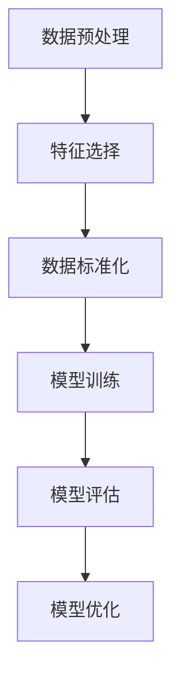
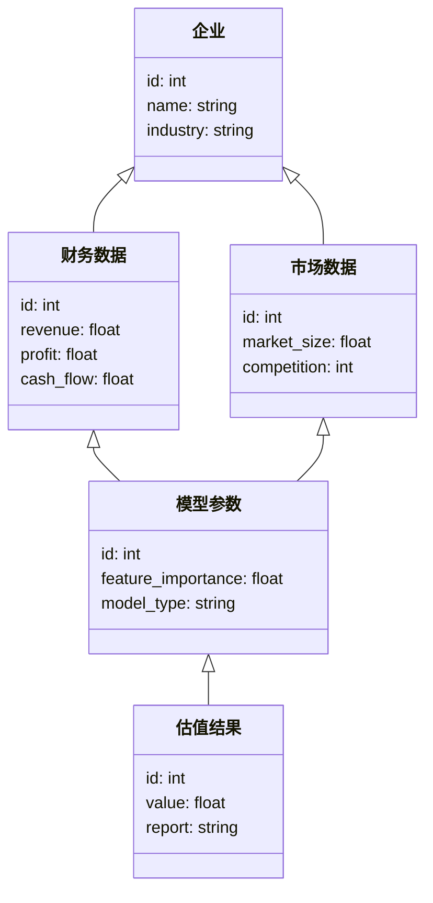
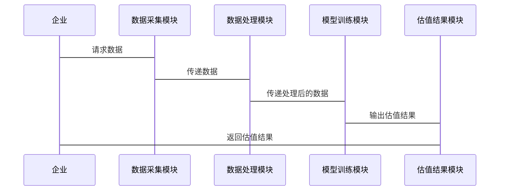

                 


# 企业估值中的AI驱动个性化营养规划平台评估

## 关键词：企业估值、人工智能、个性化营养规划、平台评估、数据驱动、技术实现

## 摘要：
本文探讨了在企业估值过程中，如何利用AI技术构建个性化营养规划平台，通过数据驱动的方法，为企业提供精准的估值服务。文章从背景介绍、核心概念、算法原理、系统架构设计、项目实战到最佳实践，全面分析了AI在企业估值中的应用，展示了如何通过技术创新提升企业估值的效率和准确性。

---

## 第一部分：企业估值中的AI驱动个性化营养规划平台背景

### 第1章：问题背景与描述

#### 1.1 问题背景
##### 1.1.1 传统企业估值方法的局限性
传统企业估值方法依赖于财务数据和经验判断，存在以下问题：
- 数据单一：主要依赖财务数据，忽视了其他重要因素（如市场趋势、管理能力等）。
- 主观性高：估值结果受评估人员主观判断影响较大。
- 时效性差：无法实时更新数据，难以应对快速变化的市场环境。

##### 1.1.2 个性化营养规划的需求
个性化营养规划是指根据企业的具体特点和市场环境，提供定制化的估值方案。这种需求源于企业之间的差异性，例如：
- 企业规模不同：小企业与大企业的估值方法差异显著。
- 行业特性不同：金融行业与制造业的估值模型截然不同。
- 发展阶段不同：初创企业与成熟企业的估值逻辑存在差异。

##### 1.1.3 AI技术在企业估值中的潜力
AI技术可以通过以下方式提升企业估值的准确性：
- 数据挖掘：AI可以处理海量数据，发现传统方法难以察觉的模式。
- 自动化分析：AI能够快速生成估值报告，节省时间和成本。
- 实时更新：AI可以实时跟踪市场变化，动态调整估值模型。

#### 1.2 问题描述
##### 1.2.1 个性化营养规划平台的目标
个性化营养规划平台的目标是为每家企业提供独特的估值方案，具体包括：
- 提供定制化的估值模型。
- 实时更新估值结果。
- 自动生成估值报告。

##### 1.2.2 企业估值中的关键因素
影响企业估值的关键因素包括：
- 财务数据：收入、利润、现金流等。
- 市场数据：行业趋势、竞争状况等。
- 管理因素：团队能力、管理效率等。
- 风险因素：政策风险、市场风险等。

##### 1.2.3 AI驱动平台的优势
AI驱动的个性化营养规划平台具有以下优势：
- 高度个性化：根据企业特点调整估值模型。
- 高效性：利用AI算法快速完成估值。
- 准确性：通过数据挖掘和机器学习提升估值精度。

#### 1.3 问题解决
##### 1.3.1 AI如何优化企业估值
AI可以通过以下方式优化企业估值：
- 数据预处理：清洗和整合多源数据。
- 模型训练：构建机器学习模型预测企业价值。
- 结果优化：根据反馈不断优化模型。

##### 1.3.2 个性化营养规划的具体实现
个性化营养规划的具体实现包括：
- 数据采集：收集企业的财务数据、市场数据等。
- 数据分析：利用AI算法分析数据，生成估值结果。
- 结果输出：将估值结果以报告形式呈现。

##### 1.3.3 平台如何提升企业估值效率
平台通过自动化数据处理和AI算法，显著提升了企业估值效率，具体表现为：
- 从手动分析到自动化处理，节省时间。
- 从单一数据源到多源数据融合，提高准确性。
- 从静态估值到动态调整，增强实时性。

#### 1.4 边界与外延
##### 1.4.1 平台的应用范围
个性化营养规划平台的应用范围包括：
- 企业自身估值：帮助企业了解自身价值。
- 投资决策：为投资者提供决策支持。
- 并购评估：为企业并购提供估值依据。

##### 1.4.2 与其他估值方法的对比
与其他估值方法相比，AI驱动平台的优势在于：
- 数据处理能力更强。
- 模型调整更灵活。
- 估值结果更精准。

##### 1.4.3 平台的局限性
尽管AI驱动平台具有诸多优势，但也存在一些局限性：
- 数据依赖性：需要大量高质量数据支持。
- 模型泛化能力：需要针对不同企业进行模型调优。
- 技术门槛：需要专业团队进行开发和维护。

#### 1.5 核心要素与组成
##### 1.5.1 数据来源与处理
数据来源包括：
- 企业财务数据：收入、利润、现金流等。
- 市场数据：行业趋势、竞争对手信息等。
- 其他数据：企业专利数、管理团队能力等。

数据处理包括：
- 数据清洗：处理缺失值、异常值。
- 数据转换：将数据转换为适合模型输入的形式。
- 数据增强：通过数据增强技术提高数据质量。

##### 1.5.2 AI模型构建
AI模型构建包括：
- 数据预处理：特征选择、降维等。
- 模型训练：选择合适的算法训练模型。
- 模型评估：通过交叉验证评估模型性能。
- 模型优化：调整超参数提升模型性能。

##### 1.5.3 结果输出与反馈
结果输出包括：
- 估值结果：企业的估值金额。
- 估值报告：详细分析企业的优劣势。
- 反馈机制：根据用户反馈调整模型。

---

## 第二部分：核心概念与联系

### 第2章：核心概念与原理

#### 2.1 AI驱动个性化营养规划平台的原理
##### 2.1.1 数据采集与预处理
数据采集与预处理是AI驱动平台的基础，主要包括：
- 数据采集：从多个数据源获取数据。
- 数据清洗：处理缺失值、重复值、异常值。
- 数据转换：将数据转换为适合模型输入的形式。
- 数据增强：通过数据增强技术提高数据质量。

##### 2.1.2 模型训练与优化
模型训练与优化是AI驱动平台的核心，主要包括：
- 模型选择：选择合适的算法（如线性回归、随机森林、神经网络等）。
- 模型训练：利用训练数据训练模型。
- 模型评估：通过验证集评估模型性能。
- 模型优化：调整超参数、增加正则化等方法优化模型。

##### 2.1.3 结果分析与反馈
结果分析与反馈是AI驱动平台的重要环节，主要包括：
- 结果分析：分析模型预测结果。
- 结果解释：解释模型预测结果背后的原因。
- 反馈机制：根据反馈调整模型。

#### 2.2 核心概念对比表
| 概念 | 描述 | 属性 | 特征 |
|------|------|------|------|
| 数据预处理 | 数据清洗、转换、增强 | 数据质量、数据一致性 | 数据完整性、数据准确性 |
| 模型训练 | 数据训练、参数调整 | 模型性能、泛化能力 | 模型准确率、模型鲁棒性 |
| 模型评估 | 模型验证、性能分析 | 模型性能、评估指标 | 模型误差、模型偏差 |

#### 2.3 ER实体关系图
```mermaid
er
    企业 (id: int, name: string, industry: string)
    财务数据 (id: int, revenue: float, profit: float, cash_flow: float)
    市场数据 (id: int, market_size: float, competition: int)
    模型参数 (id: int, feature_importance: float, model_type: string)
    估值结果 (id: int, value: float, report: string)
    企业 <--1..n--> 财务数据
    企业 <--1..n--> 市场数据
    财务数据 <--1..n--> 模型参数
    市场数据 <--1..n--> 模型参数
    模型参数 <--1..n--> 估值结果
```

---

## 第三部分：算法原理讲解

### 第3章：算法原理与实现

#### 3.1 算法选择与原理
##### 3.1.1 线性回归
线性回归是一种简单但有效的回归算法，适用于线性关系的数据。其基本假设是因变量与自变量之间存在线性关系，可以通过最小化均方误差来优化模型参数。

##### 3.1.2 随机森林
随机森林是一种基于决策树的集成算法，适用于非线性关系的数据。其基本原理是通过构建多个决策树并进行投票或平均来提高模型的准确性和鲁棒性。

##### 3.1.3 神经网络
神经网络是一种强大的深度学习算法，适用于复杂的非线性关系的数据。其基本原理是通过多层神经元模拟人脑的神经网络，通过反向传播算法优化模型参数。

#### 3.2 算法实现步骤
##### 3.2.1 线性回归实现


##### 3.2.2 线性回归公式
线性回归的数学公式为：
$$ y = \beta_0 + \beta_1x + \epsilon $$
其中，$y$ 是因变量，$x$ 是自变量，$\beta_0$ 是截距，$\beta_1$ 是斜率，$\epsilon$ 是误差项。

##### 3.2.3 线性回归代码实现
```python
import numpy as np
from sklearn.linear_model import LinearRegression

# 数据准备
X = np.array([[1], [2], [3], [4], [5]])
y = np.array([2, 4, 5, 4, 6])

# 模型训练
model = LinearRegression()
model.fit(X, y)

# 模型预测
print(model.predict([[6]]))  # 输出：[[7.0]]
```

#### 3.3 算法优化与调优
##### 3.3.1 参数调优
在模型训练过程中，可以通过调整学习率、正则化参数等超参数来优化模型性能。

##### 3.3.2 模型评估
模型评估指标包括：
- �均方误差（MSE）：衡量模型预测值与真实值的差异。
- 决定系数（R²）：衡量模型解释变量的比例。
- 平均绝对误差（MAE）：衡量模型预测值与真实值的绝对差异。

##### 3.3.3 实际案例分析
以某企业为例，利用线性回归模型进行估值，具体步骤如下：
1. 数据采集：收集企业的财务数据、市场数据等。
2. 数据预处理：清洗数据、处理缺失值。
3. 特征选择：选择影响企业估值的关键特征。
4. 模型训练：利用训练数据训练线性回归模型。
5. 模型评估：通过验证集评估模型性能。
6. 模型优化：调整超参数、增加正则化等方法优化模型。
7. 模型预测：利用优化后的模型进行企业估值。

---

## 第四部分：系统分析与架构设计方案

### 第4章：系统分析与架构设计

#### 4.1 问题场景介绍
个性化营养规划平台的系统分析包括以下几个方面：
- 系统目标：为每家企业提供定制化的估值方案。
- 系统功能：数据采集、模型训练、结果输出等。
- 系统约束：数据隐私、模型准确率等。

#### 4.2 系统功能设计
##### 4.2.1 领域模型


##### 4.2.2 系统架构设计


##### 4.2.3 接口设计
系统接口设计包括：
- 数据接口：数据输入接口、数据输出接口。
- 模型接口：模型训练接口、模型预测接口。
- 用户接口：用户查询接口、用户反馈接口。

##### 4.2.4 交互流程图


---

## 第五部分：项目实战

### 第5章：项目实战与实现

#### 5.1 环境安装与配置
##### 5.1.1 环境搭建
安装Python和相关库（如NumPy、Scikit-learn、Matplotlib）。

##### 5.1.2 数据准备
准备企业数据，包括财务数据、市场数据等。

#### 5.2 核心代码实现
##### 5.2.1 数据预处理代码
```python
import pandas as pd
import numpy as np

# 数据准备
data = pd.read_csv('企业数据.csv')
# 数据清洗
data.dropna(inplace=True)
# 数据转换
data['value'] = data['value'].astype(float)
```

##### 5.2.2 模型训练代码
```python
from sklearn.linear_model import LinearRegression

# 模型训练
model = LinearRegression()
model.fit(X_train, y_train)

# 模型预测
y_pred = model.predict(X_test)
```

##### 5.2.3 结果输出代码
```python
# 结果输出
print('预测值:', y_pred)
print('真实值:', y_test)
print('均方误差:', np.mean((y_pred - y_test) ** 2))
```

#### 5.3 项目小结
通过实际案例分析，展示了AI驱动个性化营养规划平台的实现过程，包括数据准备、模型训练、结果输出等步骤。通过该项目，读者可以掌握AI在企业估值中的具体应用。

---

## 第六部分：最佳实践

### 第6章：最佳实践与总结

#### 6.1 小结
本文详细介绍了AI驱动个性化营养规划平台的背景、核心概念、算法原理、系统架构设计、项目实战以及最佳实践。通过本文的讲解，读者可以全面了解AI在企业估值中的应用。

#### 6.2 注意事项
在实际应用中，需要注意以下几点：
- 数据隐私：确保数据的安全性和隐私性。
- 模型泛化能力：避免模型过拟合或欠拟合。
- 系统维护：定期更新数据和模型，确保系统的准确性和稳定性。

#### 6.3 拓展阅读
建议读者进一步阅读以下内容：
- 《机器学习实战》：了解机器学习的基本概念和算法。
- 《深入理解深度学习》：深入理解深度学习的原理和应用。
- 《企业估值实务》：学习企业估值的实务知识。

---

## 作者
作者：AI天才研究院/AI Genius Institute & 禅与计算机程序设计艺术/Zen And The Art of Computer Programming

