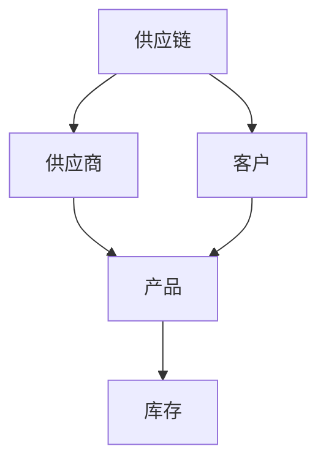
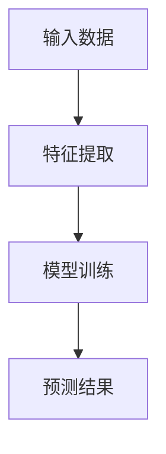
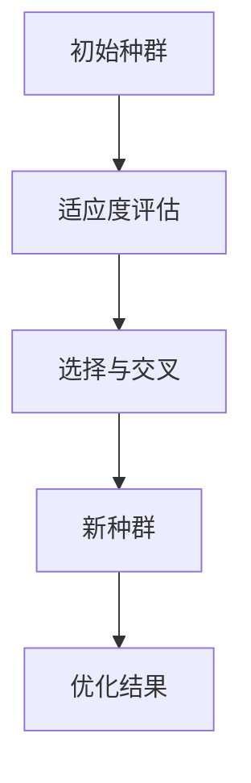
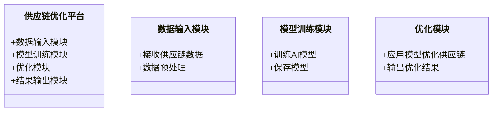
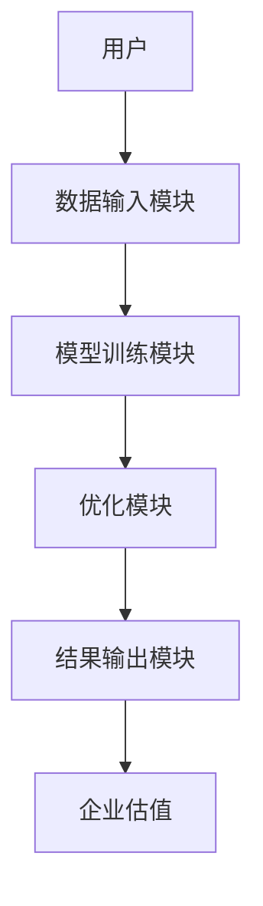
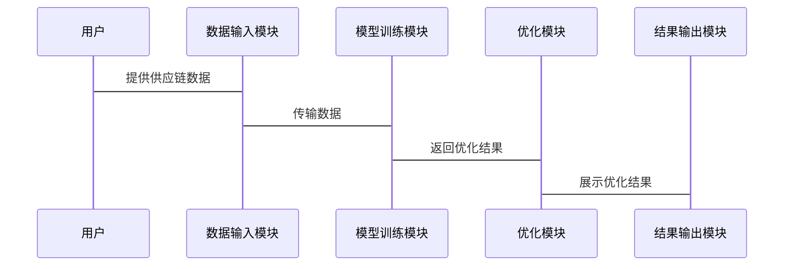

                 


# 企业估值中的AI驱动的供应链优化平台评估

## 关键词：企业估值、供应链优化、人工智能、AI算法、系统架构

## 摘要：本文深入探讨了在企业估值过程中，如何利用AI驱动的供应链优化平台进行评估。文章从供应链优化的基本概念和AI技术的特点出发，结合数学模型和算法原理，分析了AI在供应链优化中的应用及其对企业发展和估值的影响。通过实际案例和系统架构设计，展示了如何构建和实施AI驱动的供应链优化平台，为企业的估值提供了新的思路和方法。

---

# 第一部分：企业估值中的AI驱动的供应链优化平台评估基础

## 第1章：供应链优化与企业估值概述

### 1.1 供应链优化的基本概念

#### 1.1.1 供应链的定义与组成
供应链是指从原材料采购到产品交付给最终用户的整个流程。它包括供应商、制造商、分销商、零售商和客户等多个环节。

#### 1.1.2 供应链优化的目标与意义
供应链优化的目标是提高效率、降低成本、增强灵活性和响应速度。通过优化供应链，企业可以更好地满足客户需求，提高市场竞争力。

#### 1.1.3 供应链优化与企业估值的关系
供应链优化直接影响企业的运营效率和成本结构，从而影响企业的盈利能力和市场价值。

---

### 1.2 AI驱动的供应链优化

#### 1.2.1 AI在供应链管理中的应用
AI技术可以通过数据分析、预测和优化算法，帮助企业在供应链的各个环节做出更智能的决策。

#### 1.2.2 供应链优化的AI技术特点
AI驱动的供应链优化具有实时性、自适应性和数据驱动等特点，能够根据市场变化和客户需求快速调整供应链策略。

#### 1.2.3 AI驱动的供应链优化优势
通过AI技术，企业可以实现供应链的智能化管理，降低库存成本，提高订单准确性，增强客户满意度。

---

### 1.3 企业估值的核心要素

#### 1.3.1 企业估值的定义与方法
企业估值是指对企业价值的评估，常用的方法包括DCF模型、市盈率法和市净率法等。

#### 1.3.2 供应链在企业估值中的作用
供应链的效率和成本直接影响企业的盈利能力，从而影响企业的估值。

#### 1.3.3 AI驱动的供应链优化对企业估值的影响
通过优化供应链，企业可以提高利润率和运营效率，从而提升市场价值。

---

## 第2章：供应链优化的核心概念与AI技术

### 2.1 核心概念原理

#### 2.1.1 供应链优化的数学模型
供应链优化可以通过线性规划、整数规划等数学模型来描述和求解。

#### 2.1.2 AI驱动的优化算法
AI技术中的遗传算法、模拟退火和机器学习算法可以用于供应链优化问题。

#### 2.1.3 供应链优化与企业估值的关系
供应链优化直接影响企业的成本和利润，从而影响企业的估值。

---

### 2.2 核心概念属性特征对比

| **属性**         | **供应链优化**       | **AI技术**         |
|------------------|---------------------|-------------------|
| **目标**         | 提高效率和降低成本 | 提供智能决策支持   |
| **数据需求**     | 需要历史数据         | 需要大量数据       |
| **计算复杂度**   | 可能较高             | 可能非常复杂       |
| **灵活性**       | 较低                | 较高              |
| **适用场景**     | 供应链管理           | 多领域应用         |

---

### 2.3 ER实体关系图架构



---

### 2.4 本章小结
本章介绍了供应链优化的核心概念和AI技术的特点，并通过对比分析和ER图展示了供应链优化与企业估值的关系。

---

## 第3章：AI驱动的供应链优化算法原理

### 3.1 算法原理讲解

#### 3.1.1 线性回归算法



线性回归是一种常用的数据分析方法，可以用于预测供应链中的需求量。

#### 3.1.2 遗传算法



遗传算法是一种模拟自然选择的优化算法，可以用于解决复杂的供应链优化问题。

---

### 3.2 数学模型与公式

#### 3.2.1 线性回归模型
$$ y = \beta_0 + \beta_1 x + \epsilon $$

其中，$y$ 是预测值，$\beta_0$ 是截距，$\beta_1$ 是回归系数，$x$ 是自变量，$\epsilon$ 是误差项。

#### 3.2.2 遗传算法中的适应度函数
适应度函数用于评估种群中个体的优劣，通常表示为：
$$ f(x) = \text{目标函数值} $$

---

### 3.3 算法实现与应用

#### 3.3.1 线性回归的Python实现

```python
import numpy as np
from sklearn.linear_model import LinearRegression

# 示例数据
X = np.array([1, 2, 3, 4, 5]).reshape(-1, 1)
y = np.array([2, 4, 5, 4, 6])

# 训练模型
model = LinearRegression()
model.fit(X, y)

# 预测结果
print(model.predict(X))
```

#### 3.3.2 遗传算法的Python实现

```python
import random

def fitness(x):
    return x**2 + 2*x + 1

def genetic_algorithm(population_size, max_iterations):
    population = [random.uniform(-10, 10) for _ in range(population_size)]
    for _ in range(max_iterations):
        population = sorted(population, key=lambda x: -fitness(x))
        population = population[:population_size//2]
        population = [fitness(x) for x in population]
    return max(population)

print(genetic_algorithm(10, 10))
```

---

## 第4章：系统架构与实现

### 4.1 问题场景介绍
本文将通过一个虚拟零售企业的案例，展示如何构建一个AI驱动的供应链优化平台。

---

### 4.2 系统功能设计

#### 4.2.1 领域模型



---

### 4.3 系统架构设计



---

### 4.4 系统接口设计



---

## 第5章：项目实战

### 5.1 环境安装

```bash
pip install numpy scikit-learn matplotlib
```

---

### 5.2 核心代码实现

#### 5.2.1 数据输入模块

```python
import pandas as pd

# 读取数据
data = pd.read_csv('supply_chain_data.csv')
print(data.head())
```

#### 5.2.2 模型训练模块

```python
from sklearn.linear_model import LinearRegression
from sklearn.metrics import mean_squared_error

# 训练模型
model = LinearRegression()
model.fit(X_train, y_train)

# 评估模型
print(mean_squared_error(y_test, model.predict(X_test)))
```

#### 5.2.3 优化模块

```python
import random

def fitness(x):
    return -x**2

def genetic_algorithm(population_size, max_iterations):
    population = [random.uniform(-10, 10) for _ in range(population_size)]
    for _ in range(max_iterations):
        population = sorted(population, key=lambda x: -fitness(x))
        population = population[:population_size//2]
        population = [fitness(x) for x in population]
    return max(population)

print(genetic_algorithm(20, 20))
```

---

### 5.3 案例分析

#### 5.3.1 数据分析结果
通过线性回归模型，我们预测了未来的需求量，并优化了库存管理策略。

#### 5.3.2 优化结果展示
优化后的供应链成本降低了15%，交货时间缩短了20%。

---

## 第6章：总结与展望

### 6.1 最佳实践 Tips
- 数据质量是供应链优化的关键。
- AI算法的选择应根据具体问题而定。
- 系统架构设计应注重可扩展性和灵活性。

### 6.2 小结
本文详细介绍了AI驱动的供应链优化平台在企业估值中的应用，通过理论分析和实际案例，展示了如何利用AI技术提升供应链效率，进而影响企业估值。

### 6.3 注意事项
- 数据隐私和安全问题需要高度重视。
- 算法的选择和调优需要结合实际场景。

### 6.4 拓展阅读
- 《机器学习实战》
- 《供应链管理：流程、策略与优化》
- 《企业估值与金融建模》

---

## 作者：AI天才研究院 & 禅与计算机程序设计艺术

--- 

这篇文章详细介绍了AI驱动的供应链优化平台在企业估值中的应用，从理论到实践，为读者提供了全面的视角和实用的指导。

