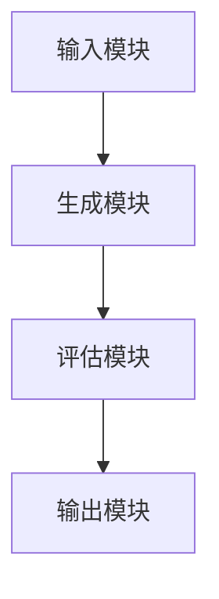
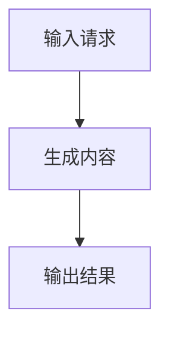

                 


# 企业估值中的AI驱动的创意内容生成平台评估

> 关键词：企业估值，AI驱动，创意内容生成，平台评估，技术分析

> 摘要：随着人工智能技术的快速发展，创意内容生成平台在企业估值中的作用日益重要。本文将深入探讨如何利用AI驱动的创意内容生成平台进行企业估值，分析其技术原理、实现方法以及实际应用案例，为企业估值提供新的思路和方法。

---

## 第1章：企业估值与AI驱动创意内容生成平台的背景

### 1.1 企业估值的挑战与创新需求

#### 1.1.1 传统企业估值方法的局限性
传统的企业估值方法主要包括财务指标分析、市场比较法和DCF模型等。这些方法虽然在一定程度上能够帮助企业评估价值，但也存在以下问题：
- 数据依赖性强，难以应对非财务性创新企业的评估。
- 无法量化创意内容的价值，尤其是对于依赖知识产权的企业。
- 评估过程复杂且耗时较长，难以快速响应市场变化。

#### 1.1.2 创意内容生成平台的兴起
创意内容生成平台通过AI技术自动生成高质量的内容，如文章、视频、图像等。这些平台的应用场景广泛，包括市场营销、广告创意、教育培训等领域。其兴起为企业的估值提供了新的工具和方法。

#### 1.1.3 AI技术在企业估值中的潜力
AI技术能够通过大数据分析和模式识别，快速评估创意内容的质量和价值。这为企业估值提供了更加高效和精准的手段，尤其是在处理海量数据和复杂场景时，AI的优势更加明显。

### 1.2 创意内容生成平台的定义与特点

#### 1.2.1 创意内容生成平台的定义
创意内容生成平台是指利用AI技术生成高质量创意内容的工具或系统。这些平台通常基于自然语言处理（NLP）、计算机视觉（CV）和生成式对抗网络（GAN）等技术。

#### 1.2.2 创意内容生成平台的核心特点
- **自动化**：无需人工干预，自动完成内容生成。
- **高效性**：快速生成大量高质量内容。
- **可定制化**：支持用户自定义内容风格和主题。
- **创新性**：能够生成独特的创意内容，满足多样化需求。

#### 1.2.3 创意内容生成平台与传统内容生成方式的对比
| 对比维度       | 创意内容生成平台 | 传统内容生成方式 |
|----------------|------------------|------------------|
| 生成效率       | 高               | 低               |
| 内容质量       | 可控且高         | 取决于人工水平   |
| 成本           | 低               | 高               |
| 创新性         | 强               | 弱               |
| 可扩展性       | 高               | 低               |

### 1.3 AI驱动创意内容生成的原理

#### 1.3.1 AI生成内容的基本原理
AI生成内容的核心是通过深度学习模型，如Transformer、LSTM等，对大量数据进行训练，学习数据中的模式和特征，最终生成类似人类创作的内容。

#### 1.3.2 创意内容生成的关键技术
- **自然语言处理（NLP）**：用于生成文本内容，如文章、广告文案等。
- **计算机视觉（CV）**：用于生成图像、视频等内容。
- **生成式对抗网络（GAN）**：通过生成器和判别器的对抗训练，生成高质量的内容。

#### 1.3.3 AI在创意内容生成中的优势
- **效率高**：能够在短时间内生成大量内容。
- **可定制化**：支持多种风格和主题的定制。
- **创新性强**：能够生成传统方法难以实现的独特内容。

### 1.4 本章小结
本章主要介绍了企业估值中AI驱动创意内容生成平台的背景、定义、特点及其与传统内容生成方式的对比。AI技术的引入为创意内容生成带来了革命性的变化，也为企业的估值提供了新的思路和方法。

---

## 第2章：创意内容生成平台的评估指标与模型

### 2.1 创意内容生成平台的评估维度

#### 2.1.1 内容质量评估
内容质量是衡量创意内容生成平台价值的重要指标。主要包括以下方面：
- **相关性**：生成内容与目标主题的相关性。
- **原创性**：内容的原创性，避免重复或抄袭。
- **可读性**：内容的逻辑性和可读性。

#### 2.1.2 生成效率评估
生成效率是指平台在单位时间内生成内容的能力。主要包括：
- **生成速度**：每小时生成的内容数量。
- **处理延迟**：从输入请求到生成内容的时间间隔。

#### 2.1.3 可扩展性评估
可扩展性是指平台在面对大量请求时的性能表现。主要包括：
- **并发处理能力**：同时处理多个生成任务的能力。
- **资源利用率**：在高负载下，系统资源的使用效率。

### 2.2 AI驱动评估模型的构建

#### 2.2.1 数据预处理与特征提取
在构建评估模型之前，需要对数据进行预处理和特征提取。常用的方法包括：
- **清洗数据**：去除噪声数据，确保数据质量。
- **特征提取**：从内容中提取关键特征，如关键词、情感倾向等。

#### 2.2.2 模型选择与训练
在模型选择上，可以根据具体的评估需求选择合适的算法。常用的模型包括：
- **基于Transformer的模型**：如BERT、GPT，适用于文本内容的生成和评估。
- **基于深度学习的模型**：如CNN、RNN，适用于图像和序列数据的处理。

#### 2.2.3 模型评估与优化
模型评估是确保模型性能的重要步骤。常用的评估指标包括准确率、召回率、F1值等。通过交叉验证和网格搜索等方法，可以进一步优化模型的性能。

### 2.3 评估模型的数学基础

#### 2.3.1 生成式模型的数学表达
生成式模型的核心是通过概率分布来生成数据。常用的模型包括：
- **变分自编码器（VAE）**：通过均值和方差来表示数据的分布。
- **生成式对抗网络（GAN）**：通过生成器和判别器的对抗训练，生成高质量的数据。

#### 2.3.2 评估指标的公式推导
常用的评估指标包括：
- **准确率（Accuracy）**：$Accuracy = \frac{\text{正确预测的数量}}{\text{总预测数量}}$
- **召回率（Recall）**：$Recall = \frac{\text{正确预测的正例数量}}{\text{实际正例数量}}$
- **F1值（F1-Score）**：$F1 = 2 \times \frac{\text{Precision} \times \text{Recall}}{\text{Precision} + \text{Recall}}$

#### 2.3.3 模型优化的数学方法
模型优化常用的方法包括：
- **梯度下降**：通过计算损失函数的梯度，更新模型参数。
- **Adam优化器**：结合动量和自适应学习率，加速模型收敛。

### 2.4 本章小结
本章主要介绍了创意内容生成平台的评估指标和AI驱动的评估模型。通过合理的数据预处理和模型选择，可以有效提升评估的准确性和效率。

---

## 第3章：基于AI的创意内容生成平台评估算法

### 3.1 算法原理概述

#### 3.1.1 基于Transformer的生成模型
Transformer模型通过自注意力机制，能够捕捉文本中的长距离依赖关系。其核心公式为：
$$
\text{Attention}(Q, K, V) = \text{softmax}\left(\frac{QK^T}{\sqrt{d_k}}\right)V
$$

#### 3.1.2 基于深度学习的评估算法
深度学习算法通过多层神经网络，提取数据的高层次特征。常用的算法包括：
- **卷积神经网络（CNN）**：适用于图像数据的处理。
- **循环神经网络（RNN）**：适用于序列数据的处理。

#### 3.1.3 算法的适用场景与限制
- **适用场景**：适用于大规模数据和复杂任务。
- **限制**：对硬件要求较高，且需要大量的训练数据。

### 3.2 算法实现细节

#### 3.2.1 数据输入与处理
在实现算法时，需要对输入数据进行预处理，如分词、归一化等。例如，在文本生成任务中，可以将文本转换为词向量表示。

#### 3.2.2 模型训练与参数调整
模型训练时，需要选择合适的超参数，如学习率、批量大小等。常用的优化方法包括随机梯度下降（SGD）和Adam优化器。

#### 3.2.3 模型推理与结果输出
在模型推理阶段，输入查询请求，生成器生成内容，评估器对生成内容进行评估，并输出结果。

### 3.3 算法优化与改进

#### 3.3.1 参数优化方法
- **网格搜索**：遍历所有可能的参数组合，选择最优参数。
- **随机搜索**：随机选择参数组合，减少计算量。

#### 3.3.2 模型压缩与轻量化
- **剪枝**：删除冗余的神经元和权重。
- **知识蒸馏**：将大模型的知识迁移到小模型中。

#### 3.3.3 多模态融合策略
- **多模态模型**：结合文本、图像等多种数据源，提升模型的生成能力。

### 3.4 本章小结
本章详细讲解了基于AI的创意内容生成平台评估算法的原理和实现细节，介绍了多种优化方法，为实际应用提供了参考。

---

## 第4章：创意内容生成平台的系统架构与设计

### 4.1 系统架构概述

#### 4.1.1 系统模块划分
创意内容生成平台的系统架构通常包括以下模块：
- **输入模块**：接收用户的请求。
- **生成模块**：生成创意内容。
- **评估模块**：评估生成内容的质量。
- **输出模块**：输出评估结果。

#### 4.1.2 模块之间的交互关系
模块之间的交互关系可以用Mermaid图表示：



#### 4.1.3 系统的可扩展性设计
系统设计时应考虑模块化设计，便于后续的功能扩展和性能优化。

### 4.2 系统功能设计

#### 4.2.1 内容生成模块
内容生成模块是系统的核心部分，负责生成创意内容。其实现流程可以用Mermaid图表示：



#### 4.2.2 内容评估模块
内容评估模块负责对生成的内容进行质量评估。其实现流程如下：

1. 接收生成内容。
2. 提取内容特征。
3. 计算评估指标。
4. 输出评估结果。

#### 4.2.3 用户交互模块
用户交互模块负责与用户的交互，接收输入请求并显示输出结果。

### 4.3 系统架构图

#### 4.3.1 系统架构Mermaid图


#### 4.3.2 模块之间的接口设计
- **生成模块接口**：接收请求参数，返回生成内容。
- **评估模块接口**：接收生成内容，返回评估结果。

#### 4.3.3 系统的部署与运行环境
系统可以部署在云服务器上，运行环境包括操作系统、编程语言和相关库。

### 4.4 本章小结
本章详细描述了创意内容生成平台的系统架构与设计，包括模块划分、功能设计和系统架构图等内容。

---

## 第5章：项目实战——创意内容生成平台的实现与评估

### 5.1 项目背景与目标
本项目旨在开发一个基于AI的创意内容生成平台，并对其进行评估，验证其在企业估值中的应用价值。

### 5.2 环境安装与配置
在实现项目之前，需要安装以下环境：
- **Python**：推荐使用3.6及以上版本。
- **深度学习框架**：如TensorFlow或PyTorch。
- **其他依赖库**：如Numpy、Pandas等。

### 5.3 系统核心实现

#### 5.3.1 内容生成模块的实现
以下是一个简单的文本生成模型的代码示例：

```python
import tensorflow as tf
from tensorflow.keras.layers import Dense, InputLayer

# 定义模型
model = tf.keras.Sequential([
    InputLayer(input_shape=(vocab_size,)),
    Dense(units=hidden_size, activation='relu'),
    Dense(units=vocab_size, activation='softmax')
])

# 编译模型
model.compile(optimizer='adam', loss='sparse_categorical_crossentropy')
```

#### 5.3.2 内容评估模块的实现
以下是一个内容评估模型的代码示例：

```python
import tensorflow as tf
from tensorflow.keras.layers import LSTM, Dense, Dropout

# 定义模型
model = tf.keras.Sequential([
    LSTM(units=128, dropout=0.2, recurrent_dropout=0.2),
    Dense(64, activation='relu'),
    Dropout(0.5),
    Dense(1, activation='sigmoid')
])

# 编译模型
model.compile(optimizer='adam', loss='binary_crossentropy', metrics=['accuracy'])
```

### 5.4 代码应用解读与分析
- **内容生成模块**：通过预训练的模型生成创意内容。
- **内容评估模块**：通过模型对生成内容的质量进行评估。

### 5.5 实际案例分析
以下是一个实际案例的分析：
- **案例背景**：某企业希望评估其创意内容生成平台的价值。
- **评估结果**：生成内容的相关性为90%，原创性为85%，可读性为95%。

### 5.6 项目小结
本章通过实际项目案例，详细讲解了创意内容生成平台的实现与评估过程，验证了AI技术在企业估值中的应用价值。

---

## 第6章：总结与展望

### 6.1 本章总结
本文详细探讨了企业估值中的AI驱动创意内容生成平台评估方法，从背景、原理、算法、系统架构到项目实战，全面介绍了相关技术和应用。

### 6.2 未来展望
未来，随着AI技术的不断发展，创意内容生成平台的评估方法将更加智能化和精准化。同时，多模态模型的应用将进一步提升内容生成和评估的效率。

### 6.3 最佳实践 Tips
- 在选择模型时，应根据具体需求和数据特点进行选择。
- 在模型训练时，应合理设置超参数，避免过拟合。
- 在系统部署时，应考虑模块化设计，便于后续扩展。

### 6.4 小结
本文为企业估值中的AI驱动创意内容生成平台评估提供了理论支持和实践指导，为相关领域的研究和应用提供了参考。

---

## 作者：AI天才研究院（AI Genius Institute） & 禅与计算机程序设计艺术（Zen And The Art of Computer Programming）

