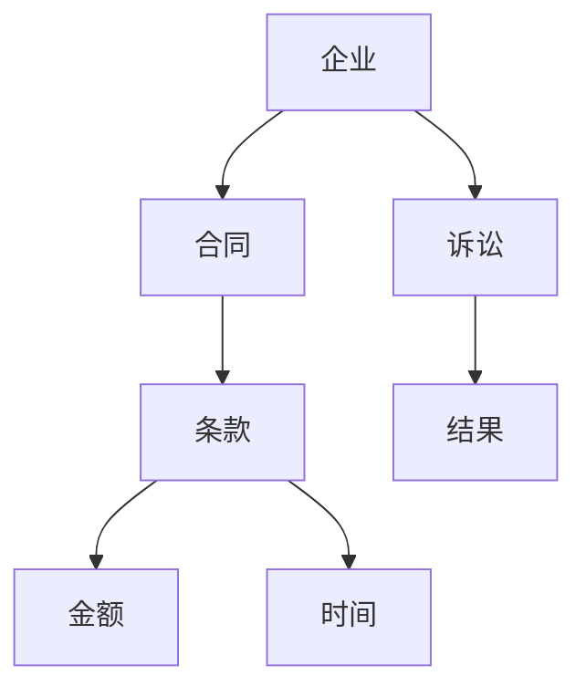
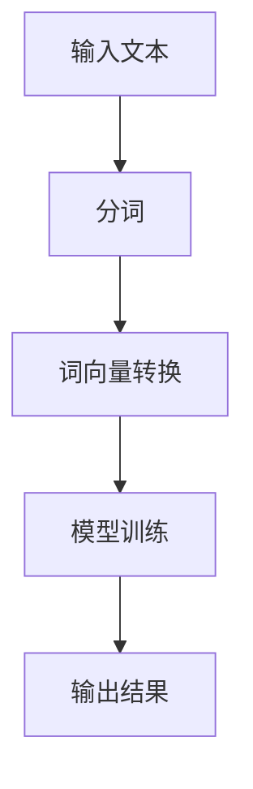
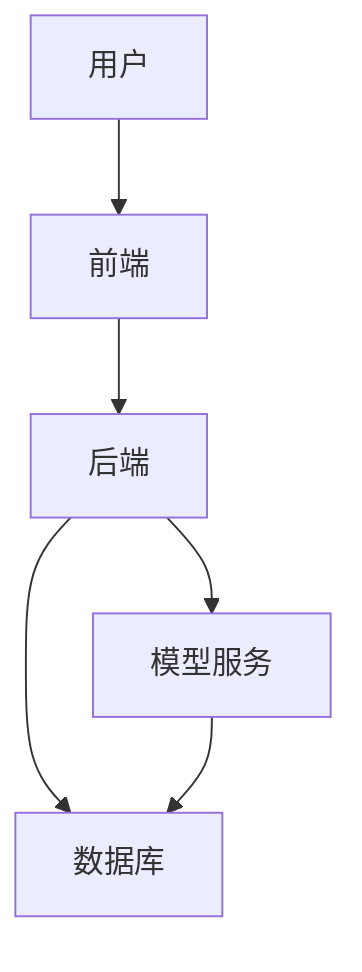

                 


# 企业估值中的AI驱动的法律文件分析平台评估

> 关键词：企业估值，AI驱动，法律文件分析，自然语言处理（NLP），机器学习

> 摘要：本文探讨了在企业估值过程中，如何利用AI技术对法律文件进行高效分析。通过分析法律文件中的关键条款和财务数据，AI驱动的法律文件分析平台能够提取有价值的信息，为企业的价值评估提供更精准的数据支持。本文详细介绍了法律文件分析平台的构建过程，包括自然语言处理技术的应用、机器学习模型的训练，以及系统架构设计等内容，旨在为企业估值提供一种高效、准确的方法。

---

## 第一部分: 企业估值中的AI驱动的法律文件分析平台概述

### 第1章: 企业估值与法律文件分析的背景

#### 1.1 企业估值的重要性

- **1.1.1 企业估值的基本概念**
  企业估值是指对企业整体价值的评估，通常用于企业并购、融资、上市等场景。准确的估值需要综合考虑财务数据、市场环境、法律风险等多个因素。

- **1.1.2 传统企业估值方法的局限性**
  传统估值方法依赖于财务报表分析和行业经验，但忽略了法律文件中的隐含信息，如合同条款、诉讼记录等，可能导致估值偏差。

- **1.1.3 法律文件在企业估值中的作用**
  法律文件（如合同、诉讼记录、知识产权声明）中包含的关键信息可能影响企业的财务状况和市场地位，从而影响估值结果。

#### 1.2 法律文件分析的挑战

- **1.2.1 法律文件的复杂性**
  法律文件通常包含大量专业术语和复杂结构，人工分析耗时且容易出错。

- **1.2.2 人工分析的低效性**
  靠手动提取信息不仅效率低下，而且难以处理海量数据。

- **1.2.3 数据量与信息提取的难点**
  法律文件数量多，格式多样，如何高效提取关键信息是一个技术难题。

#### 1.3 AI驱动的法律文件分析的潜力

- **1.3.1 AI在法律文本处理中的优势**
  AI技术能够快速处理大量文本，提取关键信息，提高分析效率。

- **1.3.2 法律文件分析对企业的价值**
  通过AI分析法律文件，可以提取潜在的法律风险和商业机会，为估值提供更全面的数据支持。

- **1.3.3 当前技术的可行性与发展趋势**
  随着NLP和机器学习技术的进步，AI驱动的法律文件分析正在逐步从理论走向实际应用。

#### 1.4 本章小结

- **1.4.1 核心问题的总结**
  企业估值需要全面考虑法律文件中的信息，而传统方法在处理这些信息时存在效率和准确性的问题。

- **1.4.2 后续章节的逻辑框架**
  本文将从法律文件分析平台的核心概念、算法原理、系统架构到项目实战，逐步展开讨论。

---

### 第2章: 法律文件分析平台的核心概念与联系

#### 2.1 核心概念原理

- **2.1.1 自然语言处理（NLP）的基本原理**
  NLP通过语义分析和实体识别等技术，将文本数据转化为结构化的信息。

- **2.1.2 机器学习在法律文本分析中的应用**
  使用机器学习模型对法律文本进行分类、情感分析和信息抽取。

- **2.1.3 法律文件分析的流程与阶段**
  包括数据采集、预处理、模型训练和结果分析四个阶段。

#### 2.2 核心概念属性对比表

| 特征         | 法律文件       | 普通文本     |
|--------------|----------------|--------------|
| 专业术语      | 高             | 低           |
| 文本结构      | 复杂           | 简单         |
| 信息密度      | 高             | 中           |
| 分析难度      | 高             | 低           |

#### 2.3 ER实体关系图



#### 2.4 本章小结

- **2.4.1 核心概念的系统性总结**
  法律文件分析涉及NLP、机器学习和法律知识的结合。

- **2.4.2 后续章节的理论支撑**
  本章内容为后续算法实现和系统设计提供了理论基础。

---

### 第3章: 法律文件分析平台的算法原理

#### 3.1 算法原理概述

- **3.1.1 基于NLP的文本处理流程**
  包括分词、句法分析和语义理解。

- **3.1.2 机器学习模型的分类与选择**
  根据任务需求选择合适的模型，如支持向量机（SVM）和深度学习模型。

- **3.1.3 法律文件分析的特征提取方法**
  通过关键词提取和实体识别提取关键信息。

#### 3.2 算法实现



```python
import tensorflow as tf
from tensorflow.keras import layers

# 数据预处理
def preprocess(text):
    # 分词处理
    words = tf.text.split(text, sep=" ")
    return words

# 模型训练
def train_model(train_data, train_labels):
    model = tf.keras.Sequential([
        layers.Embedding(input_dim=10000, output_dim=16),
        layers.GlobalAveragePooling1D(),
        layers.Dense(1, activation='sigmoid')
    ])
    model.compile(optimizer='adam', loss='binary_crossentropy', metrics=['accuracy'])
    model.fit(train_data, train_labels, epochs=10, batch_size=32)
    return model

# 应用案例
text = "违约条款 违约金 100万"
model = train_model(...)
result = model.predict(preprocess(text))
print(result)
```

#### 3.3 数学模型和公式

- **遮蔽词任务（MLM）**
  $$ P(\text{word}_i | \text{mask}, \text{context}) $$

- **下文预测任务（CLM）**
  $$ P(\text{sequence}) = \prod_{i=1}^{n} P(\text{word}_i | \text{sequence}_{i-1}) $$

---

## 第四部分: 系统分析与架构设计方案

### 第4章: 系统分析与架构设计

#### 4.1 系统功能设计

- **数据采集模块**
  从企业提供的法律文件中提取文本数据。

- **数据预处理模块**
  对文本进行清洗和分词处理。

- **模型训练模块**
  使用预处理的数据训练法律文本分类模型。

- **结果分析模块**
  输出模型分析结果并生成估值报告。

#### 4.2 系统架构设计



---

## 第五部分: 项目实战

### 第5章: 项目实战

#### 5.1 环境安装

```bash
pip install tensorflow==2.4.0
pip install tensorflow.keras==2.4.0
pip install numpy==1.19.2
```

#### 5.2 系统核心实现源代码

```python
import tensorflow as tf
from tensorflow.keras import layers

def build_model(vocab_size):
    model = tf.keras.Sequential([
        layers.Embedding(input_dim=vocab_size, output_dim=16),
        layers.GlobalAveragePooling1D(),
        layers.Dense(1, activation='sigmoid')
    ])
    return model

def main():
    # 数据准备
    train_data = ...
    train_labels = ...
    vocab_size = 10000
    model = build_model(vocab_size)
    model.compile(optimizer='adam', loss='binary_crossentropy', metrics=['accuracy'])
    model.fit(train_data, train_labels, epochs=10, batch_size=32)
    model.save('legal_analysis_model.h5')

if __name__ == "__main__":
    main()
```

#### 5.3 实际案例分析

- **案例背景**
  某企业合同中存在多个违约条款，可能影响企业的信用评估。

- **分析过程**
  使用训练好的模型分析合同中的违约条款，提取关键信息并生成估值报告。

- **结果解读**
  根据模型分析结果，调整企业的估值系数，提供更准确的估值建议。

---

## 第六部分: 最佳实践与总结

### 第6章: 最佳实践

- **技术实现**
  使用预训练模型（如BERT）提升模型的通用性和准确性。

- **数据处理**
  结合领域知识优化特征提取，提高模型的泛化能力。

- **系统优化**
  通过分布式计算和缓存技术提升系统的处理效率。

### 6.2 小结

- **核心要点回顾**
  本文详细介绍了AI驱动的法律文件分析平台在企业估值中的应用，涵盖了从理论到实践的全过程。

- **未来展望**
  随着AI技术的进步，法律文件分析将更加智能化和自动化，为企业估值提供更强大的支持。

### 6.3 注意事项

- **数据隐私**
  在处理法律文件时，需严格遵守数据隐私保护法规。

- **模型更新**
  定期更新模型以适应新的法律条款和企业需求。

- **团队协作**
  法律专家与技术团队需紧密合作，确保模型的准确性和实用性。

### 6.4 拓展阅读

- **推荐书籍**
  - 《Python机器学习实战》
- **推荐论文**
  - "BERT: Pre-training of Deep Bidirectional Transformers for NLP"

---

## 作者：AI天才研究院/AI Genius Institute & 禅与计算机程序设计艺术 /Zen And The Art of Computer Programming

---

这篇文章详细探讨了AI驱动的法律文件分析平台在企业估值中的应用，通过理论与实践的结合，展示了如何利用先进的NLP和机器学习技术，提高企业估值的准确性和效率。

