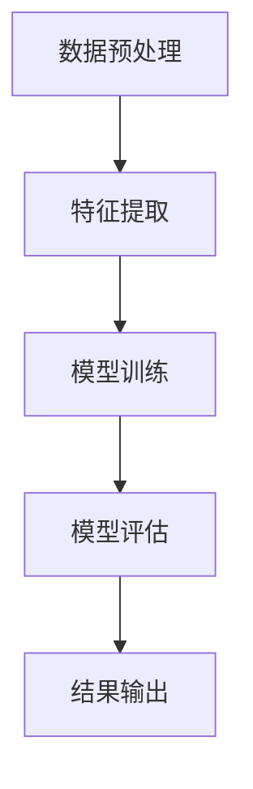
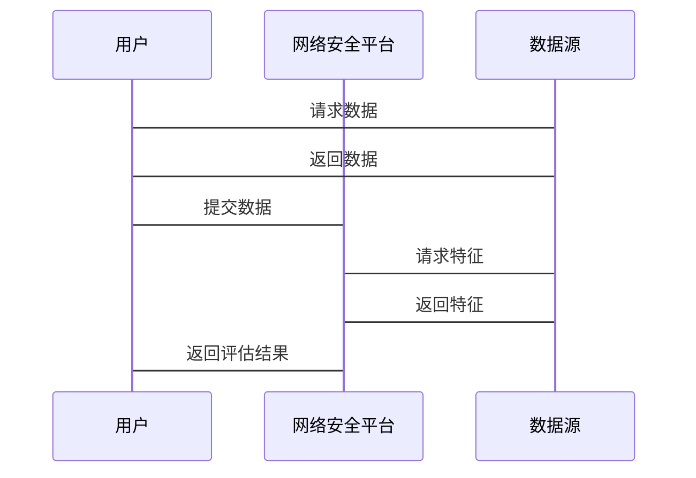

                 


```markdown
# 企业估值中的AI驱动的网络安全平台评估

## 关键词
企业估值, 网络安全, AI驱动, 网络安全平台, 人工智能, 算法原理, 系统架构

## 摘要
本文系统地探讨了AI驱动的网络安全平台在企业估值中的应用。首先介绍了企业估值和网络安全的基本概念，分析了AI技术在网络安全评估中的作用。接着深入讲解了AI驱动的网络安全评估的核心概念，包括数据驱动方法、机器学习算法和数学模型。然后详细阐述了算法原理和系统架构设计，包括系统功能设计、架构图和交互流程。最后通过实战案例展示了如何实现网络安全评估，并总结了最佳实践和未来趋势。

---

## 第1章: 企业估值与网络安全平台的背景

### 1.1 企业估值的基本概念
#### 1.1.1 企业估值的定义与方法
企业估值是通过对企业各项资产、负债、盈利能力等进行评估，确定企业价值的过程。传统方法包括DCF模型、市盈率法等，但这些方法难以量化网络安全这一隐性资产的影响。

#### 1.1.2 网络安全在企业估值中的重要性
网络安全已成为企业的重要资产，直接关系到企业的声誉、客户信任和财务安全。近年来，数据泄露事件频发，网络安全问题对企业估值的影响日益显著。

#### 1.1.3 AI驱动的网络安全平台的兴起
传统网络安全评估方法依赖人工经验，效率低下且容易出错。AI技术的应用使网络安全评估更加智能化、自动化，能够实时分析海量数据，发现潜在威胁。

---

### 1.2 网络安全平台的基本原理
#### 1.2.1 网络安全的基本概念
网络安全是指保护网络系统免受未经授权的访问、破坏和数据泄露的技术。网络安全平台通过整合多种技术手段，实现对网络的安全防护。

#### 1.2.2 网络安全平台的功能与作用
网络安全平台的功能包括入侵检测、漏洞扫描、流量监控等，其作用是保护企业数据安全，降低网络安全风险。

#### 1.2.3 AI技术在网络安全中的应用
AI技术通过机器学习算法分析网络流量、用户行为等数据，识别异常模式，预测潜在威胁，从而提升网络安全防护能力。

---

## 第2章: AI驱动的网络安全评估核心概念

### 2.1 核心概念与原理
#### 2.1.1 数据驱动的网络安全评估
数据是AI驱动网络安全评估的基础，通过收集和分析网络日志、流量数据等，提取特征用于模型训练。

#### 2.1.2 AI算法在网络安全中的应用
常用的AI算法包括支持向量机（SVM）、随机森林（Random Forest）和神经网络等。这些算法能够从大量数据中发现隐藏的模式和威胁。

#### 2.1.3 网络安全评估的数学模型
数学模型是AI驱动网络安全评估的核心，通过构建分类或回归模型，对网络安全风险进行量化评估。

### 2.2 核心概念对比表
| 对比维度 | 传统网络安全评估 | AI驱动网络安全评估 |
|----------|------------------|---------------------|
| 方法     | 基于规则         | 基于机器学习       |
| 效率     | 低               | 高                 |
| 准确率   | 中               | 高                 |

### 2.3 网络安全评估的ER实体关系图
```mermaid
er
    entity 网络安全平台 {
        id
        name
        version
        description
    }
    entity 网络日志 {
        id
        timestamp
        sourceIP
        destinationIP
        message
        platform_id
    }
    entity 用户行为 {
        id
        userId
        timestamp
        action
        platform_id
    }
    网络安全平台 <--( 网络日志 )
    网络安全平台 <--( 用户行为 )
```

---

## 第3章: 网络安全评估的算法原理

### 3.1 机器学习在网络安全中的应用
#### 3.1.1 机器学习的基本概念
机器学习是AI的核心技术，通过训练模型从数据中学习规律，用于分类、回归等任务。

#### 3.1.2 常见的机器学习算法在网络安全中的应用
- 支持向量机（SVM）：用于分类任务，如恶意软件检测。
- 随机森林：用于特征重要性分析，如攻击行为识别。
- 神经网络：用于深度学习，如流量异常检测。

### 3.2 网络安全评估的数学模型
#### 3.2.1 分类问题的数学模型
分类问题通过逻辑回归或SVM实现，公式如下：
$$ P(y=1|x) = \frac{e^{\beta x}}{1 + e^{\beta x}} $$
其中，$\beta$ 是模型参数，$x$ 是输入特征。

#### 3.2.2 回归问题的数学模型
回归问题通过线性回归实现，公式如下：
$$ y = \beta_0 + \beta_1 x_1 + \beta_2 x_2 + \dots + \beta_n x_n + \epsilon $$
其中，$y$ 是目标变量，$\beta_i$ 是模型参数，$\epsilon$ 是误差项。

### 3.3 算法流程图


---

## 第4章: 网络安全评估的系统架构设计

### 4.1 系统分析与设计
#### 4.1.1 系统功能设计
系统功能包括数据采集、特征提取、模型训练、结果输出等。

#### 4.1.2 系统架构设计
系统架构采用分层设计，包括数据层、逻辑层和应用层。

#### 4.1.3 系统接口设计
系统接口包括数据输入接口、模型调用接口和结果输出接口。

### 4.2 系统交互流程


---

## 第5章: 项目实战

### 5.1 环境安装
安装Python、TensorFlow、Scikit-learn等工具，配置开发环境。

### 5.2 核心功能实现
编写代码实现数据预处理、特征提取、模型训练和评估。

### 5.3 代码实现与解读
```python
import pandas as pd
from sklearn.model_selection import train_test_split
from sklearn.svm import SVC

# 数据加载
data = pd.read_csv('network_logs.csv')

# 特征提取
X = data.drop('label', axis=1)
y = data['label']

# 数据分割
X_train, X_test, y_train, y_test = train_test_split(X, y, test_size=0.2)

# 模型训练
model = SVC()
model.fit(X_train, y_train)

# 模型评估
score = model.score(X_test, y_test)
print(f"模型准确率：{score}")
```

### 5.4 实际案例分析
以某企业为例，分析其网络安全风险，并提出改进建议。

### 5.5 项目小结
总结项目实现过程中的经验教训，提出改进建议。

---

## 第6章: 最佳实践与小结

### 6.1 最佳实践
- 数据预处理是关键，需仔细清洗和特征工程。
- 选择合适的算法和模型参数，提升准确率。
- 定期更新模型，应对新型威胁。

### 6.2 小结
本文详细探讨了AI驱动的网络安全平台在企业估值中的应用，从理论到实践，全面分析了其核心概念、算法原理和系统架构设计。

### 6.3 注意事项
- 数据隐私保护需高度重视。
- 模型需定期更新，以应对新的威胁。

### 6.4 拓展阅读
推荐相关书籍和论文，供读者深入学习。

---

## 附录: 代码与工具

### 附录A: 代码实现
完整的Python代码示例，包括数据加载、特征提取、模型训练和评估。

### 附录B: 工具安装指南
如何安装和配置开发环境，包括Python、TensorFlow等工具的安装方法。

---

## 作者：AI天才研究院/AI Genius Institute & 禅与计算机程序设计艺术 /Zen And The Art of Computer Programming
```

