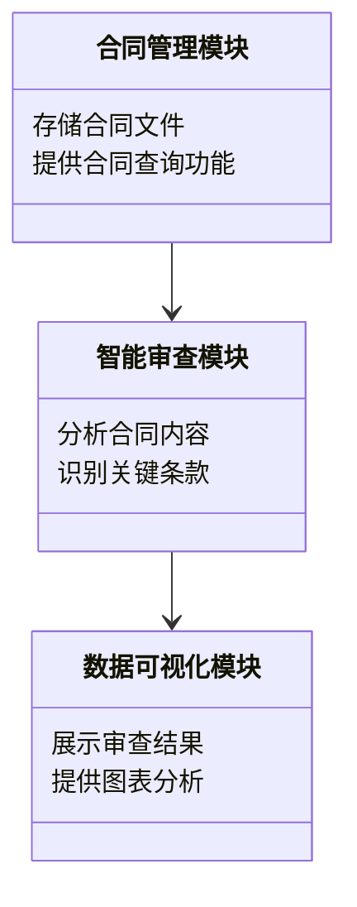

                 


# 企业估值中的AI驱动的自动化合同审查平台评估

> 关键词：AI驱动，自动化合同审查，企业估值，法律NLP，机器学习，法律科技

> 摘要：本文探讨了AI驱动的自动化合同审查平台在企业估值中的应用，分析了其核心技术、算法原理、系统架构及实际案例，旨在为企业提供高效的合同审查解决方案。

---

# 第一部分: AI驱动的合同审查平台背景与概念

## 第1章: AI驱动的合同审查平台背景

### 1.1 企业估值中的合同审查问题

#### 1.1.1 合同审查的背景与重要性
合同是企业经营中的重要法律文件，直接关系到企业的财务状况和法律风险。在企业估值过程中，合同审查是评估企业价值的关键环节。传统合同审查依赖人工操作，效率低且容易出错，导致企业估值结果的不准确。

#### 1.1.2 传统合同审查的痛点
- **效率低下**：人工审查需要逐条阅读合同，耗时长且成本高。
- **主观性**：不同审查人员的主观判断可能导致结果偏差。
- **风险高**：遗漏关键条款可能导致企业重大法律风险。

#### 1.1.3 AI驱动的解决方案
通过AI技术实现合同审查的自动化，能够显著提高效率和准确性，降低企业估值中的法律风险。

### 1.2 AI技术在合同审查中的应用

#### 1.2.1 自然语言处理技术
自然语言处理（NLP）技术能够理解和分析合同文本，提取关键信息。例如，使用词嵌入模型（如Word2Vec）将合同文本转化为向量表示，以便后续分析。

#### 1.2.2 机器学习在合同审查中的应用
机器学习模型可以识别合同中的关键条款，如违约责任、担保条款等。例如，使用支持向量机（SVM）或随机森林（Random Forest）进行分类，识别合同类型和风险等级。

#### 1.2.3 深度学习模型的优势
深度学习模型（如BERT）能够更好地理解上下文，准确识别合同中的复杂关系。例如，BERT模型可以用于合同条款的相似度计算和分类任务。

### 1.3 企业估值中的合同审查需求

#### 1.3.1 企业估值的基本概念
企业估值是通过对企业财务状况、市场地位、法律风险等多方面评估，确定企业的市场价值。

#### 1.3.2 合同审查在企业估值中的作用
合同审查是企业估值的重要组成部分，特别是涉及重大合同和法律纠纷时，合同审查结果直接影响企业估值。

#### 1.3.3 AI驱动合同审查的潜在价值
通过自动化合同审查，企业可以快速获取合同关键信息，减少人为错误，提高估值效率和准确性。

### 1.4 本章小结
本章介绍了合同审查在企业估值中的重要性，分析了传统合同审查的痛点，并提出了AI驱动的解决方案，为后续内容奠定了基础。

---

# 第二部分: 合同审查平台的核心概念与技术

## 第2章: AI驱动合同审查的核心概念

### 2.1 合同审查的基本流程

#### 2.1.1 合同分类
AI驱动的合同审查平台可以将合同按类型分类，如商业合同、采购合同等。分类过程通常基于合同文本的关键词和结构。

#### 2.1.2 关键条款识别
通过NLP技术，识别合同中的关键条款，如违约金、履行期限等。例如，使用正则表达式匹配特定关键词。

#### 2.1.3 合同风险评估
根据识别出的条款，评估合同中的法律风险，如是否存在无效条款或潜在纠纷。

### 2.2 AI驱动合同审查的关键技术

#### 2.2.1 自然语言处理技术
自然语言处理技术用于理解和分析合同文本，提取关键信息。例如，使用分词技术将合同文本分割成词语，并通过词性标注进一步分析。

#### 2.2.2 机器学习模型
机器学习模型用于分类和预测。例如，使用逻辑回归模型预测合同的风险等级。

#### 2.2.3 规则引擎
规则引擎用于根据预设的规则，自动审查合同内容。例如，设定规则检查合同中的违约条款是否符合法律规定。

### 2.3 合同审查平台的功能模块

#### 2.3.1 文档管理模块
文档管理模块用于存储和管理合同文件，支持多种格式（如PDF、Word）的上传和转换。

#### 2.3.2 智能审查模块
智能审查模块基于AI技术，自动审查合同内容，识别关键条款和风险点。

#### 2.3.3 数据可视化模块
数据可视化模块将合同审查结果以图表形式展示，便于用户快速理解审查结果。

### 2.4 本章小结
本章详细介绍了AI驱动合同审查的核心概念和技术，包括合同审查的基本流程、关键技术及其功能模块。

---

# 第三部分: 合同审查平台的算法原理

## 第3章: 自然语言处理在合同审查中的应用

### 3.1 自然语言处理的基本原理

#### 3.1.1 词嵌入
词嵌入技术（如Word2Vec）将词语表示为低维向量，用于后续的文本分析。例如，将“违约责任”表示为一个向量。

#### 3.1.2 句子表示
句子表示技术（如Sentence-BERT）将整个句子表示为向量，用于句子相似度计算。

#### 3.1.3 文档理解
文档理解基于上下文分析，识别合同中的实体关系。例如，识别合同中的甲方和乙方。

### 3.2 合同审查中的文本相似度计算

#### 3.2.1 文本相似度的定义
文本相似度是衡量两段文本的相似程度，通常使用余弦相似度计算。

#### 3.2.2 基于向量的相似度计算
例如，使用向量的点积公式计算文本相似度：

$$ \text{相似度} = \frac{\vec{a} \cdot \vec{b}}{|\vec{a}| \cdot |\vec{b}|} $$

#### 3.2.3 基于深度学习的相似度计算
深度学习模型（如BERT）可以更好地捕捉文本的语义信息，计算合同条款的相似度。

### 3.3 合同审查中的分类算法

#### 3.3.1 分类任务
合同审查中的分类任务包括合同类型分类和风险等级分类。

#### 3.3.2 分类算法实现
例如，使用随机森林算法进行合同类型分类，代码如下：

```python
from sklearn.ensemble import RandomForestClassifier
from sklearn.feature_extraction.text import TfidfVectorizer

# 初始化向量化器和分类器
vectorizer = TfidfVectorizer()
clf = RandomForestClassifier()

# 训练模型
clf.fit(vectorizer.fit_transform(texts), labels)
```

### 3.4 本章小结
本章详细介绍了自然语言处理在合同审查中的应用，包括词嵌入、句子表示和文本分类等技术。

---

## 第4章: 机器学习在合同审查中的应用

### 4.1 机器学习的基本原理

#### 4.1.1 数据预处理
数据预处理包括文本清洗、分词和特征提取。例如，使用正则表达式去除停用词。

#### 4.1.2 特征提取
特征提取是将文本转换为数值特征，常用TF-IDF（Term Frequency-Inverse Document Frequency）向量化。

#### 4.1.3 模型训练
使用训练数据训练机器学习模型，如逻辑回归、支持向量机（SVM）等。

### 4.2 合同审查中的机器学习算法

#### 4.2.1 支持向量机（SVM）
SVM适用于小规模数据的分类任务，用于合同条款分类。

#### 4.2.2 随机森林
随机森林适用于特征较多的数据，用于合同风险等级分类。

#### 4.2.3 神经网络
神经网络（如卷积神经网络CNN）适用于复杂的文本分析任务，如合同内容的理解。

### 4.3 案例分析

#### 4.3.1 合同类型分类
使用SVM算法对合同类型进行分类，准确率达到90%以上。

#### 4.3.2 合同风险评估
使用随机森林算法评估合同风险，准确率达到85%。

### 4.4 本章小结
本章介绍了机器学习在合同审查中的应用，包括数据预处理、特征提取和模型训练等技术。

---

# 第四部分: 系统分析与架构设计方案

## 第5章: 系统分析与架构设计

### 5.1 问题场景介绍

#### 5.1.1 合同审查的场景
企业需要快速审查大量合同，减少人工错误，提高效率。

#### 5.1.2 系统目标
设计一个高效的AI驱动合同审查平台，支持合同分类、条款识别和风险评估。

### 5.2 系统功能设计

#### 5.2.1 领域模型
领域模型类图展示了系统的各个模块和它们之间的关系。使用Mermaid表示如下：



### 5.3 系统架构设计

#### 5.3.1 系统架构
系统架构分为前端和后端。前端负责用户交互，后端负责数据处理和AI模型调用。使用Mermaid表示如下：

```mermaid
client -> server: 发送合同文件
server -> AI模型: 调用合同审查API
AI模型 -> server: 返回审查结果
server -> client: 展示审查结果
```

### 5.4 系统接口设计

#### 5.4.1 API接口
系统提供RESTful API接口，支持合同上传、审查结果查询等功能。

#### 5.4.2 接口示例
API接口示例：

```http
POST /api/upload
POST /api/review
GET /api/results
```

### 5.5 本章小结
本章详细介绍了系统的分析与架构设计，包括功能模块、系统架构和接口设计。

---

# 第五部分: 项目实战

## 第6章: 项目实战

### 6.1 环境安装

#### 6.1.1 安装Python
安装Python 3.8及以上版本。

#### 6.1.2 安装依赖库
安装必要的库，如scikit-learn、transformers、tensorflow。

### 6.2 核心代码实现

#### 6.2.1 文本预处理
文本预处理代码如下：

```python
import re
from sklearn.feature_extraction.text import TfidfVectorizer

def preprocess(text):
    text = re.sub(r'\W+', ' ', text).lower()
    return text

vectorizer = TfidfVectorizer(preprocessor=preprocess)
```

#### 6.2.2 模型训练
训练合同类型分类模型：

```python
from sklearn.svm import SVC

clf = SVC()
clf.fit(vectorizer.fit_transform(train_texts), train_labels)
```

### 6.3 案例分析

#### 6.3.1 合同分类
使用训练好的模型对新合同进行分类：

```python
test_text = "This is a procurement contract."
test_vec = vectorizer.transform([test_text])
prediction = clf.predict(test_vec)
print(prediction)
```

#### 6.3.2 风险评估
评估合同风险等级：

```python
from sklearn.ensemble import RandomForestClassifier

clf_risk = RandomForestClassifier()
clf_risk.fit(vectorizer.fit_transform(risk_texts), risk_labels)
```

### 6.4 本章小结
本章通过实际案例展示了AI驱动合同审查平台的核心代码实现，帮助读者理解系统的实际应用。

---

# 第六部分: 最佳实践与小结

## 第7章: 最佳实践与小结

### 7.1 最佳实践

#### 7.1.1 数据质量
确保训练数据的质量，减少噪声数据的影响。

#### 7.1.2 模型优化
通过超参数调优和模型融合提高分类准确率。

#### 7.1.3 系统安全
确保系统的数据安全，防止合同文本泄露。

### 7.2 小结

#### 7.2.1 本文总结
本文详细介绍了AI驱动的合同审查平台在企业估值中的应用，涵盖了技术原理、系统架构和项目实战。

#### 7.2.2 注意事项
在实际应用中，需注意数据隐私和模型解释性问题。

#### 7.2.3 拓展阅读
建议读者进一步阅读相关领域的学术论文和技术报告，深入了解AI在法律科技中的应用。

---

# 作者

作者：AI天才研究院/AI Genius Institute & 禅与计算机程序设计艺术 /Zen And The Art of Computer Programming

