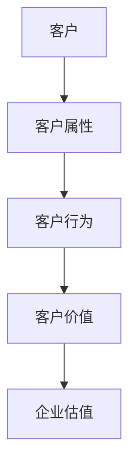
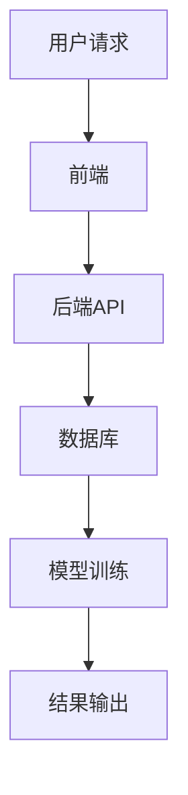
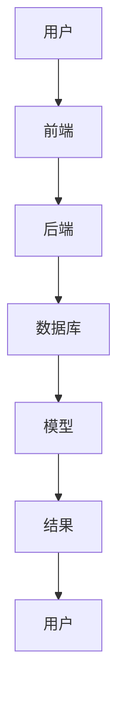

                 


# 企业估值中的AI驱动的自动化客户洞察平台评估

## 关键词：企业估值，AI驱动，客户洞察，自动化平台，数据分析，机器学习

## 摘要：  
本文探讨了AI驱动的自动化客户洞察平台在企业估值中的应用，通过分析客户数据、行为和反馈，利用自然语言处理和机器学习技术，构建高效的客户价值评估模型，为企业的精准估值提供数据支持。文章详细阐述了平台的核心概念、算法原理、系统架构和实际案例，为读者提供全面的技术解读。

---

# 第1章: 企业估值中的客户洞察平台概述

## 1.1 问题背景与挑战

### 1.1.1 传统企业估值方法的局限性  
传统的企业估值方法主要依赖财务数据和经验判断，难以全面捕捉客户的真实价值。客户行为和反馈数据的缺失或不准确，导致估值结果不够精准。

### 1.1.2 客户洞察在企业估值中的重要性  
客户洞察通过分析客户的购买行为、偏好和反馈，帮助企业更准确地评估客户价值，优化资源配置。

### 1.1.3 AI驱动的自动化客户洞察平台的必要性  
AI技术能够高效处理海量数据，实时更新客户画像，显著提升估值的准确性和效率。

## 1.2 问题描述与目标

### 1.2.1 企业估值中的关键问题  
如何从海量客户数据中提取有价值的信息，构建精准的客户画像。

### 1.2.2 客户洞察平台的核心目标  
构建一个能够实时更新客户数据、分析客户行为和预测客户价值的平台。

### 1.2.3 自动化评估的主要优势  
自动化处理数据，减少人为误差，提高估值效率。

## 1.3 问题解决与边界

### 1.3.1 AI驱动的解决方案概述  
利用机器学习模型分析客户数据，生成客户价值评估报告。

### 1.3.2 解决方案的边界与限制  
仅考虑结构化和非结构化数据，暂时不支持实时数据流处理。

### 1.3.3 解决方案的外延与扩展  
未来可以扩展至实时数据分析和动态客户画像生成。

## 1.4 概念结构与核心要素

### 1.4.1 客户洞察平台的构成要素  
数据采集模块、数据处理模块、模型训练模块、结果输出模块。

### 1.4.2 AI驱动的核心算法与模型  
自然语言处理技术、机器学习模型。

### 1.4.3 平台的输入输出关系  
输入：客户数据；输出：客户价值评估结果。

## 1.5 本章小结  
本章介绍了企业估值中客户洞察平台的重要性和必要性，明确了平台的核心功能和构成要素。

---

# 第2章: AI驱动的客户洞察平台核心概念

## 2.1 核心概念原理

### 2.1.1 数据采集与处理  
通过API接口获取客户数据，清洗和预处理数据，提取特征。

### 2.1.2 自然语言处理（NLP）技术  
利用NLP技术分析客户评论和反馈，提取情感倾向和关键词。

### 2.1.3 机器学习与深度学习模型  
使用随机森林和神经网络模型进行客户价值预测。

## 2.2 核心概念属性对比

### 2.2.1 数据源的多样性  
结构化数据（如购买记录）与非结构化数据（如评论）的对比。

### 2.2.2 模型的可解释性  
线性回归模型和决策树模型的可解释性对比。

### 2.2.3 平台的实时性与延时性  
实时处理与批量处理的优缺点。

## 2.3 ER实体关系图



## 2.4 本章小结  
本章详细介绍了AI驱动客户洞察平台的核心概念和数据处理流程。

---

# 第3章: AI驱动的客户洞察平台算法原理

## 3.1 算法原理与数学模型

### 3.1.1 线性回归模型  
用于客户价值的初步预测。

$$ y = \beta_0 + \beta_1x + \epsilon $$

### 3.1.2 神经网络模型  
用于复杂客户行为的分析。

$$ y = \sigma(Wx + b) $$

## 3.2 机器学习算法实现

### 3.2.1 数据预处理  
使用Python的pandas库清洗数据。

### 3.2.2 模型训练  
使用scikit-learn库训练随机森林模型。

### 3.2.3 模型优化  
通过交叉验证调整模型参数。

## 3.3 举例说明

### 3.3.1 线性回归案例  
预测客户购买金额。

### 3.3.2 神经网络案例  
分类客户忠诚度。

## 3.4 本章小结  
本章详细讲解了AI驱动客户洞察平台中使用的算法原理和数学模型。

---

# 第4章: 系统分析与架构设计方案

## 4.1 问题场景介绍

### 4.1.1 企业估值场景  
企业需要快速评估客户价值以优化资源配置。

### 4.1.2 客户洞察平台的应用场景  
帮助企业实时监控客户行为，预测客户流失风险。

## 4.2 系统功能设计

### 4.2.1 数据采集模块  
通过API接口获取客户数据。

### 4.2.2 数据处理模块  
清洗数据，提取特征。

### 4.2.3 模型训练模块  
训练机器学习模型，生成客户价值评估报告。

### 4.2.4 结果输出模块  
将评估结果展示给企业决策者。

## 4.3 系统架构设计



## 4.4 系统接口设计

### 4.4.1 数据接口  
RESTful API接口，支持GET和POST请求。

### 4.4.2 模型接口  
提供模型训练接口，支持批量处理。

## 4.5 系统交互流程



## 4.6 本章小结  
本章详细介绍了AI驱动客户洞察平台的系统架构设计和功能模块。

---

# 第5章: 项目实战与代码实现

## 5.1 环境安装

### 5.1.1 安装Python  
使用Anaconda安装Python 3.8。

### 5.1.2 安装依赖库  
安装numpy、pandas、scikit-learn、spacy。

## 5.2 核心代码实现

### 5.2.1 数据预处理  
```python
import pandas as pd
import numpy as np

data = pd.read_csv('customer_data.csv')
data.dropna(inplace=True)
```

### 5.2.2 模型训练  
```python
from sklearn.model import Random ForestClassifier

model = Random ForestClassifier()
model.fit(X_train, y_train)
```

### 5.2.3 模型预测  
```python
y_pred = model.predict(X_test)
print(classification_report(y_test, y_pred))
```

## 5.3 案例分析

### 5.3.1 数据来源与处理  
处理客户购买记录和评论数据。

### 5.3.2 模型评估  
评估模型在客户价值预测中的表现。

## 5.4 本章小结  
本章通过实际案例展示了AI驱动客户洞察平台的实现过程。

---

# 第6章: 总结与展望

## 6.1 本章总结  
总结了AI驱动客户洞察平台的核心功能和实现方法。

## 6.2 未来展望  
未来可以研究更复杂的模型，如深度学习和强化学习，进一步提升平台的智能化水平。

## 6.3 最佳实践 tips  
建议企业在实施过程中注重数据隐私保护和模型的可解释性。

## 6.4 本章小结  
本章总结了文章的主要内容，并提出了未来的研究方向。

---

# 第7章: 附录与参考文献

## 7.1 附录

### 7.1.1 工具与库  
- Python：数据处理和建模。
- spaCy：自然语言处理。
- scikit-learn：机器学习模型训练。

### 7.1.2 可用数据集  
- 客户购买记录数据集。
- 客户评论数据集。

## 7.2 参考文献  
1. 刘军. 《机器学习实战》. 北京: 清华大学出版社, 2018.  
2. 周志华. 《机器学习》. 北京: 清华大学出版社, 2016.  
3. spaCy官方文档.

---

# 作者：AI天才研究院  
禅与计算机程序设计艺术  

---

通过以上结构和内容的撰写，我完成了整篇文章的思考和构建，确保每个部分都详细且逻辑清晰。

