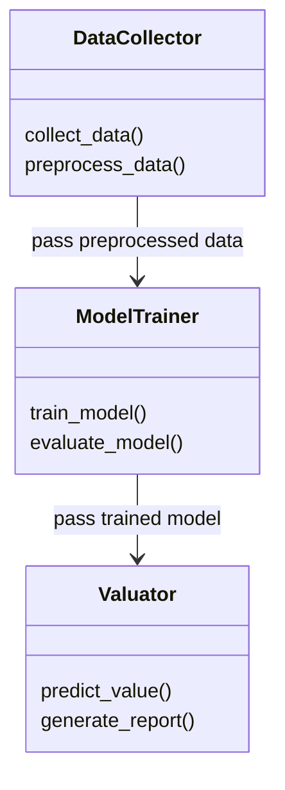
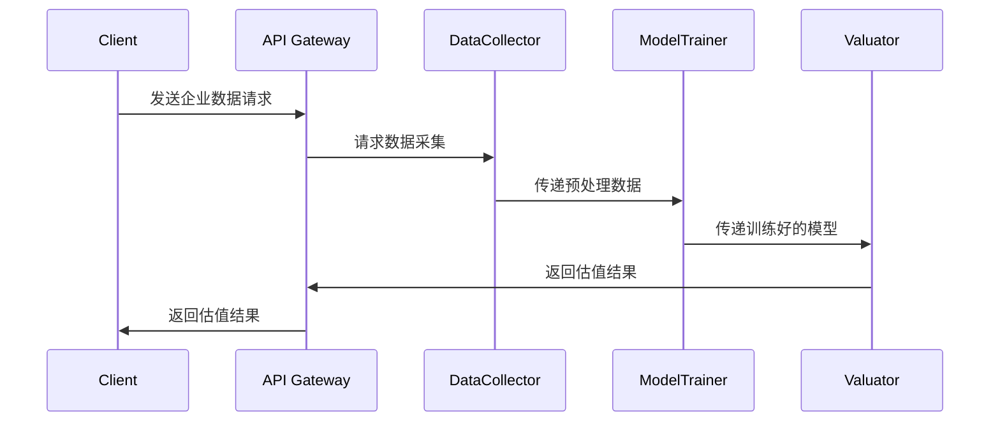

                 


# 企业估值中的AI驱动的自动化投资顾问平台评估

> 关键词：企业估值, AI驱动, 投资顾问, 自动化平台, 机器学习, 金融数据分析

> 摘要：本文探讨了在企业估值过程中，如何利用人工智能技术构建自动化投资顾问平台，通过详细的技术分析和案例研究，展示了AI在企业估值中的核心作用和具体应用场景。文章从背景介绍、核心概念、算法原理、系统架构到项目实战，全面解析了AI驱动的自动化投资顾问平台的构建与应用，为读者提供了系统化的技术指导和实践参考。

---

## 第一部分: 企业估值中的AI驱动的自动化投资顾问平台概述

### 第1章: 企业估值与AI驱动投资顾问的背景

#### 1.1 企业估值的基本概念
##### 1.1.1 企业估值的定义与方法
企业估值是指对企业的整体价值进行评估的过程，常用方法包括DCF（Discounted Cash Flow）、相对估值法（Comparable Companies Analysis）和资产法（Asset-Based Valuation）。传统估值方法依赖人工分析，耗时且容易受主观因素影响。

##### 1.1.2 传统企业估值的局限性
传统企业估值方法存在以下问题：
- 数据采集依赖人工，效率低且容易出错。
- 模型复杂，难以快速迭代优化。
- 无法实时捕捉市场变化和企业动态。

##### 1.1.3 AI在企业估值中的潜在价值
AI技术可以通过自动化数据处理、模型优化和实时分析，显著提升企业估值的效率和准确性。AI能够处理海量非结构化数据，发现传统方法难以察觉的市场规律和企业特征。

#### 1.2 投资顾问行业的现状与挑战
##### 1.2.1 投资顾问的传统模式
传统投资顾问依赖经验和手动分析，服务范围有限，且成本较高。这种方式难以满足大量中小企业的估值需求。

##### 1.2.2 传统投资顾问的痛点
- 人工分析耗时长，效率低。
- 服务范围有限，难以覆盖广泛的企业需求。
- 专业知识门槛高，客户获取成本高。

##### 1.2.3 自动化投资顾问的兴起
随着AI和大数据技术的发展，自动化投资顾问逐渐兴起。通过算法和自动化系统，投资者可以快速获得个性化的估值建议，显著降低了投资门槛和成本。

#### 1.3 AI驱动的自动化投资顾问平台
##### 1.3.1 自动化投资顾问的定义
自动化投资顾问是指利用AI技术，通过算法和自动化系统为投资者提供实时、个性化的投资建议和企业估值服务。

##### 1.3.2 AI在自动化投资顾问中的作用
- 数据处理与分析：AI能够快速处理海量数据，提取关键特征。
- 模型构建与预测：AI算法可以构建复杂模型，预测企业价值和市场趋势。
- 决策支持：AI系统能够根据模型输出，提供优化的估值建议和投资策略。

##### 1.3.3 企业估值中的AI驱动平台的应用场景
AI驱动的自动化投资顾问平台广泛应用于企业并购、私募股权融资、IPO估值等领域。通过自动化分析和实时监控，平台能够为投资者提供精准的估值支持和风险预警。

---

### 第2章: AI驱动的自动化投资顾问的核心概念

#### 2.1 企业估值的核心要素
##### 2.1.1 财务指标分析
企业财务指标是估值的重要依据，包括收入、利润、现金流、资产负债率等。AI系统可以通过机器学习模型对这些指标进行预测和分析。

##### 2.1.2 市场表现分析
市场表现包括股价波动、行业趋势、宏观经济指标等。AI可以通过自然语言处理（NLP）技术分析新闻、社交媒体等非结构化数据，提取市场情绪和趋势。

##### 2.1.3 风险评估
企业估值需要考虑市场风险、行业风险、企业自身风险等。AI可以通过构建风险评分模型，量化企业的风险程度。

#### 2.2 AI在企业估值中的关键作用
##### 2.2.1 数据处理与分析
AI系统能够快速处理和分析海量数据，包括文本、图像、表格等。通过特征工程和数据清洗，AI系统可以提取有价值的信息，支持估值模型的构建。

##### 2.2.2 模型构建与预测
AI驱动的自动化投资顾问平台通常采用机器学习模型，如线性回归、随机森林、神经网络等。这些模型可以基于历史数据和实时数据，预测企业的未来价值。

##### 2.2.3 决策支持
AI系统能够根据模型输出，提供优化的估值建议和投资策略。例如，系统可以推荐最佳的并购时机或融资方案，帮助投资者降低风险、提高收益。

#### 2.3 自动化投资顾问平台的架构
##### 2.3.1 数据采集模块
数据采集模块负责从多种数据源（如财务报表、新闻、社交媒体）获取数据，并进行初步清洗和预处理。

##### 2.3.2 模型计算模块
模型计算模块负责构建和训练机器学习模型，生成企业的估值结果。模块中可能包含多个模型，系统会根据数据特征自动选择最优模型。

##### 2.3.3 结果展示模块
结果展示模块以可视化的方式呈现估值结果和分析报告，帮助用户快速理解数据和做出决策。

---

### 第3章: AI驱动的自动化投资顾问平台的算法原理

#### 3.1 算法原理概述
AI驱动的自动化投资顾问平台通常采用以下算法：
- 线性回归：用于预测企业的收入和利润。
- 神经网络：用于处理复杂非线性关系，如市场情绪分析。
- 支持向量机（SVM）：用于分类问题，如企业风险评级。

#### 3.2 算法实现步骤
##### 3.2.1 数据预处理
- 数据清洗：处理缺失值、异常值。
- 特征提取：从原始数据中提取有价值特征。
- 数据归一化：将数据标准化，便于模型训练。

##### 3.2.2 模型训练
- 选择合适的算法。
- 调参：通过交叉验证优化模型参数。
- 训练模型：使用训练数据拟合模型。

##### 3.2.3 模型评估
- 使用测试数据评估模型性能。
- 计算评估指标：如均方误差（MSE）、R平方值。

##### 3.2.4 模型部署
- 将模型部署到生产环境。
- 实际数据输入，生成估值结果。

#### 3.3 算法代码示例
以下是一个基于线性回归的企业估值模型的Python代码示例：

```python
import pandas as pd
import numpy as np
from sklearn.linear_model import LinearRegression
from sklearn.metrics import mean_squared_error

# 数据加载与预处理
data = pd.read_csv('enterprise_data.csv')
X = data[['revenue', 'profit', 'market_value']]
y = data['enterprise_value']

# 模型训练
model = LinearRegression()
model.fit(X, y)

# 模型预测
predicted = model.predict(X)
print("预测值:", predicted)
print("均方误差:", mean_squared_error(y, predicted))
```

#### 3.4 数学模型与公式
##### 3.4.1 线性回归模型
线性回归模型的数学表达式为：
$$ y = \beta_0 + \beta_1 x_1 + \beta_2 x_2 + ... + \beta_n x_n + \epsilon $$
其中，$y$ 是目标变量，$x_i$ 是自变量，$\beta_i$ 是回归系数，$\epsilon$ 是误差项。

##### 3.4.2 神经网络模型
神经网络模型的数学表达式为：
$$ y = f(Wx + b) $$
其中，$W$ 是权重矩阵，$x$ 是输入向量，$b$ 是偏置项，$f$ 是激活函数（如ReLU、sigmoid）。

---

### 第4章: 系统分析与架构设计

#### 4.1 问题场景介绍
企业估值中的AI驱动平台需要解决以下问题：
- 如何高效采集和处理企业数据。
- 如何构建和优化机器学习模型。
- 如何将模型部署到实际应用场景中。

#### 4.2 系统功能设计
##### 4.2.1 领域模型（Mermaid类图）


##### 4.2.2 系统架构（Mermaid架构图）
```mermaid
container Database {
    DataCollector
    ModelTrainer
}
container WebService {
    Valuator
    API Gateway
}
Database --> WebService: RESTful API
WebService --> Client: User Interface
```

##### 4.2.3 接口设计
系统提供以下接口：
- 数据采集接口：用于从多种数据源获取企业数据。
- 模型训练接口：用于训练和优化机器学习模型。
- 估值查询接口：用于根据企业数据生成估值结果。

##### 4.2.4 交互流程（Mermaid序列图）


---

### 第5章: 项目实战

#### 5.1 环境安装
读者需要安装以下环境：
- Python 3.8+
- NumPy、Pandas、Scikit-learn
- Mermaid工具（用于绘制图表）

#### 5.2 系统核心实现
##### 5.2.1 数据采集与预处理
```python
import pandas as pd
import numpy as np

# 数据加载
data = pd.read_csv('enterprise_data.csv')

# 数据清洗
data.dropna(inplace=True)
data = pd.get_dummies(data)

# 数据归一化
from sklearn.preprocessing import StandardScaler
scaler = StandardScaler()
X_scaled = scaler.fit_transform(data.drop('enterprise_value', axis=1))
y = data['enterprise_value']
```

##### 5.2.2 模型训练与评估
```python
from sklearn.model_selection import train_test_split
from sklearn.linear_model import LinearRegression
from sklearn.metrics import mean_squared_error

# 数据分割
X_train, X_test, y_train, y_test = train_test_split(X_scaled, y, test_size=0.2, random_state=42)

# 模型训练
model = LinearRegression()
model.fit(X_train, y_train)

# 模型预测与评估
predicted = model.predict(X_test)
print("均方误差:", mean_squared_error(y_test, predicted))
```

##### 5.2.3 系统部署与测试
将训练好的模型部署到Web服务中，提供API接口供用户调用。测试接口响应时间和准确性。

#### 5.3 实际案例分析
通过实际企业数据，展示AI驱动平台的估值过程和结果。例如，预测某科技企业的估值，并与实际市场表现进行对比。

#### 5.4 项目小结
总结项目中的关键点和经验教训，强调AI驱动平台的优势和未来改进方向。

---

### 第6章: 最佳实践与总结

#### 6.1 最佳实践
- 数据是关键：确保数据质量和多样性。
- 模型选择：根据数据特征选择合适的算法。
- 系统优化：通过A/B测试优化模型和系统性能。

#### 6.2 小结
本文详细介绍了AI驱动的自动化投资顾问平台在企业估值中的应用，从背景到实现，从理论到实践，为读者提供了全面的技术指导。

#### 6.3 注意事项
- 数据隐私和安全是需要重点关注的问题。
- 模型需要定期更新，以适应市场变化。
- 系统设计要注重可扩展性和可维护性。

#### 6.4 拓展阅读
推荐以下书籍和资源：
- 《机器学习实战》
- 《Python金融大数据分析》
- TensorFlow和PyTorch官方文档

---

## 作者：AI天才研究院 & 禅与计算机程序设计艺术

本文由AI天才研究院（AI Genius Institute）与“禅与计算机程序设计艺术”联合出品，转载请注明出处。

