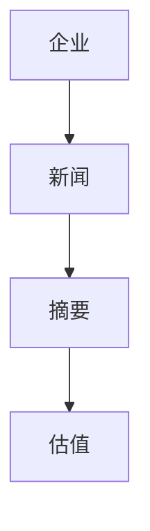
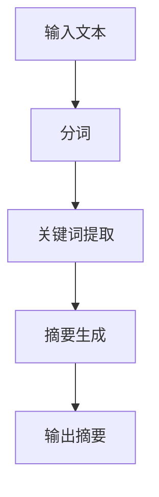
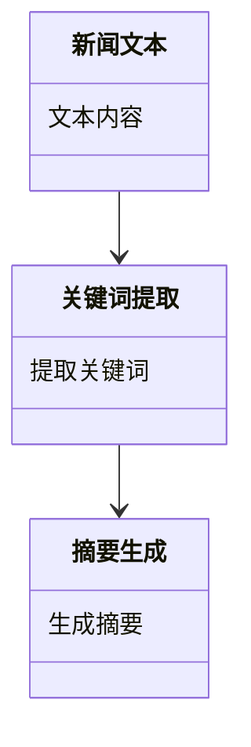
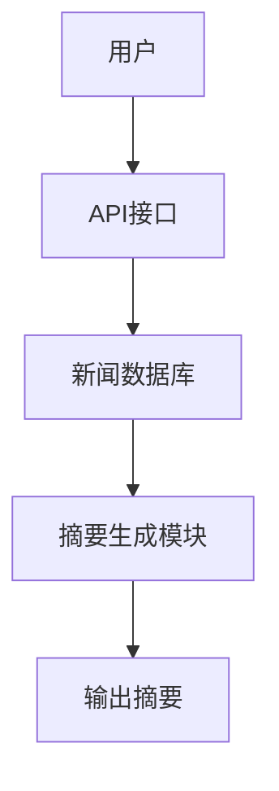
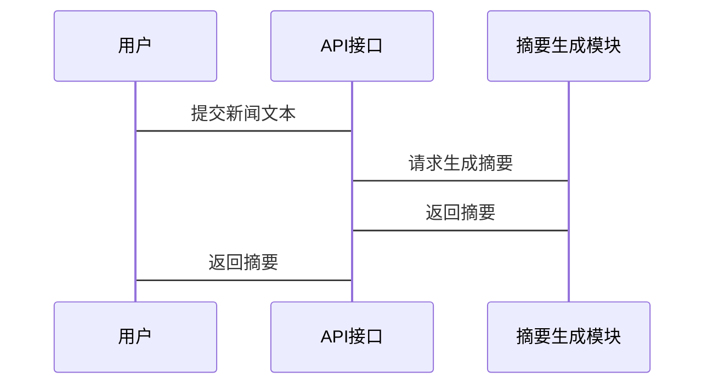

                 


# 企业估值中的AI驱动的自动化新闻摘要平台评估

> 关键词：企业估值、AI驱动、自动化新闻摘要、文本摘要、自然语言处理

> 摘要：本文详细探讨了AI驱动的自动化新闻摘要平台在企业估值中的应用，分析了传统方法的局限性，介绍了基于深度学习的文本摘要算法，包括算法原理、系统架构设计、项目实战案例以及最佳实践。通过详细的技术分析和实例解读，展示了如何利用AI技术提高企业估值的效率和准确性。

---

# 第一章: 企业估值中的AI新闻摘要平台背景

## 1.1 问题背景与描述

### 1.1.1 传统企业估值方法的局限性
传统的企业估值方法依赖于人工分析和手动数据整理，存在效率低下、主观性强、信息遗漏等问题。特别是在处理大量新闻数据时，人工摘要耗时且容易出错。

### 1.1.2 新闻摘要在企业估值中的重要性
新闻数据（如公司公告、行业动态、市场分析）是企业估值的重要依据。及时、准确的新闻摘要能够帮助企业快速捕捉关键信息，提升决策效率。

### 1.1.3 AI驱动的新闻摘要平台的提出
AI技术的快速发展为新闻摘要提供了新的解决方案。通过自然语言处理（NLP）和机器学习技术，可以实现自动化、高效的新闻摘要，为企业估值提供支持。

## 1.2 问题解决与边界

### 1.2.1 问题解决的核心目标
AI新闻摘要平台的目标是快速、准确地生成新闻摘要，帮助企业估值团队高效获取关键信息。

### 1.2.2 解决方案的边界与外延
- 边界：仅处理新闻文本数据，不涉及财务数据或其他非文本数据。
- 外延：未来可扩展至多语言支持、实时更新等功能。

### 1.2.3 核心要素与组成结构
- **输入**：新闻文本数据
- **输出**：结构化新闻摘要
- **核心模块**：文本预处理、摘要生成、结果优化

## 1.3 本章小结
本章介绍了企业估值中AI新闻摘要平台的背景、核心目标及组成结构，为后续技术分析奠定了基础。

---

# 第二章: 核心概念与联系

## 2.1 核心概念原理

### 2.1.1 自动化新闻摘要平台的定义
自动化新闻摘要平台是指利用AI技术，从大量新闻文本中提取关键信息并生成结构化摘要的系统。

### 2.1.2 AI驱动的新闻摘要技术
基于深度学习的文本摘要技术，能够自动识别文本重点并生成摘要。

### 2.1.3 企业估值中的新闻摘要应用
新闻摘要可应用于市场分析、竞争对手分析、行业趋势预测等场景。

## 2.2 核心概念属性对比

| 属性 | 传统新闻摘要 | AI驱动的新闻摘要 |
|------|----------------|-------------------|
| 效率 | 低效 | 高效 |
| 准确性 | 主观性强 | 客观性高 |
| 可扩展性 | 有限 | 高 |

## 2.3 ER实体关系图


## 2.4 本章小结
本章通过定义和对比，明确了AI驱动的新闻摘要平台的核心概念及其在企业估值中的应用价值。

---

# 第三章: AI驱动的新闻摘要平台技术基础

## 3.1 自然语言处理基础

### 3.1.1 NLP的基本概念
自然语言处理（NLP）是研究如何让计算机理解和生成人类语言的技术。

### 3.1.2 文本摘要的基本原理
文本摘要旨在从长文本中提取关键信息，生成简洁的摘要。

### 3.1.3 机器学习在新闻摘要中的应用
- **监督学习**：基于标注数据训练摘要模型。
- **无监督学习**：利用海量数据自动生成摘要。

## 3.2 文本摘要算法

### 3.2.1 基于规则的摘要方法
通过预定义的规则（如关键词提取）生成摘要。

### 3.2.2 基于模型的摘要方法
使用深度学习模型（如Transformer）生成摘要。

### 3.2.3 深度学习在文本摘要中的应用
- **模型选择**：常用预训练模型如BERT。
- **训练流程**：包括数据预处理、模型微调、评估优化。

## 3.3 本章小结
本章介绍了AI驱动的新闻摘要平台的技术基础，包括NLP的基本概念、文本摘要的算法原理及深度学习的应用。

---

# 第四章: 文本摘要算法原理

## 4.1 算法概述

### 4.1.1 基于规则的文本摘要
- **分词**：将文本分割成词语或短语。
- **关键词提取**：识别文本中的关键信息。
- **摘要生成**：基于关键词生成摘要。

### 4.1.2 基于模型的文本摘要
- **编码-解码模型**：将文本编码为向量，解码为摘要。
- **注意力机制**：聚焦文本的重要部分。

### 4.1.3 深度学习模型在文本摘要中的应用
- **模型结构**：Transformer架构。
- **训练目标**：最小化生成摘要与人工摘要的差异。

## 4.2 算法流程图


## 4.3 算法实现

### 4.3.1 基于规则的摘要实现
```python
import nltk
from sklearn.feature_extraction.text import TfidfVectorizer

# 分词
tokens = nltk.word_tokenize(text)

# 关键词提取
vectorizer = TfidfVectorizer()
tfidf = vectorizer.fit_transform([text])
tfidf_scores = tfidf[0].tolist()

# 摘要生成
top_words = [tokens[i] for i in range(len(tokens)) if tfidf_scores[i] > threshold]
summary = ' '.join(top_words)
```

### 4.3.2 基于模型的摘要实现
```python
import torch
import torch.nn as nn

# 定义编码器-解码器模型
class EncoderDecoder(nn.Module):
    def __init__(self, vocab_size):
        super().__init__()
        self.encoder = nn.Embedding(vocab_size, d_model)
        self.decoder = nn.Embedding(d_model, vocab_size)

    def forward(self, input):
        encoded = self.encoder(input)
        decoded = self.decoder(encoded)
        return decoded
```

## 4.4 本章小结
本章详细讲解了文本摘要算法的原理及实现，包括基于规则和基于模型的两种方法，并通过流程图和代码示例进行了说明。

---

# 第五章: 数学模型与公式推导

## 5.1 余弦相似度公式
$$ \text{余弦相似度} = \frac{\vec{A} \cdot \vec{B}}{|\vec{A}| |\vec{B}|} $$

## 5.2 TF-IDF公式
$$ \text{TF-IDF}(t, d) = \text{TF}(t, d) \times \text{IDF}(t) $$

## 5.3 案例分析
假设有一篇新闻文本，关键词为“收入增长”、“利润下降”，通过TF-IDF计算，生成摘要：“公司收入增长但利润下降”。

## 5.4 本章小结
本章通过公式推导和案例分析，展示了数学模型在新闻摘要中的应用。

---

# 第六章: 系统分析与架构设计

## 6.1 系统功能设计

### 6.1.1 领域模型


### 6.1.2 系统架构设计


### 6.1.3 接口设计
- **输入接口**：接收新闻文本。
- **输出接口**：返回结构化摘要。

### 6.1.4 交互流程


## 6.2 本章小结
本章详细设计了系统的功能、架构和交互流程，为后续的项目实现奠定了基础。

---

# 第七章: 项目实战

## 7.1 环境安装
- **Python**：3.8+
- **依赖库**：nltk、scikit-learn、transformers

## 7.2 核心实现

### 7.2.1 代码实现
```python
from transformers import BartTokenizer, BartForConditionalGeneration

# 初始化模型
tokenizer = BartTokenizer.from_pretrained('facebook/bart-large')
model = BartForConditionalGeneration.from_pretrained('facebook/bart-large')

# 摘要生成
inputs = tokenizer("公司收入增长但利润下降，市场需求疲软。", max_length=512, return_tensors='np')
outputs = model.generate(inputs.input_ids)
summary = tokenizer.decode(outputs[0], skip_special_tokens=True)
print(summary)
```

### 7.2.2 代码解读
- 使用预训练模型Bart进行摘要生成。
- 输入文本经过分词、编码、解码生成摘要。

## 7.3 案例分析
**输入文本**：公司收入增长但利润下降，市场需求疲软。
**生成摘要**：公司收入增长，利润下降。

## 7.4 本章小结
本章通过代码实现和案例分析，展示了AI驱动的新闻摘要平台的实际应用。

---

# 第八章: 最佳实践与总结

## 8.1 最佳实践 tips
- **数据质量**：确保输入文本的质量和相关性。
- **模型调优**：根据具体需求调整模型参数。
- **持续优化**：定期更新模型以适应新的语言模式。

## 8.2 本章小结
本章总结了AI驱动的新闻摘要平台的关键点，并提供了实际应用中的注意事项和未来研究方向。

---

# 作者信息

作者：AI天才研究院/AI Genius Institute & 禅与计算机程序设计艺术/Zen And The Art of Computer Programming

---

通过以上结构，本文系统地介绍了AI驱动的自动化新闻摘要平台在企业估值中的应用，从技术原理到项目实现，为读者提供了全面的指导和深入的分析。

