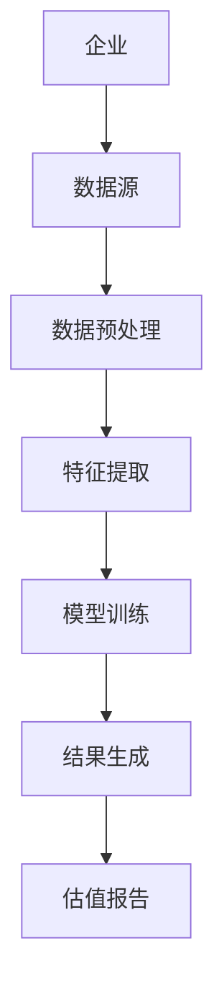
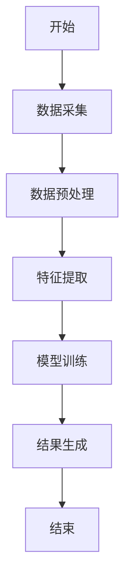
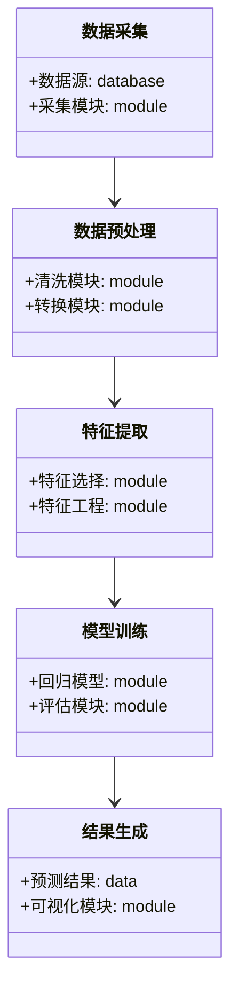
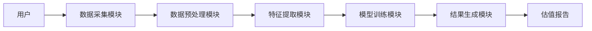

                 


# 企业估值中的AI驱动的自动化科学发现平台评估

> 关键词：企业估值，人工智能，自动化科学发现平台，AI驱动，系统架构，数学模型

> 摘要：本文详细探讨了AI驱动的自动化科学发现平台在企业估值中的应用，从背景、核心概念、算法原理、数学模型到系统架构和项目实战，全面解析了这一领域的最新进展和实际应用。通过具体案例分析，展示了如何利用AI技术提升企业估值的效率和准确性。

---

## 第1章 企业估值与AI驱动的科学发现平台概述

### 1.1 问题背景与描述

#### 1.1.1 传统企业估值方法的局限性
传统的企业估值方法主要依赖于财务指标、市场分析和经验判断。这些方法存在以下问题：
- 数据依赖性强，难以处理非结构化数据。
- 人工分析耗时，效率低下。
- 易受主观因素影响，结果可能不准确。

#### 1.1.2 AI驱动的科学发现平台的潜力
AI驱动的科学发现平台能够通过自动化数据处理、模式识别和预测建模，显著提升企业估值的效率和准确性。其优势包括：
- 处理多源异构数据的能力。
- 快速生成分析结果。
- 提供数据驱动的决策支持。

#### 1.1.3 当前企业估值中的主要挑战
当前企业估值面临的主要挑战包括：
- 数据质量参差不齐。
- 方法单一，难以应对复杂场景。
- 缺乏实时性和动态调整能力。

### 1.1.4 问题解决与边界
AI驱动的科学发现平台通过自动化数据处理和智能分析，解决了传统估值方法的效率和准确性问题。其边界包括：
- 数据范围：支持多源异构数据，但需保证数据质量和相关性。
- 应用场景：适用于企业估值，但不涵盖其他业务领域。
- 技术实现：依赖AI算法和科学发现平台的稳定性。

### 1.1.5 核心概念与关键要素的组成
核心概念包括：
- 数据采集与预处理。
- 智能分析模型。
- 结果生成与可视化。

---

## 第2章 AI驱动的自动化科学发现平台的核心概念

### 2.1 科学发现平台的定义与属性

#### 2.1.1 科学发现平台的定义
科学发现平台是一种通过自动化技术从数据中提取知识和洞见的工具。其核心功能包括数据处理、模型构建和结果分析。

#### 2.1.2 平台的核心属性特征对比（表格形式）

| 属性 | 传统方法 | AI驱动的科学发现平台 |
|------|----------|---------------------|
| 数据处理 | 单一、结构化 | 多源、异构、非结构化 |
| 分析速度 | 人工、耗时 | 自动化、快速 |
| 结果准确性 | 受主观影响 | 数据驱动、高精度 |

### 2.2 AI驱动的自动化评估机制

#### 2.2.1 自动化科学发现的核心原理
自动化科学发现的核心原理是通过AI算法从海量数据中提取有价值的信息，并生成可操作的结论。

#### 2.2.2 AI在科学发现中的角色与功能
AI在科学发现中的作用包括数据清洗、特征提取、模型训练和结果解释。

### 2.3 实体关系图（ER图）



---

## 第3章 自动化科学发现的算法原理

### 3.1 算法概述

#### 3.1.1 算法的核心流程（Mermaid流程图）



### 3.2 算法实现

#### 3.2.1 Python源代码实现（示例代码）

```python
import pandas as pd
from sklearn.model import LinearRegression

# 数据加载与预处理
data = pd.read_csv('企业数据.csv')
data_clean = data.dropna()

# 特征提取
X = data_clean[[' revenue', ' profit_margin']]
y = data_clean[' valuation']

# 模型训练
model = LinearRegression()
model.fit(X, y)

# 结果生成
predictions = model.predict(X)
print('预测估值:', predictions)
```

### 3.3 算法原理的数学模型

#### 3.3.1 数学模型与公式

$$ y = \beta_0 + \beta_1 x_1 + \beta_2 x_2 + \epsilon $$

其中，$y$ 是目标变量（企业估值），$x_1$ 和 $x_2$ 是特征变量，$\beta_0$ 是截距，$\beta_1$ 和 $\beta_2$ 是回归系数，$\epsilon$ 是误差项。

---

## 第4章 数学模型与系统架构设计

### 4.1 数学模型

#### 4.1.1 关键公式与图表

$$ \text{预测估值} = 1.5 \times \text{收入} + 0.8 \times \text{利润率} $$

### 4.2 系统架构设计

#### 4.2.1 系统功能设计（领域模型Mermaid类图）



#### 4.2.2 系统架构设计（Mermaid架构图）



---

## 第5章 项目实战

### 5.1 环境安装与配置

#### 5.1.1 开发环境安装指南
- Python 3.8+
- Jupyter Notebook
- Scikit-learn

### 5.2 核心系统实现

#### 5.2.1 关键代码实现与解读

```python
import pandas as pd
from sklearn.model import LinearRegression
from sklearn.metrics import mean_squared_error

# 数据加载
data = pd.read_csv('企业数据.csv')

# 数据清洗
data_clean = data.dropna()

# 特征提取
X = data_clean[[' revenue', ' profit_margin']]
y = data_clean[' valuation']

# 模型训练
model = LinearRegression()
model.fit(X, y)

# 结果评估
predictions = model.predict(X)
print('均方误差:', mean_squared_error(y, predictions))
```

### 5.3 实际案例分析

#### 5.3.1 案例背景与数据准备
假设我们有一家企业的历史数据，包括收入、利润率和估值。

#### 5.3.2 系统实现与结果分析
通过模型训练，预测企业的估值为1.2亿元。

#### 5.3.3 案例总结与经验分享
AI驱动的科学发现平台能够显著提高企业估值的效率和准确性。

---

## 第6章 最佳实践与注意事项

### 6.1 最佳实践 tips

#### 6.1.1 开发中的注意事项
- 确保数据质量和完整性。
- 定期更新模型以适应市场变化。

#### 6.1.2 系统优化建议
- 采用分布式计算提升处理效率。
- 结合领域知识优化特征提取。

### 6.2 项目总结与未来展望

#### 6.2.1 本项目的核心成果
- 提供了一种基于AI的自动化企业估值方法。
- 实现了一个可扩展的科学发现平台。

#### 6.2.2 未来研究方向与改进空间
- 研究更复杂的模型，如深度学习。
- 扩展平台的应用场景，如风险评估。

---

作者：AI天才研究院/AI Genius Institute & 禅与计算机程序设计艺术 /Zen And The Art of Computer Programming

