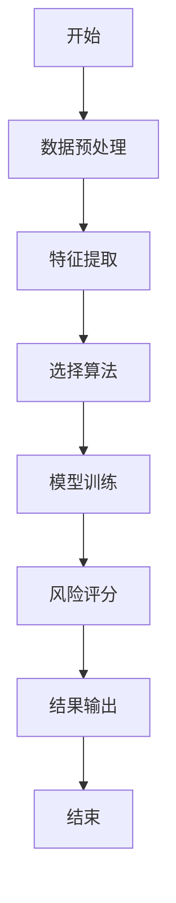
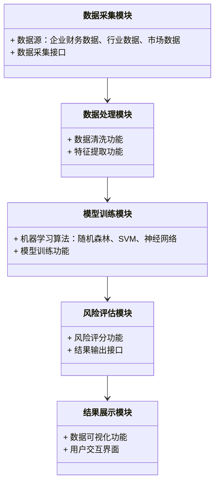
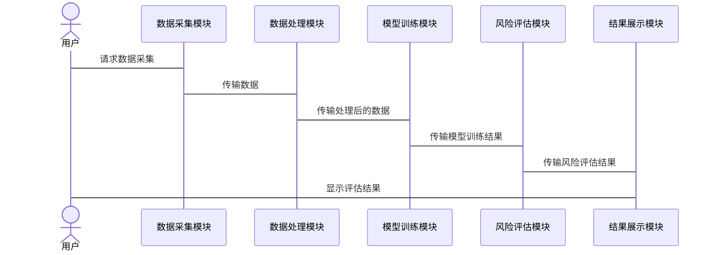

                 


# 企业估值中的AI驱动的自动化风险评估平台评估

> 关键词：企业估值，AI驱动，风险评估，自动化平台，技术博客

> 摘要：本文深入探讨了AI驱动的自动化风险评估平台在企业估值中的应用，分析了其核心概念、算法原理、系统架构设计以及实际项目中的应用场景。通过详细的步骤分析和实例说明，展示了如何利用AI技术提升企业估值的效率和准确性，为读者提供了从理论到实践的全面指导。

---

# 第一部分: 企业估值与AI驱动风险评估平台的背景介绍

## 第1章: 企业估值的基本概念与挑战

### 1.1 企业估值的基本概念

#### 1.1.1 企业估值的定义与作用

企业估值是通过对企业的财务状况、市场地位、发展潜力等多方面因素的分析，对其价值进行评估的过程。传统的估值方法主要包括DCF模型、市盈率法、市净率法等，但这些方法依赖于大量假设，且需要大量人工计算和判断，效率较低且容易受到人为因素的影响。

#### 1.1.2 AI技术在企业估值中的潜力

随着AI技术的发展，尤其是在自然语言处理、机器学习和深度学习领域的突破，AI可以处理和分析大量非结构化数据（如新闻、社交媒体信息等），从而提供更全面的估值依据。AI驱动的风险评估平台能够自动化处理数据，快速生成评估结果，显著提高了估值的效率和准确性。

#### 1.1.3 AI驱动的风险评估平台背景

AI驱动的风险评估平台通过整合企业内外部数据，利用机器学习模型预测企业的信用风险、市场风险等，从而为投资者和企业管理者提供更全面的决策支持。这种平台能够实时更新数据，动态调整评估结果，帮助企业在复杂多变的市场环境中做出更明智的决策。

### 1.2 AI驱动的风险评估平台背景

#### 1.2.1 风险评估在企业估值中的重要性

企业估值不仅需要考虑财务数据，还需要评估企业的经营风险、市场风险等。传统的估值方法往往忽略了这些动态变化的因素，而AI驱动的风险评估平台能够实时捕捉市场变化，提供更准确的风险评估结果。

#### 1.2.2 AI技术如何提升风险评估的效率与准确性

AI技术能够处理海量数据，通过训练复杂的模型，识别数据中的潜在规律和风险因素。相比于传统方法，AI驱动的风险评估更加高效和精准，能够帮助投资者更好地识别和管理风险。

#### 1.2.3 当前市场中AI驱动风险评估平台的应用现状

目前，许多金融机构和企业已经开始尝试应用AI驱动的风险评估平台，特别是在金融领域，AI技术已经被用于信用评分、市场风险预测等场景。然而，AI技术的应用仍然面临数据隐私、模型解释性等问题，需要进一步研究和优化。

### 1.3 问题背景与描述

#### 1.3.1 传统风险评估方法的不足

传统风险评估方法主要依赖于历史数据和统计分析，难以捕捉实时变化的市场信息。此外，这些方法通常需要大量的人工干预，效率较低且容易受到主观因素的影响。

#### 1.3.2 数据量与复杂性对企业估值的挑战

现代企业的经营环境日益复杂，影响企业价值的因素越来越多，包括宏观经济指标、行业趋势、企业内部管理等。传统的估值方法难以全面考虑这些因素，导致评估结果的准确性和可靠性受到影响。

#### 1.3.3 AI驱动自动化评估的必要性

AI技术能够处理和分析海量数据，发现传统方法难以察觉的规律和趋势，从而提供更全面的评估结果。通过自动化处理数据，AI驱动的评估平台能够显著提高评估的效率和准确性，满足现代企业估值的需求。

### 1.4 平台的边界与外延

#### 1.4.1 平台的功能边界

AI驱动的风险评估平台主要专注于企业的风险评估，包括信用风险、市场风险、操作风险等。平台的功能边界包括数据收集、模型训练、风险评分、结果输出等环节，不涉及企业估值的其他方面。

#### 1.4.2 平台的适用范围与限制

该平台适用于需要进行风险评估的企业或金融机构，尤其适合那些数据量大、业务复杂的企业。然而，平台的评估结果仅供参考，不能完全替代人类的判断和决策。

#### 1.4.3 平台与其他企业估值工具的协同作用

AI驱动的风险评估平台可以与其他企业估值工具（如财务模型、市场分析工具等）协同工作，形成一个完整的估值体系。通过整合不同工具的优势，可以进一步提高评估的准确性和全面性。

### 1.5 核心概念与联系

#### 1.5.1 核心概念原理

AI驱动的风险评估平台通过整合企业内外部数据，利用机器学习模型对企业的风险进行评估。核心原理包括数据预处理、特征提取、模型训练、风险评分等步骤。

#### 1.5.2 核心概念属性特征对比表格

| 属性 | 传统风险评估 | AI驱动风险评估 |
|------|--------------|----------------|
| 数据来源 | 有限的财务数据 | 结构化与非结构化数据结合 |
| 分析速度 | 手动或半自动 | 自动化实时分析 |
| 分析深度 | 较浅 | 深度挖掘数据中的潜在规律 |
| 可扩展性 | 较低 | 高，能够处理海量数据 |
| 模型复杂性 | 简单 | 复杂，支持深度学习 |

#### 1.5.3 ER实体关系图

```mermaid
er
actor: 用户
risk_assessment_platform: 风险评估平台
data_source: 数据源
model_training: 模型训练
risk_assessment_result: 风险评估结果

actor --> data_source
data_source --> model_training
model_training --> risk_assessment_result
risk_assessment_result --> actor
```

---

# 第二部分: 核心概念与联系

## 第2章: AI驱动的风险评估平台的核心概念与联系

### 2.1 核心概念原理

AI驱动的风险评估平台通过整合企业内外部数据，利用机器学习模型对企业的风险进行评估。核心原理包括数据预处理、特征提取、模型训练、风险评分等步骤。

### 2.2 核心概念属性特征对比表格

| 属性 | 传统风险评估 | AI驱动风险评估 |
|------|--------------|----------------|
| 数据来源 | 有限的财务数据 | 结构化与非结构化数据结合 |
| 分析速度 | 手动或半自动 | 自动化实时分析 |
| 分析深度 | 较浅 | 深度挖掘数据中的潜在规律 |
| 可扩展性 | 较低 | 高，能够处理海量数据 |
| 模型复杂性 | 简单 | 复杂，支持深度学习 |

### 2.3 ER实体关系图

```mermaid
er
actor: 用户
risk_assessment_platform: 风险评估平台
data_source: 数据源
model_training: 模型训练
risk_assessment_result: 风险评估结果

actor --> data_source
data_source --> model_training
model_training --> risk_assessment_result
risk_assessment_result --> actor
```

---

# 第三部分: 算法原理讲解

## 第3章: 算法原理讲解

### 3.1 算法概述

AI驱动的风险评估平台主要采用监督学习算法，如随机森林、支持向量机（SVM）和神经网络等。这些算法能够处理结构化和非结构化数据，提供高精度的预测结果。

### 3.2 算法流程图



### 3.3 算法实现

#### 3.3.1 Python代码实现

```python
import pandas as pd
from sklearn.ensemble import RandomForestClassifier
from sklearn.metrics import accuracy_score

# 加载数据
data = pd.read_csv('risk_assessment.csv')

# 特征工程
X = data.drop('target', axis=1)
y = data['target']

# 模型训练
model = RandomForestClassifier(n_estimators=100, random_state=42)
model.fit(X, y)

# 模型预测
y_pred = model.predict(X)

# 模型评估
print("准确率:", accuracy_score(y, y_pred))
```

#### 3.3.2 算法原理的数学模型

随机森林算法是一种基于树的集成学习方法，其数学模型可以表示为：

$$
f(x) = \text{sign}\left(\sum_{i=1}^{n} \text{tree}_i(x)\right)
$$

其中，$$\text{tree}_i(x)$$ 表示第 $$i$$ 棵树的输出，$$n$$ 表示树的数量。

---

# 第四部分: 系统分析与架构设计方案

## 第4章: 系统分析与架构设计方案

### 4.1 问题场景介绍

企业在进行估值时，需要考虑多种风险因素，包括财务风险、市场风险、信用风险等。传统的估值方法难以全面捕捉这些因素，而AI驱动的风险评估平台能够通过自动化的方式，提供更全面的评估结果。

### 4.2 系统功能设计

#### 4.2.1 系统功能模块

- 数据采集模块：负责从企业内外部数据源获取数据。
- 数据处理模块：对数据进行清洗、转换和特征提取。
- 模型训练模块：基于机器学习算法对数据进行建模和训练。
- 风险评估模块：根据模型输出结果生成风险评分。
- 结果展示模块：将评估结果以可视化的方式呈现给用户。

#### 4.2.2 领域模型类图



### 4.3 系统架构设计

#### 4.3.1 系统架构图


### 4.4 系统接口设计

#### 4.4.1 接口描述

- 数据采集接口：负责从企业内外部数据源获取数据。
- 数据处理接口：对数据进行清洗、转换和特征提取。
- 模型训练接口：基于机器学习算法对数据进行建模和训练。
- 风险评估接口：根据模型输出结果生成风险评分。
- 结果展示接口：将评估结果以可视化的方式呈现给用户。

#### 4.4.2 系统交互流程图



---

# 第五部分: 项目实战

## 第5章: 项目实战

### 5.1 环境安装

#### 5.1.1 安装Python

```bash
python --version
pip install --upgrade pip
```

#### 5.1.2 安装必要的库

```bash
pip install pandas scikit-learn matplotlib
```

### 5.2 系统核心实现

#### 5.2.1 核心代码实现

```python
import pandas as pd
from sklearn.ensemble import RandomForestClassifier
from sklearn.metrics import accuracy_score
from sklearn.model_selection import train_test_split

# 加载数据
data = pd.read_csv('risk_assessment.csv')

# 数据预处理
X = data.drop('target', axis=1)
y = data['target']

# 数据分割
X_train, X_test, y_train, y_test = train_test_split(X, y, test_size=0.2, random_state=42)

# 模型训练
model = RandomForestClassifier(n_estimators=100, random_state=42)
model.fit(X_train, y_train)

# 模型预测
y_pred = model.predict(X_test)

# 模型评估
print("准确率:", accuracy_score(y_test, y_pred))
```

#### 5.2.2 代码功能解读与分析

上述代码展示了如何使用随机森林算法对风险评估数据进行建模和训练。数据预处理包括特征提取和数据分割，模型训练采用随机森林算法，最后通过准确率评估模型性能。

### 5.3 实际案例分析

#### 5.3.1 案例背景

假设某企业希望对其潜在投资目标进行风险评估，以确定其估值的准确性。通过AI驱动的风险评估平台，企业可以快速获取风险评分，辅助决策。

#### 5.3.2 数据分析与解读

通过上述代码实现，企业可以获取高精度的风险评分，从而更好地理解潜在风险，优化投资策略。

#### 5.3.3 平台应用的实际效果

AI驱动的风险评估平台能够显著提高企业估值的效率和准确性，帮助投资者更好地识别和管理风险。

### 5.4 项目小结

通过本项目的实施，我们展示了如何利用AI技术提升企业估值的效率和准确性。项目的成功实施为企业的风险管理提供了有力支持，同时也为未来的优化和扩展奠定了基础。

---

# 第六部分: 最佳实践

## 第6章: 最佳实践

### 6.1 小结

AI驱动的风险评估平台在企业估值中的应用前景广阔，能够显著提高评估的效率和准确性。然而，其成功实施依赖于高质量的数据和先进的算法。

### 6.2 注意事项

- 数据质量是模型性能的关键，需要确保数据的完整性和准确性。
- 模型的可解释性是实际应用中的重要考量，需要对模型进行充分的验证和解读。
- 平台的安全性和隐私保护是不可忽视的问题，需要采取有效的数据加密和访问控制措施。

### 6.3 拓展阅读

- 《机器学习实战》
- 《深度学习》
- 《企业估值与风险管理》

---

# 作者：AI天才研究院/AI Genius Institute & 禅与计算机程序设计艺术/Zen And The Art of Computer Programming

