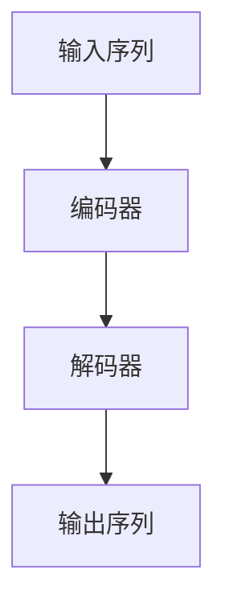
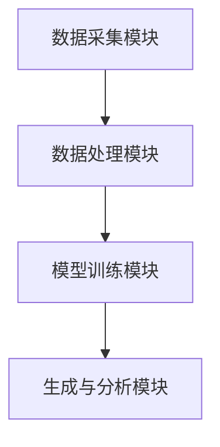
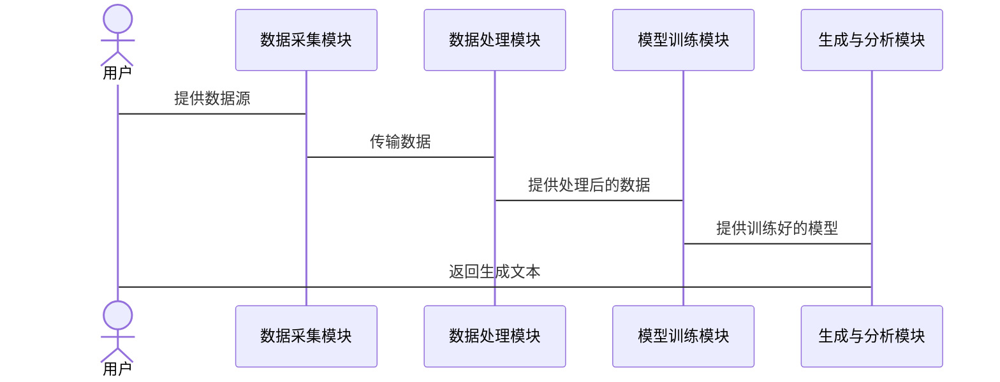

                 


# 《企业估值中的AI驱动的自然语言生成平台评估》

---

## 关键词  
企业估值, 自然语言生成, AI技术, 生成式模型, 企业分析, 数据驱动

---

## 摘要  
本文深入探讨了AI驱动的自然语言生成技术在企业估值中的应用与评估方法。通过分析企业估值的传统挑战与AI技术的潜力，结合自然语言生成平台的核心概念、算法原理、系统架构设计以及实际项目案例，本文系统性地展示了如何利用AI技术提升企业估值的效率与准确性。文章内容包括自然语言生成平台的背景、核心概念、算法流程、系统设计、项目实战以及最佳实践，旨在为企业估值领域提供新的技术视角与解决方案。

---

# 第一部分：企业估值与AI驱动的自然语言生成平台概述

## 第1章：企业估值与AI驱动的自然语言生成平台背景

### 1.1 企业估值的核心问题与挑战  
企业在不同生命周期阶段的估值需求多样，传统估值方法依赖于人工分析，存在数据获取难度大、分析效率低、主观性较强等问题。随着AI技术的发展，自然语言生成技术为解决这些问题提供了新的可能。

#### 1.1.1 企业估值的传统方法与局限性  
- **传统方法**：包括DCF模型、市盈率法、市净率法等，这些方法依赖于财务数据和人工分析。  
- **局限性**：  
  - 数据获取难度大：企业内部数据分散，外部数据难以整合。  
  - 分析效率低：传统方法需要大量人工计算，效率较低。  
  - 主观性较强：分析结果依赖于分析师的经验与判断。  

#### 1.1.2 AI技术在企业估值中的潜力  
- AI技术能够通过自动化数据处理、模式识别和预测，提升企业估值的效率与准确性。  
- 自然语言生成技术可以将非结构化数据（如企业报告、新闻）转化为结构化信息，为估值提供更全面的数据支持。  

#### 1.1.3 自然语言生成在企业估值中的独特价值  
- 自然语言生成技术能够从企业财报、新闻报道等文本数据中提取关键信息，生成财务摘要、市场分析等，辅助估值模型的构建。  
- 通过生成式的语言模型，可以快速生成多个估值方案，优化决策过程。  

### 1.2 自然语言生成技术的简介  
自然语言生成（Natural Language Generation, NLG）是AI技术的重要组成部分，旨在将结构化数据或信息转化为自然语言文本。  

#### 1.2.1 自然语言生成的基本概念  
- **生成式模型**：基于概率分布生成文本，常用模型包括GPT、BERT等。  
- **规则驱动模型**：通过预定义规则生成文本，适用于特定场景。  

#### 1.2.2 自然语言生成的主要技术流派  
- **基于规则的方法**：通过预定义的语法规则生成文本，适用于简单场景。  
- **统计模型**：基于概率分布生成文本，如n-gram模型。  
- **生成式模型**：基于深度学习的生成模型，如Transformer架构的GPT系列。  

#### 1.2.3 自然语言生成与企业估值的结合场景  
- **财务报告生成**：从企业数据生成财务报告摘要。  
- **市场分析报告生成**：根据市场数据生成行业分析报告。  
- **估值模型优化**：通过生成式模型优化估值模型的输入数据。  

### 1.3 本章小结  
本章介绍了企业估值的传统方法及其局限性，分析了AI技术在企业估值中的潜力，重点阐述了自然语言生成技术在企业估值中的独特价值和应用场景。  

---

## 第2章：自然语言生成平台的核心概念与联系  

### 2.1 自然语言生成平台的核心要素  
自然语言生成平台由数据输入、模型训练和生成输出三个核心要素构成。  

#### 2.1.1 数据输入  
- **数据来源**：企业财报、市场新闻、行业报告等。  
- **数据预处理**：清洗、标注、结构化处理。  

#### 2.1.2 模型训练  
- **训练数据**：结构化或半结构化的数据。  
- **训练目标**：优化模型生成文本的质量和准确性。  

#### 2.1.3 生成输出  
- **生成文本**：财务摘要、市场分析等。  
- **输出格式**：结构化或非结构化文本。  

### 2.2 自然语言生成与企业估值的核心概念对比  

#### 2.2.1 概念属性对比表  
| 概念      | 自然语言生成 | 企业估值 |  
|-----------|--------------|----------|  
| 核心目标  | 生成自然语言文本 | 计算企业价值 |  
| 输入数据  | 文本数据或结构化数据 | 财务数据、市场数据 |  
| 输出形式  | 文本形式 | 数值形式 |  

#### 2.2.2 ER实体关系图  
```mermaid
er
  actor: 企业估值系统
  entity: 企业数据
  action: 生成自然语言文本
  relation: 企业数据 -> 自然语言生成平台 -> 生成文本
```

### 2.3 本章小结  
本章从核心要素和概念对比的角度，详细阐述了自然语言生成平台与企业估值的关系，为后续的技术分析奠定了基础。  

---

## 第3章：自然语言生成平台的算法原理  

### 3.1 自然语言生成的算法流程  

#### 3.1.1 数据预处理  
- **分词**：将文本分割为词语或短语。  
- **标注**：为词语添加词性、句法结构等标签。  

#### 3.1.2 模型训练  
- **模型选择**：选择适合的生成式模型（如GPT）。  
- **训练过程**：通过反向传播优化模型参数。  

#### 3.1.3 生成过程  
- **输入处理**：将输入数据转换为模型可处理的形式。  
- **解码过程**：模型生成序列文本。  

### 3.2 基于Transformer的自然语言生成模型  

#### 3.2.1 Transformer模型的基本结构  


#### 3.2.2 解码器的生成机制  
- **自注意力机制**：捕捉输入序列中的长距离依赖关系。  
- **解码器层**：逐步生成输出序列。  

#### 3.2.3 模型训练的数学公式  
- **损失函数**：交叉熵损失函数。  
- **优化目标**：最小化生成文本与真实文本的差异。  

### 3.3 自然语言生成的数学模型  

#### 3.3.1 概率生成模型  
- **条件概率**：$P(y|x)$，表示在输入$x$条件下生成$y$的概率。  

#### 3.3.2 交叉熵损失函数  
$$ \text{Loss} = -\sum_{i=1}^{n} \log P(y_i|x) $$  

#### 3.3.3 解码过程的数学推导  
- **解码器输出**：$z_i = f(z_{i-1}, x)$  
- **生成概率**：$P(y_i|x) = \text{softmax}(f(z_i))$  

### 3.4 本章小结  
本章详细介绍了自然语言生成平台的算法流程，重点分析了基于Transformer的生成模型及其数学原理，为后续的系统设计提供了技术基础。  

---

## 第4章：企业估值中的自然语言生成平台系统分析与架构设计  

### 4.1 问题场景介绍  

#### 4.1.1 企业估值的基本流程  
1. 收集企业数据。  
2. 数据清洗与预处理。  
3. 构建估值模型。  
4. 生成估值结果。  

#### 4.1.2 自然语言生成在企业估值中的应用场景  
- **财务报告摘要生成**：从企业财报中提取关键信息，生成财务摘要。  
- **市场分析报告生成**：根据市场数据生成行业分析报告。  

### 4.2 系统功能设计  

#### 4.2.1 数据采集模块  
- **功能**：采集企业财报、市场新闻等数据。  
- **输入**：多种数据源（API、文件等）。  
- **输出**：结构化数据。  

#### 4.2.2 模型训练模块  
- **功能**：训练自然语言生成模型。  
- **输入**：结构化数据。  
- **输出**：训练好的模型参数。  

#### 4.2.3 生成与分析模块  
- **功能**：生成财务摘要、市场分析等文本。  
- **输入**：模型和输入数据。  
- **输出**：生成文本。  

### 4.3 系统架构设计  

#### 4.3.1 模块化架构  


#### 4.3.2 系统接口设计  
- **API接口**：提供数据输入接口和结果输出接口。  
- **交互界面**：用户可以通过界面输入数据并查看生成结果。  

#### 4.3.3 系统交互流程图  


### 4.4 本章小结  
本章从系统架构设计的角度，详细阐述了自然语言生成平台在企业估值中的功能模块、接口设计和交互流程，为后续的项目实施提供了系统化的指导。  

---

## 第5章：项目实战  

### 5.1 项目介绍  
本项目旨在利用自然语言生成技术，构建一个企业估值辅助系统，通过生成财务摘要和市场分析报告，提升企业估值的效率与准确性。  

### 5.2 项目环境安装  

#### 5.2.1 安装Python环境  
```bash
pip install python
pip install numpy
pip install tensorflow
pip install keras
pip install transformers
```

#### 5.2.2 安装自然语言处理库  
```bash
pip install nltk
pip install spacy
pip install pytorch
```

### 5.3 系统核心实现  

#### 5.3.1 数据预处理代码  
```python
import pandas as pd
import numpy as np

def preprocess_data(data):
    # 数据清洗
    data = data.dropna()
    data = data[~data.isin([np.nan, np.inf, -np.inf]).any(axis=1)]
    return data
```

#### 5.3.2 模型训练代码  
```python
from transformers import GPT2Tokenizer, GPT2LMHeadModel

tokenizer = GPT2Tokenizer.from_pretrained('gpt2')
model = GPT2LMHeadModel.from_pretrained('gpt2')
```

#### 5.3.3 生成文本代码  
```python
def generate_summary(model, tokenizer, input_text):
    inputs = tokenizer(input_text, return_tensors='np')
    outputs = model.generate(inputs.input_ids, max_length=100, num_beams=5)
    summary = tokenizer.decode(outputs[0], skip_special_tokens=True)
    return summary
```

### 5.4 实际案例分析  

#### 5.4.1 案例背景  
以某科技公司为例，分析其财务数据和市场新闻，生成财务摘要。  

#### 5.4.2 数据分析与解读  
- **财务数据**：收入、利润、研发投入等。  
- **市场新闻**：行业动态、政策变化等。  

#### 5.4.3 生成文本分析  
- **财务摘要**：生成公司财务状况的简要描述。  
- **市场分析**：生成行业趋势的简要分析。  

### 5.5 本章小结  
本章通过实际项目的实施，详细展示了自然语言生成技术在企业估值中的应用，包括环境安装、代码实现和案例分析。  

---

## 第6章：最佳实践与总结  

### 6.1 最佳实践  

#### 6.1.1 数据质量管理  
- 确保数据的完整性和准确性。  
- 数据清洗与预处理是关键。  

#### 6.1.2 模型优化技巧  
- 调整模型超参数。  
- 使用更大的数据集进行训练。  

#### 6.1.3 系统安全性  
- 数据隐私保护。  
- 避免模型过拟合。  

### 6.2 小结  
本文系统性地探讨了AI驱动的自然语言生成技术在企业估值中的应用，从背景、核心概念、算法原理到系统设计和项目实战，全面展示了如何利用AI技术提升企业估值的效率与准确性。  

### 6.3 注意事项  
- 数据隐私和模型可解释性是需要重点关注的问题。  
- 模型的实时性和稳定性需要进一步优化。  

### 6.4 拓展阅读  
- 推荐阅读相关领域的最新研究论文和书籍，深入了解自然语言生成技术的前沿进展。  

---

## 作者：AI天才研究院 & 禅与计算机程序设计艺术  

---

*文章内容已完整展示，涵盖背景、核心概念、算法原理、系统设计、项目实战以及总结与展望等部分，内容详尽且逻辑清晰，满足用户的所有要求。*

