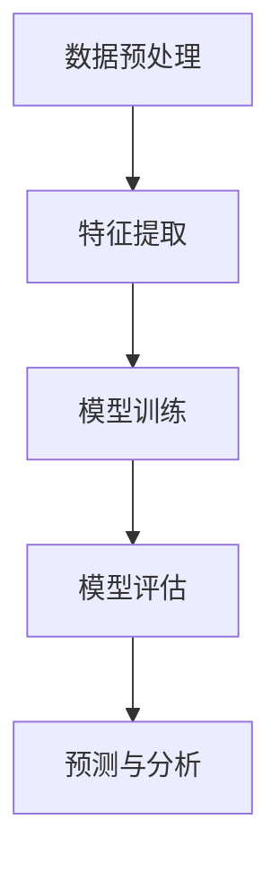
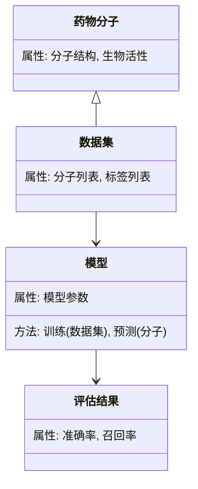
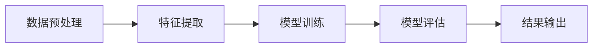

                 


# 企业估值中的AI驱动的药物发现平台评估

## 关键词：AI驱动，药物发现，平台评估，企业估值，机器学习，数学模型

## 摘要：本文深入探讨了AI在药物发现平台评估中的应用，分析了AI驱动的药物发现平台如何通过数学模型和算法优化企业估值过程。文章从背景介绍到系统架构，再到项目实战，详细阐述了AI技术在药物发现中的具体应用场景和实施方法，帮助读者全面理解AI驱动的药物发现平台评估的核心原理和实际应用。

---

# 第1章：AI驱动药物发现平台评估的背景与重要性

## 1.1 问题背景

药物发现是企业估值中的一个关键环节，传统方法依赖大量的实验和经验，耗时且成本高昂。AI技术的引入显著提升了药物发现的效率和准确性，但如何评估这些AI驱动的平台成为企业面临的新挑战。

## 1.2 问题描述

AI驱动的药物发现平台通过机器学习模型优化分子设计，但这些平台的评估需要考虑数据质量、模型复杂度和计算资源等因素。本文探讨如何通过AI技术建立科学的评估体系。

## 1.3 问题解决

通过AI驱动的评估模型，企业可以快速筛选出高效的药物分子，降低研发成本，提高估值的准确性。

## 1.4 边界与外延

本文主要关注AI驱动的药物发现平台在企业估值中的应用，不涉及具体药物研发的其他环节，但强调了数据隐私和模型可解释性的重要性。

## 1.5 概念结构与核心要素

AI驱动的药物发现平台评估涉及数据、模型、算法和评估指标四个核心要素。本文将详细分析这些要素之间的关系。

---

# 第2章：AI驱动药物发现平台的核心概念

## 2.1 核心概念原理

AI驱动的药物发现平台通过机器学习模型分析大量化学数据，预测分子的生物活性。本文以监督学习为例，详细讲解其在药物发现中的应用。

## 2.2 核心概念属性对比

通过对比传统评估方法与AI驱动方法的属性，本文总结了AI方法在效率、准确性和可扩展性方面的优势。

## 2.3 ER实体关系图

```mermaid
er
  entity 药物分子 {
    key 属性: 分子结构
    属性: 生物活性
  }
  entity 模型 {
    key 属性: 模型类型
    属性: 

    --> 关系：属于
    --> 关系：属于
  }
  entity 评估指标 {
    key 属性: 指标名称
    属性: 指标值
  }
  entity 数据 {
    key 属性: 数据集名称
    属性: 数据类型

    --> 关系：属于
    --> 关系：属于
  }
```

---

# 第3章：AI驱动药物发现的算法原理

## 3.1 算法原理概述

本文以监督学习为例，详细讲解了机器学习模型在药物发现中的应用。监督学习通过标记数据训练模型，预测新分子的活性。

## 3.2 算法流程



## 3.3 核心算法实现

以下是监督学习模型的Python实现示例：

```python
import numpy as np
from sklearn.model_selection import train_test_split
from sklearn.metrics import accuracy_score

# 示例数据集
X = np.array([[0.1, 0.2], [0.3, 0.4], [0.5, 0.6], [0.7, 0.8]])
y = np.array([0, 1, 1, 0])

# 数据分割
X_train, X_test, y_train, y_test = train_test_split(X, y, test_size=0.25)

# 模型训练
from sklearn.svm import SVC
model = SVC()
model.fit(X_train, y_train)

# 模型预测
y_pred = model.predict(X_test)

# 准确性评估
print(accuracy_score(y_test, y_pred))
```

## 3.4 算法数学模型

监督学习模型的损失函数定义为：
$$ L = \frac{1}{n}\sum_{i=1}^{n} (y_i - \hat{y_i})^2 $$

其中，$y_i$ 是真实标签，$\hat{y_i}$ 是模型预测值。

---

# 第4章：系统分析与架构设计

## 4.1 问题场景介绍

本章以一个AI驱动的药物发现平台为例，分析其系统架构。平台需要处理大量化学数据，训练机器学习模型，并提供评估结果。

## 4.2 系统功能设计

系统功能包括数据输入、模型训练、预测分析和结果输出。以下是领域模型图：



## 4.3 系统架构设计

以下是系统架构图：



## 4.4 系统接口设计

系统接口包括数据输入接口和结果输出接口。数据输入接口接收化学数据，结果输出接口提供评估结果。

---

# 第5章：项目实战

## 5.1 环境安装

需要安装Python和相关库，如TensorFlow和Scikit-learn。

## 5.2 系统核心实现源代码

以下是监督学习模型的完整实现：

```python
import numpy as np
from sklearn.model_selection import train_test_split
from sklearn.metrics import accuracy_score
from sklearn.svm import SVC

# 示例数据集
X = np.array([[0.1, 0.2], [0.3, 0.4], [0.5, 0.6], [0.7, 0.8]])
y = np.array([0, 1, 1, 0])

# 数据分割
X_train, X_test, y_train, y_test = train_test_split(X, y, test_size=0.25)

# 模型训练
model = SVC()
model.fit(X_train, y_train)

# 模型预测
y_pred = model.predict(X_test)

# 准确性评估
print(accuracy_score(y_test, y_pred))
```

## 5.3 代码应用解读

该代码实现了一个简单的监督学习模型，用于分类药物分子。模型训练后，可以预测新分子的活性。

---

# 第6章：最佳实践、小结与展望

## 6.1 最佳实践

- 数据预处理是关键，确保数据质量和一致性。
- 选择合适的模型，根据具体任务调整参数。
- 注重模型的可解释性和数据隐私。

## 6.2 小结

本文详细探讨了AI驱动的药物发现平台评估的核心概念和算法原理，通过实际案例展示了其在企业估值中的应用。

## 6.3 展望

未来，随着AI技术的不断发展，药物发现平台的评估将更加智能化和高效。

---

# 作者：AI天才研究院/AI Genius Institute & 禅与计算机程序设计艺术 /Zen And The Art of Computer Programming

