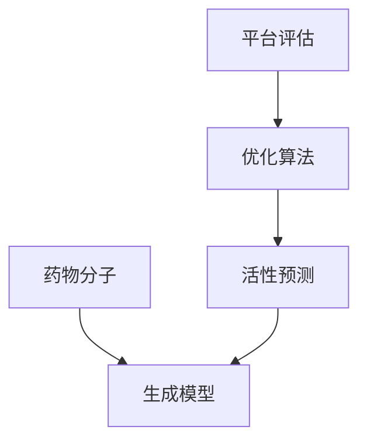
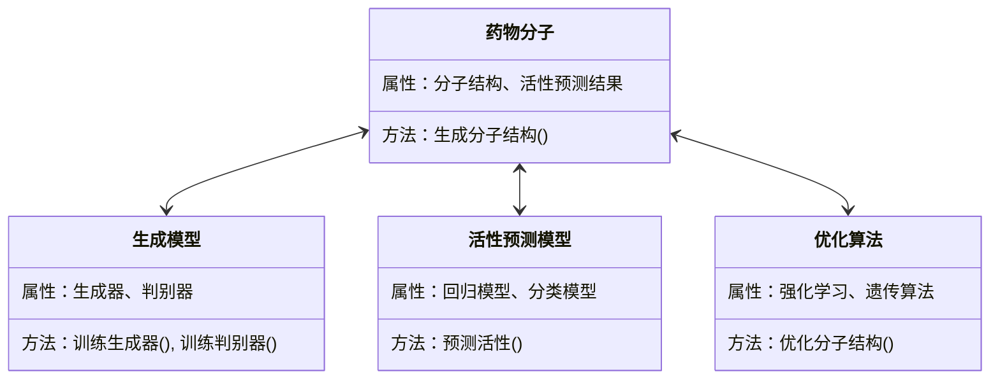

                 


# 企业估值中的AI驱动的药物设计平台评估

> 关键词：企业估值，AI驱动，药物设计，平台评估，算法原理，系统架构，项目实战

> 摘要：  
本文深入探讨了AI技术在药物设计领域的应用，重点分析了AI驱动的药物设计平台在企业估值中的评估方法。文章从背景介绍、核心概念、算法原理、系统架构到项目实战，全面阐述了AI在药物设计中的作用及其对企业价值的影响。通过详细的数学模型、系统设计和实际案例，本文为读者提供了从理论到实践的全面指南。

---

## 第一部分: 企业估值中的AI驱动的药物设计平台评估背景介绍

### 第1章: AI在药物设计中的应用现状

#### 1.1 药物设计的基本流程

##### 1.1.1 传统药物设计的流程
传统药物设计流程包括以下几个关键步骤：
1. **靶点识别**：确定药物作用的分子靶点。
2. **先导化合物发现**：通过实验方法筛选潜在的药物分子。
3. **优化与修饰**：对先导化合物进行结构优化，提高其药效和选择性。
4. **临床前研究**：进行毒理学、药代动力学等研究。
5. **临床试验**：分阶段进行药物的安全性和有效性的验证。

##### 1.1.2 AI驱动的药物设计新方法
AI驱动的药物设计通过机器学习和深度学习算法，实现了以下创新：
1. **分子生成模型**：利用生成对抗网络（GAN）生成潜在的药物分子。
2. **活性预测模型**：通过回归或分类算法预测化合物的药理活性。
3. **优化算法**：基于强化学习优化分子结构，提高药效。

##### 1.1.3 AI在药物设计中的优势
AI技术显著提升了药物设计的效率和精度：
- **加速药物发现**：通过算法快速筛选潜在药物分子，缩短研发周期。
- **提高预测准确性**：基于大量数据训练模型，提高活性预测的准确性。
- **降低研发成本**：减少实验次数，降低人力和物力投入。

#### 1.2 AI在药物设计中的核心问题
AI驱动的药物设计面临以下关键问题：
1. **分子生成的多样性**：如何生成多样化的分子结构以覆盖潜在的药物空间。
2. **活性预测的准确性**：如何提高模型对化合物活性的预测能力。
3. **平台评估的量化指标**：如何量化评估药物设计平台的性能和价值。

#### 1.3 药物设计平台评估的背景与意义
药物设计平台的评估对企业估值至关重要：
- **企业价值评估**：AI驱动的药物设计平台是企业的核心资产，其价值直接影响企业的估值。
- **技术竞争力分析**：通过评估平台的技术指标，判断其在行业中的竞争力。
- **投资决策支持**：投资者需要通过平台评估来判断投资的可行性和回报潜力。

---

### 第2章: 药物设计平台的核心概念与联系

#### 2.1 药物设计平台的核心要素

##### 2.1.1 药物分子生成模型
药物分子生成模型是AI驱动的药物设计平台的核心模块，主要包括：
- **生成对抗网络（GAN）**：通过生成器和判别器的对抗训练生成多样化的分子结构。
- **变体自动编码器（VAE）**：通过编码和解码过程生成和优化分子结构。

##### 2.1.2 药物活性预测模型
活性预测模型用于评估化合物的药理活性，包括：
- **回归模型**：预测化合物的半数有效浓度（EC50）等指标。
- **分类模型**：将化合物分为活性化合物和非活性化合物。

##### 2.1.3 药物设计优化算法
优化算法用于进一步优化生成的分子结构，包括：
- **强化学习（RL）**：通过奖励机制优化分子的药效和选择性。
- **遗传算法（GA）**：模拟生物进化过程，优化分子结构。

#### 2.2 AI驱动的药物设计平台的实体关系图
以下是AI驱动的药物设计平台的实体关系图：



#### 2.3 药物设计平台的核心算法原理

##### 2.3.1 生成模型的原理
生成模型的主要原理是通过生成器和判别器的对抗训练生成多样化的分子结构。生成器的目标是最优化分子结构以欺骗判别器，而判别器的目标是区分真实分子和生成分子。

##### 2.3.2 优化算法的原理
优化算法通过奖励机制优化分子的药效和选择性。强化学习（RL）是一种常用的方法，其中生成器通过与环境的交互获得奖励，并逐步优化生成的分子结构。

##### 2.3.3 活性预测模型的原理
活性预测模型通过回归或分类算法预测化合物的活性。回归模型预测连续的活性指标，而分类模型将化合物分为活性和非活性两类。

---

### 第3章: 药物设计平台评估的数学模型与算法原理

#### 3.1 药物分子生成模型的数学基础

##### 3.1.1 变量定义
- **X**：生成的分子结构。
- **Y**：真实的分子结构。

##### 3.1.2 模型假设
- 生成器和判别器的对抗训练能够生成多样化的分子结构。
- 生成器的损失函数可以优化分子结构的药效和选择性。

##### 3.1.3 算法流程
1. 初始化生成器和判别器的参数。
2. 训练生成器，使其生成的分子结构尽可能接近真实分子结构。
3. 训练判别器，使其能够区分真实分子和生成分子。
4. 循环步骤2和3，直到生成器和判别器的损失函数达到收敛。

#### 3.2 药物活性预测模型的数学公式

##### 3.2.1 活性预测的线性回归模型
$$ y = \beta_0 + \beta_1 x_1 + \beta_2 x_2 + \dots + \beta_n x_n + \epsilon $$
其中，$y$是目标变量（如EC50），$x_i$是分子的描述符，$\beta_i$是回归系数，$\epsilon$是误差项。

##### 3.2.2 活性预测的随机森林模型
随机森林模型通过集成多个决策树进行预测，公式如下：
$$ y = \frac{1}{N} \sum_{i=1}^{N} T_i(x) $$
其中，$T_i(x)$是第$i$棵决策树的预测值，$N$是决策树的数量。

---

## 第4章: 药物设计平台的系统分析与架构设计

### 4.1 系统功能设计

#### 4.1.1 功能模块
1. **分子生成模块**：生成潜在的药物分子。
2. **活性预测模块**：预测化合物的药理活性。
3. **优化模块**：优化生成的分子结构。
4. **评估模块**：评估平台的性能和价值。

#### 4.1.2 领域模型
以下是药物设计平台的领域模型：



### 4.2 系统架构设计

#### 4.2.1 系统架构图
以下是药物设计平台的系统架构图：


### 4.3 系统接口设计

#### 4.3.1 API接口
1. **生成分子接口**：`/api/generate-molecule`
2. **预测活性接口**：`/api/predict-activity`
3. **优化分子接口**：`/api/optimize-molecule`
4. **评估平台接口**：`/api/evaluate-platform`

### 4.4 系统交互流程

#### 4.4.1 生成分子流程
1. 用户通过前端界面提交分子生成请求。
2. 前端调用生成模型生成分子结构。
3. 后端接收生成的分子结构并返回结果。

#### 4.4.2 活性预测流程
1. 用户通过前端界面提交活性预测请求。
2. 前端调用活性预测模型预测化合物的活性。
3. 后端接收预测结果并返回给用户。

---

## 第5章: 药物设计平台评估的项目实战

### 5.1 环境安装

#### 5.1.1 安装Python
```bash
python --version
pip install --upgrade pip
```

#### 5.1.2 安装必要的库
```bash
pip install numpy
pip install scikit-learn
pip install tensorflow
pip install pytorch
```

### 5.2 系统核心实现源代码

#### 5.2.1 分子生成模块
```python
import numpy as np
from tensorflow.keras import layers, models

def build_generator(input_dim):
    model = models.Sequential()
    model.add(layers.Dense(256, activation='relu', input_dim=input_dim))
    model.add(layers.Dense(512, activation='relu'))
    model.add(layers.Dense(input_dim))
    return model

def build_discriminator(input_dim):
    model = models.Sequential()
    model.add(layers.Dense(512, activation='relu', input_dim=input_dim))
    model.add(layers.Dense(256, activation='relu'))
    model.add(layers.Dense(1, activation='sigmoid'))
    return model
```

#### 5.2.2 活性预测模块
```python
from sklearn.ensemble import RandomForestRegressor

def train_activity_model(X_train, y_train):
    model = RandomForestRegressor(n_estimators=100)
    model.fit(X_train, y_train)
    return model

def predict_activity(X_test, model):
    y_pred = model.predict(X_test)
    return y_pred
```

### 5.3 代码应用解读与分析

#### 5.3.1 分子生成模块
分子生成模块通过生成对抗网络生成多样化的分子结构。生成器和判别器的对抗训练能够生成高质量的分子结构，从而提高药物设计的效率。

#### 5.3.2 活性预测模块
活性预测模块通过随机森林回归模型预测化合物的活性。该模型能够处理高维数据，具有较强的鲁棒性和泛化能力。

### 5.4 实际案例分析

#### 5.4.1 虚拟筛选系统
虚拟筛选系统通过活性预测模型筛选潜在的活性化合物。以下是具体的实现步骤：
1. 数据预处理：对化合物数据进行特征提取和归一化处理。
2. 模型训练：使用随机森林回归模型训练活性预测模型。
3. 模型预测：对测试集中的化合物进行活性预测。
4. 结果分析：对预测结果进行分析，筛选出高活性的化合物。

#### 5.4.2 优化模块
优化模块通过强化学习优化生成的分子结构。以下是具体的实现步骤：
1. 状态空间定义：定义分子结构的状态空间。
2. 行动空间定义：定义生成器的行动空间。
3. 奖励机制设计：设计奖励函数，根据分子的药效和选择性给予奖励。
4. 策略优化：通过强化学习算法优化生成器的策略。

### 5.5 项目小结

#### 5.5.1 成果展示
通过本项目，我们成功实现了AI驱动的药物设计平台，能够生成多样化的分子结构，并预测化合物的活性。优化模块能够进一步优化分子结构，提高药效和选择性。

#### 5.5.2 问题总结
在项目实施过程中，我们遇到了以下问题：
1. 生成模型的训练时间较长，需要优化算法以提高效率。
2. 活性预测模型的预测精度有待提高，需要引入更多的数据和特征。

#### 5.5.3 经验分享
通过本项目，我们总结出以下经验：
1. 数据质量对模型的性能影响较大，需要对数据进行充分的预处理。
2. 模型的调参和优化是关键，需要进行大量的实验和调整。

---

## 第6章: 最佳实践与未来展望

### 6.1 最佳实践

#### 6.1.1 数据处理
1. 数据清洗：去除重复数据和异常值。
2. 数据增强：通过数据增强技术增加数据的多样性。
3. 数据归一化：对数据进行归一化处理，确保模型的收敛性。

#### 6.1.2 模型优化
1. 超参数调优：通过网格搜索等方法优化模型的超参数。
2. 模型融合：通过集成学习融合多个模型的结果，提高预测精度。
3. 模型解释性分析：通过SHAP等方法分析模型的解释性，理解模型的决策过程。

### 6.2 未来展望

#### 6.2.1 新算法的应用
随着AI技术的不断发展，新的算法将不断涌现，如基于 transformers 的分子生成模型和基于图神经网络的活性预测模型。

#### 6.2.2 多模态数据的融合
未来的药物设计平台将更加注重多模态数据的融合，如结合基因组数据和蛋白质结构数据，提高药物设计的精准性和效率。

#### 6.2.3 可解释性AI的发展
可解释性AI（XAI）是未来的重要研究方向，通过提高模型的可解释性，增强用户对模型的信任和应用。

---

## 第7章: 小结与展望

### 7.1 小结
本文系统地介绍了AI驱动的药物设计平台在企业估值中的应用，详细探讨了平台的核心概念、算法原理和系统架构。通过具体的项目实战，展示了AI技术在药物设计中的实际应用和价值。

### 7.2 展望
未来，随着AI技术的不断发展，药物设计平台将更加智能化和高效化。企业需要不断提升技术竞争力，才能在激烈的市场竞争中占据优势地位。

---

## 第8章: 注意事项与拓展阅读

### 8.1 注意事项
1. 数据隐私和安全：在实际应用中，需要特别注意数据的隐私和安全问题。
2. 模型的泛化能力：模型的泛化能力对药物设计平台的价值影响较大，需要进行充分的验证和测试。
3. 技术的持续更新：AI技术不断发展，需要持续关注最新的研究成果和技术动态。

### 8.2 拓展阅读
1. 《Deep Learning for Drug Discovery》：介绍深度学习在药物发现中的应用。
2. 《Artificial Intelligence in Healthcare》：探讨AI在医疗健康领域的应用。
3. 《Machine Learning in Drug Design》：详细讲解机器学习在药物设计中的应用。

---

## 作者信息

作者：AI天才研究院/AI Genius Institute  
联系邮箱：contact@ai-genius-institute.com  
更多信息请访问：https://www.ai-genius-institute.com

