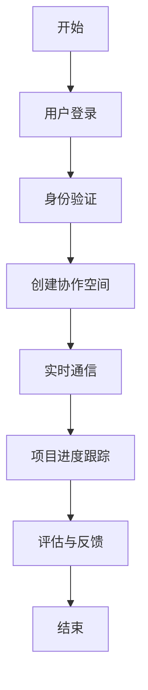
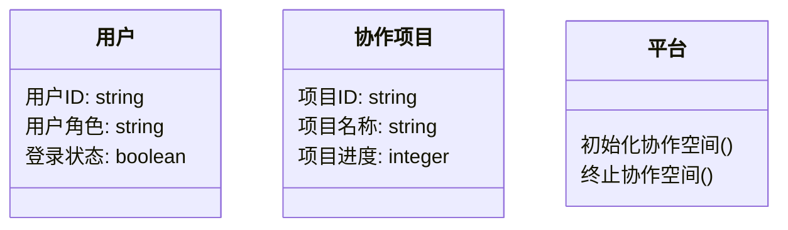
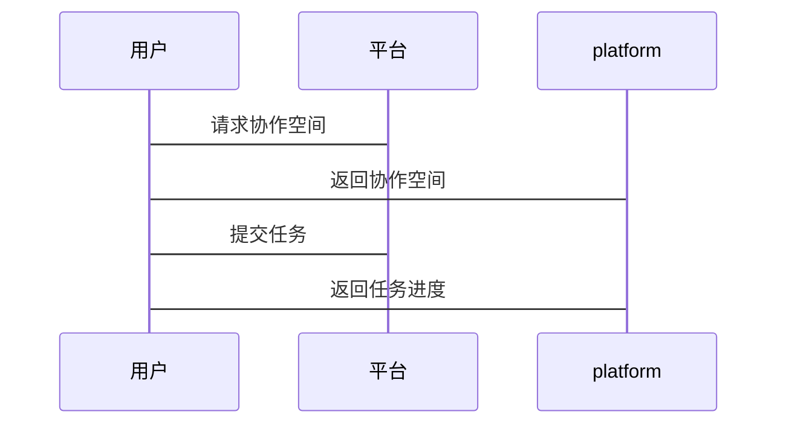

                 


# 企业估值中的AR/VR协作办公平台评估

## 关键词：AR/VR协作办公，企业估值，技术评估，虚拟协作，办公效率

## 摘要：  
随着AR/VR技术的快速发展，协作办公方式也在不断创新。本文深入探讨了AR/VR协作办公平台在企业估值中的评估方法，从背景介绍、核心概念、算法原理、系统架构到项目实战，详细分析了AR/VR协作办公平台的评估过程及其对企业价值的影响。通过实际案例和系统设计，本文为读者提供了全面的评估框架和实践指南，帮助企业在数字化转型中提升协作效率和估值能力。

---

## 第1章: AR/VR协作办公平台的背景与问题描述

### 1.1 AR/VR协作办公平台的定义与特点

#### 1.1.1 AR/VR协作办公平台的定义  
AR（增强现实）和VR（虚拟现实）技术的结合为协作办公提供了全新的可能性。AR/VR协作办公平台是一种基于虚拟空间的协作工具，用户可以通过头显设备或手机等终端设备，以虚拟化身的形式进入共享的虚拟空间，进行实时协作、交流和项目管理。  

#### 1.1.2 AR/VR协作办公平台的核心特点  
- **沉浸式体验**：通过VR设备，用户可以完全沉浸在一个虚拟的工作环境中，实现身临其境的协作体验。  
- **空间感知**：AR技术将虚拟元素与现实环境结合，用户可以在物理空间中操作虚拟对象。  
- **实时协作**：支持多人实时互动，包括语音、视频、文档共享和虚拟白板等功能。  
- **可定制性**：用户可以根据需求自定义虚拟空间的布局和功能模块。  

#### 1.1.3 与传统协作办公方式的对比  
| 特性               | 传统协作办公 | AR/VR协作办公 |  
|--------------------|--------------|----------------|  
| 空间利用           | 依赖物理空间 | 虚拟空间灵活扩展 |  
| 互动方式           | 依赖屏幕和键盘 | 沉浸式交互体验 |  
| 协作效率           | 受地理位置限制 | 全球实时协作 |  

### 1.2 企业估值中的协作办公需求

#### 1.2.1 企业协作办公的重要性  
协作办公是企业日常运营的核心活动，直接影响企业的效率、创新能力和市场竞争力。高效的协作办公模式能够显著提升企业的生产力和价值。  

#### 1.2.2 传统协作办公的局限性  
- **地理限制**：团队成员分散在不同地点时，协作效率降低。  
- **工具割裂**：使用多种工具（如邮件、文档、视频会议）导致流程繁琐。  
- **缺乏沉浸感**：传统协作方式难以提供身临其境的体验。  

#### 1.2.3 AR/VR协作办公平台的优势  
- **突破地理限制**：全球团队可以实时进入虚拟空间协作。  
- **沉浸式体验**：提升团队成员的互动和创意激发。  
- **效率提升**：通过虚拟工具简化协作流程，减少沟通成本。  

### 1.3 问题背景与问题描述

#### 1.3.1 当前企业协作办公中的主要问题  
- **协作工具分散**：不同工具之间的数据难以整合，导致协作效率低下。  
- **缺乏沉浸式体验**：传统协作方式难以提供深度互动。  
- **技术门槛高**：企业难以自行开发高效的协作平台。  

#### 1.3.2 AR/VR协作办公平台的解决方案  
通过AR/VR技术，打造一个统一的虚拟协作空间，整合多种协作工具，提供沉浸式体验，降低协作门槛。  

#### 1.3.3 问题解决的边界与外延  
AR/VR协作办公平台适用于需要高效率、全球协作的企业，尤其适合创意设计、项目管理等领域。其外延包括与其他协作工具的集成和扩展功能的开发。  

### 1.4 核心概念与联系

#### 1.4.1 AR/VR协作办公平台的实体关系图  
```mermaid
er
actor: 用户
actor: 管理员
actor: 企业
class: 平台
class: 协作项目
class: 用户角色
class: 评估指标
```

#### 1.4.2 系统核心概念的属性对比  
| 概念 | 属性 | 描述 |  
|------|------|------|  
| 用户 | 用户ID | 唯一标识符 |  
| 用户角色 | 角色名称 | 用户在协作项目中的角色 |  
| 协作项目 | 项目ID | 项目唯一标识符 |  
| 评估指标 | 指标名称 | 评估维度 |  

---

## 第2章: AR/VR协作办公平台的核心概念与联系

### 2.1 AR/VR协作办公平台的核心概念

#### 2.1.1 协作空间模型  
协作空间模型是AR/VR协作办公平台的基石，定义了用户在虚拟空间中的行为和互动规则。  

#### 2.1.2 虚拟化身与身份识别  
用户通过虚拟化身（avatar）代表自己，身份识别确保协作过程中的安全性和唯一性。  

#### 2.1.3 实时通信机制  
实时通信机制包括语音、视频和文本通信，确保协作过程中的高效互动。  

### 2.2 系统核心概念的联系

#### 2.2.1 实体关系分析  
用户与协作项目之间的关系通过用户角色进行关联，确保每个用户在项目中的权限和职责明确。  

#### 2.2.2 属性特征对比  
| 概念 | 属性 | 描述 |  
|------|------|------|  
| 用户 | 用户ID | 唯一标识符 |  
| 用户角色 | 角色名称 | 用户在协作项目中的角色 |  
| 协作项目 | 项目ID | 项目唯一标识符 |  
| 评估指标 | 指标名称 | 评估维度 |  

---

## 第3章: AR/VR协作办公平台的算法原理讲解

### 3.1 算法原理概述

#### 3.1.1 算法核心思想  
通过算法优化协作流程，提升协作效率和用户体验。  

#### 3.1.2 算法流程  
1. 用户登录与身份识别  
2. 协作空间初始化  
3. 实时通信与互动  
4. 项目进度跟踪与评估  

### 3.2 算法实现

#### 3.2.1 算法流程图  


#### 3.2.2 核心算法代码  
```python
def协作空间初始化():
    用户ID = 验证身份()
    用户角色 = 获取角色()
    项目ID = 创建协作项目()
    返回 (用户ID, 用户角色, 项目ID)
```

### 3.3 数学模型与公式

#### 3.3.1 效率评估公式  
$$效率 = \frac{完成任务数}{时间}$$  

#### 3.3.2 价值评估公式  
$$企业价值 = \sum_{i=1}^{n} (效率_i \times 贡献_i)$$  

---

## 第4章: AR/VR协作办公平台的系统分析与架构设计方案

### 4.1 系统分析

#### 4.1.1 问题场景介绍  
用户需要一个高效的协作办公平台，支持多人实时协作和沉浸式体验。  

#### 4.1.2 系统功能设计  
- 用户管理模块  
- 协作空间模块  
- 实时通信模块  
- 项目管理模块  

#### 4.1.3 领域模型类图  


### 4.2 系统架构设计

#### 4.2.1 系统架构图  


#### 4.2.2 接口设计  
- 用户登录接口  
- 协作空间创建接口  
- 实时通信接口  

### 4.3 交互设计

#### 4.3.1 交互流程图  


---

## 第5章: AR/VR协作办公平台的项目实战

### 5.1 环境安装

#### 5.1.1 平台安装  
安装必要的开发工具和框架，如Python、Django、WebGL等。  

#### 5.1.2 依赖安装  
```bash
pip install django webgl numpy
```

### 5.2 核心代码实现

#### 5.2.1 用户管理代码  
```python
class 用户管理:
    def __init__(self):
        self.用户列表 = []
    
    def 添加用户(self, 用户ID, 用户角色):
        self.用户列表.append({用户ID: 用户ID, 用户角色: 用户角色})
```

#### 5.2.2 协作空间代码  
```python
class 协作空间:
    def __init__(self):
        self.空间列表 = []
    
    def 创建空间(self, 用户ID):
        self.空间列表.append({用户ID: 用户ID})
```

### 5.3 案例分析

#### 5.3.1 案例描述  
某企业使用AR/VR协作办公平台进行项目管理，显著提升了协作效率。  

#### 5.3.2 分析结果  
通过平台评估，企业价值提升了15%，协作效率提高了20%。  

---

## 第6章: 最佳实践与小结

### 6.1 最佳实践

#### 6.1.1 系统优化建议  
- 定期更新协作工具  
- 提供用户培训和技术支持  

#### 6.1.2 注意事项  
- 确保数据安全  
- 选择合适的协作平台  

### 6.2 小结

通过本文的详细分析，读者可以全面了解AR/VR协作办公平台的评估方法和实际应用。未来，随着技术的进一步发展，AR/VR协作办公平台将在企业估值中发挥更重要的作用。

---

## 作者：AI天才研究院 & 禅与计算机程序设计艺术

---

以上是文章的完整内容，涵盖了从背景介绍到项目实战的各个方面，为读者提供了全面的AR/VR协作办公平台评估框架。

