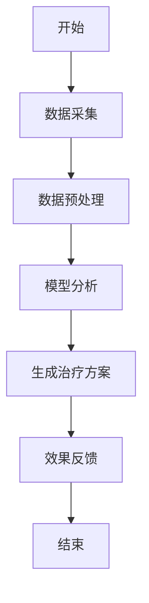
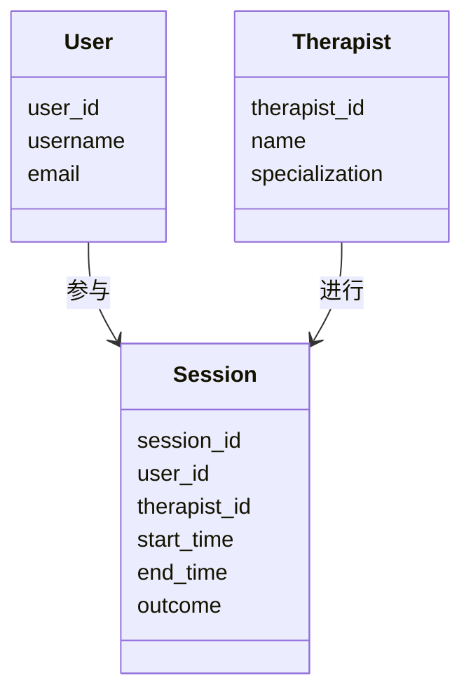
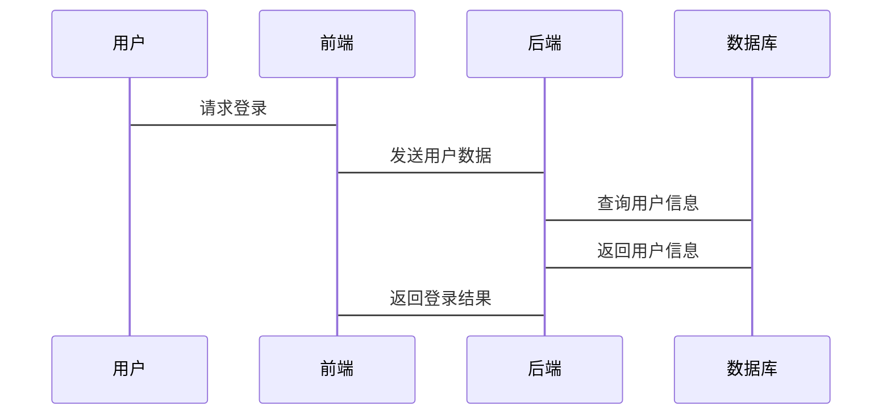

                 


# 企业估值中的AR/VR心理健康治疗平台评估

---

## 关键词：
- AR/VR
- 心理健康治疗
- 企业估值
- 系统架构
- 算法原理
- 项目实战

---

## 摘要：
本文将深入探讨AR/VR技术在心理健康治疗领域的应用及其对企业估值的影响。通过分析AR/VR技术的特点、优势与劣势，结合心理健康治疗的核心原理，提出一套基于AR/VR的心理健康治疗平台评估方法。本文将从算法原理、系统架构、项目实战等多个维度进行详细阐述，为企业的估值和决策提供技术支持。

---

# 第一部分: 企业估值中的AR/VR心理健康治疗平台背景与概念

## 第1章: AR/VR心理健康治疗平台的背景与问题背景

### 1.1 传统心理健康治疗的局限性
- **1.1.1 传统心理健康治疗的痛点**  
  传统心理健康治疗面临资源分配不均、治疗效果不稳定、患者参与度低等问题。  
- **1.1.2 传统心理健康治疗的边界与外延**  
  传统治疗方式主要依赖药物和心理疏导，难以覆盖复杂的心理问题。  
- **1.1.3 传统心理健康治疗的核心要素**  
  医生的经验、患者的配合度、治疗环境的舒适性等。

### 1.2 AR/VR技术在心理健康治疗中的应用前景
- **1.2.1 AR/VR技术的定义与特点**  
  AR（增强现实）通过叠加数字信息到真实环境中，提供沉浸式体验；VR（虚拟现实）则完全沉浸在一个虚拟世界中。  
- **1.2.2 AR/VR技术在心理健康治疗中的优势**  
  提供高度沉浸的治疗环境，增强患者参与度，便于医生实时监控患者状态。  
- **1.2.3 AR/VR技术在心理健康治疗中的劣势**  
  高昂的设备成本、技术门槛高、患者可能产生依赖性等。

### 1.3 问题描述与解决方案
- **1.3.1 问题背景**  
  心理健康问题日益严重，传统治疗方式难以满足需求。  
- **1.3.2 问题描述**  
  患者缺乏有效的治疗工具，医生难以量化治疗效果。  
- **1.3.3 问题解决路径**  
  引入AR/VR技术，提供个性化的治疗方案，实时量化治疗效果。  
- **1.3.4 问题边界与外延**  
  仅适用于部分心理健康问题，如焦虑症、PTSD等。

## 第2章: AR/VR心理健康治疗平台的核心概念与联系

### 2.1 核心概念原理
- **2.1.1 AR/VR技术的核心原理**  
  利用计算机图形学生成虚拟环境，通过传感器实时捕捉用户行为。  
- **2.1.2 心理健康治疗的核心原理**  
  基于心理学理论，通过行为矫正和认知重构改善患者的心理状态。

### 2.2 核心概念属性特征对比表格
| **属性**       | **AR/VR技术**                     | **心理健康治疗**                 |
|----------------|------------------------------------|----------------------------------|
| **核心技术**    | 计算机图形学、传感器技术          | 认知心理学、行为学              |
| **目标**        | 提供沉浸式体验                   | 改善患者心理状态                 |
| **适用场景**    | 心理治疗、康复训练               | 焦虑症、PTSD、社交恐惧症         |
| **效果评估**    | 实时数据采集与分析               | 主观评分与医生反馈              |

### 2.3 ER实体关系图
```mermaid
erDiagram
    user {
        user_id
        username
        email
    }
    therapist {
        therapist_id
        name
        specialization
    }
    session {
        session_id
        user_id
        therapist_id
        start_time
        end_time
        outcome
    }
    user --> session : 参与
    therapist --> session : 进行
```

---

## 第3章: AR/VR心理健康治疗平台的算法原理

### 3.1 算法原理概述
- **3.1.1 算法原理**  
  通过实时分析用户的生理数据（如心率、皮肤电反应）和行为数据（如位置、动作），结合预设的心理健康模型，生成个性化的治疗方案。  
- **3.1.2 算法流程**  
  数据采集 → 数据预处理 → 模型分析 → 治疗方案生成 → 效果反馈。

### 3.2 算法原理的数学模型和公式
- **数学模型**  
  $$ S = f(D) $$
  其中，S为治疗方案，D为用户数据。  
- **公式推导**  
  治疗效果评估公式：$$ E = \alpha D + \beta T $$
  其中，E为评估结果，D为用户数据，T为治疗方案，$\alpha$和$\beta$为权重系数。

### 3.3 算法流程图


### 3.4 算法实现代码
```python
def evaluate_effectiveness(user_data):
    # 数据预处理
    processed_data = preprocess(user_data)
    # 模型分析
    analysis_result = analyze(processed_data)
    # 生成治疗方案
    treatment_plan = generate_plan(analysis_result)
    return treatment_plan
```

### 3.5 通俗易懂的举例说明
例如，用户在VR环境中模拟社交场景，系统通过分析用户的生理数据和行为数据，生成个性化的社交恐惧症治疗方案。

---

## 第4章: AR/VR心理健康治疗平台的系统分析与架构设计

### 4.1 问题场景介绍
- **4.1.1 问题背景**  
  心理健康治疗需要实时反馈和个性化方案。  
- **4.1.2 问题描述**  
  如何设计一个高效的AR/VR心理健康治疗平台。  
- **4.1.3 问题解决路径**  
  采用模块化设计，整合AR/VR技术与心理健康模型。

### 4.2 系统功能设计
- **领域模型Mermaid类图**  


### 4.3 系统架构设计
- **Mermaid架构图**  


### 4.4 系统接口设计
- **接口描述**  
  RESTful API：提供用户认证、数据上传、治疗方案生成等功能。  
- **接口实现**  
  使用Django框架，编写API接口。

### 4.5 系统交互序列图


---

## 第5章: 项目实战

### 5.1 环境安装
- 安装Unity和相关VR开发工具。  
- 安装Python和必要的库（如numpy、pandas）。

### 5.2 系统核心实现源代码
```python
def preprocess(user_data):
    # 数据清洗和标准化
    return processed_data
```

### 5.3 代码应用解读与分析
- **代码功能**  
  预处理用户数据，确保数据的准确性和一致性。  
- **代码优化**  
  使用并行计算加速数据处理。

### 5.4 实际案例分析
- **案例背景**  
  患者患有焦虑症，需要通过VR技术进行治疗。  
- **案例分析**  
  系统生成个性化治疗方案，实时监控治疗效果。

### 5.5 项目小结
本章通过实际案例展示了如何将AR/VR技术应用于心理健康治疗，并详细解读了系统的实现过程。

---

## 第6章: 最佳实践 tips、小结、注意事项、拓展阅读

### 6.1 小结
本文从背景、核心概念、算法原理、系统设计到项目实战，全面介绍了AR/VR心理健康治疗平台的评估方法。

### 6.2 注意事项
- 数据隐私保护是关键，必须遵守相关法律法规。  
- 系统稳定性直接影响治疗效果，需确保技术的可靠性。

### 6.3 拓展阅读
推荐阅读相关领域的书籍和论文，深入了解AR/VR技术在医疗领域的应用。

---

## 作者：AI天才研究院/AI Genius Institute & 禅与计算机程序设计艺术 /Zen And The Art of Computer Programming

