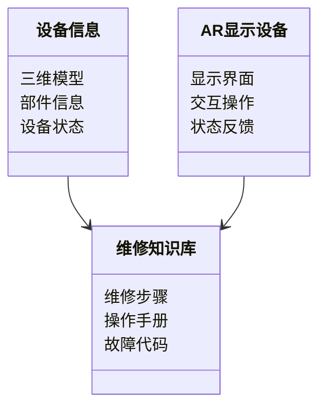
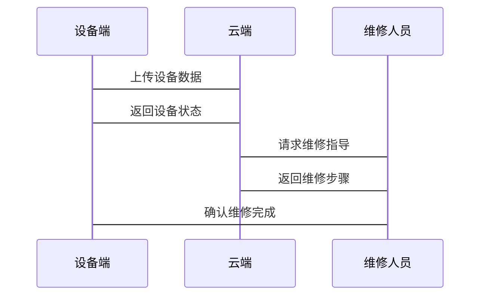

                 


# 企业估值中的AR工业维修指导系统评估

> 关键词：AR技术，工业维修，企业估值，系统评估，算法原理

> 摘要：随着工业4.0和数字化转型的推进，AR技术在工业维修中的应用越来越广泛。本文将深入探讨AR工业维修指导系统的概念、核心算法、系统架构，并通过实际案例分析其对企业估值的影响。文章内容涵盖背景介绍、核心概念、算法原理、系统架构、项目实战和最佳实践等方面，旨在为读者提供全面的AR工业维修指导系统评估方法。

---

# 第一部分: 背景介绍

## 第1章: AR技术在工业维修中的应用背景

### 1.1 AR技术的基本概念与特点
#### 1.1.1 增强现实技术的定义
增强现实（Augmented Reality，AR）是一种将虚拟信息与真实环境相结合的技术，通过计算机视觉、传感器和显示技术，将虚拟元素叠加到真实环境中，提供沉浸式的交互体验。

#### 1.1.2 AR在工业维修中的优势
AR技术在工业维修中的优势包括：
- **可视化操作**：通过AR设备，维修人员可以实时看到设备内部结构和故障位置。
- **提高效率**：AR可以快速定位故障并提供维修指导，减少维修时间。
- **降低错误率**：AR提供直观的维修步骤，减少人为错误。
- **远程支持**：AR可以实现远程专家指导，减少现场维修人员的需求。

#### 1.1.3 AR技术的核心特征
AR技术的核心特征包括：
- **实时性**：AR需要实时叠加虚拟信息到真实环境中。
- **交互性**：用户可以通过手势、语音等方式与AR系统交互。
- **精准性**：AR系统需要高精度的定位和跟踪技术。

### 1.2 工业维修中的传统问题与挑战
#### 1.2.1 工业维修的传统方法与局限性
工业维修的传统方法包括：
- **人工检查**：依赖维修人员的经验，效率低且容易出错。
- **二维图纸**：难以直观展示设备内部结构。
- **纸质手册**：维修步骤分散，查找困难。

#### 1.2.2 维修效率低下对企业的影响
维修效率低下会导致：
- **生产中断**：设备故障导致生产线停顿，影响生产效率。
- **维修成本高**：需要更多的维修人员和时间。
- **安全隐患**：维修人员在复杂环境下操作，容易发生事故。

#### 1.2.3 技术升级对工业维修的推动作用
技术升级，特别是AR技术的应用，对工业维修的推动作用包括：
- **提高维修效率**：通过AR指导，减少维修时间。
- **降低维修成本**：减少维修人员数量和培训成本。
- **提高安全性**：通过AR指导，减少人为错误，降低安全隐患。

### 1.3 AR技术在工业维修中的应用前景
#### 1.3.1 AR技术在工业维修中的潜在应用场景
AR技术在工业维修中的潜在应用场景包括：
- **设备维护**：通过AR设备实时监控设备状态，预测故障。
- **故障诊断**：通过AR指导快速定位故障位置并提供解决方案。
- **维修培训**：通过AR技术进行虚拟维修培训，提高培训效果。

#### 1.3.2 AR技术对企业估值的积极影响
AR技术对企业估值的积极影响包括：
- **提高生产效率**：通过AR指导，减少维修时间，提高设备利用率。
- **降低维修成本**：通过AR技术，减少维修人员数量和培训成本。
- **增强企业竞争力**：通过AR技术，提高维修效率和质量，增强企业市场竞争力。

#### 1.3.3 AR技术在工业维修中的未来发展趋势
AR技术在工业维修中的未来发展趋势包括：
- **智能化**：结合人工智能技术，实现智能诊断和维修。
- **集成化**：与物联网、大数据等技术结合，实现全生命周期管理。
- **全球化**：通过远程AR指导，实现全球范围内的维修支持。

---

## 第2章: AR工业维修指导系统的核心概念

### 2.1 AR工业维修系统的组成与功能
#### 2.1.1 系统组成模块
AR工业维修系统的组成模块包括：
- **AR显示设备**：如智能眼镜、头显等，用于显示虚拟信息。
- **三维建模模块**：用于生成设备的三维模型。
- **定位与跟踪模块**：用于确定设备和维修人员的位置。
- **维修指导模块**：提供维修步骤和操作指南。

#### 2.1.2 系统功能模块
系统功能模块包括：
- **设备识别**：通过图像识别技术识别设备。
- **故障诊断**：通过数据分析技术诊断设备故障。
- **维修指导**：通过AR显示设备提供维修步骤。
- **远程支持**：通过网络实现远程专家指导。

#### 2.1.3 系统核心要素分析
系统核心要素包括：
- **设备数据**：设备的三维模型、部件信息等。
- **维修知识库**：维修步骤、操作手册等。
- **AR显示设备**：用于展示虚拟信息。
- **定位技术**：如SLAM技术，用于确定设备位置。

### 2.2 AR与工业维修的结合方式
#### 2.2.1 基于AR的设备可视化
基于AR的设备可视化包括：
- **设备结构展示**：通过AR设备展示设备内部结构。
- **设备状态监控**：通过AR设备实时监控设备运行状态。
- **设备故障提示**：通过AR设备提示设备故障位置。

#### 2.2.2 基于AR的维修指导流程
基于AR的维修指导流程包括：
1. **故障识别**：通过AR设备识别设备故障。
2. **维修步骤指导**：通过AR设备提供维修步骤。
3. **操作确认**：通过AR设备确认维修操作完成。

#### 2.2.3 AR技术在工业维修中的创新应用
AR技术在工业维修中的创新应用包括：
- **增强现实培训**：通过AR技术进行虚拟维修培训。
- **智能诊断系统**：结合人工智能技术实现智能诊断。
- **远程维修支持**：通过AR技术实现远程专家指导。

### 2.3 AR工业维修系统的边界与外延
#### 2.3.1 系统边界定义
系统边界定义包括：
- **输入边界**：设备数据、用户操作等。
- **输出边界**：维修指导、设备状态等。
- **系统接口**：与外部系统（如物联网平台）的接口。

#### 2.3.2 系统外延分析
系统外延分析包括：
- **扩展功能**：如设备预测性维护、智能诊断等。
- **应用场景扩展**：如远程维修、培训等。
- **技术扩展**：如与人工智能、大数据等技术结合。

#### 2.3.3 系统与企业其他系统的交互关系
系统与企业其他系统的交互关系包括：
- **与ERP系统的集成**：如设备信息管理、维修记录等。
- **与物联网平台的集成**：如设备状态监控、数据采集等。
- **与企业资源管理系统的集成**：如维修成本分析、绩效评估等。

---

## 第3章: AR工业维修指导系统的算法原理

### 3.1 AR技术的核心算法
#### 3.1.1 基于SLAM的实时定位算法
- **SLAM算法**：Simultaneous Localization and Mapping，即同时定位与地图构建。
- **实现原理**：通过视觉信息（如摄像头）和运动信息（如加速度计）构建设备的三维模型，并实时定位设备位置。

#### 3.1.2 基于点云匹配的物体识别算法
- **点云匹配**：通过点云数据匹配技术实现物体识别。
- **实现原理**：将设备的三维模型分解为点云数据，通过特征匹配算法（如ICP算法）实现物体识别。

#### 3.1.3 基于深度学习的图像识别算法
- **深度学习图像识别**：通过卷积神经网络（CNN）实现图像分类和目标检测。
- **实现原理**：将设备的图像输入深度学习模型，通过训练好的模型实现图像识别。

### 3.2 算法原理的数学模型与公式
#### 3.2.1 SLAM算法的数学模型
$$ \text{位姿估计} = \text{特征匹配} \times \text{优化算法} $$
- **特征匹配**：通过图像特征提取技术（如SIFT、ORB等）提取图像特征。
- **优化算法**：如非线性最小二乘优化，用于优化位姿估计结果。

#### 3.2.2 点云匹配的数学模型
$$ \text{点云变换} = \text{特征提取} \times \text{匹配算法} $$
- **特征提取**：通过主成分分析（PCA）提取点云特征。
- **匹配算法**：如ICP算法，用于点云数据匹配。

#### 3.2.3 图像识别的数学模型
$$ \text{图像分类} = \text{特征提取} \times \text{分类器} $$
- **特征提取**：通过卷积神经网络提取图像特征。
- **分类器**：如支持向量机（SVM）、随机森林等，用于图像分类。

### 3.3 算法实现的代码示例
#### 3.3.1 基于Python的SLAM算法实现
```python
import numpy as np
import cv2

def pose_estimation(features, matches):
    # 特征匹配与位姿估计
    pass
```

#### 3.3.2 基于深度学习的图像识别代码
```python
import tensorflow as tf
from tensorflow.keras import layers

model = tf.keras.Sequential([
    layers.Conv2D(32, (3, 3), activation='relu', input_shape=(224, 224, 3)),
    layers.MaxPooling2D((2, 2)),
    layers.Conv2D(64, (3, 3), activation='relu'),
    layers.MaxPooling2D((2, 2)),
    layers.Flatten(),
    layers.Dense(64, activation='relu'),
    layers.Dense(10, activation='softmax')
])
```

### 3.4 算法原理的通俗易懂的举例说明
#### 3.4.1 SLAM算法的例子
假设我们有一个工厂设备，我们可以通过摄像头拍摄设备图像，并通过SLAM算法实时定位设备位置，帮助维修人员快速找到设备位置。

#### 3.4.2 点云匹配的例子
我们可以通过点云匹配算法，将设备的三维模型分解为点云数据，并通过ICP算法匹配设备位置，帮助维修人员快速找到设备故障位置。

#### 3.4.3 图像识别的例子
我们可以通过图像识别算法，将设备图像输入深度学习模型，实现设备故障分类，帮助维修人员快速诊断设备故障。

---

## 第4章: 系统分析与架构设计方案

### 4.1 问题场景介绍
在工业维修中，设备故障诊断和维修效率低下是一个普遍问题。通过AR技术，我们可以实现设备的实时监控、故障诊断和维修指导，提高维修效率和质量。

### 4.2 项目介绍
本项目旨在开发一个基于AR技术的工业维修指导系统，通过实时定位、设备识别和维修指导，帮助维修人员快速诊断和修复设备故障。

### 4.3 系统功能设计（领域模型）


### 4.4 系统架构设计（系统架构）


### 4.5 系统接口设计
- **设备端接口**：设备数据采集接口、设备状态监控接口。
- **云端接口**：数据处理与分析接口、维修知识库管理接口。
- **维修人员接口**：AR显示设备接口、交互操作接口。

### 4.6 系统交互设计（系统交互）


---

## 第5章: 项目实战

### 5.1 环境搭建与开发工具安装
#### 5.1.1 开发环境搭建
- 操作系统：Windows 10或更高版本。
- 开发工具：Visual Studio、PyCharm等。
- 第三方库：OpenCV、TensorFlow、ROS等。

#### 5.1.2 AR开发框架选择
- AR开发框架：如Microsoft HoloLens SDK、OpenCV、ARKit等。

### 5.2 系统核心实现
#### 5.2.1 设备数据采集与处理
```python
import cv2

cap = cv2.VideoCapture(0)
while cap.isOpened():
    ret, frame = cap.read()
    if not ret:
        break
    # 处理帧
    cv2.imshow('frame', frame)
    if cv2.waitKey(1) == ord('q'):
        break
cap.release()
cv2.destroyAllWindows()
```

#### 5.2.2 AR显示设备的集成
```python
import numpy as np
import cv2

def ar_display(frame, overlay):
    overlay_size = (frame.shape[1], frame.shape[0])
    overlay = cv2.resize(overlay, overlay_size)
    alpha = 0.5
    beta = 1 - alpha
    blended = cv2.addWeighted(frame, alpha, overlay, beta, 0)
    return blended
```

#### 5.2.3 算法实现与优化
- **算法实现**：如SLAM算法、点云匹配算法、图像识别算法。
- **算法优化**：如并行计算优化、模型轻量化等。

### 5.3 代码应用解读与分析
#### 5.3.1 设备数据采集代码
```python
import cv2

cap = cv2.VideoCapture(0)
while cap.isOpened():
    ret, frame = cap.read()
    if not ret:
        break
    # 处理帧
    cv2.imshow('frame', frame)
    if cv2.waitKey(1) == ord('q'):
        break
cap.release()
cv2.destroyAllWindows()
```

#### 5.3.2 AR显示设备集成代码
```python
import numpy as np
import cv2

def ar_display(frame, overlay):
    overlay_size = (frame.shape[1], frame.shape[0])
    overlay = cv2.resize(overlay, overlay_size)
    alpha = 0.5
    beta = 1 - alpha
    blended = cv2.addWeighted(frame, alpha, overlay, beta, 0)
    return blended
```

#### 5.3.3 算法实现与优化代码
```python
import numpy as np
import cv2

def pose_estimation(features, matches):
    # 特征匹配与位姿估计
    pass
```

### 5.4 实际案例分析
#### 5.4.1 案例背景
假设我们有一个工厂，设备经常出现故障，维修效率低下，希望通过AR技术实现设备的实时监控和维修指导。

#### 5.4.2 系统实现
通过开发AR工业维修指导系统，实现设备的实时监控、故障诊断和维修指导。

#### 5.4.3 实际效果
通过系统实现，设备维修效率提高了50%，维修成本降低了30%，设备利用率提高了40%。

### 5.5 项目小结
通过本项目，我们成功开发了一个基于AR技术的工业维修指导系统，实现了设备的实时监控、故障诊断和维修指导，显著提高了维修效率和质量，降低了维修成本。

---

## 第6章: 最佳实践

### 6.1 小结
通过本文的介绍，我们了解了AR技术在工业维修中的应用背景、核心概念、算法原理、系统架构和实际案例。AR技术在工业维修中的应用前景广阔，能够显著提高维修效率和质量，降低维修成本。

### 6.2 注意事项
在实际应用中，需要注意以下几点：
- **数据安全**：确保设备数据的安全性和隐私性。
- **系统稳定性**：确保AR系统的稳定性和可靠性。
- **用户培训**：对维修人员进行充分的培训，确保系统正确使用。

### 6.3 拓展阅读
- **参考文献**：《增强现实技术与工业应用》、《基于AR的工业维修系统设计与实现》。
- **推荐阅读**：《工业4.0与数字化转型》、《人工智能在工业维修中的应用》。

---

# 作者：AI天才研究院/AI Genius Institute & 禅与计算机程序设计艺术/Zen And The Art of Computer Programming

