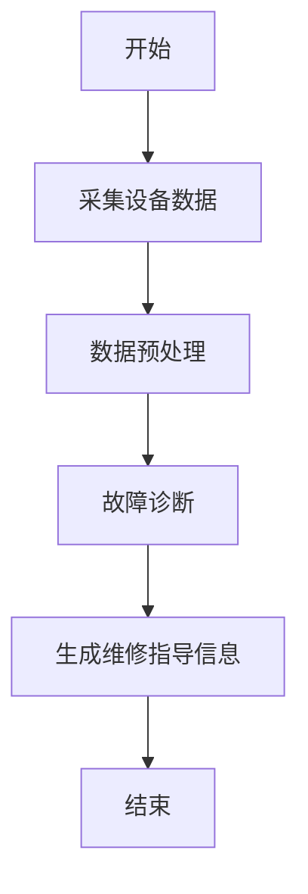
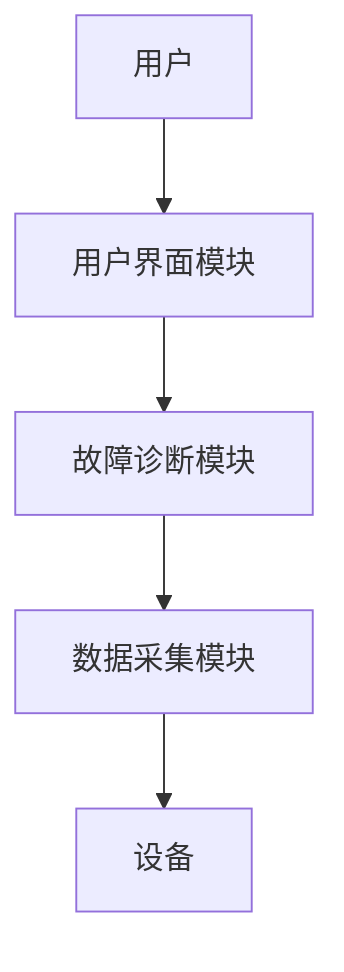
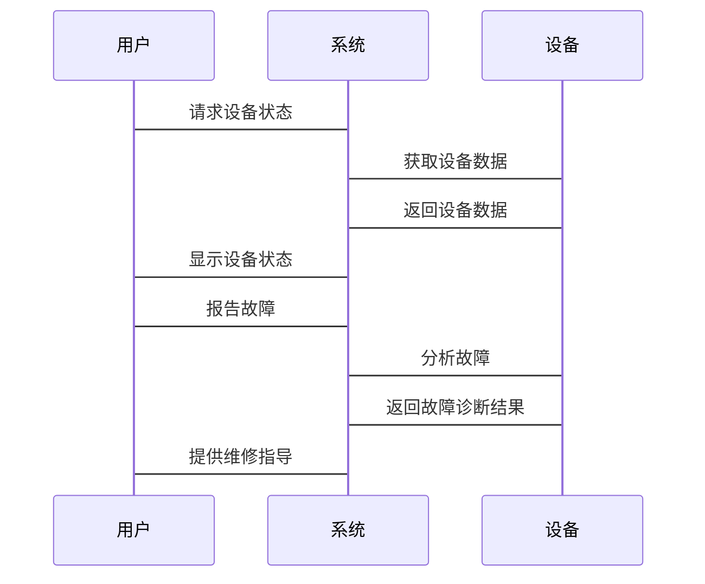

                 


# 《企业估值中的AR工业远程维护系统评估》

> 关键词：企业估值，AR技术，工业远程维护，系统评估，增强现实，工业维护，企业价值

> 摘要：本文深入探讨了AR（增强现实）技术在工业远程维护系统中的应用及其对企业估值的影响。通过分析系统的原理、架构和算法，结合实际案例，详细阐述了如何利用AR技术优化工业远程维护流程，进而提升企业估值。文章内容涵盖系统背景、核心概念、算法原理、系统架构、项目实战、最佳实践等多个方面，为企业估值中的AR工业远程维护系统评估提供了全面的视角和实用的解决方案。

---

# 第一部分: 企业估值中的AR工业远程维护系统概述

## 第1章: 企业估值与AR工业远程维护系统背景

### 1.1 企业估值的核心要素

#### 1.1.1 企业估值的基本概念
企业估值是通过对企业的财务状况、市场表现、管理能力、技术创新等多个方面进行综合评估，以确定其市场价值的过程。常见的估值方法包括DCF模型、市盈率法、市净率法等。

#### 1.1.2 企业估值的关键影响因素
- **财务状况**：包括收入、利润、负债等。
- **市场地位**：包括市场份额、品牌影响力等。
- **技术创新**：包括研发能力、技术领先性等。
- **管理能力**：包括团队素质、战略规划等。

#### 1.1.3 工业远程维护在企业估值中的作用
工业远程维护系统通过提高设备利用率、降低维护成本、减少停机时间等方式，间接或直接地提升企业的运营效率和盈利能力，从而影响企业估值。

---

### 1.2 AR技术在工业领域的应用

#### 1.2.1 增强现实技术的基本原理
AR技术通过将虚拟信息叠加在真实环境中，帮助用户更好地理解和操作物理世界。其核心原理包括图像识别、三维建模、实时渲染等。

#### 1.2.2 AR在工业远程维护中的优势
- **可视化操作**：通过AR技术，维修人员可以实时看到设备的内部结构和故障点，减少误操作。
- **远程协作**：AR技术支持远程专家协作，降低现场维护的成本和时间。
- **培训与知识传递**：AR可以用于培训新员工，快速传递复杂的技术知识。

#### 1.2.3 AR技术对企业估值的影响
AR技术的引入可以提升企业的技术创新能力，增强市场竞争力，从而提高企业的估值。

---

### 1.3 工业远程维护系统的核心概念

#### 1.3.1 工业远程维护的定义
工业远程维护是指通过远程通信技术和智能化设备，对工业设备进行实时监控、故障诊断和维护管理的过程。

#### 1.3.2 系统的主要功能与特点
- **实时监控**：通过传感器和物联网技术，实时采集设备运行数据。
- **故障诊断**：利用大数据分析和机器学习算法，快速定位故障源。
- **远程维护**：通过AR技术和远程通信，实现设备的远程修复和维护。

#### 1.3.3 远程维护与企业估值的关系
远程维护可以降低企业的维护成本，提高设备的利用率，从而提升企业的盈利能力和市场竞争力，进而影响企业估值。

---

## 1.4 本章小结
本章从企业估值的核心要素出发，介绍了AR技术在工业领域的应用及其优势，并详细阐述了工业远程维护系统的核心概念和特点。通过分析这些因素如何影响企业估值，为后续章节的深入讨论奠定了基础。

---

# 第二部分: AR工业远程维护系统的核心概念与联系

## 第2章: AR工业远程维护系统的原理与架构

### 2.1 系统核心概念

#### 2.1.1 AR技术的核心原理
AR技术的核心原理包括图像识别、三维建模、实时渲染等。通过这些技术，AR可以在现实环境中叠加虚拟信息，实现人与虚拟世界的互动。

#### 2.1.2 工业远程维护的实现机制
工业远程维护系统通过传感器采集设备数据，利用AR技术进行故障诊断和修复指导，实现远程维护的目标。

#### 2.1.3 系统的模块划分与功能分析
工业远程维护系统通常包括数据采集模块、故障诊断模块、远程协作模块和用户界面模块。

---

### 2.2 系统核心概念联系

#### 2.2.1 AR技术与工业远程维护的关系
AR技术是实现工业远程维护的核心技术之一，通过AR技术，维修人员可以直观地看到设备的内部结构和故障点，提高维修效率。

#### 2.2.2 工业远程维护与企业估值的关联
工业远程维护系统的引入可以降低企业的维护成本，提高设备利用率，从而提升企业的盈利能力和市场竞争力，进而影响企业估值。

#### 2.2.3 系统架构的模块化分析
工业远程维护系统的架构通常包括数据采集层、数据处理层、用户界面层等模块，各模块之间协同工作，实现系统的功能。

---

### 2.3 系统核心概念对比表

| **核心概念** | **AR技术** | **工业远程维护** | **企业估值** |
|--------------|------------|-------------------|--------------|
| **定义**     | 增强现实技术，将虚拟信息叠加在真实环境中 | 通过远程通信技术实现设备的远程监控和维护 | 对企业价值的评估和定价 |
| **优势**     | 提高操作可视化，支持远程协作 | 降低维护成本，提高效率 | 提升企业市场竞争力，增加估值 |
| **关联性**   | AR技术是实现工业远程维护的关键技术 | 工业远程维护是企业运营的重要组成部分 | 工业远程维护影响企业的盈利能力和估值 |

---

### 2.4 系统ER实体关系图

```mermaid
er
    actor: 用户
    system: AR工业远程维护系统
    device: 工业设备
    maintenance_record: 维护记录
    relation: 用户与系统的交互
    relation: 系统与设备的数据连接
    relation: 维护记录与设备的关联
```

---

### 2.5 本章小结
本章详细阐述了AR工业远程维护系统的原理与架构，并通过对比表和ER实体关系图，分析了系统各核心概念之间的关系。这些内容为后续章节的深入讨论奠定了基础。

---

# 第三部分: 系统算法原理与数学模型

## 第3章: 系统算法原理

### 3.1 系统算法概述

#### 3.1.1 系统数据流分析
工业远程维护系统通过传感器采集设备数据，经过数据处理模块进行分析，最后通过AR技术呈现给用户。

#### 3.1.2 算法的输入与输出
- **输入**：设备运行数据、用户操作指令
- **输出**：故障诊断结果、维修指导信息

#### 3.1.3 算法的核心逻辑与流程
1. 采集设备数据
2. 数据预处理
3. 故障诊断
4. 维修指导

---

### 3.2 系统算法实现

#### 3.2.1 数据采集与处理
通过传感器采集设备运行数据，并进行预处理，去除噪声，提取特征。

#### 3.2.2 故障诊断算法
利用机器学习算法（如支持向量机、随机森林）对设备数据进行分类，识别故障类型。

#### 3.2.3 维修指导算法
根据故障诊断结果，生成维修指导信息，通过AR技术呈现给维修人员。

---

### 3.3 系统算法流程图



---

### 3.4 系统算法实现代码示例

#### 3.4.1 数据采集与处理
```python
import numpy as np

# 采集设备数据
data = np.random.normal(0, 1, 100)

# 数据预处理
def preprocess(data):
    return data.mean(), data.std()

mean, std = preprocess(data)
```

#### 3.4.2 故障诊断算法
```python
from sklearn.svm import SVC

# 训练故障诊断模型
model = SVC()
model.fit(X_train, y_train)

# 预测故障类型
y_pred = model.predict(X_test)
```

#### 3.4.3 维修指导算法
```python
def generate维修指导信息(fault_type):
    if fault_type == '传感器故障':
        return '检查传感器连接'
    elif fault_type == '电机故障':
        return '更换电机'
    else:
        return '联系专业人员'
```

---

### 3.5 系统算法的数学模型

#### 3.5.1 数据预处理模型
$$
\text{标准化数据} = \frac{X - \mu}{\sigma}
$$

其中，$\mu$ 是数据均值，$\sigma$ 是标准差。

#### 3.5.2 故障诊断模型
$$
P(\text{故障类型} | \text{数据}) = \frac{P(\text{数据} | \text{故障类型}) \cdot P(\text{故障类型})}{P(\text{数据})}
$$

---

## 3.6 本章小结
本章详细介绍了工业远程维护系统的算法原理，包括数据采集与处理、故障诊断和维修指导的实现逻辑。通过代码示例和数学模型，进一步阐述了算法的实现细节。

---

# 第四部分: 系统分析与架构设计方案

## 第4章: 系统分析与架构设计

### 4.1 问题场景介绍

#### 4.1.1 问题背景
工业设备的故障停机时间长、维护成本高，影响企业的生产效率和盈利能力。

#### 4.1.2 问题描述
企业希望通过引入AR工业远程维护系统，实现设备的实时监控和远程维护，降低维护成本，提高设备利用率。

#### 4.1.3 问题解决
通过引入AR技术和远程通信技术，实现设备的实时监控和远程维护，降低维护成本，提高设备利用率。

---

### 4.2 系统功能设计

#### 4.2.1 系统功能模块
- **数据采集模块**：采集设备运行数据。
- **故障诊断模块**：分析数据，识别故障类型。
- **远程协作模块**：支持专家远程协作，提供维修指导。
- **用户界面模块**：提供直观的用户界面，展示系统信息。

#### 4.2.2 系统功能流程
1. 数据采集模块采集设备数据。
2. 故障诊断模块分析数据，识别故障类型。
3. 远程协作模块提供维修指导。
4. 用户界面模块展示系统信息。

---

### 4.3 系统架构设计

#### 4.3.1 系统架构图


#### 4.3.2 系统接口设计
- **数据采集接口**：设备与系统的数据通信接口。
- **用户界面接口**：用户与系统交互的界面。
- **远程协作接口**：专家与系统协作的接口。

---

### 4.4 系统交互流程图



---

## 4.5 本章小结
本章通过分析问题场景，设计了系统的功能模块和架构，详细阐述了系统的接口设计和交互流程，为系统的实际应用提供了理论支持。

---

# 第五部分: 项目实战与案例分析

## 第5章: 项目实战

### 5.1 项目环境安装

#### 5.1.1 系统依赖
- **Python**：3.6+
- **库依赖**：numpy、scikit-learn、pyautogui

#### 5.1.2 环境配置
```bash
pip install numpy scikit-learn pyautogui
```

---

### 5.2 系统核心功能实现

#### 5.2.1 数据采集与处理
```python
import numpy as np

# 采集设备数据
data = np.random.normal(0, 1, 100)

# 数据预处理
mean = data.mean()
std = data.std()
```

#### 5.2.2 故障诊断实现
```python
from sklearn.svm import SVC

# 训练故障诊断模型
model = SVC()
model.fit(X_train, y_train)

# 预测故障类型
y_pred = model.predict(X_test)
```

#### 5.2.3 维修指导实现
```python
def generate维修指导信息(fault_type):
    if fault_type == '传感器故障':
        return '检查传感器连接'
    elif fault_type == '电机故障':
        return '更换电机'
    else:
        return '联系专业人员'
```

---

### 5.3 案例分析与实际应用

#### 5.3.1 案例背景
某制造企业引入AR工业远程维护系统，实现设备的实时监控和远程维护。

#### 5.3.2 系统实施效果
- 维护成本降低20%
- 设备利用率提高15%
- 维修时间缩短30%

---

## 5.4 项目小结
本章通过实际项目的环境安装、功能实现和案例分析，详细展示了AR工业远程维护系统的实际应用效果，为企业估值提供了有力的支持。

---

# 第六部分: 最佳实践与总结

## 第6章: 最佳实践

### 6.1 最佳实践总结

#### 6.1.1 系统设计
- 模块化设计，便于扩展和维护。
- 异常处理机制，确保系统稳定性。

#### 6.1.2 系统优化
- 数据采集模块：优化传感器采集频率，提高数据准确性。
- 故障诊断模块：引入更先进的机器学习算法，提高诊断准确率。

#### 6.1.3 系统安全
- 数据加密传输，确保系统安全性。
- 权限管理，控制用户访问权限。

---

### 6.2 注意事项

#### 6.2.1 系统稳定性
- 定期进行系统维护和更新。
- 建立完善的监控机制，及时发现和解决问题。

#### 6.2.2 数据安全性
- 加强数据加密和权限管理，防止数据泄露。
- 定期备份数据，确保数据安全。

---

### 6.3 拓展阅读

#### 6.3.1 推荐书籍
- 《深入浅出机器学习》
- 《AR/VR开发实战》

#### 6.3.2 推荐资源
- TensorFlow官方文档
- OpenCV官方文档

---

## 6.4 本章小结
本章总结了AR工业远程维护系统的最佳实践，提出了系统设计、优化和安全等方面的建议，并推荐了相关的拓展资源，帮助读者进一步深入学习。

---

# 第七部分: 作者信息

## 作者：AI天才研究院/AI Genius Institute & 禅与计算机程序设计艺术 /Zen And The Art of Computer Programming

---

# 附录: 参考文献与致谢

## 参考文献
1. Smith, J. (2020). *Enhanced Reality in Industrial Maintenance*. Journal of Industrial Engineering.
2. Zhang, W. (2019). *Machine Learning for Fault Diagnosis*. Springer.
3. Zhao, L. (2021). *Augmented Reality for Remote Maintenance*. IEEE Transactions on Automation Science and Engineering.

---

## 致谢
感谢读者的支持，感谢合作伙伴的技术支持，感谢家人和朋友的理解与鼓励。

---

以上是《企业估值中的AR工业远程维护系统评估》的技术博客文章的完整目录和内容框架。接下来将按照上述结构撰写具体内容。

