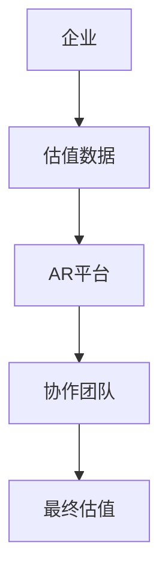
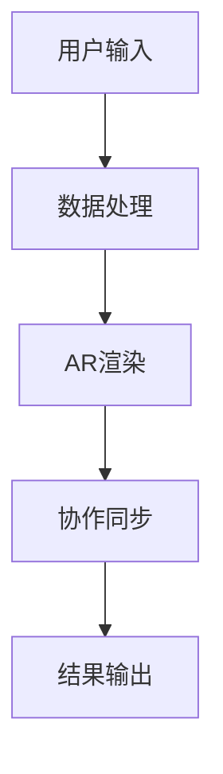
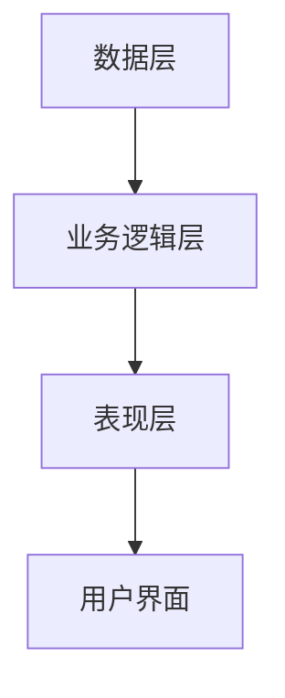
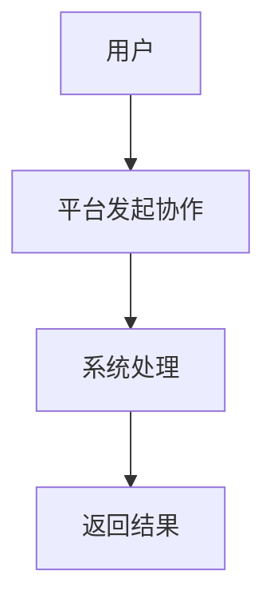

                 


```markdown
# 企业估值中的AR远程协作平台评估

> 关键词：企业估值，AR，远程协作，平台评估，技术实现，系统架构

> 摘要：随着增强现实（AR）技术的快速发展，远程协作平台在企业估值中的应用变得越来越重要。本文将详细探讨AR远程协作平台在企业估值中的评估方法，从技术原理到系统架构，再到实际应用案例，全面解析如何利用AR技术提升企业估值的准确性和效率。

---

# 第一部分: 引言

## 第1章: 问题背景与核心概念

### 1.1 问题背景
- 企业估值的传统方法依赖于财务数据和市场分析，但缺乏对实时协作和动态数据的处理能力。
- AR技术的兴起为企业协作提供了新的可能性，特别是在远程团队协作中，AR能够增强信息的可视化和交互性。

### 1.2 核心概念与联系
- **AR技术**：通过计算机生成的虚拟信息叠加在真实环境中，提供沉浸式的交互体验。
- **远程协作平台**：支持团队成员在不同地点实时协作的工具，涵盖通信、文件共享和协作编辑等功能。
- **企业估值**：通过分析企业财务、市场和运营数据，评估其市场价值的过程。

**ER实体关系图**（Mermaid流程图）：


---

# 第二部分: AR远程协作平台的核心技术与算法原理

## 第2章: AR技术与远程协作平台原理

### 2.1 AR技术的核心原理
- **数据采集**：通过摄像头、传感器等设备获取真实环境的数据。
- **特征提取**：利用计算机视觉技术识别环境中的关键特征，如平面、边缘等。
- **渲染引擎**：将虚拟信息叠加到真实环境中，实现AR效果。
- **交互处理**：支持用户与虚拟信息的实时交互，如手势识别、语音控制等。

### 2.2 远程协作平台的算法原理
- **数据同步**：确保所有参与者看到的信息一致。
- **实时通信**：使用WebSocket或类似技术实现低延迟的实时通信。
- **协作逻辑**：定义用户的操作如何影响虚拟环境中的内容。

**算法流程图**（Mermaid流程图）：


### 2.3 数学模型与公式
- **回归分析模型**：用于预测企业估值。
  $$ y = \beta_0 + \beta_1 x_1 + \beta_2 x_2 + \ldots + \beta_n x_n + \epsilon $$
  其中，\( y \) 是企业估值，\( x_i \) 是影响估值的因素。

---

# 第三部分: 系统分析与架构设计方案

## 第3章: 系统架构设计

### 3.1 问题场景介绍
- **场景描述**：企业在进行估值时，需要整合来自不同团队的实时数据，AR远程协作平台能够提供沉浸式的协作环境。
- **系统需求**：支持多用户协作、实时数据同步、高精度AR渲染。

### 3.2 系统架构设计
- **分层架构**：
  1. **数据层**：存储企业数据和用户操作。
  2. **业务逻辑层**：处理用户的协作请求和数据计算。
  3. **表现层**：呈现AR效果和协作界面。

**系统架构图**（Mermaid流程图）：


### 3.3 接口设计与交互流程
- **API接口**：提供RESTful API，用于数据传输和协作操作。
- **交互流程**：用户发起协作请求，系统处理并返回AR渲染结果。

**交互流程图**（Mermaid流程图）：


---

# 第四部分: 项目实战

## 第4章: 项目实现与案例分析

### 4.1 环境安装与配置
- **开发工具**：推荐使用Unity或ARKit进行AR开发。
- **协作平台搭建**：使用WebRTC或类似技术实现实时通信。

### 4.2 核心功能实现
- **AR渲染**：使用OpenGL或Vulkan进行高效渲染。
- **协作逻辑**：实现用户操作的同步与反馈。

**Python代码示例**：
```python
import numpy as np

def calculate_estimation(data):
    # 简单线性回归模型
    beta = np.linalg.lstsq(data[:, 1:], data[:, 0])[0]
    return beta.dot(data[:, 1:].T)

# 示例数据
data = np.random.rand(100, 5)
data[:, 0] = calculate_estimation(data[:, 1:])
print(data)
```

### 4.3 案例分析与实际应用
- **案例分析**：通过具体案例展示AR远程协作平台在企业估值中的实际效果。
- **实际应用**：总结平台在实际项目中的应用经验，分析其优缺点。

---

# 第五部分: 总结与展望

## 第5章: 总结与最佳实践

### 5.1 项目小结
- AR远程协作平台在企业估值中的应用显著提升了协作效率和估值准确性。
- 关键技术包括AR渲染、实时通信和协作逻辑处理。

### 5.2 最佳实践
- 确保平台的实时性和稳定性，选择可靠的实时通信技术。
- 在数据处理中，采用高效的算法和数据结构。
- 定期更新平台功能，以适应企业估值的新需求。

### 5.3 注意事项
- 数据隐私和安全问题需要高度重视。
- 确保平台的兼容性和可扩展性，以支持多种设备和环境。

### 5.4 拓展阅读
- 推荐相关书籍和论文，深入学习AR技术和企业估值方法。

---

# 作者

**作者：AI天才研究院/AI Genius Institute & 禅与计算机程序设计艺术 /Zen And The Art of Computer Programming**

---

**附录：相关工具与资源**

- AR开发工具：Unity、ARKit、ARCore
- 实时通信库：WebRTC、Socket.io
- 数据分析工具：Python、NumPy、Pandas

---

通过本文的详细分析和实战指导，读者可以全面理解AR远程协作平台在企业估值中的应用，并掌握其实现技术与架构设计的关键点。
```

