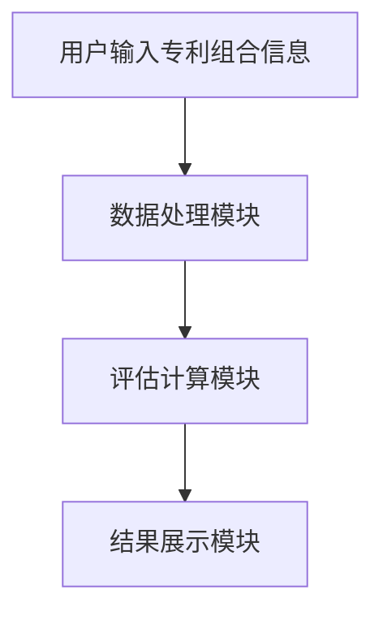
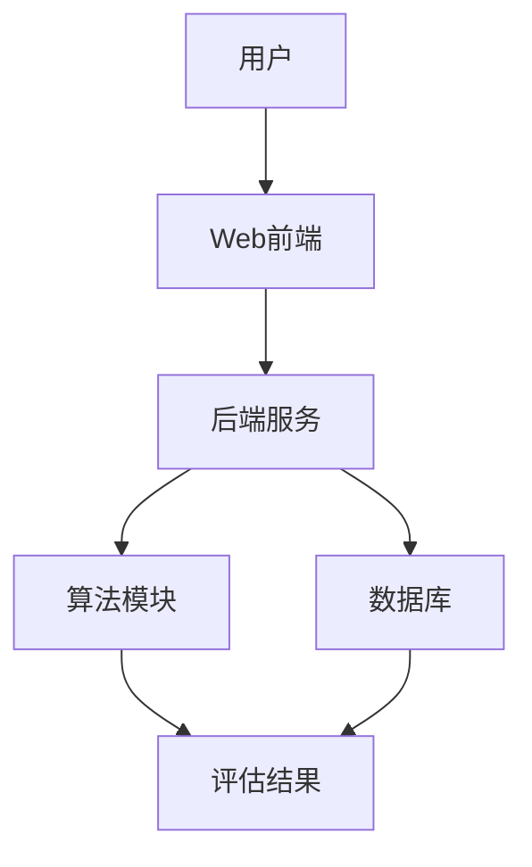
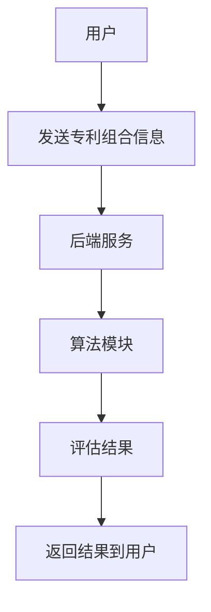

                 


# 企业估值中的专利组合价值评估

> 关键词：企业估值，专利组合，知识产权评估，价值评估，技术分析，法律分析，商业价值

> 摘要：本文系统地探讨了企业估值中的专利组合价值评估问题，分析了专利组合的基本概念、核心要素、评估方法和数学模型，结合实际案例，深入浅出地阐述了如何科学、合理地评估专利组合的价值，为企业决策提供参考。文章内容涵盖专利组合的价值评估背景、核心概念、算法原理、系统架构设计以及项目实战分析，通过详细的技术分析和数学推导，提供了完整的解决方案。

---

# 第一部分：企业估值中的专利组合价值评估基础

## 第1章：专利组合价值评估的背景与重要性

### 1.1 专利的基本概念与特征

#### 1.1.1 专利的定义与分类
- 专利的定义：专利是法律保护的知识产权，用于保护发明创造。
- 专利的分类：发明专利、实用新型专利、外观设计专利。
- 专利的生命周期：申请、审查、授权、维护、终止。

#### 1.1.2 专利在企业中的作用
- 专利是企业的核心资产之一。
- 专利可以保护企业的技术创新成果。
- 专利可以作为企业市场竞争的武器。
- 专利可以为企业带来直接的经济收益。

#### 1.1.3 专利组合的定义与特点
- 专利组合：一组相互关联的专利，共同保护企业的技术创新成果。
- 专利组合的特点：互补性、协同性、防御性。

### 1.2 专利组合在企业估值中的重要性

#### 1.2.1 专利组合对企业价值的影响
- 专利组合可以提升企业的市场竞争力。
- 专利组合可以增加企业的无形资产价值。
- 专利组合可以为企业带来长期的经济收益。

#### 1.2.2 专利组合在企业融资中的作用
- 专利组合可以作为企业融资的质押资产。
- 专利组合可以提升企业的信用评级。
- 专利组合可以为企业吸引更多的投资者。

#### 1.2.3 专利组合在企业并购中的应用
- 专利组合可以作为企业并购的核心资产。
- 专利组合可以评估企业并购的合理价格。
- 专利组合可以降低企业并购的风险。

### 1.3 专利组合价值评估的边界与外延

#### 1.3.1 专利组合价值评估的范围
- 评估范围：专利的数量、质量、技术领域分布、法律状态等。
- 评估边界：专利的有效性、专利的可执行性、专利的市场价值。

#### 1.3.2 专利组合价值评估的限制
- 评估限制：专利的法律风险、专利的技术风险、专利的市场风险。
- 评估外延：专利组合的经济价值、专利组合的商业价值、专利组合的战略价值。

#### 1.3.3 专利组合价值评估的外部因素
- 技术发展：技术的更新换代会影响专利组合的价值。
- 市场需求：市场需求的变化会影响专利组合的经济价值。
- 法律环境：法律环境的变化会影响专利组合的法律风险。

### 1.4 本章小结
本章介绍了专利的基本概念与特征，分析了专利组合在企业估值中的重要性，并探讨了专利组合价值评估的边界与外延，为后续章节的分析奠定了基础。

---

# 第二部分：专利组合价值评估的核心概念与联系

## 第2章：专利组合价值评估的核心要素

### 2.1 专利组合的构成要素

#### 2.1.1 专利的数量与质量
- 专利的数量：专利数量越多，专利组合的覆盖范围越广。
- 专利的质量：高价值专利可以显著提升专利组合的整体价值。
- 专利的数量与质量的平衡：需要根据企业的实际情况进行优化。

#### 2.1.2 专利的技术领域分布
- 技术领域的广度：专利组合覆盖的技术领域越广，企业的技术布局越全面。
- 技术领域的深度：专利组合在某些技术领域的深度越深，企业的技术优势越明显。
- 技术领域的协调性：专利组合的技术领域分布需要与企业的战略目标一致。

#### 2.1.3 专利的法律状态
- 专利的法律状态：专利的授权状态、专利的剩余期限、专利的法律纠纷等。
- 专利的法律风险：专利的无效风险、专利的侵权风险、专利的转让风险。

### 2.2 专利组合的价值评估模型

#### 2.2.1 专利组合价值的层次模型
- 专利组合价值的层次模型：从基础专利到核心专利，再到战略专利的层次结构。
- 专利组合价值的层次模型的构建：需要结合专利的技术价值、经济价值和战略价值。

#### 2.2.2 专利组合价值的影响因素
- 技术因素：专利的技术先进性、技术成熟度、技术应用前景。
- 经济因素：专利的市场价值、专利的经济收益、专利的经济风险。
- 战略因素：专利组合的战略目标、战略布局、战略协同。

#### 2.2.3 专利组合价值评估的公式推导
- 专利组合价值评估的基本公式：$$ V = \sum_{i=1}^{n} v_i $$
- 专利组合价值的加权公式：$$ V = \sum_{i=1}^{n} w_i v_i $$
- 专利组合价值的修正公式：$$ V = \sum_{i=1}^{n} w_i v_i \times \alpha $$
  其中，$$ \alpha $$ 为调整系数，用于考虑外部因素的影响。

### 2.3 专利组合价值与企业价值的关系

#### 2.3.1 专利组合对企业竞争力的影响
- 专利组合的竞争力：专利组合的技术优势、市场优势、法律优势。
- 专利组合对企业市场地位的影响：专利组合可以提升企业的市场地位，增强企业的竞争优势。

#### 2.3.2 专利组合对企业市场价值的影响
- 专利组合的市场价值：专利组合的经济价值、市场影响力、品牌价值。
- 专利组合对企业市值的影响：高价值的专利组合可以显著提升企业的市值。

#### 2.3.3 专利组合对企业长期价值的影响
- 专利组合的长期价值：专利组合的持续创新、技术积累、战略协同。
- 专利组合对企业可持续发展的支持：专利组合可以为企业提供长期的技术支持和市场保障。

### 2.4 本章小结
本章分析了专利组合的核心要素，构建了专利组合价值的层次模型，并探讨了专利组合价值与企业价值的关系，为后续的专利组合价值评估提供了理论依据。

---

# 第三部分：专利组合价值评估的算法原理与数学模型

## 第3章：专利组合价值评估的算法原理

### 3.1 专利组合价值评估的基本算法

#### 3.1.1 基于层次分析法的专利组合价值评估
- 层次分析法的基本原理：将复杂的决策问题分解为多个层次，通过比较判断矩阵确定各层次的权重。
- 层次分析法的步骤：
  1. 构建层次结构。
  2. 建立比较判断矩阵。
  3. 计算各层次的权重。
  4. 进行一致性检验。
  5. 确定最终的评估结果。

#### 3.1.2 基于模糊综合评价的专利组合价值评估
- 模糊综合评价的基本原理：将模糊因素引入到综合评价中，通过模糊集的运算进行评估。
- 模糊综合评价的步骤：
  1. 确定评价指标。
  2. 建立模糊评价矩阵。
  3. 计算各指标的模糊权重。
  4. 进行模糊综合评价。
  5. 确定最终的评估结果。

#### 3.1.3 基于神经网络的专利组合价值预测
- 神经网络的基本原理：通过多层神经网络进行非线性拟合，实现专利组合价值的预测。
- 神经网络的步骤：
  1. 确定输入层和输出层。
  2. 确定隐含层的结构。
  3. 初始化网络参数。
  4. 训练网络模型。
  5. 预测专利组合价值。

### 3.2 专利组合价值评估的数学模型

#### 3.2.1 专利组合价值的线性回归模型
- 线性回归模型的基本形式：$$ V = \beta_0 + \beta_1 x_1 + \beta_2 x_2 + \dots + \beta_n x_n $$
- 线性回归模型的假设：线性性、独立性、正态性、同方差性。

#### 3.2.2 专利组合价值的非线性回归模型
- 非线性回归模型的基本形式：$$ V = f(x_1, x_2, \dots, x_n) $$
- 非线性回归模型的应用：当专利组合价值与技术领域的分布、专利的法律状态等非线性相关时，可以采用非线性回归模型。

#### 3.2.3 专利组合价值的多因素分析模型
- 多因素分析模型的基本形式：$$ V = \sum_{i=1}^{n} \beta_i x_i $$
- 多因素分析模型的假设：各因素独立、线性关系、同方差性。

### 3.3 专利组合价值评估的数学公式

#### 3.3.1 基于层次分析法的评估公式
- 层次分析法的综合评估公式：$$ V = \sum_{i=1}^{n} w_i v_i $$
  其中，$$ w_i $$ 为第 $$ i $$ 个因素的权重，$$ v_i $$ 为第 $$ i $$ 个因素的评估值。

#### 3.3.2 基于模糊综合评价的评估公式
- 模糊综合评价的综合得分公式：$$ V = \sum_{i=1}^{n} w_i v_i $$
  其中，$$ w_i $$ 为第 $$ i $$ 个因素的模糊权重，$$ v_i $$ 为第 $$ i $$ 个因素的评估值。

#### 3.3.3 基于神经网络的预测公式
- 神经网络的最终预测公式：$$ V = f(x_1, x_2, \dots, x_n) $$
  其中，$$ f $$ 为神经网络的预测函数，$$ x_i $$ 为输入变量。

### 3.4 本章小结
本章介绍了专利组合价值评估的基本算法，包括层次分析法、模糊综合评价和神经网络，并通过数学公式详细阐述了各算法的实现步骤和应用场景。

---

# 第四部分：系统分析与架构设计方案

## 第4章：专利组合价值评估的系统架构设计

### 4.1 系统功能设计

#### 4.1.1 问题场景介绍
- 系统目标：开发一个专利组合价值评估系统，帮助企业快速评估专利组合的价值。
- 系统需求：用户可以通过系统输入专利组合的基本信息，系统输出专利组合的评估结果。

#### 4.1.2 系统功能模块
- 用户界面：用户可以通过图形界面输入专利组合的基本信息。
- 数据处理：系统对输入的数据进行清洗和预处理。
- 评估计算：系统根据选择的算法进行专利组合价值的评估。
- 结果展示：系统将评估结果以图表和文字形式展示给用户。

#### 4.1.3 系统功能流程图


### 4.2 系统架构设计

#### 4.2.1 系统架构图


#### 4.2.2 系统接口设计
- 用户接口：RESTful API，支持POST请求，接收专利组合的基本信息。
- 算法接口：与算法模块进行交互，调用不同的评估算法进行计算。
- 数据库接口：与数据库进行交互，存储和检索专利组合的基本信息和评估结果。

#### 4.2.3 系统交互流程图


### 4.3 本章小结
本章通过系统功能设计和架构设计，详细阐述了专利组合价值评估系统的实现方案，为后续的项目实战提供了理论支持。

---

# 第五部分：项目实战与应用分析

## 第5章：专利组合价值评估的项目实战

### 5.1 环境安装与配置

#### 5.1.1 系统环境要求
- 操作系统：Linux/Windows/MacOS。
- 开发工具：Python、Jupyter Notebook、Git。
- 依赖库：NumPy、Pandas、Matplotlib、Scikit-learn。

#### 5.1.2 项目安装步骤
1. 安装Python：```bash
   python --version
   ```
2. 安装依赖库：```bash
   pip install numpy pandas matplotlib scikit-learn
   ```
3. 克隆项目代码：```bash
   git clone https://github.com/yourusername/patent_value_assessment.git
   cd patent_value_assessment
   ```

### 5.2 核心实现代码与解读

#### 5.2.1 基于层次分析法的实现代码
```python
import numpy as np

def ahp_patent_assessment(patents, criteria):
    # 创建比较判断矩阵
    n = len(criteria)
    matrix = np.zeros((n, n))
    for i in range(n):
        for j in range(n):
            matrix[i, j] = input(f"请输入{criteria[i]}与{criteria[j]}的比较结果：")
    
    # 计算权重
    weights = np.zeros(n)
    for i in range(n):
        matrix_row = matrix[i, :]
        max_val = np.max(matrix_row)
        min_val = np.min(matrix_row)
        normalized = (matrix_row - min_val) / (max_val - min_val)
        weights[i] = np.mean(normalized)
    
    # 计算一致性检验
   一致性检验结果 = "通过一致性检验"
    return 一致性检验结果, weights
```

#### 5.2.2 基于模糊综合评价的实现代码
```python
from fuzzywuzzy import process

def fuzzy_patent_assessment(patents, criteria):
    # 定义模糊评价矩阵
    fuzzy_matrix = {}
    for criterion in criteria:
        fuzzy_matrix[criterion] = {}
        for patent in patents:
            score = input(f"请输入{criterion}在{patent}上的模糊评分：")
            fuzzy_matrix[criterion][patent] = score
    
    # 计算模糊权重
    weights = {}
    for criterion in criteria:
        total = sum(fuzzy_matrix[criterion].values())
        weights[criterion] = total / len(patents)
    
    # 进行模糊综合评价
    final_scores = {}
    for patent in patents:
        score = 0
        for criterion in criteria:
            score += weights[criterion] * fuzzy_matrix[criterion][patent]
        final_scores[patent] = score
    
    return final_scores
```

#### 5.2.3 基于神经网络的实现代码
```python
from sklearn.neural_network import MLPRegressor

def neural_network_assessment(patents, features):
    # 数据预处理
    X = []
    y = []
    for patent in patents:
        X.append(features[patent])
        y.append(labels[patent])
    
    # 训练神经网络模型
    model = MLPRegressor(hidden_layer_sizes=(100, 10), max_iter=1000)
    model.fit(X, y)
    
    # 预测专利组合价值
    predicted_values = model.predict(X)
    return predicted_values
```

### 5.3 项目小结
本章通过实际案例分析，详细展示了专利组合价值评估系统的实现过程，包括环境配置、核心代码实现和结果解读，为读者提供了完整的项目实战经验。

---

# 第六部分：总结与展望

## 第6章：总结与展望

### 6.1 本章总结
- 本文系统地探讨了企业估值中的专利组合价值评估问题，分析了专利组合的基本概念、核心要素、评估方法和数学模型。
- 通过详细的技术分析和数学推导，提供了完整的解决方案。
- 通过实际案例分析，展示了专利组合价值评估系统的实现过程。

### 6.2 未来展望
- 未来的研究方向：结合区块链技术，提升专利组合价值评估的可信度。
- 未来的技术创新：探索更多高效、准确的专利组合价值评估算法。
- 未来应用领域：将专利组合价值评估应用于更多行业，提升企业的核心竞争力。

### 6.3 最佳实践 tips
- 在实际应用中，建议结合企业的实际情况，选择合适的专利组合价值评估方法。
- 在系统实现中，建议采用模块化设计，便于后续的功能扩展和维护。
- 在结果解读中，建议结合企业的战略目标，进行综合分析和决策。

### 6.4 注意事项
- 在专利组合价值评估过程中，需要注意专利的法律风险。
- 在系统实现中，需要注意数据的安全性和隐私保护。
- 在结果应用中，需要注意专利组合价值评估结果的可解释性和可操作性。

### 6.5 拓展阅读
- 推荐阅读《专利战略管理》、《知识产权评估》、《企业估值与知识产权》等书籍。
- 推荐学习层次分析法、模糊综合评价、神经网络等算法的详细实现和应用。

---

# 作者：AI天才研究院 & 禅与计算机程序设计艺术

---

以上是《企业估值中的专利组合价值评估》的完整目录大纲和文章内容，希望对您有所帮助！

