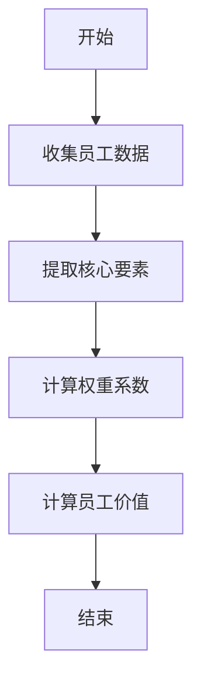

                 


# 企业估值中的人力资本价值法

> 关键词：企业估值、人力资本、价值评估、权重系数法、回归分析法、系统架构、项目实战

> 摘要：本文将详细介绍人力资本在企业估值中的重要性及其价值评估方法。通过分析人力资本的核心概念、算法原理、系统架构及实际案例，阐述如何将人力资本价值法应用于企业估值，为企业提供更全面的估值依据。

---

## 第一部分: 企业估值中的人力资本价值法概述

### 第1章: 人力资本的基本概念

#### 1.1 人力资本的定义与特点
- 1.1.1 人力资本的定义：人力资本是指企业员工的知识、技能、经验等无形资产的总和，是企业价值的重要组成部分。
- 1.1.2 人力资本的特点：
  - 知识密集性：依赖于员工的知识和技能。
  - 无形性：无法像有形资产那样直接量化。
  - 可持续性：通过培训和激励可以持续提升。
- 1.1.3 人力资本与传统资本的区别：
  - 传统资本（如设备、资金）是看得见的，而人力资本是无形的。
  - 传统资本的价值容易量化，而人力资本的价值难以直接衡量。

#### 1.2 人力资本在企业中的重要性
- 1.2.1 人力资本对企业价值的影响：
  - 高质量的人力资本可以提高企业的生产力和创新能力。
  - 优秀团队是企业核心竞争力的源泉。
- 1.2.2 人力资本在企业战略中的作用：
  - 人才战略是企业长期发展的关键。
  - 通过吸引和留住人才，企业可以保持竞争优势。
- 1.2.3 人力资本与企业绩效的关系：
  - 人力资本的投入与企业绩效呈正相关。
  - 高绩效企业通常拥有较高的员工满意度和忠诚度。

### 第2章: 人力资本价值法的背景与问题

#### 2.1 企业估值的传统方法
- 2.1.1 资产基础法：基于企业的有形资产进行估值。
- 2.1.2 收益法：基于企业的未来收益折现进行估值。
- 2.1.3 市场法：基于可比企业的市场价值进行估值。

#### 2.2 传统企业估值方法的局限性
- 2.2.1 忽视人力资本的贡献：传统方法往往忽略员工价值对企业整体价值的影响。
- 2.2.2 无法准确量化员工价值：员工的创造力和创新能力难以用财务指标衡量。
- 2.2.3 企业价值评估的不完整性：仅考虑有形资产可能导致估值偏低。

#### 2.3 人力资本价值法的提出
- 2.3.1 提出的背景：随着知识经济的发展，人力资本在企业中的作用日益凸显。
- 2.3.2 方法的目标：建立一种能够量化人力资本价值的方法，弥补传统估值方法的不足。
- 2.3.3 方法的核心思想：将人力资本视为企业的重要资产，纳入整体估值体系。

---

## 第二部分: 人力资本价值法的核心概念与联系

### 第3章: 核心概念与联系

#### 3.1 人力资本价值法的核心概念
- 3.1.1 核心要素：
  - 员工的知识储备。
  - 员工的技能水平。
  - 员工的工作经验。
  - 员工的创新能力和团队协作能力。
- 3.1.2 影响因素：
  - 行业特点：不同行业对人力资本的需求不同。
  - 企业规模：大规模企业通常拥有更多的人才资源。
  - 组织文化：优秀的企业文化可以提升员工的忠诚度和创造力。

#### 3.2 核心概念的属性特征对比
- 表格对比分析：
  | 特性         | 传统资本       | 人力资本       |
  |--------------|----------------|----------------|
  | 性质         | 有形           | 无形           |
  | 价值来源     | 设备、资金     | 知识、技能     |
  | 可持续性     | 低             | 高             |
  | 评估难度     | 易             | 难             |

#### 3.3 系统架构设计
- ER实体关系图：
  - 员工信息表：包含员工ID、姓名、职位、薪资等。
  - 技能表：包含技能ID、技能名称、技能水平等。
  - 企业表：包含企业ID、企业名称、行业等。
  - 关系：员工属于企业，拥有多种技能。

---

## 第三部分: 人力资本价值法的算法原理

### 第4章: 算法原理讲解

#### 4.1 人力资本价值的计算方法
- 4.1.1 权重系数法：
  - 每个核心要素赋予不同的权重，计算员工的总价值。
  - 例如：知识（权重0.4）、技能（权重0.3）、经验（权重0.2）、创新能力（权重0.1）。
  - 公式：$$ V = 0.4K + 0.3S + 0.2E + 0.1I $$
- 4.1.2 回归分析法：
  - 通过收集大量数据，建立员工价值与企业绩效之间的回归模型。
  - 公式：$$ y = a + bx + e $$
  - 其中，y为员工价值，x为企业绩效，e为误差项。
- 4.1.3 综合评估模型：
  - 结合权重系数法和回归分析法，构建综合评估模型。
  - 例如：$$ V = 0.5w + 0.5r $$，其中w为权重系数法结果，r为回归分析法结果。

#### 4.2 算法流程图（Mermaid）


---

## 第四部分: 项目实战

### 第5章: 项目实战

#### 5.1 环境安装
- 安装Python和相关库（如pandas、numpy、scikit-learn）。
- 数据准备：收集员工数据，包括知识、技能、经验、创新能力等。

#### 5.2 核心代码实现
```python
import pandas as pd
import numpy as np
from sklearn.linear_model import LinearRegression

# 数据加载
data = pd.read_csv('employee_data.csv')

# 特征和目标变量
X = data[['knowledge', 'skills', 'experience', 'innovation']]
y = data['value']

# 模型训练
model = LinearRegression()
model.fit(X, y)

# 预测员工价值
new_employee = [[5, 4, 3, 2]]
predicted_value = model.predict(new_employee)
print(f"预测价值为：{predicted_value[0][0]:.2f}")
```

#### 5.3 代码解读与分析
- 数据加载：使用pandas读取员工数据。
- 特征和目标变量：选择相关特征变量，目标变量为员工价值。
- 模型训练：使用线性回归模型训练数据。
- 预测员工价值：输入新员工的特征，预测其价值。

#### 5.4 案例分析
- 以某科技公司为例，分析其员工价值的评估过程。
- 结果对比：传统估值方法与人力资本价值法的对比。

#### 5.5 项目小结
- 项目总结：通过实际案例验证人力资本价值法的有效性。
- 经验教训：数据质量对模型准确性的影响。

---

## 第五部分: 最佳实践与总结

### 第6章: 最佳实践

#### 6.1 最佳实践 tips
- 数据收集：确保数据的全面性和准确性。
- 模型选择：根据企业特点选择合适的评估方法。
- 持续优化：定期更新模型，适应企业发展的变化。

#### 6.2 小结
- 人力资本价值法为企业估值提供了新的视角。
- 通过科学的方法和工具，可以更准确地评估人力资本的价值。

#### 6.3 注意事项
- 数据隐私保护：确保员工数据的安全性。
- 模型适用性：不同行业可能需要不同的评估方法。
- 团队协作：跨部门合作是成功的关键。

#### 6.4 拓展阅读
- 推荐书籍：《人力资本管理》、《企业估值方法论》。
- 网站推荐：查阅相关学术论文和行业报告。

---

## 作者：AI天才研究院/AI Genius Institute & 禅与计算机程序设计艺术/Zen And The Art of Computer Programming

