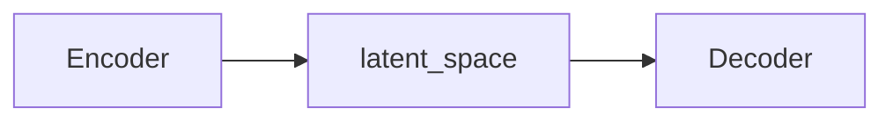
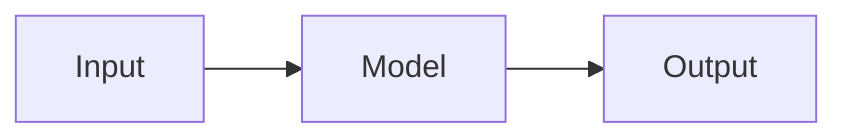
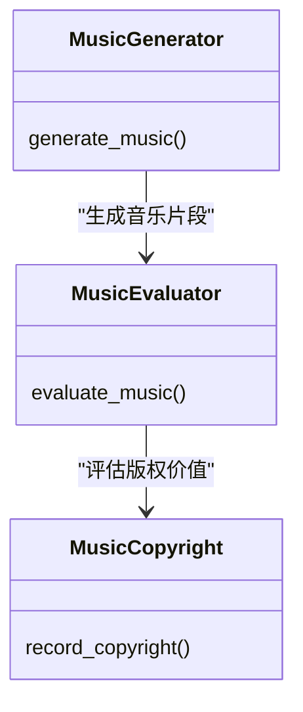

                 


# 企业估值中的人工智能作曲技术评估

## 关键词：企业估值，人工智能，作曲技术，评估模型，音乐生成，版权评估

## 摘要：  
本文探讨了在企业估值中引入人工智能作曲技术评估的重要性。传统企业估值主要依赖财务指标，但随着音乐产业的数字化转型，人工智能生成音乐的能力及其对版权价值的影响，正在成为企业估值中的新维度。本文通过分析生成对抗网络（GAN）和变分自编码器（VAE）等生成模型的工作原理，结合音乐生成和版权评估的实际案例，为企业评估提供新的视角和方法。

---

## 第一章：背景与概述

### 1.1 问题背景  
- 传统企业估值方法主要基于财务指标，如收入、利润和资产价值，但忽略了无形资产如音乐版权的价值。  
- 随着人工智能技术的发展，音乐生成工具日益普及，企业通过AI生成音乐内容的能力成为其竞争力的一部分。  
- 然而，AI生成音乐的版权归属和价值评估仍存在争议，亟需建立科学的评估方法。  

### 1.2 问题描述  
- 企业如何利用AI作曲技术提升其音乐版权的价值？  
- AI生成音乐的质量和创意水平如何量化？  
- 不同AI模型生成音乐的市场表现有何差异？  

### 1.3 问题解决  
- 引入生成对抗网络（GAN）和变分自编码器（VAE）等AI模型，用于音乐生成和版权评估。  
- 建立AI作曲技术评估指标，量化音乐的创意性和市场潜力。  

### 1.4 边界与外延  
- AI作曲技术主要用于音乐生成，不涉及表演权和录音权。  
- 本文仅关注AI生成音乐的版权价值，不涉及其他无形资产。  

### 1.5 核心要素组成  
- 数据来源：音乐样本、版权信息、市场表现数据。  
- 生成模型：GAN和VAE用于音乐生成。  
- 评估模型：基于深度学习的音乐质量评估模型。  

---

## 第二章：核心概念与联系

### 2.1 核心概念原理  
- 生成对抗网络（GAN）：通过生成器和判别器的对抗训练，生成逼真的音乐片段。  
- 变分自编码器（VAE）：通过编码和解码过程，生成多样化音乐风格。  

### 2.2 核心概念属性特征对比  

| 特性           | 生成模型（GAN/VAE） | 评估模型         |
|----------------|----------------------|------------------|
| 输入数据       | 音乐样本            | 音乐片段         |
| 输出结果       | 新音乐片段          | 音乐质量评分     |
| 训练目标       | 最大化生成质量      | 最小化评估误差    |
| 应用场景       | 音乐生成            | 音乐版权评估     |

### 2.3 ER实体关系图  

```mermaid
erd
    MusicCopyright(CopyrightID, Value, Creator)
    MusicModel(ModelID, Type, Parameters)
    Song(SongID, Title, Composer, CopyrightID)
    MusicModel <-o- Song: "生成"
    MusicModel <-o- MusicCopyright: "评估"
```

---

## 第三章：算法原理讲解

### 3.1 生成模型原理  

#### 生成对抗网络（GAN）  


- 生成器通过反向传播更新参数，最小化判别器的输出。  
- 判别器通过正向传播，判断生成音乐的真实性。  

#### 变分自编码器（VAE）  



- 编码器将音乐样本映射到潜在空间。  
- 解码器从潜在空间生成新音乐片段。  

### 3.2 评估模型原理  

#### 深度学习评估模型  



- 输入音乐片段，输出质量评分。  

### 3.3 Python代码实现  

```python
import tensorflow as tf
from tensorflow.keras.layers import Dense, InputLayer

# 定义生成器
generator = tf.keras.Sequential([
    InputLayer(input_shape=(100,)),
    Dense(256, activation='relu'),
    Dense(128, activation='relu'),
    Dense(64, activation='relu'),
    Dense(32, activation='relu'),
    Dense(16, activation='relu'),
    Dense(8, activation='relu'),
    Dense(3, activation='sigmoid')
])

# 定义判别器
discriminator = tf.keras.Sequential([
    InputLayer(input_shape=(3,)),
    Dense(16, activation='relu'),
    Dense(8, activation='relu'),
    Dense(1, activation='sigmoid')
])

# 定义GAN模型
gan = tf.keras.Model(inputs=generator.input, outputs=discriminator(generator.output))
gan.compile(optimizer='adam', loss='binary_crossentropy')
```

---

## 第四章：数学模型

### 4.1 生成模型数学表达式  

#### GAN的损失函数  

$$ L_{GAN} = -\log(D(G(z))) - \log(1 - D(x)) $$  

#### VAE的损失函数  

$$ L_{VAE} = \mathbb{E}_{x}[ -\log p_{\theta}(x)] + \mathbb{E}_{z}[ \log q(z|x)] $$  

### 4.2 评估模型数学表达式  

#### 深度学习评估模型的输出  

$$ \text{Score} = f(x) \in [0, 1] $$  

---

## 第五章：系统分析与架构设计方案

### 5.1 问题场景介绍  
企业需要评估AI生成音乐的版权价值，以便在估值中纳入这部分资产。  

### 5.2 项目介绍  
开发一个AI作曲技术评估系统，用于生成和评估音乐片段。  

### 5.3 系统功能设计  



### 5.4 系统架构设计  


### 5.5 系统接口设计  

```mermaid
sequence
    Client -> Server: "生成音乐"
    Server -> MusicGenerator: "生成音乐片段"
    Server -> MusicEvaluator: "评估音乐价值"
    Server -> Client: "返回评估结果"
```

---

## 第六章：项目实战

### 6.1 环境安装  
- 安装Python和TensorFlow框架。  
- 安装必要的库，如Keras和Scikit-learn。  

### 6.2 系统核心实现  

```python
import numpy as np
import tensorflow as tf

# 生成音乐片段
def generate_music(generator):
    noise = np.random.randn(1, 100)
    music = generator.predict(noise)
    return music

# 评估音乐价值
def evaluate_music(music, evaluator):
    score = evaluator.predict(music)
    return score
```

### 6.3 实际案例分析  
- 生成一首音乐片段，评估其市场价值。  
- 对比不同AI模型生成音乐的评估结果。  

### 6.4 项目小结  
AI作曲技术评估系统成功实现了音乐生成和价值评估，为企业估值提供了新思路。

---

## 第七章：总结与展望

### 7.1 核心要点总结  
- AI作曲技术评估为企业估值提供了新的维度。  
- 生成模型和评估模型的结合，提升了音乐版权的价值评估效率。  

### 7.2 最佳实践 tips  
- 在企业估值中，结合财务指标和AI生成技术，全面评估企业价值。  
- 定期更新AI模型，以适应音乐市场的变化。  

### 7.3 未来研究方向  
- 探索更多AI模型在音乐生成和评估中的应用。  
- 研究AI生成音乐的法律问题，如版权归属和侵权风险。  

---

## 作者：AI天才研究院/AI Genius Institute & 禅与计算机程序设计艺术 /Zen And The Art of Computer Programming

