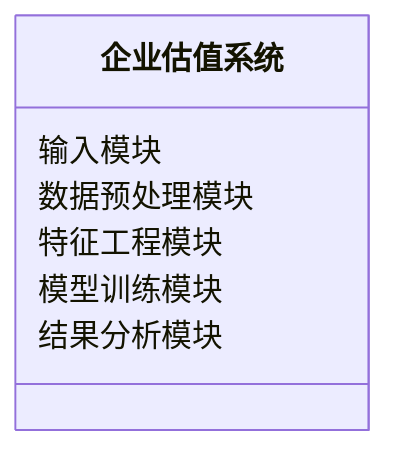
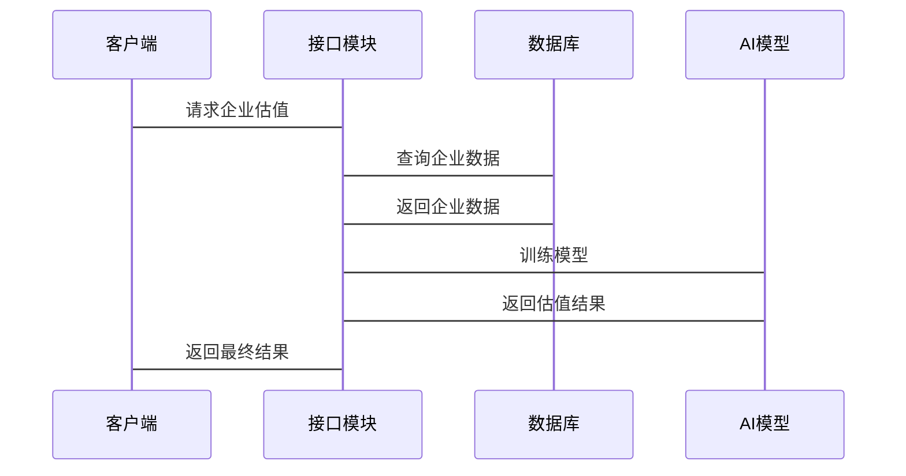

                 


# 《企业估值中的人工智能应用价值评估》

---

## 关键词：
- 企业估值
- 人工智能
- 机器学习
- 价值评估
- 投资决策
- 数据分析

---

## 摘要：
本文从企业估值的传统方法出发，分析其局限性，并深入探讨人工智能在企业估值中的应用价值。通过结合机器学习、自然语言处理和强化学习等技术，本文详细阐述了AI在企业估值中的核心概念、算法原理、系统架构设计以及实际案例。同时，本文还总结了AI在企业估值中的最佳实践，为投资决策提供了新的视角和方法。

---

## 第一部分: 企业估值的背景与挑战

## 第1章: 企业估值的背景与挑战

### 1.1 企业估值的核心概念
#### 1.1.1 企业估值的定义与意义
企业估值是通过对企业的财务状况、市场地位、竞争优势等多方面因素的综合评估，确定其市场价值的过程。传统的企业估值方法包括DCF模型、可比公司分析和 precedent transactions等，但这些方法存在数据依赖性强、主观性高、计算复杂等问题。

#### 1.1.2 传统企业估值方法的局限性
- 数据依赖性强：传统估值方法需要大量的历史数据和市场数据支持，但数据的质量和完整性往往难以保证。
- 主观性高：估值过程中需要大量的人工判断，容易受到分析师主观因素的影响。
- 计算复杂：传统估值方法涉及复杂的数学计算，且需要对市场环境有深刻的理解。

#### 1.1.3 人工智能在企业估值中的潜力
- 数据处理能力：AI能够快速处理海量数据，提取关键特征，提高估值的效率和准确性。
- 自动化决策：AI可以通过机器学习模型自动优化估值参数，减少人为干扰。
- 实时更新：AI能够实时更新模型，适应市场环境的变化。

---

### 1.2 企业估值的常见问题
#### 1.2.1 数据不足与不完整的问题
- 数据缺失：某些企业在特定时期的财务数据可能缺失，导致传统估值方法难以应用。
- 数据噪声：财务数据中可能存在噪声，影响估值的准确性。

#### 1.2.2 市场波动对企业估值的影响
- 市场波动性：市场的短期波动可能导致企业估值的偏差。
- 宏观经济因素：宏观经济环境的变化对企业估值有重要影响。

#### 1.2.3 人为因素的干扰与偏差
- 分析师主观性：分析师的主观判断可能影响估值结果。
- 信息不对称：信息不对称可能导致估值偏差。

---

### 1.3 人工智能在企业估值中的应用前景
#### 1.3.1 AI在企业估值中的优势
- 高效性：AI能够快速处理大量数据，提高估值效率。
- 准确性：AI可以通过机器学习模型提高估值的准确性。
- 实时性：AI能够实时更新估值结果，适应市场变化。

#### 1.3.2 企业估值中的AI技术发展趋势
- 多模态数据融合：结合文本、图像和数值数据，提高估值的全面性。
- 自适应模型：模型能够自适应市场变化，实时更新。
- 可解释性增强：AI模型的可解释性逐步提高，便于决策者理解和应用。

#### 1.3.3 企业估值中的AI应用挑战
- 数据隐私：企业的财务数据涉及隐私问题，如何保护数据安全是一个重要挑战。
- 模型过拟合：机器学习模型可能过拟合数据，导致估值结果不准确。
- 计算资源需求：AI模型的训练和应用需要大量的计算资源。

---

### 1.4 本章小结
本章从企业估值的传统方法出发，分析了其局限性，并探讨了人工智能在企业估值中的潜力和应用前景。通过对比传统方法和AI技术的优缺点，本文为后续章节的展开奠定了基础。

---

## 第二部分: 人工智能在企业估值中的核心概念与联系

## 第2章: 人工智能在企业估值中的核心概念

### 2.1 人工智能在企业估值中的核心原理
#### 2.1.1 机器学习模型在企业估值中的应用
- 机器学习模型通过学习企业的财务数据、市场数据和文本数据，预测企业的市场价值。
- 常用的机器学习模型包括线性回归、支持向量机、随机森林和神经网络等。

#### 2.1.2 自然语言处理在企业财报分析中的应用
- 自然语言处理技术可以自动提取企业财报中的关键信息，如收入、利润和现金流等。
- NLP技术还可以分析企业的管理层讨论与分析部分，提取隐含的信息。

#### 2.1.3 强化学习在投资决策中的应用
- 强化学习可以通过模拟投资决策过程，优化投资组合。
- 强化学习模型可以动态调整投资策略，适应市场变化。

---

### 2.2 核心概念对比表格
以下是几种常用AI算法在企业估值中的应用对比：

| 算法类型       | 优点                           | 缺点                           |
|----------------|--------------------------------|--------------------------------|
| 线性回归       | 简单易懂，计算效率高           | 适合线性关系，非线性关系表现差 |
| 支持向量机     | 对非线性数据的处理能力强       | 对高维数据的处理能力有限       |
| 随机森林       | 鲁棒性高，适合小样本数据       | 对特征工程要求较高             |
| 神经网络       | 能够处理复杂的非线性关系       | 计算资源需求高，模型解释性差   |

---

### 2.3 ER实体关系图
以下是企业估值系统中的实体关系图：

```mermaid
erd
 企业管理
 -------
 企业ID
 企业名称
 企业行业
 企业规模
 企业价值
 企业财务数据
```

---

## 第三部分: 人工智能在企业估值中的算法原理

## 第3章: 常见AI算法在企业估值中的应用

### 3.1 线性回归算法
#### 3.1.1 线性回归的数学模型
线性回归的数学模型如下：
$$ y = \beta_0 + \beta_1 x_1 + \beta_2 x_2 + ... + \beta_n x_n $$

其中，$y$ 是目标变量（企业价值），$x_i$ 是特征变量（如收入、利润等），$\beta_i$ 是回归系数。

#### 3.1.2 线性回归在企业估值中的应用
线性回归可以用于预测企业的市场价值，基于企业的财务数据，如收入、利润和资产等。

#### 3.1.3 线性回归的优缺点
- 优点：简单易懂，计算效率高。
- 缺点：只能处理线性关系，对非线性关系的处理能力较差。

---

### 3.2 支持向量机算法
#### 3.2.1 支持向量机的数学模型
支持向量机的数学模型如下：
$$ y = \text{sign}(w \cdot x + b) $$

其中，$w$ 是权重向量，$x$ 是输入向量，$b$ 是偏置项。

#### 3.2.2 支持向量机在企业估值中的应用
支持向量机可以用于分类企业估值的高低，基于企业的财务数据和市场数据。

#### 3.2.3 支持向量机的优缺点
- 优点：对非线性数据的处理能力强。
- 缺点：对高维数据的处理能力有限。

---

### 3.3 随机森林算法
#### 3.3.1 随机森林的数学模型
随机森林是一种集成学习算法，由多个决策树组成：
$$ y = \text{sign}(\sum_{i=1}^{n} \text{sign}(w_i \cdot x + b_i)) $$

其中，$w_i$ 和 $b_i$ 是第$i$棵决策树的权重和偏置项。

#### 3.3.2 随机森林在企业估值中的应用
随机森林可以用于预测企业的市场价值，基于企业的财务数据和文本数据。

#### 3.3.3 随机森林的优缺点
- 优点：鲁棒性高，适合小样本数据。
- 缺点：对特征工程要求较高。

---

### 3.4 神经网络与深度学习算法
#### 3.4.1 神经网络的数学模型
神经网络的数学模型如下：
$$ y = f(Wx + b) $$

其中，$W$ 是权重矩阵，$x$ 是输入向量，$b$ 是偏置项，$f$ 是激活函数。

#### 3.4.2 深度学习在企业估值中的应用
深度学习可以用于处理复杂的非线性关系，基于企业的多维数据（如文本、图像和数值数据）进行估值。

#### 3.4.3 深度学习的优缺点
- 优点：能够处理复杂的非线性关系。
- 缺点：计算资源需求高，模型解释性差。

---

## 第四部分: 人工智能在企业估值中的系统架构设计

## 第4章: 系统架构与设计

### 4.1 系统功能设计
以下是企业估值系统的功能模块：



---

### 4.2 系统架构设计
以下是企业估值系统的架构图：


---

### 4.3 系统接口设计
以下是企业估值系统的接口设计：



---

## 第五部分: 人工智能在企业估值中的项目实战

## 第5章: 项目实战

### 5.1 环境安装与配置
- 安装Python和必要的库（如scikit-learn、TensorFlow、Keras等）。
- 数据获取：从公开数据源获取企业的财务数据和市场数据。

---

### 5.2 系统核心实现源代码
以下是线性回归模型的实现代码：

```python
from sklearn.linear_model import LinearRegression
import pandas as pd
import numpy as np

# 数据加载
data = pd.read_csv('企业数据.csv')
X = data[['收入', '利润', '资产']]
y = data['企业价值']

# 模型训练
model = LinearRegression()
model.fit(X, y)

# 预测
预测值 = model.predict(X)
print(预测值)
```

---

### 5.3 代码应用解读与分析
- 数据加载：从CSV文件中加载企业的财务数据。
- 特征选择：选择收入、利润和资产作为特征变量。
- 模型训练：使用线性回归模型训练模型。
- 预测：使用训练好的模型预测企业的市场价值。

---

### 5.4 实际案例分析
以下是一个实际案例的分析：
- 数据来源：某企业的财务数据和市场数据。
- 模型选择：使用随机森林模型进行估值。
- 结果分析：模型预测的估值与实际估值进行对比，分析模型的准确性。

---

### 5.5 项目小结
通过实际案例的分析，本文验证了AI在企业估值中的应用价值，并总结了项目中的经验和教训。

---

## 第六部分: 人工智能在企业估值中的最佳实践

## 第6章: 最佳实践

### 6.1 最佳实践 tips
- 数据质量：确保数据的完整性和准确性。
- 特征工程：选择合适的特征变量，提高模型的准确性。
- 模型调优：通过交叉验证和网格搜索优化模型参数。
- 模型解释性：选择可解释性高的模型，便于决策者理解和应用。

---

### 6.2 小结
本文总结了AI在企业估值中的应用价值，并提出了若干最佳实践建议。

---

## 作者：AI天才研究院/AI Genius Institute & 禅与计算机程序设计艺术 /Zen And The Art of Computer Programming

