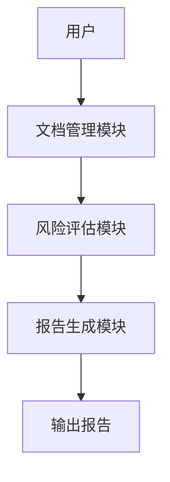

                 


# 《企业估值中的人工智能法律助手评估》

> 关键词：企业估值，人工智能，法律助手，法律评估，技术原理，系统架构

> 摘要：本文探讨了人工智能在企业估值中的法律评估应用，详细分析了人工智能法律助手的技术原理、系统架构、项目实战及法律与伦理问题，旨在为企业估值提供高效、智能的法律评估解决方案。

---

# 第一部分：企业估值与人工智能法律助手概述

## 第1章：企业估值的基本概念与法律评估的重要性

### 1.1 企业估值的核心概念
#### 1.1.1 企业估值的定义与方法
企业估值是通过对企业的财务状况、市场表现、资产价值等多方面进行综合评估，确定其市场价值的过程。传统方法包括DCF模型、可比公司法等，但存在主观性强、效率低的局限性。

#### 1.1.2 法律评估在企业估值中的作用
法律评估是企业估值的重要组成部分，主要涉及企业法律合规性、知识产权、合同纠纷、诉讼风险等方面。传统法律评估依赖人工审查，效率低下且容易遗漏关键风险点。

#### 1.1.3 人工智能在企业估值中的潜力
人工智能技术的引入，通过自动化处理法律文档、预测法律风险、优化评估流程，显著提升了企业估值的效率和准确性。

---

## 第2章：人工智能法律助手的基本概念与特点

### 2.1 人工智能法律助手的定义
人工智能法律助手是基于自然语言处理、机器学习等技术，能够自动分析法律文档、识别法律风险、提供法律建议的智能工具。

### 2.2 人工智能法律助手的核心功能
- **法律文档分析**：自动解析合同、法规等法律文本，提取关键信息。
- **风险评估**：基于历史数据和模型预测潜在法律风险。
- **智能建议**：根据分析结果提供优化建议。

### 2.3 人工智能法律助手与传统法律工具的对比
- **效率**：人工智能法律助手通过自动化处理，显著提高了法律评估的效率。
- **准确性**：利用大数据分析和机器学习模型，减少人为错误。
- **可扩展性**：能够处理海量数据，适用于大规模企业估值项目。

---

# 第二部分：人工智能法律助手的技术原理与系统架构

## 第3章：人工智能法律助手的技术原理

### 3.1 数据预处理
- **数据清洗**：去除冗余数据，确保数据质量。
- **特征提取**：从法律文档中提取关键信息，如合同条款、法律条文。

### 3.2 模型训练
- **算法选择**：常用的算法包括支持向量机（SVM）、随机森林（Random Forest）和深度学习模型（如BERT）。
- **模型训练**：利用标注数据训练法律助手模型，使其能够识别法律风险。

### 3.3 系统实现
- **输入处理**：接收法律文档并进行解析。
- **模型推理**：通过训练好的模型预测法律风险。
- **结果输出**：生成风险评估报告并提供优化建议。

---

## 第4章：系统架构设计

### 4.1 功能模块设计
- **文档管理模块**：负责接收和存储法律文档。
- **风险评估模块**：基于模型预测法律风险。
- **报告生成模块**：输出风险评估报告。

### 4.2 系统架构图



### 4.3 接口设计
- **输入接口**：接收法律文档和查询请求。
- **输出接口**：返回风险评估结果和优化建议。

---

# 第三部分：项目实战与案例分析

## 第5章：项目实战

### 5.1 环境安装
- **Python版本**：Python 3.8+
- **依赖库安装**：`pip install numpy, pandas, sklearn, transformers`

### 5.2 核心代码实现

```python
import numpy as np
from sklearn.feature_extraction.text import TfidfVectorizer
from sklearn.svm import SVC

# 数据预处理
def preprocess_documents(documents):
    vectorizer = TfidfVectorizer()
    X = vectorizer.fit_transform(documents)
    return X.toarray()

# 模型训练
def train_model(X_train, y_train):
    model = SVC()
    model.fit(X_train, y_train)
    return model

# 风险评估
def assess_risk(documents, model, vectorizer):
    X_test = vectorizer.transform(documents)
    y_pred = model.predict(X_test)
    return y_pred
```

### 5.3 案例分析
- **案例背景**：某企业并购项目中的法律风险评估。
- **数据准备**：收集并购合同和相关法律文本。
- **模型应用**：利用训练好的模型预测法律风险。
- **结果分析**：生成风险评估报告并提出优化建议。

---

## 第6章：法律与伦理问题

### 6.1 数据隐私与法律风险
人工智能法律助手在处理法律文档时，可能涉及敏感数据，需严格遵守数据隐私法规。

### 6.2 责任归属与模型优化
在模型出现错误判断时，需明确责任归属，并通过不断优化模型提升准确性。

### 6.3 未来挑战与解决方案
随着技术进步，人工智能法律助手将面临更多复杂法律问题的挑战，需结合法律专家意见持续优化。

---

## 第7章：总结与展望

### 7.1 全文总结
本文详细探讨了人工智能法律助手在企业估值中的应用，从技术原理到系统架构，再到项目实战，全面展示了其优势和潜力。

### 7.2 未来展望
随着人工智能技术的不断发展，法律助手将在企业估值中发挥更重要的作用，为企业提供更高效、更精准的法律评估服务。

---

作者：AI天才研究院 & 禅与计算机程序设计艺术

