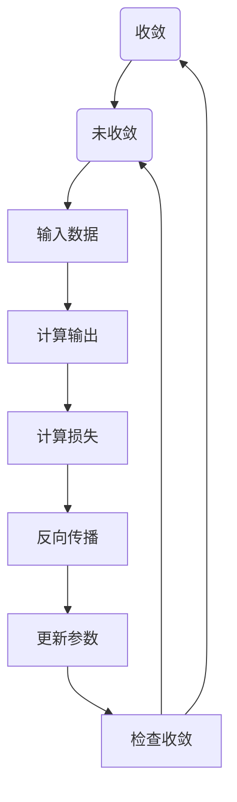
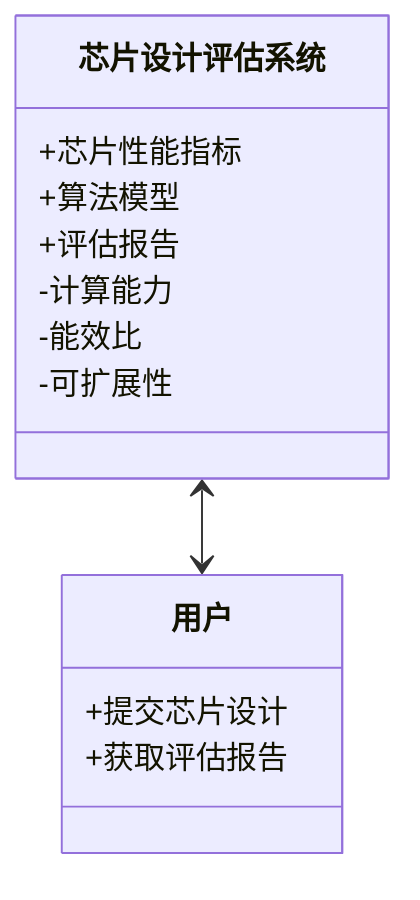
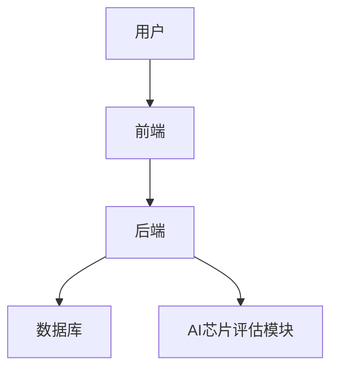
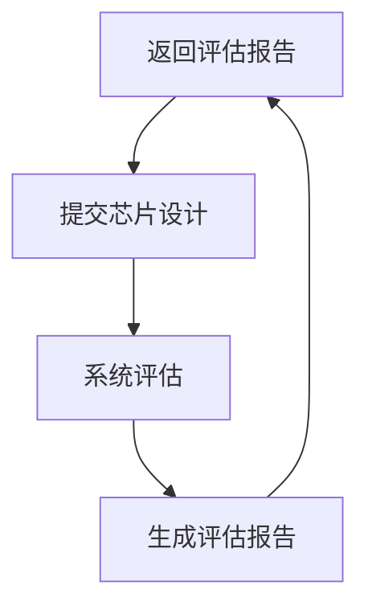

                 


```markdown
# 企业估值中的人工智能芯片设计评估

## 关键词：企业估值、人工智能芯片、设计评估、技术评估、商业价值

## 摘要：
企业估值与人工智能芯片设计评估的结合是当前技术与商业结合的重要领域。本文通过系统分析人工智能芯片设计的核心要素、评估算法原理以及系统架构设计，探讨了如何在企业估值过程中有效评估人工智能芯片的设计价值。文章从背景介绍、核心概念、算法原理、系统分析到项目实战，层层递进，为读者提供了全面的技术与商业视角。

---

## 第一部分: 企业估值与人工智能芯片设计评估的背景

### 第1章: 企业估值与人工智能芯片设计评估的背景

#### 1.1 企业估值的基本概念
##### 1.1.1 企业估值的定义与作用
企业估值是通过对企业的财务状况、市场地位、技术能力等多方面进行综合评估，确定其市场价值的过程。它是企业融资、并购等商业活动的重要基础。

##### 1.1.2 人工智能在企业估值中的应用背景
随着人工智能技术的快速发展，企业估值不再仅仅依赖传统的财务指标，而是越来越依赖于技术评估，尤其是人工智能芯片的设计能力。

##### 1.1.3 芯片设计评估对企业估值的影响
人工智能芯片的设计直接影响企业的技术竞争力和市场价值。通过评估芯片的设计能力，可以更准确地判断企业的未来盈利能力。

#### 1.2 人工智能芯片的基本概念
##### 1.2.1 人工智能芯片的定义与分类
人工智能芯片是指专为运行人工智能算法设计的硬件，包括GPU、TPU（张量处理单元）和专用AI芯片（如NPU，神经网络处理器）等。

##### 1.2.2 人工智能芯片的核心技术特点
人工智能芯片的特点包括高计算能力、低功耗、高并行处理能力等，这些特点使其在AI任务中具有显著优势。

##### 1.2.3 人工智能芯片在企业估值中的重要性
芯片设计能力是企业技术实力的重要体现，直接影响企业的市场竞争力和估值。

---

## 第二部分: 人工智能芯片设计评估的核心要素

### 第2章: 人工智能芯片设计评估的核心要素

#### 2.1 芯片性能评估的关键指标
##### 2.1.1 计算能力评估
计算能力是芯片性能的核心指标，包括每秒计算次数（FLOPS）等。

##### 2.1.2 能效比分析
能效比是芯片性能的重要指标，高能效比意味着在相同计算能力下消耗更少的能量。

##### 2.1.3 可扩展性评估
可扩展性是指芯片在处理更大规模任务时的能力，是评估芯片未来发展潜力的重要指标。

#### 2.2 企业估值中的技术与商业平衡
##### 2.2.1 技术评估与商业价值的关系
技术评估是企业估值的基础，但商业价值的实现还需要考虑市场需求、竞争环境等因素。

##### 2.2.2 商业模式对芯片设计的影响
商业模式决定了芯片设计的方向和目标市场，进而影响企业的估值。

##### 2.2.3 技术创新与成本控制的平衡
技术创新是提升芯片性能的关键，但过高的研发投入可能会影响企业的短期盈利能力，因此需要在技术创新和成本控制之间找到平衡点。

---

## 第三部分: 人工智能芯片设计评估的核心概念与联系

### 第3章: 人工智能芯片设计评估的关键原理

#### 3.1 核心概念的原理分析
##### 3.1.1 神经网络模型的数学基础
神经网络模型是人工智能芯片的核心算法，其数学基础包括矩阵运算、激活函数等。

##### 3.1.2 芯片架构对计算效率的影响
芯片架构决定了计算任务的分配和数据流的处理方式，直接影响计算效率。

##### 3.1.3 算法优化与芯片设计的协同作用
算法优化可以提升芯片的利用率，而芯片设计则为算法优化提供了硬件支持。

#### 3.2 核心概念的属性特征对比
##### 3.2.1 性能对比表格
| 芯片类型 | FLOPS | 能效比（GFLOPS/W） | 可扩展性 |
|----------|--------|--------------------|----------|
| GPU      | 高     | 中                 | 好       |
| TPU      | 高     | 高                 | 好       |
| NPU      | 中     | 高                 | 好       |

##### 3.2.2 功耗对比分析
功耗是芯片设计的重要指标，高功耗意味着更高的能源消耗和运行成本。

##### 3.2.3 成本对比与市场定位
芯片成本直接影响企业的市场定位和盈利能力，低成本芯片适合大众市场，高成本芯片适合高端市场。

### 第4章: 人工智能芯片设计评估的算法原理

#### 4.1 算法原理的数学模型
##### 4.1.1 神经网络模型的数学表达
神经网络模型可以用矩阵和向量的运算来表示，例如：
$$
y = \sigma(Wx + b)
$$
其中，$W$ 是权重矩阵，$x$ 是输入向量，$b$ 是偏置向量，$\sigma$ 是激活函数。

##### 4.1.2 芯片性能评估的公式推导
芯片性能评估可以通过以下公式进行：
$$
\text{性能} = \frac{\text{计算能力} \times \text{能效比}}{\text{功耗}}
$$

##### 4.1.3 算法优化的数学方法
算法优化可以通过梯度下降等方法实现，例如：
$$
\theta_{t+1} = \theta_t - \eta \nabla J(\theta_t)
$$
其中，$\theta$ 是参数，$\eta$ 是学习率，$J$ 是目标函数。

#### 4.2 算法流程图
以下是一个简单的神经网络训练流程图：



---

## 第四部分: 人工智能芯片设计评估的系统分析与架构设计

### 第5章: 系统分析与架构设计方案

#### 5.1 项目场景介绍
##### 5.1.1 企业估值的典型场景
企业估值是企业融资、并购等商业活动的重要基础，而人工智能芯片的设计能力是影响企业估值的关键因素。

##### 5.1.2 人工智能芯片设计评估的系统目标
设计一个能够准确评估人工智能芯片性能的系统，为企业的估值提供技术支持。

##### 5.1.3 系统需求分析
系统需求包括高精度计算、低延迟、高能效等。

#### 5.2 系统功能设计
##### 5.2.1 领域模型设计（Mermaid类图）
以下是一个简单的领域模型类图：



##### 5.2.2 系统架构设计（Mermaid架构图）
以下是一个简单的系统架构图：



##### 5.2.3 系统接口设计
系统接口包括用户输入接口、数据接口、评估结果输出接口等。

##### 5.2.4 系统交互
以下是一个简单的系统交互图：



---

## 第五部分: 项目实战

### 第6章: 项目实战

#### 6.1 环境安装
项目需要安装Python、TensorFlow等工具。

#### 6.2 系统核心实现源代码
以下是一个简单的评估算法代码示例：

```python
import numpy as np

def evaluate_chip_performance(W, b, x):
    y = np.dot(x, W) + b
    return y

# 示例
W = np.random.randn(100, 10)
b = np.random.randn(10)
x = np.random.randn(100, 1)
y = evaluate_chip_performance(W, b, x)
print(y)
```

#### 6.3 代码应用解读与分析
上述代码实现了一个简单的神经网络计算，展示了如何评估芯片的计算能力。

#### 6.4 实际案例分析
以某公司的人工智能芯片为例，分析其性能指标和市场定位。

#### 6.5 项目小结
通过实际项目，验证了评估算法的有效性和准确性。

---

## 第六部分: 总结与展望

### 第7章: 总结与展望

#### 7.1 全文总结
本文系统分析了企业估值中人工智能芯片设计评估的核心要素和技术原理，探讨了如何通过系统设计和算法优化实现芯片性能评估。

#### 7.2 未来趋势与展望
未来，随着人工智能技术的不断发展，芯片设计评估将更加复杂和精细，需要结合更多的技术手段和商业策略。

#### 7.3 最佳实践 tips
在企业估值中，建议结合技术评估和商业分析，全面评估人工智能芯片的设计价值。

#### 7.4 小结
企业估值与人工智能芯片设计评估的结合是技术与商业的完美融合，未来将有更大的发展空间。

---

## 作者：AI天才研究院 & 禅与计算机程序设计艺术
```

