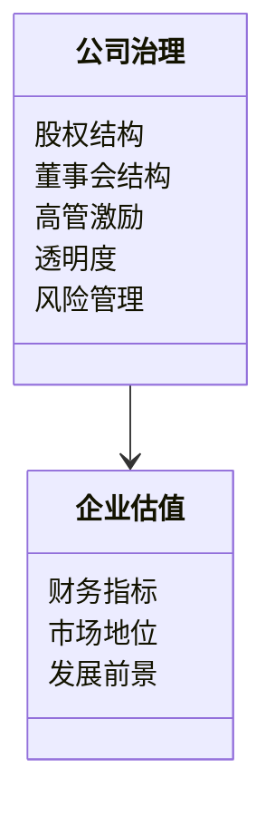

                 


# 企业估值中的公司治理因素

> 关键词：企业估值、公司治理、股权结构、董事会治理、高管激励、公司治理评分模型

> 摘要：本文系统地探讨了公司治理因素在企业估值中的重要性。通过分析股权结构、董事会治理和高管激励等关键因素，结合量化模型和实际案例，揭示了公司治理如何影响企业价值。文章还提出了构建公司治理评分模型的方法，并通过系统架构设计和项目实战，进一步验证了公司治理因素在企业估值中的实际应用价值。

---

## 第1章：公司治理的基本概念

### 1.1 公司治理的定义与内涵

#### 1.1.1 公司治理的定义
公司治理是通过一系列制度和机制，确保公司股东、董事会、管理层和其他利益相关者之间的权利和责任得到合理分配和有效执行的过程。它涵盖了公司战略制定、决策执行、风险管理等多个方面。

#### 1.1.2 公司治理的核心要素
公司治理的核心要素包括：
- **股权结构**：股东的持股比例和控制权。
- **董事会结构**：董事会的组成、职责和运作效率。
- **高管激励机制**：管理层的激励方式和效果。
- **公司透明度**：信息披露的及时性、准确性和完整性。
- **风险管理**：公司对风险的识别、评估和控制能力。

#### 1.1.3 公司治理与企业价值的关系
公司治理是影响企业价值的重要因素。良好的公司治理能够提升企业的决策效率、降低风险、增强投资者信心，从而提高企业的市场价值。

### 1.2 公司治理的发展历程

#### 1.2.1 传统公司治理的演变
早期的公司治理主要关注股东权益保护，强调董事会的监督职责。随着企业规模的扩大和复杂性的增加，公司治理逐渐从单纯的“控制”转向“治理”。

#### 1.2.2 现代公司治理的特征
现代公司治理强调利益相关者的平衡，注重透明度、问责制和可持续发展。董事会的独立性和多样性成为重要特征。

#### 1.2.3 全球化背景下的公司治理趋势
全球化背景下，公司治理呈现出跨国化、标准化和数字化的趋势。国际组织和监管机构（如OECD、国际证监会组织）发布的治理准则对公司治理实践产生了深远影响。

---

## 第2章：企业估值的基本原理

### 2.1 企业估值的定义与方法

#### 2.1.1 企业估值的定义
企业估值是通过对公司财务状况、市场地位、发展前景等多方面因素的综合分析，确定公司市场价值的过程。

#### 2.1.2 主要估值方法概述
常用的估值方法包括：
- **相对估值法**：基于可比公司（如市盈率、市净率）进行估值。
- **绝对估值法**：基于公司未来现金流的贴现（如DCF模型）。
- **资产价值法**：基于公司资产的账面价值。

#### 2.1.3 不同估值方法的适用场景
- **相对估值法**适用于市场数据充分、可比公司较多的情况。
- **绝对估值法**适用于现金流稳定、未来增长可预测的公司。
- **资产价值法**适用于资产密集型行业或企业处于困境时的估值。

### 2.2 财务指标与企业估值

#### 2.2.1 常用财务指标分析
常用的财务指标包括：
- **净利润**：衡量公司盈利能力。
- **营业收入**：衡量公司收入能力。
- **资产负债率**：衡量公司财务风险。
- **ROE（净资产收益率）**：衡量公司资本使用效率。

#### 2.2.2 财务指标与企业价值的关系
财务指标是企业估值的重要依据。例如，高净利润和低资产负债率通常意味着较高的企业价值。

#### 2.2.3 财务指标在估值中的应用
财务指标常用于相对估值法和绝对估值法的计算中。例如，DCF模型需要预测未来现金流，而这些现金流的预测需要结合公司的净利润、营业收入等财务指标。

---

## 第3章：公司治理因素与企业估值的关系

### 3.1 公司治理在企业估值中的重要性

#### 3.1.1 公司治理对企业价值的影响
良好的公司治理能够提升企业的运营效率、降低风险、增强投资者信心，从而提高企业的市场价值。

#### 3.1.2 公司治理与企业风险的关系
公司治理不善可能导致企业面临更大的风险，如管理层舞弊、决策失误等，从而降低企业价值。

#### 3.1.3 公司治理与企业长期发展的关联
良好的公司治理是企业长期发展的基础，能够确保公司战略的持续性和稳定性。

### 3.2 公司治理因素对估值的具体影响

#### 3.2.1 股权结构与控制权
- **股权集中**：控股股东的决策权较大，可能导致决策失误或利益输送。
- **股权分散**：多个股东共同决策，可能降低风险但可能影响效率。

#### 3.2.2 董事会结构与治理效率
- **董事会独立性**：独立董事的比例越高，董事会的监督能力越强。
- **董事会多样性**：董事会成员来自不同背景，能够提供更全面的决策支持。

#### 3.2.3 高管激励机制
- **激励不足**：高管缺乏动力，可能导致企业绩效低下。
- **激励过度**：高管可能追求短期利益，忽视长期发展。

---

## 第4章：公司治理的核心要素与影响

### 4.1 股权结构分析

#### 4.1.1 股权结构的分类
- **单一股东控制**：某一方股东持股比例超过50%。
- **多方股东共同控制**：多个股东持股比例接近，无单一控股股东。

#### 4.1.2 不同股权结构对估值的影响
- **单一股东控制**：可能引发关联交易和利益输送，增加企业风险。
- **多方股东共同控制**：降低风险，但可能影响决策效率。

#### 4.1.3 股权结构与企业控制权的关系
股权结构直接影响企业的控制权分配。例如，控股股东可以主导董事会决策，而小股东可能在决策中话语权较弱。

### 4.2 董事会治理

#### 4.2.1 董事会的构成与职责
- **构成**：董事会由董事长、独立董事和其他董事组成。
- **职责**：制定公司战略、监督高管、确保公司合规性。

#### 4.2.2 董事会效率对企业价值的影响
高效的董事会能够提升公司治理水平，降低运营风险，从而提高企业价值。

#### 4.2.3 董事会治理中的关键问题
- **独立董事比例**：独立董事的比例越高，董事会的独立性越强。
- **董事会会议频率**：董事会会议的频率影响治理效率。

### 4.3 高管激励机制

#### 4.3.1 激励机制的类型
- **股票期权**：高管通过持有股票期权获得收益。
- **绩效奖金**：根据公司绩效发放奖金。
- **年薪制**：固定年薪加绩效考核。

#### 4.3.2 激励机制与管理层行为的关系
有效的激励机制能够激发管理层的积极性，提高企业绩效。

#### 4.3.3 激励机制对企业价值的影响
激励机制的合理设计能够降低代理成本，提升企业价值。例如，股票期权激励能够将高管利益与公司利益绑定，促进长期发展。

---

## 第5章：公司治理因素的量化与模型构建

### 5.1 公司治理评分模型

#### 5.1.1 模型构建的逻辑
公司治理评分模型通过对公司治理的核心要素进行量化，评估其对公司价值的影响。

#### 5.1.2 模型的输入变量与权重分配
- **输入变量**：股权结构、董事会结构、高管激励等。
- **权重分配**：根据各因素对估值的影响程度确定权重。

#### 5.1.3 模型的输出结果与解释
模型输出为公司治理评分，评分越高，公司治理水平越高，企业价值越大。

### 5.2 公司治理因素的权重确定

#### 5.2.1 权重确定方法
- **专家评分法**：邀请行业专家对各因素的重要性进行评分。
- **数据回归法**：通过数据分析确定各因素的权重。

#### 5.2.2 权重分配示例
- 股权结构：30%
- 董事会结构：25%
- 高管激励：20%
- 透明度：15%
- 风险管理：10%

---

## 第6章：系统分析与架构设计

### 6.1 系统功能设计（领域模型）



### 6.2 系统架构设计


---

## 第7章：项目实战

### 7.1 环境配置与数据收集

#### 7.1.1 环境配置
- 操作系统：Linux
- 开发工具：Python、Jupyter Notebook
- 数据库：MySQL

#### 7.1.2 数据收集
- 收集目标公司的财务数据、股权结构、董事会信息等。

### 7.2 核心实现

#### 7.2.1 公司治理评分模型实现

```python
def calculate_governance_score(company_data):
    equity_structure = company_data['equity_structure']
    boardGovernance = company_data['board_governance']
    executive_incentives = company_data['executive_incentives']
    transparency = company_data['transparency']
    risk_management = company_data['risk_management']
    
    weights = {
        'equity_structure': 0.3,
        'board_governance': 0.25,
        'executive_incentives': 0.2,
        'transparency': 0.15,
        'risk_management': 0.1
    }
    
    score = (
        equity_structure * weights['equity_structure'] +
        boardGovernance * weights['board_governance'] +
        executive_incentives * weights['executive_incentives'] +
        transparency * weights['transparency'] +
        risk_management * weights['risk_management']
    )
    return score
```

#### 7.2.2 模型验证与结果分析
通过对实际案例的分析，验证模型的准确性。例如，分析苹果公司的治理结构，计算其治理评分，并与市场估值进行对比。

---

## 第8章：最佳实践与小结

### 8.1 最佳实践 tips
- 在企业估值中，公司治理因素的重要性不容忽视。
- 合理设计激励机制，平衡短期与长期利益。
- 提高公司透明度，增强投资者信心。

### 8.2 小结
公司治理是企业估值的重要组成部分。通过量化公司治理因素，构建评分模型，可以更准确地评估企业价值。同时，良好的公司治理能够降低风险，提升企业长期发展潜力。

### 8.3 注意事项
- 公司治理因素的权重需要根据行业特点和公司实际情况调整。
- 数据的准确性和完整性对模型结果有重要影响。

### 8.4 拓展阅读
建议进一步研究公司治理与ESG（环境、社会、治理）投资理念的关系，以及数字化技术在公司治理中的应用。

---

作者：AI天才研究院/AI Genius Institute & 禅与计算机程序设计艺术 /Zen And The Art of Computer Programming

