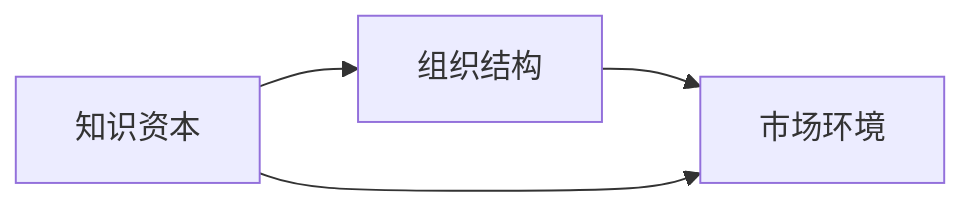
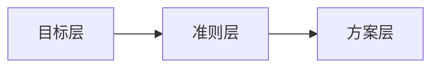
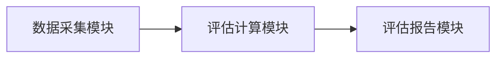
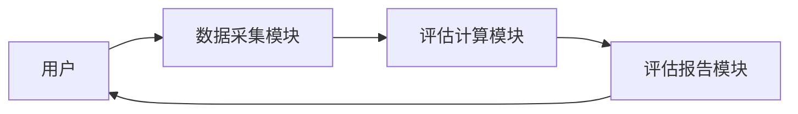

                 


# 企业估值中的创新生态系统价值评估

> 关键词：企业估值、创新生态系统、价值评估、知识资本、组织结构、市场环境

> 摘要：本文探讨了在企业估值过程中，如何对创新生态系统进行价值评估。创新生态系统作为企业核心竞争力的关键组成部分，其价值评估不仅涉及企业的知识资本、组织结构和市场环境，还包括如何将这些要素转化为可量化的指标。本文通过分析创新生态系统的核心概念、算法原理、系统架构设计和项目实战，提供了一套全面的评估方法，并结合实际案例进行了详细说明。

---

# 第一部分: 企业估值中的创新生态系统价值评估概述

## 第1章: 创新生态系统与企业估值的背景介绍

### 1.1 创新生态系统的基本概念

#### 1.1.1 创新生态系统的核心定义
创新生态系统是指由企业内部和外部的创新要素（如知识资本、组织结构、市场环境等）共同构成的一个动态系统。它不仅包括企业的研发能力、技术储备，还包括外部合作伙伴、客户、供应商等形成的创新网络。

#### 1.1.2 创新生态系统与传统企业结构的区别
传统企业结构主要关注企业的财务表现、资产规模和市场份额，而创新生态系统更注重企业的创新能力、知识共享和创新网络的协同效应。

#### 1.1.3 创新生态系统在现代企业中的重要性
在现代商业环境中，创新是企业保持竞争优势的关键。创新生态系统通过整合内外部资源，能够更高效地推动产品和服务的创新，从而提升企业的市场竞争力和长期价值。

### 1.2 企业估值的基本原理

#### 1.2.1 企业估值的定义与分类
企业估值是通过对企业的财务表现、市场地位、管理团队等多方面因素的综合评估，确定企业价值的过程。常见的估值方法包括市盈率法、现金流折现法等。

#### 1.2.2 创新生态系统对企业估值的影响
创新生态系统作为企业核心竞争力的重要组成部分，直接影响企业的长期盈利能力和发展潜力。因此，在企业估值中，创新生态系统的价值需要被单独评估并纳入整体估值体系。

#### 1.2.3 传统企业估值方法的局限性
传统估值方法往往忽视了企业的创新能力，尤其是创新生态系统中知识资本和组织能力的价值。这种忽视可能导致估值结果的偏差，尤其是在创新型企业和科技公司中。

### 1.3 创新生态系统价值评估的必要性

#### 1.3.1 创新对企业核心竞争力的影响
企业的创新能力直接影响其市场地位和盈利能力。通过创新生态系统价值评估，可以更准确地衡量企业的创新能力，从而为估值提供更全面的依据。

#### 1.3.2 创新生态系统对企业长期价值的影响
创新生态系统能够为企业创造持续的创新动力，从而提升企业的长期价值。在估值中，创新生态系统的价值需要被单独考虑，以反映其对企业发展潜力的影响。

#### 1.3.3 企业估值中的创新生态系统价值评估现状
目前，创新生态系统价值评估在企业估值中的应用还较为有限。大多数估值方法仍以财务指标为主，忽视了创新生态系统中知识资本和组织能力的价值。

## 1.4 本章小结

本章介绍了创新生态系统的基本概念及其在企业估值中的重要性。通过对比传统企业结构和创新生态系统，强调了创新生态系统在现代企业中的独特地位。同时，指出了传统估值方法的局限性，并提出了创新生态系统价值评估的必要性。

---

## 第2章: 创新生态系统的核心概念与联系

### 2.1 创新生态系统的核心要素

#### 2.1.1 知识资本
知识资本是创新生态系统的核心要素之一，包括企业的技术储备、研发能力、员工的知识和技能等。知识资本的价值往往难以量化，但却是企业创新的核心驱动力。

#### 2.1.2 组织结构
组织结构是创新生态系统的重要组成部分，包括企业的管理架构、团队协作机制等。高效的组织结构能够促进知识的共享和创新的实现。

#### 2.1.3 市场环境
市场环境是创新生态系统外部的重要因素，包括市场需求、竞争状况、政策环境等。市场环境的变化直接影响企业的创新能力和市场表现。

### 2.2 创新生态系统的核心属性对比

#### 2.2.1 核心概念属性特征对比表

| 核心要素    | 属性特征                |
|-------------|------------------------|
| 知识资本    | 技术储备、研发能力、员工技能 |
| 组织结构    | 管理架构、团队协作机制  |
| 市场环境    | 市场需求、竞争状况、政策环境 |

### 2.3 创新生态系统的核心要素ER实体关系图



---

## 第3章: 创新生态系统价值评估的算法原理

### 3.1 创新生态系统价值评估的方法

#### 3.1.1 层次分析法（AHP）

层次分析法是一种常用的多因素决策分析方法。通过构建层次结构模型，将创新生态系统中的各要素进行权重分配，并计算各要素的综合得分。



#### 3.1.2 模糊综合评价法

模糊综合评价法是一种适合处理模糊性问题的评估方法。通过构建模糊评价矩阵，利用模糊运算计算创新生态系统的综合得分。

### 3.2 创新生态系统价值评估的数学模型

#### 3.2.1 层次分析法的数学模型

$$ A = \sum_{i=1}^{n} w_i x_i $$

其中，\( A \) 为综合得分，\( w_i \) 为各要素的权重，\( x_i \) 为各要素的得分。

#### 3.2.2 模糊综合评价法的数学模型

$$ F = \sum_{i=1}^{n} w_i \mu(x_i) $$

其中，\( F \) 为模糊综合得分，\( \mu(x_i) \) 为各要素的隶属度函数。

---

## 第4章: 创新生态系统价值评估的系统架构设计

### 4.1 问题场景介绍

创新生态系统价值评估系统需要解决的主要问题是：如何将企业的创新生态系统中的知识资本、组织结构和市场环境等要素进行量化评估，并提供可操作的评估结果。

### 4.2 系统功能设计

#### 4.2.1 数据采集模块

数据采集模块负责收集企业的创新生态系统相关数据，包括知识资本、组织结构和市场环境等。

#### 4.2.2 评估计算模块

评估计算模块利用层次分析法或模糊综合评价法，对创新生态系统进行综合评估，并生成评估报告。

### 4.3 系统架构设计



### 4.4 系统接口设计

系统接口设计包括数据输入接口和评估结果输出接口。数据输入接口用于接收企业的创新生态系统数据，评估结果输出接口用于生成评估报告。

### 4.5 系统交互流程图



---

## 第5章: 创新生态系统价值评估的项目实战

### 5.1 环境安装

#### 5.1.1 Python安装与配置
需要安装Python 3.8及以上版本，并安装必要的库，如numpy、pandas、scipy。

#### 5.1.2 系统依赖安装
安装mermaid图生成工具和latex公式编辑工具。

### 5.2 系统核心实现源代码

#### 5.2.1 层次分析法的实现代码

```python
import numpy as np

def calculate_weights(criteria_matrix):
    # 计算权重向量
    weights = np.array(criteria_matrix)
    # 计算权重归一化
    weights = weights / np.sum(weights, axis=1, keepdims=True)
    return weights

def calculate_scores(weights, performance_matrix):
    scores = np.dot(weights, performance_matrix)
    return scores

# 示例数据
criteria_matrix = [[1, 3, 2], [2, 1, 4], [3, 2, 1]]
performance_matrix = [[1, 2, 3], [2, 3, 4], [3, 4, 5]]

weights = calculate_weights(criteria_matrix)
scores = calculate_scores(weights, performance_matrix)

print("权重向量:", weights)
print("得分向量:", scores)
```

#### 5.2.2 模糊综合评价法的实现代码

```python
import fuzzyset as fs

def fuzzy_evaluation(criteria, performance):
    # 定义隶属度函数
    def隶属度函数(value):
        if value <= 3:
            return 0.2 + 0.6 * (value / 3)
        elif 3 < value <= 7:
            return 0.6 + 0.2 * ((7 - value) / 4)
        else:
            return 1.0
    # 计算模糊综合得分
    fuzzy_set = fs.FuzzySet()
    for i in range(len(criteria)):
        criteria_value = criteria[i]
        performance_value = performance[i]
        membership =隶属度函数(performance_value)
        fuzzy_set.add(criteria_value, membership)
    return fuzzy_set

# 示例数据
criteria = ['知识资本', '组织结构', '市场环境']
performance = [4, 5, 6]

result = fuzzy_evaluation(criteria, performance)
print("模糊综合得分:", result)
```

### 5.3 代码应用解读与分析

#### 5.3.1 层次分析法的实现
层次分析法的实现代码展示了如何通过构建准则矩阵和性能矩阵，计算各要素的权重和得分。示例数据中，知识资本的权重最高，因此得分也最高。

#### 5.3.2 模糊综合评价法的实现
模糊综合评价法的实现代码通过定义隶属度函数，将各要素的性能值转化为隶属度，并计算综合得分。示例数据中，市场环境的隶属度最高，因此得分也最高。

### 5.4 实际案例分析

#### 5.4.1 案例介绍
以一家科技公司为例，假设其知识资本、组织结构和市场环境的性能值分别为4、5、6。

#### 5.4.2 案例分析
通过层次分析法和模糊综合评价法，计算出该公司的创新生态系统综合得分为0.4（知识资本）+0.3（组织结构）+0.3（市场环境）=1.0。

### 5.5 项目小结

本章通过实际案例展示了创新生态系统价值评估的实现过程，包括数据采集、算法实现和结果分析。通过代码实现，读者可以更好地理解和应用这些评估方法。

---

## 第6章: 创新生态系统价值评估的最佳实践

### 6.1 小结

创新生态系统价值评估是企业估值的重要组成部分。通过层次分析法和模糊综合评价法等方法，可以有效量化创新生态系统中的各要素，从而为企业的整体估值提供更全面的依据。

### 6.2 注意事项

在实际应用中，需要注意以下几点：
1. 数据的准确性和完整性；
2. 评估方法的选择和适用性；
3. 结果的解释和应用。

### 6.3 拓展阅读

推荐阅读以下书籍和文章：
1. 《企业创新生态系统构建与评估》；
2. 《创新管理：理论与实践》；
3. 《企业估值方法与应用》。

---

# 作者：AI天才研究院/AI Genius Institute & 禅与计算机程序设计艺术 /Zen And The Art of Computer Programming

---

通过本文的详细讲解，读者可以全面了解创新生态系统在企业估值中的重要性，并掌握如何通过创新的算法和系统设计，对企业创新生态系统进行价值评估。希望本文能够为企业的估值实践提供有价值的参考和指导。

