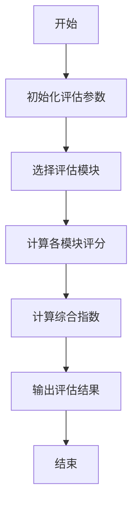
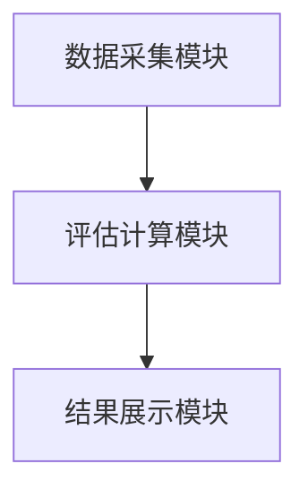
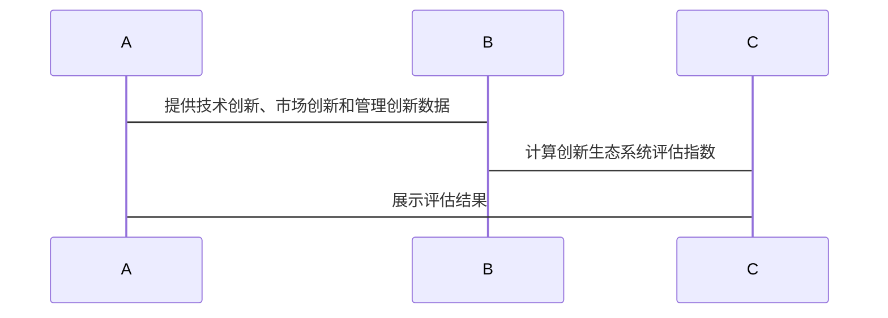

                 


# 企业估值中的创新生态系统评估

## 关键词
企业估值, 创新生态系统, 创新评估, 创新模块, 企业绩效

## 摘要
企业估值不仅是对财务表现的评估，更是对创新生态系统整体能力的考量。在当前竞争激烈的商业环境中，企业的创新能力直接影响其市场地位和长期发展潜力。传统的估值方法往往忽视了创新生态系统中技术、市场和管理等模块的互动关系，而这些因素实际上对企业绩效有着深远的影响。因此，如何构建一个全面的创新生态系统评估体系，对于准确评估企业价值具有重要意义。本文将从创新生态系统的基本概念出发，逐步分析其核心要素，探讨创新生态系统评估的算法原理，并结合实际案例进行系统设计与项目实战。

---

# 第一部分: 企业估值中的创新生态系统评估概述

## 第1章: 创新生态系统与企业估值的背景介绍

### 1.1 创新生态系统的基本概念
#### 1.1.1 创新生态系统的核心概念
- 创新生态系统是指企业在技术创新、市场创新和管理创新等多个维度上的综合能力体系。
- 它涵盖了企业从技术研发到市场应用，再到内部管理优化的全过程。

#### 1.1.2 创新生态系统与企业估值的关系
- 企业的创新能力直接影响其市场竞争力和长期增长潜力。
- 传统估值方法主要依赖财务指标，而创新生态系统评估提供了更全面的视角。

#### 1.1.3 创新生态系统评估的必要性
- 传统估值方法的局限性：无法充分反映企业的创新能力和未来的增长潜力。
- 创新生态系统评估能够弥补这一不足，为投资者提供更全面的决策依据。

### 1.2 企业估值的传统方法与局限性
#### 1.2.1 传统企业估值方法概述
- 市盈率法：基于市盈率的简单估值。
- 现金流折现法：基于未来现金流的贴现。
- 资产评估法：基于资产的账面价值。

#### 1.2.2 传统方法的局限性
- 忽视了企业的创新能力对长期价值的影响。
- 无法量化企业内部管理和市场拓展能力的差异。

#### 1.2.3 创新生态系统评估的优势
- 全面性：综合考虑技术、市场和管理等多个维度。
- 动态性：能够捕捉企业的创新动态和潜在价值。

### 1.3 创新生态系统评估的核心要素
#### 1.3.1 技术创新模块
- 包括研发投入、专利数量、技术先进性等指标。
- 技术创新是企业长期竞争优势的核心来源。

#### 1.3.2 市场创新模块
- 包括市场拓展能力、品牌影响力、客户满意度等指标。
- 市场创新决定了企业在市场中的份额和地位。

#### 1.3.3 管理创新模块
- 包括组织结构优化、内部流程改进、员工绩效等指标。
- 管理创新能够提高企业的运营效率和整体竞争力。

### 1.4 创新生态系统评估的边界与外延
#### 1.4.1 评估范围的界定
- 创新生态系统评估主要关注企业的内部能力和外部市场表现。
- 与企业外部环境（如行业趋势、政策环境）存在互动关系。

#### 1.4.2 与其他评估方法的区分
- 创新生态系统评估更注重企业内部创新能力的量化。
- 与传统估值方法结合使用，能够提供更全面的评估结果。

#### 1.4.3 创新生态系统评估的动态性
- 企业的创新能力是动态变化的，需要定期更新评估结果。
- 创新生态系统评估能够帮助企业及时调整战略方向。

### 1.5 本章小结
本章通过介绍创新生态系统的基本概念，分析了传统企业估值方法的局限性，并提出了创新生态系统评估的核心要素和边界。通过全面考虑企业的技术创新、市场创新和管理创新能力，创新生态系统评估能够为企业的价值评估提供更准确的依据。

---

## 第2章: 创新生态系统评估的核心概念与联系

### 2.1 创新生态系统的核心原理
#### 2.1.1 创新生态系统的基本原理
- 创新生态系统是一个复杂的互动系统，各模块之间相互依赖、相互促进。
- 技术创新是核心，市场创新是导向，管理创新是保障。

#### 2.1.2 创新生态系统与企业绩效的关系
- 企业的创新能力直接影响其市场表现和长期增长。
- 创新生态系统评估能够量化企业的创新潜力和竞争优势。

### 2.2 创新生态系统核心概念的对比分析
#### 2.2.1 核心概念属性特征对比表
| 概念       | 技术创新 | 市场创新 | 管理创新 |
|------------|----------|----------|----------|
| 属性1      | 技术性    | 市场导向  | 系统性    |
| 属性2      | 可衡量性  | 不可完全量化 | 可持续性  |
| 属性3      | 动态性    | 竞争性    | 适应性    |

#### 2.2.2 创新生态系统ER实体关系图
```mermaid
erd
actor 创新生态系统, -{
  创新模块:技术创新, 市场创新, 管理创新
  关系: 依赖, 互动, 综合评估
}
```

### 2.3 创新生态系统评估的数学模型
#### 2.3.1 创新生态系统评估的综合指数模型
$$ E = \sum_{i=1}^{n} w_i x_i $$
其中，$E$ 是创新生态系统评估指数，$w_i$ 是各模块的权重，$x_i$ 是各模块的评分。

#### 2.3.2 权重分配的依据
- 技术创新：权重为40%
- 市场创新：权重为30%
- 管理创新：权重为30%

### 2.4 创新生态系统评估的流程
#### 2.4.1 评估流程图


### 2.5 创新生态系统评估的Python实现
#### 2.5.1 环境安装与配置
```bash
pip install numpy pandas
```

#### 2.5.2 核心代码实现
```python
import numpy as np
import pandas as pd

def calculate_innovation_score(technology, market, management):
    weights = np.array([0.4, 0.3, 0.3])
    scores = np.array([technology, market, management])
    innovation_score = np.dot(weights, scores)
    return innovation_score

# 示例数据
technology_score = 85
market_score = 75
management_score = 80

result = calculate_innovation_score(technology_score, market_score, management_score)
print(f"创新生态系统评估指数: {result}")
```

### 2.6 本章小结
本章通过对比分析创新生态系统各核心概念的属性特征，并结合权重分配和数学模型，提出了创新生态系统评估的综合指数模型。通过流程图和Python代码的实现，进一步明确了创新生态系统评估的具体步骤和方法。

---

## 第3章: 创新生态系统评估的系统分析与架构设计

### 3.1 系统分析与问题场景介绍
#### 3.1.1 问题场景
- 企业需要通过创新生态系统评估确定自身的市场竞争力。
- 投资者需要更全面的评估方法来判断企业的潜在价值。

#### 3.1.2 系统功能设计
- 数据采集模块：收集企业的技术创新、市场创新和管理创新数据。
- 评估计算模块：根据模型计算创新生态系统指数。
- 结果展示模块：以可视化形式呈现评估结果。

### 3.2 系统架构设计
#### 3.2.1 系统架构图


#### 3.2.2 系统交互序列图


### 3.3 系统接口设计
#### 3.3.1 数据接口
- 输入接口：技术创新、市场创新和管理创新评分。
- 输出接口：创新生态系统评估指数。

#### 3.3.2 交互接口
- 用户输入：企业创新数据。
- 系统输出：评估结果和分析报告。

### 3.4 系统实现与项目实战
#### 3.4.1 项目实战
- 环境安装：Python 3.8+
- 核心代码实现：创新生态系统评估模型的实现。

### 3.5 本章小结
本章通过系统分析和架构设计，明确了创新生态系统评估的实现步骤和系统结构。通过项目实战，进一步验证了模型的有效性和可操作性。

---

## 第4章: 创新生态系统评估的最佳实践

### 4.1 项目小结
- 创新生态系统评估能够全面反映企业的创新能力。
- 通过量化各模块的评分，能够为企业的估值提供更准确的依据。

### 4.2 创新生态系统评估的注意事项
- 数据的准确性和完整性直接影响评估结果。
- 权重分配需要根据企业的实际情况进行调整。

### 4.3 拓展阅读
- 推荐阅读相关领域的学术论文和实践案例。
- 关注行业动态和技术进步，及时更新评估模型。

### 4.4 本章小结
本章通过总结项目经验，提出了创新生态系统评估的最佳实践，并提供了拓展阅读的方向，帮助读者进一步深入学习。

---

## 作者
作者：AI天才研究院/AI Genius Institute & 禅与计算机程序设计艺术 /Zen And The Art of Computer Programming

---

这篇文章从创新生态系统的基本概念出发，逐步分析了其核心要素，探讨了创新生态系统评估的算法原理，并结合实际案例进行了系统设计与项目实战。通过理论与实践的结合，为企业的创新生态系统评估提供了全面的指导和参考。

