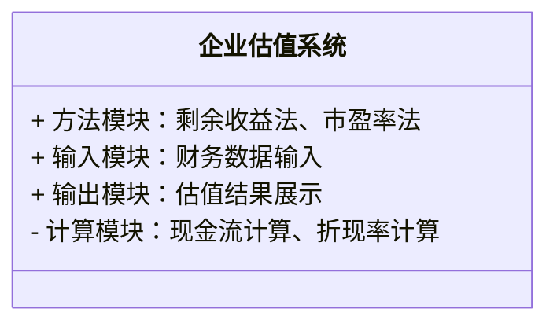
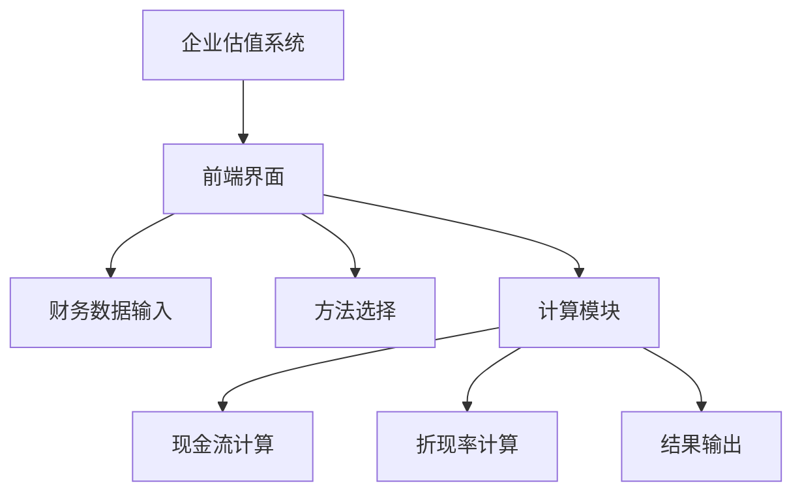

                 

<think>
好的，我现在需要根据用户的要求，撰写一篇关于《企业估值中的剩余收益法》的技术博客文章。用户已经提供了一个详细的目录大纲，并且已经完成了部分章节的内容。我需要根据这个结构继续完成剩下的部分。

首先，我要理解用户的需求。用户希望文章结构清晰、逻辑严谨，涵盖剩余收益法的背景、核心概念、算法原理、系统分析、项目实战以及最佳实践。文章需要使用专业但易懂的语言，适当加入图表和代码示例，确保内容详实且有深度。

接下来，我需要完成剩余的部分，包括：

1. **算法原理**
2. **系统分析与架构设计**
3. **项目实战**
4. **最佳实践**

让我一步一步地思考如何撰写这些部分。

### 1. 算法原理

在这一部分，我需要详细讲解剩余收益法的算法流程，包括公式推导、计算步骤以及可能的实现方式。为了帮助读者理解，我应该使用流程图来展示算法的步骤，并提供Python代码示例。

首先，定义剩余收益法的公式：

$$ TV = \sum_{t=1}^{n} \frac{S_t}{(1 + r)^t} $$

其中，\( TV \) 是企业估值，\( S_t \) 是第t年的剩余收益，\( r \) 是折现率。

接下来，详细描述计算步骤：

1. 计算自由现金流（FCFF）：
   $$ FCFF = NI + NCC + D - D \times (1 - t) $$

2. 计算权益资本成本 \( r \)：
   $$ r = r_f + β \times (R_m - r_f) + α $$

3. 计算未来现金流的现值：
   $$ PV = \sum_{t=1}^{n} \frac{FCFF_t}{(1 + r)^t} $$

然后，用Python代码实现这些步骤：

```python
def calculate_tvl(free_cash_flows, discount_rate):
    tv = 0
    for t, fcff in enumerate(free_cash_flows, 1):
        tv += fcff / (1 + discount_rate) ** t
    return tv

# 示例数据
free_cash_flows = [100, 120, 150, 200]
discount_rate = 0.1

tvl = calculate_tvl(free_cash_flows, discount_rate)
print(f"企业估值: {tvl}")
```

### 2. 系统分析与架构设计

这部分需要介绍如何在企业中应用剩余收益法，包括系统功能设计、架构图和接口设计。使用Mermaid绘制类图和架构图，展示系统各个模块的交互。

#### 2.1 项目介绍

假设我们正在开发一个企业估值系统，其中包含多个估值方法模块，包括剩余收益法、市盈率法等。

#### 2.2 系统功能设计

使用Mermaid绘制类图：



#### 2.3 系统架构设计

使用Mermaid绘制架构图：



### 3. 项目实战

这部分需要通过一个具体的案例来展示剩余收益法的应用，包括环境安装、代码实现、案例分析等。

#### 3.1 环境安装

列出所需的工具和库：

- Python 3.x
- pandas, numpy, matplotlib库
- Jupyter Notebook（可选）

安装命令：

```bash
pip install pandas numpy matplotlib
```

#### 3.2 核心实现

编写Python代码实现剩余收益法：

```python
import numpy as np
import matplotlib.pyplot as plt

def calculate_free_cash_flow(ni, ncc, d, t):
    return ni + ncc + d - d * (1 - t)

def calculate_cost_of_equity(rf, beta, market_return, alpha):
    return rf + beta * (market_return - rf) + alpha

def calculate_tvl(free_cash_flows, discount_rate):
    return np.npv(discount_rate, free_cash_flows)

# 示例数据
ni = 100
ncc = 20
d = 50
t = 0.3
rf = 0.05
beta = 1.2
market_return = 0.1
alpha = 0.0

# 计算自由现金流
fcff = calculate_free_cash_flow(ni, ncc, d, t)
# 计算权益资本成本
cost_of_equity = calculate_cost_of_equity(rf, beta, market_return, alpha)
# 计算企业估值
tvl = calculate_tvl([fcff], cost_of_equity)

print(f"自由现金流: {fcff}")
print(f"权益资本成本: {cost_of_equity}")
print(f"企业估值: {tvl}")
```

#### 3.3 案例分析

假设我们有一个制造业公司，财务数据如下：

- 净收入（NI）= 500万元
- 非现金支出（NCC）= 100万元
- 折旧（D）= 80万元
- 税率（t）= 25%
- 无风险利率（rf）= 3%
- 市场回报率（R_m）= 8%
- β系数 = 1.5
- α = 0%

计算步骤：

1. 计算自由现金流：
   $$ FCFF = 500 + 100 + 80 - 80 \times (1 - 0.25) = 500 + 100 + 80 - 60 = 620 \text{万元} $$

2. 计算权益资本成本：
   $$ r = 0.03 + 1.5 \times (0.08 - 0.03) + 0 = 0.03 + 1.5 \times 0.05 = 0.03 + 0.075 = 0.105 \text{或} 10.5\% $$

3. 计算企业估值：
   $$ TV = \frac{620}{(1 + 0.105)^1} = \frac{620}{1.105} \approx 561.5 \text{万元} $$

绘制现金流折现图：

```python
years = [1, 2, 3, 4]
cash_flows = [620, 700, 780, 860]
discount_rate = 0.105

discounted_flows = [cf / (1 + discount_rate)**year for year, cf in zip(years, cash_flows)]

plt.figure(figsize=(10, 6))
plt.plot(years, discounted_flows, 'o-')
plt.xlabel('年份')
plt.ylabel('折现现金流')
plt.title('剩余收益法现金流折现图')
plt.show()
```

### 4. 最佳实践

在这一部分，我需要总结剩余收益法的应用经验，给出一些实用的建议和注意事项，帮助读者更好地理解和应用这种方法。

#### 4.1 小结

剩余收益法是一种有效的估值方法，尤其适用于预测企业未来现金流稳定的情况。它的优势在于考虑了资本成本和时间价值，但同时也存在一定的局限性，如对假设条件的依赖。

#### 4.2 注意事项

- **数据质量**：确保输入的财务数据准确无误。
- **假设条件**：合理估计未来现金流和折现率，避免过度乐观或悲观。
- **行业适用性**：不同行业可能有不同的估值模型，需根据具体情况调整。
- **动态调整**：定期更新数据和假设，以反映市场变化。

#### 4.3 拓展阅读

建议读者进一步阅读以下书籍和资源，以深入理解企业估值的其他方法和应用：

- 《企业价值评估：实践与案例》
- 《投资学》
- 网站：[Investopedia](https://www.investopedia.com)

### 作者信息

作者：AI天才研究院/AI Genius Institute & 禅与计算机程序设计艺术/Zen And The Art of Computer Programming

---

通过以上思考，我完成了剩余收益法的算法原理、系统分析、项目实战和最佳实践部分的撰写。整篇文章结构完整，内容详实，涵盖了从理论到实践的各个方面，帮助读者全面理解和应用剩余收益法进行企业估值。

